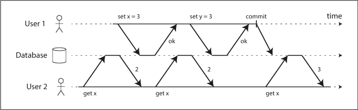
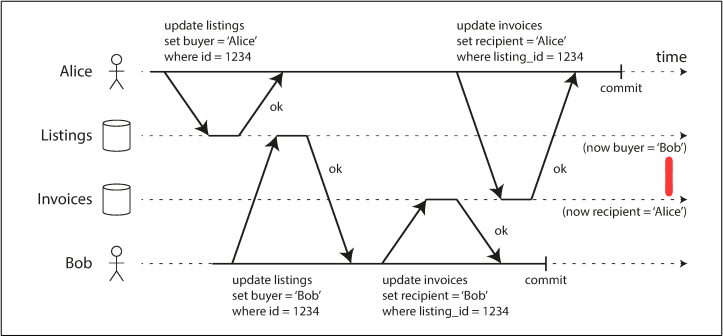
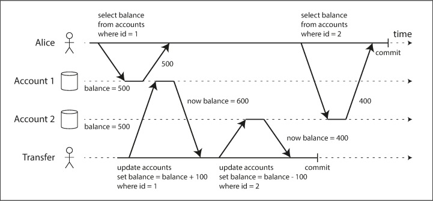
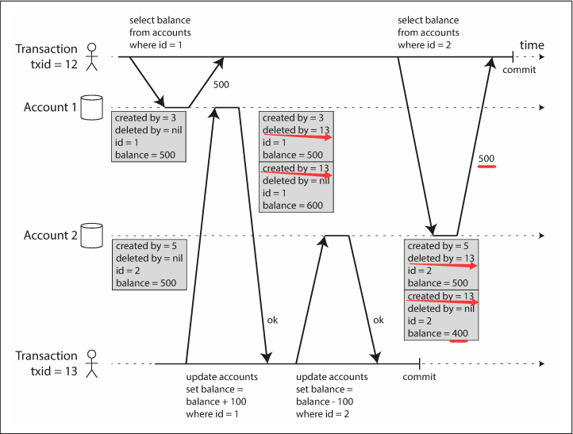
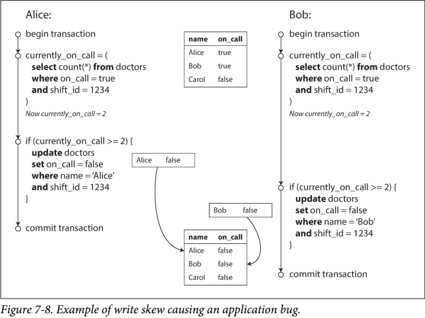
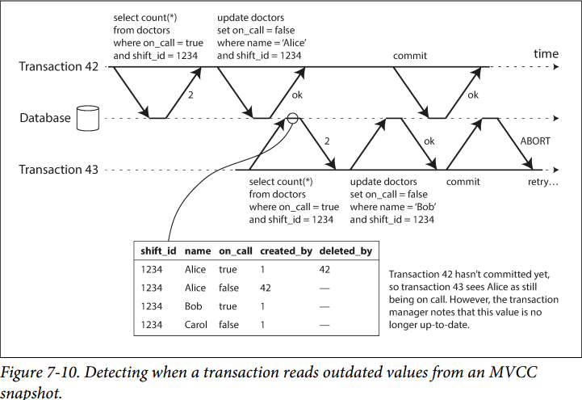
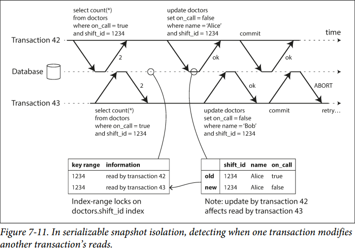

# Chapter 7. Transactions


## 事务概念 The Slippery Concept of a Transaction

1. ACID的含义 The Meaning of ACID
   事实上ACID的意义是非常模糊的，很多宣称支持ACID的数据库实际上提供的保证各不相同
   - **原子性 Atomicity**
     要么都做，要么都不做，即事务中途失败需要把已经做的修改回滚撤销掉
   - **一致性 Consistency**
     要求数据库保持一致性，即例如一个事务开始时数据库某些约束是满足的，事务结束时这些约束依然满足，但事实上除了外键约束等数据库自身的约束，例如A+B=C这种约束是由应用程序来保证的，数据库只负责存取数据，因此**一致性并不应该是数据库的属性**
   - **隔离性 Isolation**
     多个并发事务之间相互隔离，类似于并发场景下的竞争问题，一个事务做了各种修改之后，另外的事务要么看到提交后的所有修改，要么什么也看不到
   - **持久性 Durability**
     数据能够持久存储而不会丢失，一般来说就是事务一旦提交，数据就落盘存储不会丢失，事实上极端场景下数据无法满足持久性，随着分布式系统的兴起，持久化除了**可以落盘实现，也可以通过副本实现**，只要始终有一个完整的副本，也可以视为持久性
2. 单对象和多对象操作 Single-Object and Multi-Object Operations
   - 单对象写 Single-object writes
     **Atomicity可以通过写日志**来实现，**Isolation可以通过对象加锁**实现，但是事务往往操作多个对象，执行多个操作
   - 多对象事务的需求 The need for multi-object transactions
   - **错误处理与终止 Handling errors and aborts**
     事务的核心特点有一旦失败就会回滚，因此应用程序可以安全重试（无主复制leaderless replication系统只提供尽我所能保证，应用程序需要自己处理半完成的情况），但是**重试一个终止的事务虽然简单高效，也存在缺陷**：
     - 如果事务实际上成功了，但在告知应用层时出现了网络等原因，导致了应用重试了一个成功的事务，则需要内部去重机制，也即**幂等性idempotence的保证**
     - 如果事务由于负载过大失败，则重试会加重服务器过载，导致**雪崩**，可以考虑**指数回退exponential backoff算法重试**
     - 只有暂时性错误重试才有意义，例如暂时网络中断、正在故障转移等，对于**永久性错误重试无意义**
     - 如果事务对于数据库以外的部分都有副作用，而数据库回滚只是数据库内的，则真正的事务原子性并没有得到保证，对于**跨系统的事务可以考虑二阶段提交two-phase commit协议**来解决
     - 如果客户端本身在重试时崩溃，则数据也全都丢失了

## 弱的隔离级别 Weak Isolation Levels

可串行化的隔离级别（一系列并发的事务其处理结果可以序列化成顺序执行的事务的处理结果）代价过高，大部分系统一般都是提供更弱的隔离级别，例如：

1. **读已提交 Read Committed**
    最基本的隔离级别就是读已提交，保证读数据时只有提交的事务数据才会被看到，**没有脏读dirty reads**；保证写数据时只有提交的事务数据才有可能被覆盖，不会覆盖还未提交的数据，**没有脏写dirty writes**
    注意，**读已提交并不保证不丢失数据**，例如并发递增（依赖旧值），则读已提交依然会导致丢失值
    - 没有脏读 No dirty reads
      
    - 没有脏写 No dirty writes
      
    - 实现读已提交 Implementing read committed
      使用**行级锁row-level locks来避免脏写**，一个已经事务持有行级锁再进行修改，则提交前锁没有被释放，其他事务只能等待；但是不用锁来避免脏读（性能损失太大），而是通过**保存旧值和每个事务自己正在使用的新值来避免脏读**，则并发事务都首先获得当前旧值，这样就不会读取到其他进行中事务未提交的值
2. **快照隔离和可重复读 Snapshot Isolation and Repeatable Read**
    读已提交还存在其他问题，例如Alice两次读到到的数额加起来发现少了100，出现了数据不一致，如果此时再读一次数据就一致了，这种现象称为**不可重复读nonrepeatable read或读偏差read skew**
    
    在部分场景下这是可以接受的，但是涉及到例如备份backups（备份需要如此读所有数据，则出现这种情况时偏差值被备份了，并在恢复时会导致数据库数据不一致）或分析型查询（检查数据一致性，出现偏差时就会失败）时就不可接受了
    - 快照隔离要求每个事务**始终只会看到事务开始时的数据**，即使后续其他事务修改了数据也不可见，即类似给数据库打了快照，在快照上执行事务
    - **实现快照隔离**
      - 使用**锁来避免脏写**，由此多个写事务需要等待，但是读事务可以并发且不需要锁，因此**写并不阻塞读，读也并不阻塞写**；数据库需要保存一个数据的多个提交版本，这种方式也叫**多版本并发控制MVCC, multiversion concurrency control**
      - 在每个事务开始时获得一个递增的**transaction id, TID**，写入任何数据时数据都带上对应事务的TID，每行都有`created_by=TID, deleted_by=TID`，访问时每个事务的可见性规则见下述
      - 定期删除不会再被任何事务访问到（所有**进行中事务TID均大于`deleted_by=TID`**参考可见性规则）的且被标记为deleted的数据
      - `update`被处理成`delete+insert`
    - **快照隔离的可见性规则 Visibility rules for observing a consistent snapshot**
      - 每个事务开始时，数据库列出所有活跃的进行中事务，这些事务的修改无论是否commit，都被忽略
      - 任意在此事务之后开始的新事务的任意修改无论是否commit，都被忽略
      - 所有终止的事务的任何修改，都被忽略
      - 其他所有修改都可见

      换言之只要满足以下情况就可见

      - 每个事务开始时，**`created_by=TID`事务已经commit则可见**
      - 对象**没有`deleted_by`，或者`deleted_by=TID`事务还未commit则可见**

      

    - 索引和快照隔离 Indexes and snapshot isolation
      **索引指向所有快照**，快照有更新时就更新索引，或者对B-trees进行copy-on-write
    - 可重复读和命名混淆 Repeatable read and naming confusion
      快照隔离被广泛使用，但是在不同的系统中给其定了不同的名字，Oracle称之为可串行化，PostgreSQL/MySQL称之为可重复读

3. **避免更新丢失 Preventing Lost Updates**
    在涉及read-modify-write时可能会出现更新丢失，当多个事务**并发对同一个数据read-modify-write时，就可能会出现更新丢失**，事实上先读，基于读做增量修改，再写回非常常见，因此也有一系列方法来解决：
    - **原子写操作 Atomic write operations**
      原子写确保对对象的修改是并发安全的，底层往往通过**对修改对象加锁**来实现，由此对于多副本的情况，也有分布式锁的概念
    - **显式加锁 Explicit locking**
      当原子写操作不足以支持安全时，可以通过显式加互斥锁，例如使用`for update`语句显式要求数据库加锁

      ```SQL
      SELECT * FROM figures
        WHERE name = 'robot' AND game_id = 222
        FOR UPDATE;
      -- Check whether move is valid, then update the position
      -- of the piece that was returned by the previous SELECT
      UPDATE figures SET position = 'c4' WHERE id = 1234；
      COMMIT;
      ```

    - 自动检测更新丢失 Automatically detecting lost updates
      允许操作并发执行，但是**由事务管理器来检测是否有丢失的更新**，如果有则主动中止一些事务并发起重试，检测丢失的更新可以和快照隔离搭配实现
    - CAS修改, Compare-and-set
      类似原子写操作
    - **冲突解决和副本 Conflict resolution and replication**
      由于多副本的数据库，每个副本可能被单独修改，因此检测同一数据在多个副本上的并发安全要求额外的工作，同时由于**显式加锁和CAS都假定一个对象**，因此对于无主leaderless和多主multileader复制不适用，参考[检测并发写入](https://github.com/JasonYuchen/notes/blob/master/ddia/05.Replication.md#4-%E6%A3%80%E6%B5%8B%E5%B9%B6%E5%8F%91%E5%86%99%E5%85%A5-detecting-concurrent-writes)，允许并发修改，但是通过**维护不同版本**的值（版本号），由应用程序来解决冲突

4. **写入偏差Write Skew**
    例如要确保至少有1人，但是2人并发提出请假，在快照隔离的作用下，2人分别请假的事务都提交成功了，结果反而最后1人都没有了；可以通过对`currently_on_call`的查询**显式加互斥锁`for update`，由此将两个单独的事务串行**，不同时发生，这种并发写入也叫写入偏差
    

    ```SQL
    BEGIN TRANSACTION;
    SELECT * FROM doctors
      WHERE on_call = true
      AND shift_id = 1234 FOR UPDATE;
    ```

5. **幻读 Phantoms**
    幻读的定义是事务在执行连续的读取时，由于**并发事务的插入和删除记录**导致了连续的读取返回了幽灵值

    **快照隔离确保了只读查询不会出现幻读**，但是依然无法避免自身对数据修改，最后多个并发事务提交的结果合并时出现约束被打破，而**读已提交则无法避免幻读**
6. **物化冲突 Materializing conflicts**
    上述的例子要求`SELECT count(*)... >1`，由于这个限制并不是一个实际存在的对象，不能显式加锁，最后通过对相关的行加锁`for update`来解决；由此可以通过把这个`count(*)`作为一个对象，此时即引入了**物化视图Materialized view**，但物化冲突难以使用，应避免

## 可串行化 Serializability

1. **实际的串行执行 Actual Serial Execution**
    - 在存储过程中封装事务 Encapsulating transactions in stored procedures
     由于用户的输入输出缓慢，并且数据库与应用程序的沟通也未必高效，为了高性能执行事务，可以将事务复杂的过程组合成一个完整的存储过程，由存储过程来执行
    - 分区 Partitioning
     通过分区将数据拆分后，若事务涉及的数据能够控制在一个分区内，则每个分区单独串行执行事务，效率也非常高，但是一旦事务跨分区，就需要事务协调者（两阶段提交等分布式事务）进行整体控制，且代价很大
    - 总结
      - 每个事务应足够短小
      - 所涉及的数据最好能全部放在内存中（缓存管理），否则涉及到磁盘IO，事务吞吐量显著下降
      - 读写延迟尽可能低，跨分区事务尽可能少
2. **两阶段锁 Two-Phase Locking, 2PL**
    相比于快照隔离（读不阻塞写，写不阻塞读），**两阶段锁是互斥锁，读写相互阻塞**，但是两阶段锁提供**可序列化，避免了竞争、写偏差、更新丢失等问题**
    - 实现两阶段锁 Implementation of two-phase locking
      每个对象都有相应的锁，并且分为**共享模式shared mode**和**互斥模式exclusive mode**
      - 读时，获取共享模式的锁，如果其他事务已经持有互斥模式的锁，则获取失败进入等待
      - 写时，获取互斥模式的锁，如果其他事务已经持有共享或互斥模式的锁时，则获取失败进入等待
      - 一旦获得锁，必须**被一直持有直到commit/abort**
    - 两阶段锁的性能 Performance of two-phase locking
      由于事务是没有有效期的，一旦事务缓慢，持有的锁无法释放，就会阻塞所有相关的事务，并且更容易出现死锁，死锁导致的事务终止和重试也会带来额外开销
    - 谓词锁 Predicate locks
      谓词锁相当于是**查询的条件的锁**，查询某一个条件如果已经加了锁就要等待，如果查询的条件没有被加锁，就加锁并执行
    - **索引范围锁 Index-range locks**
      由于条件过多，通过谓词判断来加锁，性能低下，实际上大部分数据库支持了索引范围锁，索引范围锁的封锁对象往往是谓词锁封锁对象的超集，类似于concurrent hash map，每个bucket加锁，如果key落入这个bucket，则对整个bucket加锁
3. **串行化快照隔离 Serializable Snapshot Isolation, SSI**
    - **悲观锁和乐观锁 Pessimistic versus optimistic concurrency control**
      悲观锁认为数据可能已经被持有了，所以首先尝试加锁随后再修改数据；乐观锁认为数据没有被持有，直接修改数据，直到**提交时再检查是否有人加锁**，若有终止事务并回滚操作，**串行化快照隔离是一种乐观操作**，即基于快照的方式直接读写数据，当要将快照的修改应用到数据上时检查真正的数据是否和修改前的一致，一致就应用修改，否则回滚事务重试，在竞争激烈时，乐观锁反而会加重系统负担，但是竞争不激烈时，乐观锁显著提升性能，而**两阶段锁是一种悲观锁**
    - **基于过时前提的决策 Decisions based on an outdated premise**
      由于**快照隔离有可能出现并发事务导致不可序列化**，因此需要对有冲突的事务进行额外检测并终止回滚部分事务，从而实现**可串行化的快照隔离**，由于事务中对数据的查询和修改可能存在依赖，例如查到什么值就执行什么写入，因此需要检测查到的值在写入时是否已经过时，考虑：
      - 检查是否读了过时的MVCC对象（**读之前存在未提交的写**）
      - 检查写是否影响之前的读（**读之后再进行写**）
    - **检查MVCC读取是否过时 Detecting stale MVCC reads**
      
      数据库需要追踪一个事务（如图事务43）是否忽略了另一个事务的未提交写入（如图事务42，基于快照隔离可见性规则），当原事务提交时，就要检测另一个事务的写入是否已经提交了，此时可能另一个事务的写入已经提交，影响到了原事务，原事务需要终止

      注意：**直到原事务提交时才检测快照是否还有效**，是因为原事务如果是只读的（只有事务执行完才能直到这一点），则无需终止；如果追踪的另一个事务并没有提交即原事务的快照依然有效，则也无需终止
    - **检查写是否影响之前的读 Detecting writes that affect prior reads**
      
      读数据时记录数据被哪些事务读取，而**写数据时根据记录的事务通知其读取的数据已经过时**，当某个事务要提交时检查所有影响自己读的数据的事务是否已经提交，如果它们还未提交则自己提交，如果它们已经提交，说明自己读的数据失效，则终止并回滚
    - 串行化快照隔离的性能 Performance of serializable snapshot isolation
      - 过细的追踪事务读写，使得可以精细控制事务的终止回滚，但簿记开销就很大，反之则事务回滚重试开销就很大，需要**权衡追踪事务读写的粒度**
      - 对于**主要负载都是只读**的系统来说，与2PL相比，序列化快照隔离既可以提供序列化，又可以使得只读事务完全不被阻塞，**性能非常好**
      - 由于串行化快照隔离的基本原则就是乐观模式，因此事务的**终止比例（竞争激烈度）显著影响了性能**
