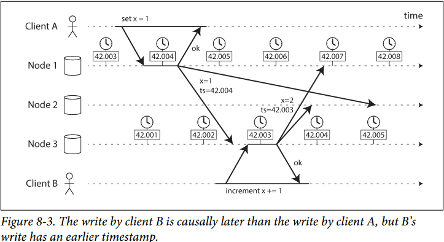
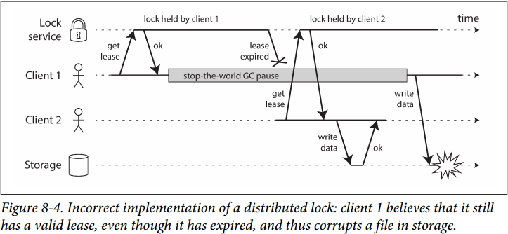
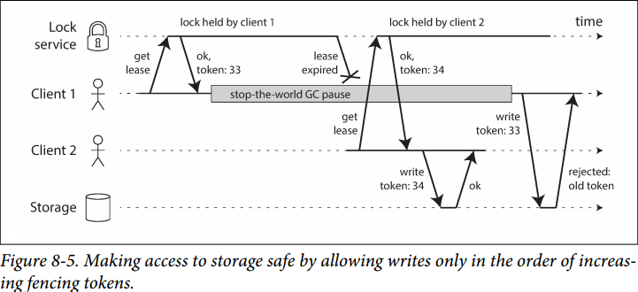

# Chapter 8. The Trouble with Distributed Systems

## 故障与部分失效 Faults and Partial Failures

- 云计算和超级计算机 Cloud Computing and Supercomputing
  - 云计算往往提供在线服务，一旦不可用是不可接受的，而超级计算机出现故障，整体停机影响不大
  - 超级计算机往往使用高度可靠的硬件，而云计算使用廉价商用的节点但故障率相对更高
  - 云计算基于IP和以太网，而超级计算机基于专用网络
  - 当一个系统大到一定规模时，可以假定任意时刻总有部分不能正常工作（概率）
  - 系统如果对故障有容忍度，并且一定程度内依然可以提供服务是非常重要的
  - 云计算可以部署在跨地域的数据中心，相互沟通通过不可靠的因特网，而超级计算机往往集中放置

## 不可靠的网络 Unreliable Networks

- **真实世界的网络故障 Network Faults in Practice**
  - 请求在网络中丢包
  - 请求进入队列等待，延迟较高
  - 远端节点失效，可能已经宕机
  - 远端节点暂时无法响应，诸如正在进行垃圾回收等，但随后就会重新响应
  - 响应在网络中丢包
  - 响应进入队列等待，延迟较高

  **分布式系统中，发送者无法判断是哪一种情况，只能通过延迟timeout来判断是否出现了问题，但延迟依然无法判断具体情况**

- **检测故障 Detecting Faults**
  - 能够到达目标机器，但是目标端口无程序在监听，证明进程已经退出，但是假如正在处理请求时进程崩溃，无法判断原请求处理到什么程度
  - 如果路由器回送IP不可达，则说明目标机器已经宕机，但是路由器本身也不一定可靠
  
  **为了确保请求真的被处理了，需要有应用层ACK机制，因为TCP的ACK只保证请求送达，而不保证此后程序正确处理了请求，即End-to-End Arguments**

- **超时和无穷延迟 Timeouts and Unbounded Delays**
  由于延迟没有上界，往往用超时来判断远端是否可用，但是超时的时间难以确定，过长的超时可能需要等待额外的时间，而过短的超时可能导致更高的风险出现误报，在高负载工作时可能延迟更大，此时一旦因为延迟而误报节点死亡，转移功能和负载到其他节点上会导致进一步负载增加，最后出现**级联失效cascading failure**
  注意：**TCP执行拥塞控制算法，使得数据包在收发端都可能进行排队，并且TCP本身也有超时重传**

## 不可靠的时钟 Unreliable Clocks

- 单调钟与时钟 Monotonic Versus Time-of-Day Clocks
  - **时钟 Time-of-day clocks**
    也称为挂钟wall-clock，通常使用NTP与授时服务器同步，返回的是时间点，因此当时钟比授时服务器慢或快时，**会被重置与服务器同步，即跳变**，这意味着时间并不一定单调增加，可能会突然增加或减少（被重置了）
  - **单调钟 Monotonic clocks**
    单调钟保证一定单调增加，**适用于测量时间间隔（经过时间elapsed time）**，但是单调钟返回的并不是绝对时间时间点，因此都通过单调钟返回的多次值之差来看时间间隔，其**绝对值没有意义**
- 时钟同步与准确性 Clock Synchronization and Accuracy
  单调钟不需要同步，时钟需要同步，但是**同步方法本身并不可靠，可靠方法见[Spanner TrueTime](https://github.com/JasonYuchen/notes/blob/master/mit6.824/Spanner.md#%E7%9C%9F%E5%AE%9E%E6%97%B6%E9%97%B4-truetime)**，且精度也不如所想之高
- **依赖同步时钟 Relying on Synchronized Clocks**
  由于同步时钟受NTP影响，可能会出现时间跳跃，同时错误配置的NTP可能导致同步时钟逐渐偏离轨迹
  - 有序事件的时间戳Timestamps for ordering events
    
    由于时钟同步问题，导致事件发生的顺序受到了影响，常见通过**最后写者获胜LWW**来解决冲突，参考[检测并发写入](https://github.com/JasonYuchen/notes/blob/master/ddia/05.Replication.md#4-%E6%A3%80%E6%B5%8B%E5%B9%B6%E5%8F%91%E5%86%99%E5%85%A5-detecting-concurrent-writes)
  - 时钟读数存在置信区间 Clock readings have a confidence interval
  - **全局快照的同步时钟 Synchronized clociks for global snapshots**
    例如快照隔离要求有全局单调递增的事务TID，在单机上一个原子计数器即可，但是在分布式系统中不能直接使用时间戳作为TID，因为不同系统的同步时钟存在精确度问题，可以通过**某一个节点专门生成TID（TiDB的PD），或者通过采用考虑了精确度问题的时钟，例如时钟同步且精确度在5ms内，则相邻事务的时间戳±5ms这个区间不重叠（Spanner的TrueTime API）**，就可以确保先后顺序
- **进程暂停 Process Pauses**
  假定一个单主节点的系统，为了确保主节点确认自己的有效性，可以通过获得并持有一个**租约lease**来实现，在到期前更新租约的有效时间，当节点宕机后其他节点就能通过获得租约成为新的主节点。但是问题在于**租约的超时检查本身可能不及时**，例如遇到了垃圾回收的STW, stop the world、虚拟化环境中虚拟机被暂停等情况，导致可能已经超时了，但是"主节点"并没有意识到此时已经有新的主节点出现，这种情况称为进程暂停，分布式系统中需要假设这种情况会发生，通常可以通过**令牌token**的方式让每一个阶段持有租约的leader互斥（例如Raft的term号，单调递增的term代表更新的leader）

## 知识、真相和谎言 Knowledge, Truth, and Lies

### 真相由多数决定The Truth Is Defined by the Majority

分布式系统中无法由单个节点来确定状况，往往依赖于**法定人数quorum**

- 领导者与锁定 The leader and the lock
  - 只允许一个领导者进行数据库分区，避免**脑裂split brain**
  - 只允许一个事务或用户持有特定资源或对象的锁，避免并发写入导致数据损坏
  - 每个特定的名字只能由一个用户或服务来注册，避免命名冲突
- **防护令牌 Fencing tokens**
  例如一个分布式锁，C1获取租约之后进入了GC，而租约到期后自动解锁但是C1没有感知到，此后C2获得租约，待C1从GC恢复后租约已经过期，但是自以为依然持有锁，出现C1和C2并发修改一个数据
  
  通过使用**单调递增的序列号**，将所有获得锁的顺序序列化记录称为**防护令牌fencing tokens**，一旦接收了更大令牌的控制，就会**拒绝所有旧的令牌**
  

### 拜占庭故障Byzantine Faults

假设**所有节点本身不可靠（会做出欺骗行为）的情况称为拜占庭故障**，对于如何在有不可信节点的情况下达成所有节点的共识，称为**拜占庭将军问题Byzantine Generals Problem**

注意：**即使大部分情况下可以假设所有节点是可信的，但是依然需要手段来防止意外的数据错误**，例如错误配置、比特跳转等，例如

- 网络传输可能由于硬件错误或bug出现数据损坏，由此TCP/UDP引入了校验和checksum，在引用层也可以引入校验和
- 不信任任何用户输入，对用户输入进行合法性校验
- 使用多个NTP服务器，每次同步时间交叉验证多个NTP的结果，来确保单个错误NTP服务器不会影响整个系统

### 系统模型和现实

- 根据时间的假设，三种常用的模型
  - **同步模型 Synchronous model**
    假定网络延迟有界，程序暂停有界，时钟错误有界，绝大部分情况下**并不符合现实**
  - **部分同步模型 Partially synchronous model**
    大部分情况下与同步模型一致，但是一些时候网络延迟、程序暂停、时钟漂移会突破界限，比较符合现实情况
  - **异步模型 Asynchronous model**
    没有任何时间上的保证，甚至没有时钟（不能使用超时），少数算法能适用这个模型，**非常局限**

- 节点故障，三种常用的模型
  - **崩溃停止故障 Crash-stop faults**
    节点只存在崩溃故障，一旦崩溃就失去响应且不会再恢复
  - **崩溃恢复故障 Crash-recovery faults**
    节点只存在崩溃故障，但是可以在未知时间内恢复，且假定内存数据被丢失，硬盘数据能够跨越崩溃时间
  - **拜占庭故障Byzantine (arbitrary) faults**
    节点存在任意故障，包括欺骗其他节点这种形式的故障

绝大多数情况下，系统模型都是**部分同步模型+崩溃恢复故障**：

- 算法的正确性 Correctness of an algorithm
  对于算法来说，其**所有属性在某个确定的系统模型下，都能够得到满足，则认为其是正确的**，例如对于防护令牌fencing tokens
  - **唯一性 Uniqueness**：任意两个请求返回的值都不相同
  - **单调序列 Monotonic sequence**：后请求的值一定大于前请求的值
  - **可用性 Availability**：节点要求获得令牌且自身没有崩溃，则最终一定能获得令牌
- 安全性和活性 Safety and liveness
  **安全性Safety可以认为是没有坏事发生nothing bad happens**

  **活性Liveness可以认为是最终好事发生something good eventually happens**
