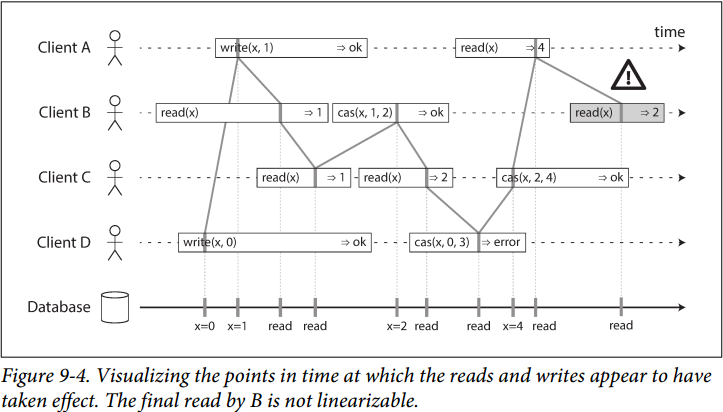
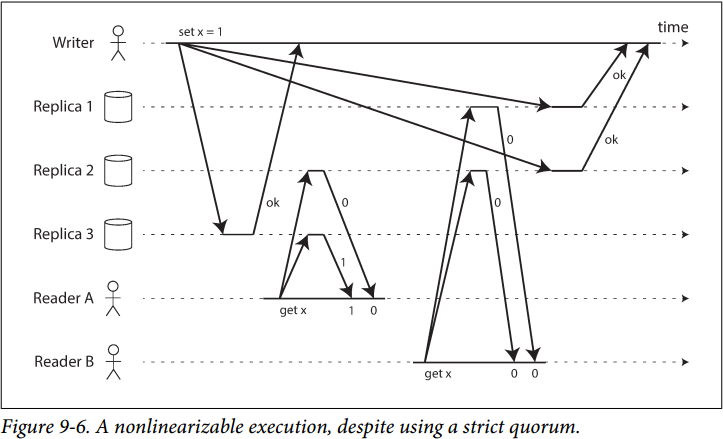
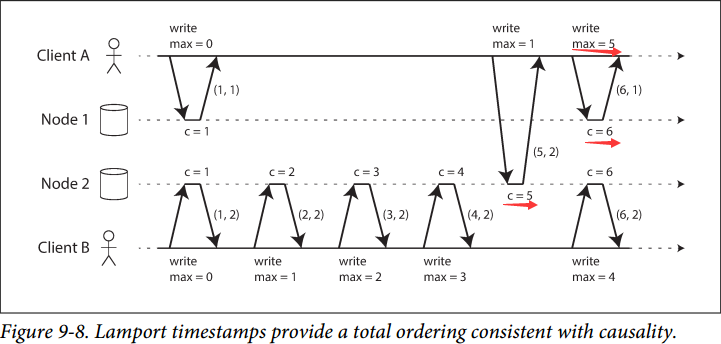
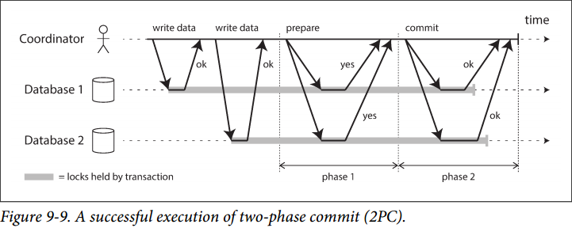

# Chapter 9. Consistency and Consensus

## 一致性保证 Consistency Guarantees

- **[Various Consistency Models](https://github.com/JasonYuchen/notes/tree/master/consistency)**

- **[Strong Consistency Models](https://github.com/JasonYuchen/notes/blob/master/consistency/Strong_consistency_models.md)**

## 线性一致性 Linearizability

**线性一致性 linearizability**（又称**原子一致性atomic**，**强一致性strong**，**立即一致性immediate**，**外部一致性external** consistency）的核心就在于在外部看来多个副本的数据行为表现就和只有一个副本一样，是最强的一致性保证

### 1. 什么使得系统保证线性一致性 What Makes a System Linearizable

- 线性一致性系统示例
  所有读取都能读到最近一个成功的写入，所有读取一旦读到了一个值，此后都只会读到更新的值，如图：

  

  - Database按顺序处理了`D write -> A Write -> B Read`，**并发请求的执行顺序可以和接收顺序不一致**
  - B先获得`read(X)=1`，随后A才获得`write(X, 1)`成功，异步网络存在延迟，并发请求的**客户端获得结果顺序可以和执行顺序不一致**
  - 最后由B发起的`read(X)=2`违背了线性一致性，因为此前A已经获得了结果`read(X)=4`，这**两个请求并不是并发的**

- 注意区分**线性一致性Linearizability**和**可串行化Serializability**：
  - 可串行化是事务隔离等级的一个级别，多个事务可以读写多个对象，**可串行化代表这些事务对多个对象的读写结果可以串行化成某一个按顺序执行操作的结果**，事务真正执行的操作和串行化后的操作顺序可以不一致，**强调的是结果一致**，可串行化实际上是个弱一致性保证，保证结果而不保证新鲜度，[见此](https://github.com/JasonYuchen/notes/blob/master/consistency/Strong_consistency_models.md#%E5%8F%AF%E5%BA%8F%E5%88%97%E5%8C%96%E4%B8%80%E8%87%B4%E6%80%A7-serializable-consistency)
  - **线性一致性是对一个对象的读写的新鲜度保证**，并不将多个操作包装成事务，因此并不保证写偏差等问题，不保证结果但保证新鲜度
  - 基于**真正串行执行Actual Serial Execution**或**两阶段锁2PL**的可串行化方式，**也是线性一致性的**
  - 基于**可串行化快照隔离SSI**的可串行化方式，**并不是线性一致性的**，因为快照隔离不会读到快照后发生的写

### 2. 依赖线性一致性 Relying on Linearizability

- **锁定和领导选举 Locking and leader election**
  例如通过获得一个锁（分布式锁）来证明自己是leader，就需要保证线性一致性，如果多个结点读到的leader不同就会出现脑裂
- **约束和唯一性保证 Constraints and uniqueness guarantees**
- **跨信道的时序依赖 Cross-channel timing dependencies**

### 3. 实现线性一致性的系统 Implementing Linearizable Systems

- 常见的方法和线性一致性的可能性
  - **单主复制**：可能线性一致
  - **共识算法**：线性一致
  - **多主复制**：非线性一致
  - **无主复制**：可能非线性一致
- **线性一致性和法定人数 Linearizability and quorums**
  严格的法定人数并**不能保证线性一致性**，例如图中的两次`get x`：
  

### 4. 线性一致性的代价 The Cost of Linearizability

当需要线性一致性时，一些副本由于网络等原因无法连接其他副本，导致失联的副本无法处理读写请求，由此这些**副本就不可用**了；当不需要线性一致性时，副本可以独立处理读写请求例如多主复制，由此保证了可用性，但**丢失了线性一致性**

- **CAP理论（并不准确）**
  CAP指**一致性Consistency（只考虑线性一致性），可用性Availability，分区容错性Partition tolerance（只考虑网络分区）**，CAP理论指出三者只能选其二，但是CAP理论是无助的，因为网络隔离等带来的网络分区是一种错误，总是会发生而不是一种选择，因此更好的描述是**当P发生时CA二选一**，但是由于**A的定义也非常模糊**，事实上在实际中用更准确地描述，而回避CAP的说法
- **线性一致性和网络延迟 Linearizability and network delays**
  放弃线性一致性的主要原因在于性能，由于已经从数学上证明**读写响应时间至少是正比于网络延迟**，因此不可能即获得高性能又保证线性一致性，由此可以考虑**为了性能放弃线性一致性**

## 顺序保证 Ordering Guarantees

### 1. 顺序和因果 Ordering and Causality

若一个系统服从因果关系规定的顺序，则称为满足**因果一致性causally consistent**，例如快照隔离提供了因果一致性

- **因果顺序不是全序**
  线性一致性中任意两个操作都有顺序关系，而在因果一致性中只要求有因果关系的操作有顺序，例如B依赖A，则根据因果一致性A一定发生在B前，但是对于**无因果关系的操作（并发操作）是可以无序的**，因此**因果一致性是偏序partial ordered而非全序total ordered的**
- **线性一致性强于因果一致性**
  因果一致性是能够保证系统**不因网络延迟而劣化性能的最强的保证**，比因果一致性更强的**线性一致性和顺序一致性会受网络延迟影响**
  
  目前业界普遍都是用线性一致性来保证因果一致性的
- **捕获因果关系**
  参考无主复制的[检测并发写入与版本号](https://github.com/JasonYuchen/notes/blob/master/ddia/05.Replication.md#4-%E6%A3%80%E6%B5%8B%E5%B9%B6%E5%8F%91%E5%86%99%E5%85%A5-detecting-concurrent-writes)、参考事务隔离级别的[可串行化快照隔离](https://github.com/JasonYuchen/notes/blob/master/ddia/07.Transactions.md#%E5%8F%AF%E4%B8%B2%E8%A1%8C%E5%8C%96-serializability)、参考COPS的[context追踪所有操作依赖](https://github.com/JasonYuchen/notes/blob/master/mit6.824/17.Causal_Consistency.md#3-%E9%99%8D%E4%BD%8E%E5%90%8C%E6%AD%A5%E4%BB%A3%E4%BB%B7-straw-man-three---cops)

### 2. 序列号顺序 Sequence Number Ordering

使用**逻辑时钟logic clock**例如单调递增的序列号来标记每一个操作的发生时间点，对于有因果关系的操作确保先发送的序列号小，对于并发的操作则随意分配序列号

- 非因果序列号生成器 Noncausal sequence number generators
- **Lamport时间戳**
  每个节点都有一个独特的标识符node ID，且每个节点都有一个计数器counter记录执行过的操作数，则**Lamport时间戳就是`(counter, node ID)`**，每个节点和每个用户都**记录见过的计数器的最大值**，并在每一个**请求上都带有这个最大值**，当**遇到更大的值时立刻更新**自己的值为新的最大值，`(counter1, node ID1) > (counter2, node ID2) when counter1>counter2 or counter1==counter2 & node ID1> node ID2`
  
  
  A带着`1`访问NODE 2时发现计数器是`5`大于所持有的`1`，立即更新为`5`，此后带着`5`访问NODE 1时，NODE 1立即更新为`5`，并返回递增后的`6`给A，由此保证了因果性，因为**每一个因果依赖的操作必然带来时间戳的单调递增**

  注意：Lamport时间戳与版本向量version vectors不同，Lamport时间戳提供一个全序，根据**全序无法区分是并发还是依赖**，而**版本向量能够区分两个操作是并发的还是因果依赖的**

  注意：仅仅有Lamport时间戳是不够的，因为**基于时间戳获得全序首先需要在所有节点上获得所有操作**，假如还**没有获得其他节点的操作，则已经发生的操作顺序依然是未知的**

### 3. 全序广播 Total Order Broadcast

全序广播的前提条件是满足**可靠交付Reliable delivery**、**全序交付Totally ordered delivery**

- **使用全序广播**
  - 若数据库的复制时，**每条日志也通过全序的方式广播**，每个副本按照顺序应用这些日志，则所有副本都能保证相互一致，这也称为**复制状态机replicated state machine**
  - 若每条广播代表一个事务，则全序后顺序执行的事务，也**保证了事务的可序列化**，保证了分区和副本的相互一致
  - 使用全序广播也可以实现分布式锁，并且提供防护令牌，**全序的序列号可以充当令牌，全序日志就是获得和释放锁的顺序**
- **使用全序广播实现线性一致性存储**
  全序广播与线性一致性不同，**全序广播保证了消息的全序传递，可靠传递，但是不一定要同步**，而线性一致性是新鲜度的保证，保证了读取一定能读到最新的值（全序广播不保证这一点，因为接收者是可以落后于广播者的，从而不保证线性一致性），但是**基于全序广播可以实现线性一致性**：
  - **线性一致性写的实现**：
    全序广播一条`try write`，随后持续获得所有广播的消息，如果**第一条`try write`就是自己的，则可以安全写入**，每个节点都以第一条`try write`为准且每个节点都能看到相同顺序的消息（全序广播），若不是则放弃本次操作，由此保证了线性一致性写，因为所有写入被全序广播，只有**第一条写入会得到所有节点的认可**
  - **线性一致性读的实现**（可以有多种方案）：
    1. 全序广播一条`try read`，随后持续获得所有广播的消息，等到**收到自己的`try read`，就执行真正的读取**，由全序广播确保了自己的`try read`在真正`read`时，一定都在`try read`-`read`之间的其他写之后，因为之间发生的其他写都被自己执行了，由此保证了线性一致性读（etcd的quorum read做法）
    2. 如果日志允许节点以线性一致性的方式获取当前最新位置，可以通过准备`read`时**先读取当前的最新位置，随后等到该位置已经抵达节点时才返回`read`的结果**，从而满足线性一致性读（ZooKeeper的sync的做法）
    3. 可以使得`read`和`write`同步处理，在执行**线性一致性`write`时更新`read`的结果**，从而满足线性一致性读（Chain Replication的做法）
- **使用线性一致性存储来实现全序广播**
  假定有符合线性一致性的递增计数器，则每需要一次广播时就从递增计数器获取一个值，这个值就是全序广播的序列号，按序列号广播，接收者按序列号接收，中间不存在序列号空洞

注意：**全序广播、线性一致性、共识是数学上等同的问题**，解决其中任意一个，就可以进而实现其他两个

## 分布式事务和共识 Distributed Transactions and Consensus

### 1. 原子提交和两阶段提交 Atomic Commit and Two-Phase Commit, 2PC

- **从单个节点到分布式的原子提交**
  不能通过leader向所有节点发出commit，随后就commit这种单节点的方式，因为涉及到多个节点，可能会出现**部分节点commit成功，部分节点commit失败**这种不一致情况（节点崩溃、网络丢失、部分节点冲突等）
- **2PC简介**
  两阶段提交需要**事务协调器coordinator**（a.k.a. transaction manager）在所有参与事务的节点participants上执行事务
  - 待提交时，首先预备提交**prepare**到所有参与者，待都返回yes时再执行提交**commit**，由此事务完成
  - 若prepare阶段任意一个节点返回no或超时timeout，则执行**abort**，由此事务终止
  - 若commit阶段有节点崩溃，则事务必须在节点恢复后继续提交，**commit的事务不可撤销**
  
  
- **2PC流程**
  1. 当启动一个分布式事务时，从coordinator处获得一个**全局唯一的TID**
  2. **coordinator在每个participant上启动一个单节点事务**，并带有这个TID，所有读写都在这些单节点事务上完成，coordinator和任意一个pariticipant都可以在这个阶段abort
  3. 准备提交时，coordinator发送prepare请求给所有participants，并带有TID，如果**任意participant拒绝或超时，则coordinator发送abort**给所有participants终止事务
  4. 当participant收到prepare时，进行确定在任意情况下都能commit事务（持久化数据和日志，检查约束等），随后反馈yes给coordinator，**自此participant保证一旦收到commit就一定能commit**而不会提出abort
  5. **coordinator收到反馈后来决定commit/abort**，并将决定写入持久化日志（用于崩溃恢复，这个节点称为**commit point**）
  6. coordinator持久化决定之后，就将commit/abort发送给所有participants，如果这个决定没有得到yes，就一直重试直到成功，因为**决定commit的transaction不允许失败或回退**，假设commit时某个participant崩溃，则**重启恢复后也要以yes来响应以确保事务一定能commit**

  通过**两个不可回退点**（participant对prepare返回yes时，保证接下来会commit；coordinator决定commit/abort时，保证始终贯彻这个决定直到成功）来实现原子事务提交，而在单节点中两个点被合并到一起（写入commit到持久化日志）
- **coordinator失效**
  - 在prepare前失效，则participant可以安全abort
  - 在commit前，prepare之后失效，则participant无从知晓coordinator的决定，从而只能等待，这时pariticipant处于不确定状态uncertain
  
  注意：**理论上所有participants可以自行通信尝试达成共识决定commit/abort**，但这超出了2PC的范围
- **三阶段提交**
  三阶段分为**canCommit, prepareCommit, doCommit**三个阶段，且coordinator, participants都引入超时机制，但是由于**超时无法区分延迟还是故障**，因此可能出现数据不一致

  两阶段提交又称为**阻塞原子提交协议**，因为2PC需要等待coordinator做出决定，一旦coordinator失效就必须阻塞等待，但是不阻塞的诸如三阶段提交协议要求一个完美的错误检测器perfect failure detector来检测节点是故障与否，这在网络环境中是不可能用超时来做到的，因为超时无法区分是网络延迟还是节点故障，因此2PC依然广泛使用

  注意：2PC的coordinator故障是一个单点故障，可以通过使用**共识协议来实现coordinator高可用**；同理每个participant故障也是单点并可以用**共识协议来实现participants高可用**，实现这种思路的就是[Google Spanner](https://github.com/JasonYuchen/notes/blob/master/mit6.824/13.Spanner.md)

### 2. 实践中的分布式事务 Distributed Transactions in Practice

- 两种常见的分布式事务：
  - **数据库内部分布式事务Database-internal distributed transactions**：分布式数据库内部使用的分布式事务，意味着所有节点运行相同的程序，可以自由选择协议并针对性的优化，因此数据库内部分布式事务往往运行良好
  - **异构分布式事务Heterogeneous distributed transaction**：**跨系统**的分布式事务，事务的参与者可能运行不同的程序（数据库或非数据库），协调所有参与者进行事务难度更大
- **恰好一次消息处理**
  采用分布式事务来实现消息队列到数据库的恰好一次消息处理，异构分布式事务，例如Flink采用2PC达成跨系统的exactly-once语义
- **eXtended Architecture, XA事务**
  XA事务是实现异构分布式事务2PC的标准，并且被广泛支持，通过在不同的系统上实现XA API就可以支持跨系统的异构分布式事务
- **怀疑时持有锁阻塞整个系统**
  在2PC中，当参与者不确定事务状态时，必须持有锁，因为例如**2PL中锁的释放只在事务commit/abort时才发生**，现在事务状态未知，怀疑时必须持有锁，由此导致了阻塞等待，进而其他涉及相关数据的事务**都进入了阻塞等待，整个系统都会变得不可用**
- **从协调者故障中恢复**
  由于有可能出现协调者从崩溃重启后事务日志出错或丢失，此时相关的事务将永远孤立留存，此时只能由手动决定commit/abort，需要仔细检查每个participant是否已经commit/abort

  大部分XA事务的实现有一个紧急逃脱方案称为**启发式决策heuristic decisions**，允许participant在存疑时单方面决定commit/abort，但是这是有可能破坏数据一致性的（参考3PC，例如部分participant决定commit，另一部分决定abort）
- **分布式事务的局限性**
  即使XA事务解决了跨系统的异构分布式事务，但是核心在于coordinator本身是数据库，存储事务的结果，因此需要考虑：
  - 如果coordinator本身只是单节点而没有副本时，就是**单点故障**，因此一旦coordinator崩溃会阻塞其他系统：采用共识协议实现coordinator高可用
  - 许多应用程序是无状态的（例如HTTP），由此带来了简单部署和弹性收缩的好处，但是一旦coordinator是这些应用的一部分，系统就发生了本质的变化，coordinator的日志非常重要，**进而这些程序也不再无状态**
  - 由于XA事务需要跨系统，那么势必是最基础的部分，因此不能支持例如可序列化快照隔离（**如何解决不同系统快照的冲突？**）、不能解决死锁（**如何判断不同系统上的锁和依赖关系？**）
  - 由此可见，对于数据库内部分布式事务，局限性小得多
  - **分布式事务有一个放大故障amplifying failures的趋势，即系统一个部分的损坏会逐渐扩大导致整个系统不可用**

### 3. 容错共识 Fault-Tolerant Consensus

- **共识算法与全序广播 Consensus algorithms and total order broadcast**
  - **一致同意 Uniform aggrement**：节点之间不做出不同的决定，全序广播保证所有节点按相同顺序交付相同消息
  - **完整性 Integrity**：节点不决定两次，全序广播保证消息不会重复，恰好一次
  - **有效性 Validity**：如果节点决定了V，那么V一定是被某个节点提出的，全序广播保证消息不会损坏
  - **终止 Termination**：未崩溃的节点达到法定人数一定会最终做出决定（2PC不符合这一点），全序广播保证消息不会丢失
- **单主复制与共识 Single-leader replication and consensus**
  `TODO`
- **任期编号与法定人数 Epoch/Term numbering and quorums**
  共识算法保证在一个选举任期内只有一个leader，当当前的leader被认为失效时，就增加任期号并选举一个新的leader，因此**任期号也是单调递增且全序的**，并且高任期号的leader可以胜过低任期号的leader，**leader通过法定人数quorum选票来确定自己是否能够做出决定**，只有过半节点支持，leader才能够前进
- **共识的局限性 Limitations of consensus**
  共识算法提供了容错（只要过半节点majority正常工作）、全序广播、安全保证，但是**代价是性能**，共识算法的投票过程本质上是同步复制过程，一旦出现网络分区等，被分隔较小的节点群都被阻塞，并且在高延迟的网络环境中，可能出现**频繁的超时影响整体性能**

  例如Raft有个特别的**leader跳跃问题**：
  当所有节点之间网络都良好，除了节点A与节点B之间网络中断，且A是leader，由此会出现B收不到A的心跳而发起选举，由于所有其他连接良好，B能够获胜成为leader，重复此过程A也成为leader，随后出现系统抖动，leader反复跳跃（**超时内忽视选举请求**或**prevote解决**）

### 4. 成员和协调服务 Membership and Coordination Services

- 特性
  - 线性一致性原子操作
    例如**由共识算法结合CAS操作来实现分布式锁**（通常是租约lease），共识算法保证了锁的获取和释放是线性一致的且容错
  - 全序操作
    例如单调递增的TID，**由共识算法来给所有事务提供单调递增的TID**，且这个提供TID的服务是容错且线性一致性的
  - 失效检测
    用户与服务维持一个长session且定期发心跳，一旦上一次心跳时间超过了session的超时值，则**服务就可以判定session失效并释放所有资源**
  - 变更通知
    用户的加入与退出，作为一种成员**变更事件，可以可靠的通知给其他用户或系统**
- 分配 Allocating work to nodes
- 服务发现 Service discovery
- 成员服务 Membership services
