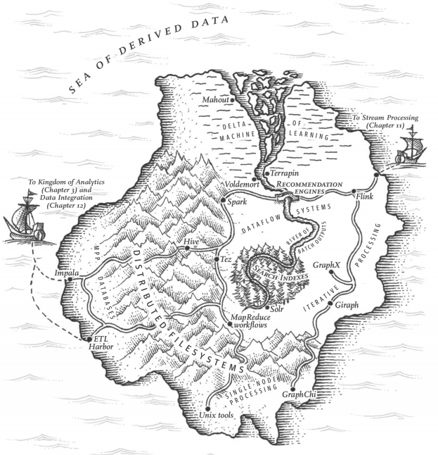
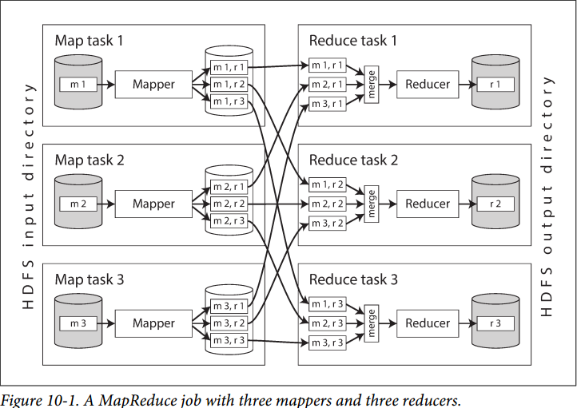
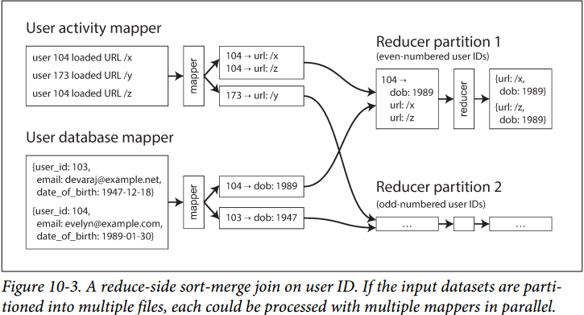

# Chapter 10. Batch Processing

## 数据处理分类

- **在线服务Services**（在线系统online systems）
    服务等待请求或指令，一旦有请求和指令就尽快完成并给出响应，**响应时间response time是主要性能指标，服务的可用性非常重要**
- **批处理系统Batch processing systems**（离线系统offline systems）
    一次系获取大量输入，允许一个任务来处理这批输入，并产生一个输出，一般来说批处理都是定期运行的，**吞吐量throughput是主要性能指标**
- **流处理系统Stream processing systems**（准实时系统near-real-time-systems）
    流处理器类似批处理消费输入产生输出，但在有输入时即运行并产生输出，类似于**消息驱动**，往往带来低延迟的效果，介于服务和批处理之间

## 使用Unix工具进行批处理Batching Processing with Unix Tools

- 简单日志分析 Simple Log Analysis
  - 命令链与自定义程序Chain of commands versus custom program
  - 排序对比内存聚合Sorting versus in-memory aggregation
- UNIX哲学
  - 统一接口A uniform interface
  - 逻辑与布线相分离Separation of logic and wiring
  - 透明度和实验Transparency and experimentation

## MapReduce和分布式文件系统 MapReduce and Distributed Filesystems

原理见mit6.824/MapReduce.md，这里主要是应用场景

### 1. MapReduce任务执行

1. Mapper函数
    每一条输入的记录都会调用一次mapper函数，每一个输入记录都会通过mapper产生不定数量的KV对，mapper不存在上下文，所有记录可以各自独立进行mapping
1. Reducer函数
    收集所有mapper产生的KV对，同一个key可能对有多个values，使用reducer迭代values并产生输出，不同key的recuing也可以独立进行
1. MapReduce的分布式执行 Distributed execution of MapReduce
    

### 2. Reduce侧的连接和分组 Reduce-Side Joins and Grouping

1. **排序合并连接 Sort-merge joins**
    **根据mapper输出的key分区**，随后再将获得的KV对进行排序，由此相同的key所需要连接的事件都连续相邻存放，随后进行**二次排序secondary sort，将同一个key的不同事件也排序分类**，再执行reduce时就可以对不同的事件相互之间笛卡儿积，只要从每一类事件的第一条扫描到最后一条，相同事件也已经有序了
    
1. 相关数据存放在一起 Bringing related data together in the same place
    类似于排序合并连接，mapper出来的KV直接存放在对应的位置，相关的KV存放在一起
1. 分组 GROUP BY
    类似于排序合并连接，相关数据存放在一起，则只要**对分组的列作为key**来设置mapper，就可以在reducer中执行相关的分组后聚合
1. **处理倾斜 Handling skew**
    由于每个reducer处理单个key的所有KV对，因此对于热点值hot keys，就会导致出现单个reducer处理远超其他reducer的记录数，可以通过**对reducer的key也进行分区，并行reducing，最后收集所有结果**即可，这样可以分散热点数值的处理压力，可以通过较小的样本reducing或是显示指定热点值来确定hot key并进行分区

### 3. Map侧的连接 Map-Side Joins

1. **广播散列连接 Broadcast hash joins**
    适用于最简单场景下的**大数据集对小数据集的连接**，小数据集需要足够小放入内存，随后mapper流水线处理大数据集，并根据需要连接的字段去内存中的小数据查询，执行连接后再输出给reducer
2. **分区散列连接 Partitioned hash joins**
    若输入的数据集是分区的，且**连接的数据集也是相同模式的分区**，则连接也可以逐分区进行，例如所有A数据集的01分区包含的数据只会与B数据集的对应01分区进行，则就可以按分区逐个连接而不用全表连接
3. **Map侧归并连接 Map-side merge joins**
    若输入的数据与连接的数据按**相同的模式分区，且都按相同的字段进行了排序**，就可以执行类似归并的方式进行连接，此时数据集能无论够放在内存中都可以进行

### 4. 批处理工作流的输出 The Output of Batch Workflows

1. 建立搜索索引 Building search indexes
    对于海量文档，将文档分区并根据关键字进行mapping并获得关键字对文档位置的KV对，从而高效建立搜索索引
1. 键值存储作为批处理的输出 Key-value stores as batch process output
    当批处理输出的键值需要查询被用到时，先输出到新数据库，随后再与旧数据库做替换，而不是直接写入到唯一的数据库中，这样读写分离，且出错可以轻易回滚
1. 批处理输出的哲学 Philosophy of batch process outputs
    将**输入视为不可变且避免副作用**，一旦输出出错就可以轻易回到原来的环境或继续使用旧的输出，由于不可变输入，因此重试也是安全的

### 5. 对比Hadoop和分布式数据库 Comparing Hadoop to Distributed Databases

1. **存储多样性 Diversity of storage**
    数据库要求按特定的模型来构造数据，而分布式文件系统则可以存储任意数据，但同样的，数据最终根据一定结构进行解释的负担就被转移到了操作者身上，因此常见的过程往往是某种原始数据存储到Hadoop中随后编写MapReduce来清理数据并转换其关系形式，构建好模型导入到数据库中
1. **处理模型多样性 Diversity of processing models**
    MPP数据库单体紧密集成，负责了磁盘布局、查询解释与优化、调度执行等所有操作，因此对于具体数据可以针对性的调整和优化查询达到极好的性能，但是分布式文件系统则支持更为通用的处理模型而不一定只能用SQL查询，由于Hadoop平台的开放性，采用更多自定义的或其他数据处理模式成为可能
1. 针对频繁故障的设计 Designing for frequent faults
    MPP数据库若单个节点查询时崩溃，往往会终止整个查询随后由用户或内部重试整个查询，而MapReduce被设计成容忍单个Map或Reduce失败的情况，并无害的重试

## MapReduce之外 Beyond MapReduce

### 1. 物化中间状态 Materialization of Intermediate State

1. **数据流引擎 Dataflow engines**
    参考Spark和Flink，相比于MapReduce，其优点在于：
    - 排序等昂贵的操作只在必要时做（**懒惰求值**），而不是mapper/reducer的默认行为
    - 去除了不必要的map任务，**mapper通常可以与上一级的reducer合并**，因为mapper并不改变分区等情况，从而可以迭代map-reduce-map-reduce...运算
    - 流处理中数据的上下依赖和连接都是**显式声明**的，因此调度器可以从全局执行一些优化
    - 流数据引擎的算子operator可以在输入就绪后立即开始并产生输出，后续阶段不必等前驱过程结束即可开始，即**流水线化pipeline**
1. 容错 Fault tolerance
    Spark使用弹性分布式数据集resilient distributed dataset, RDD来跟踪数据，Flink使用检查点checkpoint持久化算子状态，来使得出错时能够重新进行计算，关键在于**计算本身是确定的deterministic**，即给定输入的输出是一样的

### 2. 图与迭代处理 Graphs and Iterative Processing

1. Pregel处理模型 The Pregel processing model
    在每次迭代中，**每个顶点vertex调用处理函数**，所有发送给这个定点的消息都发送给处理函数，并且将信息**通过所有边edge发送给相邻节点**，反复迭代这个过程直到没有更多的边需要跟进或系统达到一些指标收敛，处理过程类似于Actor模型，顶点状态具有容错性和耐久性
1. 容错性 Fault tolearance
    所有顶点之间通过**异步消息传递**，提高了Pregel的性能，同时保证了容错性（参考TCP丢包重传），另一方面Pregel模型保证所有一轮迭代中发送的消息都在下轮迭代中送达，所以**下一轮迭代开始前前一轮消息必须都送达**，每一轮迭代结束时**持久化保存所有顶点状态**，由此确保任意时刻出错，都可以**从上一轮成功的迭代中恢复并重试**
1. 并行执行 Parallel execution
    由于图计算依赖消息传递，因此跨机器网络开销成为制约图模型的重要因素

### 3. 高级API和语言

1. **向声明式查询语言的转变 The move toward declarative query languages**
    原来MapReduce允许用户使用任何代码，但是就需要用户自己来设计连接、过滤等算法；通过向声明式查询语言的转变，在高级API中引入声明式的部分，由优化器来自动优化选择使用的算法，提高了人类和机器的效率，同时批处理框架也就变得更像MPP数据库
1. 专业化的不同领域 Specialization for different domains
   批处理引擎被用于分布式执行日益广泛的各领域算法，内置更多功能和高级声明式算子；而MPP数据库更加灵活并且易于编程执行任何代码，两者越来越相似
