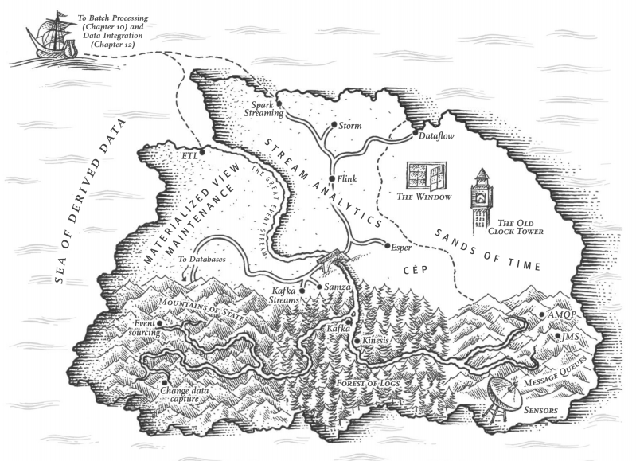
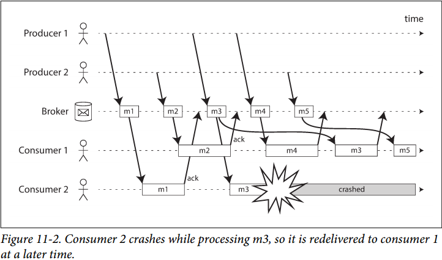
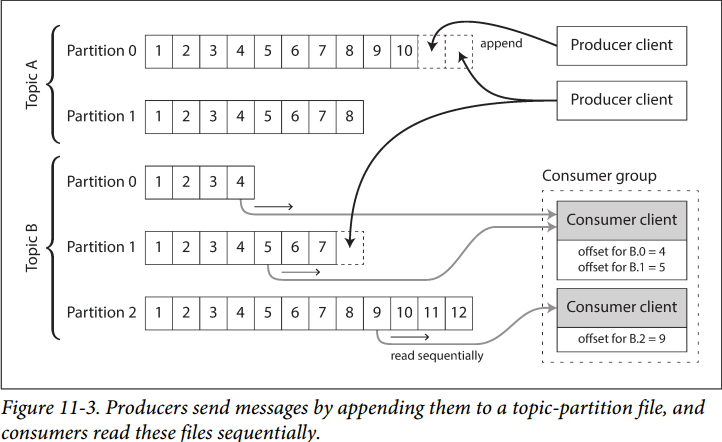
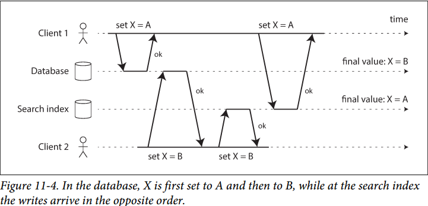
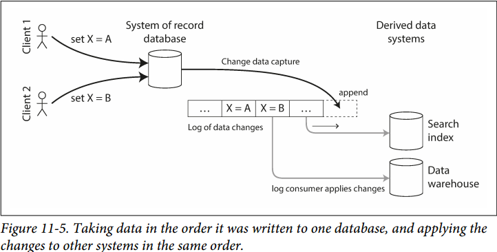
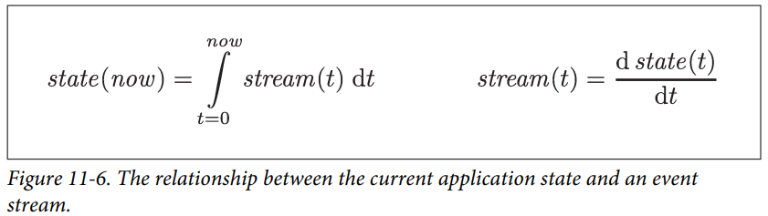

# Chapter 11. Stream Processing

## 传递事件流 Transmitting Event Streams

流数据中，**记录record即一个事件event**，一个小的独立的self-contained、不可变immutable对象，包含着某个时间点发生的事件所有信息；由生产者**producer, publisher, sender**产生，并被多个消费者**consumer, subscriber, recipient**消费处理，所有相关的事件可以按照topic, stream来分为一组

### 1. 消息系统 Messaging Systems

- 如果生产者产生速度快过消费者消费速度：
  - **扔掉消息**
  - **缓冲队列**
  - **背压 backpressure**（也称为流量控制flow control）
- 如果节点崩溃或暂时不可用，数据会丢失吗：大部分数据库提供数据持久性，但是会有性能损失延迟增大

对上述两种问题可以从下述方面进行考虑：

1. **直传**
   直接使用UDP组播、TCP多播等实现**生产者与消费者直接相连**，**容错程度极为有限**，必须假设双方都处于正常运行状态
2. **消息代理 Message brokers**
   通过消息代理message broker（又称**消息队列message queue**）来传递消息，本质上是一种处理消息流的数据库，生产者向消息代理写入数据，消费者从消息代理接收数据，同时由消息代理来负责数据的**持久化和处理生产者和消费者的上下线**（连接、断连、崩溃等），常见的消息代理比如Kafka
3. **消息代理与数据库对比**
   部分消息代理还支持2PC（例如Flink通过2PC实现exactly-once语义），使得与数据库更接近，但是他们依然有重要区别：
   - 数据库保存所有数据直到被显式删除，而消息代理会**自动删除成功传输的消息**
   - 由于成功传输的消息会被删除，消息代理假设当前数据非常少，因此**队列缓冲**也可能很小
   - 数据库提供二级索引等各种方式便于数据搜索，而消息代理往往提供采用某种**模式匹配**订阅某一个topic的子集
   - 消息代理**不支持任意的查询**，但是数据一旦改变就会通知客户（事件驱动event-driven）
4. **多消费者**
   - 负载均衡 Load balancing：多个消费者下，每条数据可以传递给其中一个，进行某个topic消息的负载均衡
   - 扇出 Fan-out：多个消费者下，每条数据可以传递给所有消费者，消费者相互独立
5. **确认与重传**
   由于消息代理发送给消费者后，消息是否真的被处理过是未知的，通过显式告知消费代理数据确认acknowledgments来使得消息代理确认消息已成功

   注意：例如消息已处理，但是还未ACK消费者就崩溃，重启后导致重复消费消息，此时需要原子提交来解决问题，例如2PC

   - 没有ACK的保证了**at-most-once语义**，即至多只会发送一次
   - 仅有ACK的保证了**at-least-once语义**，只要没收到ACK就可以重传，确保至少收到一次
   - 原子提交如2PC的保证了**exactly-once语义**，确保只收到一次

   当与负载均衡结合时，会出现无法保持消息消费顺序的问题，如下图消费者1顺序处理了M4, M3, M5消息：
   

### 2. 分区日志 Partitioned Logs

流数据系统如果不在成功传递消息后即删除，而是保存一定数量的消息（数据库保存所有历史数据），则在新的消费者加入时，就可以从最早未被删除的历史数据开始订阅直到最新，提供了更多灵活性，**结合了数据库的持久化和流数据的低延迟**，称为**基于日志的消息代理**

1. **使用日志存储消息**
   消息可以顺序写入日志，对消息进行分区以获得更高的吞吐量和存储总量，并对每个分区的消息进行偏移量offset编号确定顺序，跨分区的顺序是未定义的
   
2. **日志与传统消息对比**
   基于log之后，**负载均衡load balancing**可以简单的通过每个分区日志分配消费者，**扇出fan-out**可以简单的通过每个消费者都读一个分区日志来实现
3. **消费者偏移量**
   通过偏移量来消费一个分区，使得消费到的消息判断很容易，偏移量小的都被消费，偏移量大的都还未被消费，因此消息代理不需要记录每条消息的ACK，只需要记录**当前消费偏移量**即可，并且提供了**批量化**和**流水线化**的可能，批量交付，偏移量批量增加等，类似于单主复制single-leader replication中的日志序列号log sequence number
4. **磁盘空间的使用**
   日志被分为多个**段segment**（segmented log），根据设定的最大保存量，定期新建segment并删除旧segment，因此特别缓慢或新加入的消费者无法获得已经被删除的segment中的数据
5. **当消费者跟不上生产者时**：实际上基于磁盘日志的方式等同于缓冲队列的处理方式，只是队列的大小受当前可用磁盘限制
6. **重播旧消息**
   在传统的消息系统中，消费并确认ACK消息会导致消息被删除，而对于基于日志的消息系统，则消费消息更像读取文件，重播未删除的旧消息是可能的，因此也使得基于日志的消息系统更像批处理，从故障和崩溃中恢复状态更加容易和可行

## 数据库与流 Databases and Streams

### 1. 保持系统同步 Keeping Systems in Sync

往往一整个大系统中包含有数据库、流数据、应用程序等各个子系统，而使得**整个系统同步**就非常重要，例如数据库中的数据更新了，则对应的索引和缓存也必须更新，一种方式是**双写dual write**，即更新数据时同时写入到各个系统（**Lambda架构**），但是双写存在数据竞争的问题会导致最终不同系统间数据不一致（同系统内依然一致，需要**跨系统的异构分布式事务，原子提交和2PC**）

### 2. 变更数据捕获 Change Data Capture

通过捕获数据库的内部log，**获取数据库的所有变化**，随后通过类似流的方式同步应用到其他系统上

1. **实现变更数据捕获CDC**
   将某一个数据库作为leader，捕获其所有数据变更，并通过基于日志的消息代理发送给所有其他系统作为follower，同时这是**异步消息系统**，因为所有replication存在的[延迟问题](05.Replication.md#复制延迟问题-Problems-with-Replication-Lag)，这里都会存在
2. **初始快照Snapshot**
   保存所有日志并重放可以重建系统，但是过慢且空间占用多，可以**定期触发快照**，并且快照包含消息偏移值（参考Raft算法的snapshot index、commit index、apply index）
3. **日志压缩Compaction**
   日志压缩类似于快照，**保留所有key最新的value**，丢弃过时值，例如对数据库的所有变更都保存一个主键，每次日志压缩保持主键的值最新丢弃过时值，则新加入消费者时从offset=0开始重放日志即可，日志由于定期压缩数量并不会很大，参考LSM-trees

### 3. 事件溯源 Event Sourcing

在CDC中，数据库本身是作为一个可变状态的存储，类似一个状态机，而所有数据变化状态迁移transition通过CDC的方式发布出来，**应用程序围绕着可变的数据库**

更为彻底的一种方式是采用事件溯源event sourcing，每一个事件都是不可变的immutable一条记录，应用程序通过消费处理连续的记录更新状态，**应用程序围绕着不可变的事件流**

1. **从日志中获取当前状态**
   根据一系列事件流构建系统的当前状态，这种方式应该是**确定性的deterministic**，相同的事件总是从获得相同的状态，例如从添加物品、删除物品的一系列用户操作事件来构建用户购物车的当前内容
2. **命令和事件 Commands and events**
   时间溯源需要**注意区分命令和事件**，命令commands来自用户并且还不一定会执行，例如无效的输入、违背了约束等，而当命令经过应用验证合法可行时，才会变成事件events，并且一旦变成事件流分发给下游处理者，处理者必须接受不能拒绝

   通常命令的校验本身也可以是事件，从而**一条命令可以被分为校验事件和执行/拒绝事件**两部分，通过异步日志流的方式处理

### 4. 状态、流和不可变性 State, Streams, and Immutability

1. **不可变事件的优点**
   不可变的事件流构建了系统状态的演化过程，即使中间出现错误，也可以通过**补偿事件compensate events**进行修复，也可以通过重新处理事件流进行校验查错，而对于可变的数据库如果一旦被错误修改，则要修复就会困难得多

   同时由于可变数据库只记录了当前系统状态，而事件流包含的信息更多，有更多可以分析和决策的基础
2. **从相同的日志中获取不同视图**
   通过注册多个事件流的消费者，每个消费者可以**通过不同的逻辑来构建系统状态为不同的目的服务**，从而相同的事件流可以衍生出任意个不同的视图

   另一方面只要存有事件流，随时可以通过**重放历史事件来基于不同的策略构建不同的系统**，期间也不会影响正在消费事件的其他系统
3. **并发控制**
   事件流较大的问题在于并发控制，例如用户写入了数据随后发起读，而写入数据正在异步等待处理，从而无法满足**读己之写一致性**，这在实际场景中会导致很大的问题，通常可以通过以下方式来解决：
   - 在写入真正完成前，读取需要阻塞等待（例如基于时间戳等待）
   - 读取也作为一种事件跟随在写入后，写入处理完了再处理读取，此时才返回结果
4. **不可变性的局限**
   对于只要是添加、很少修改和删除的负载来说天然适合事件流和不可变性，但是如果主要是修改操作的负载就不是很适合事件流，因为对于较小的数据集依然会产生较大的日志，从而影响日志压缩compaction和垃圾回收garbage collection的性能

   另一方面由于安全或是管理的要求，**删除事件有时候是一个必须的选项**，从而日志流就不是很合适

## 流处理 Processing Streams

批处理在于数据一批一批获得处理，每次数据进入都会积攒到下一个批次的节点才统一处理；**流处理是消息驱动**，一旦有数据就会处理

### 1. 流处理的应用场景

- 复合事件处理 Complex Event Processing
  例如一个复合处理引擎，设定好一个处理模式，处理模式由引擎保存，并对持续输入符合条件的复合多个消息进行识别匹配，随后输出处理结果，例如设置上下文依赖的匹配过滤引擎，当连续多条消息满足某一个复杂规则就执行预设的处理
- 流分析 Stream analytics
  分析往往不重视每一条消息，而是关注一些在某个窗口window内的统计指标，则例如一个计算引擎，设定好一些统计函数并由引擎保存，对持续输入的流数据进行统计分析例如求和、取平均等，然后不断输出处理结果，类似聚合引擎
- 维护物化视图 Maintaining materialized views
  例如物化视图往往是一些数据的聚合指标，当所涉及的数据改变时，通过流数据通知物化视图也更新，从而维护物化视图
- 在流上搜索Search on streams
  类似复合事件处理，设定好一个搜索表达式，由引擎保存，并对持续的输入的事件进行匹配输出，例如设置好`select cola, colb from stream1 where colc = ?`进行模式匹配过滤搜索
- 消息传递和RPC

### 2. 时间的要点 Reasoning About Time

- **事件时间与处理时间 Event time vs. processing time**
  事件时间event time是事件发生的时间，往往直接由消息的时间戳体现，而处理时间processing time是消息被流数据系统处理的时间，往往会由于延迟等原因使得其与事件时间有偏差（网络延迟、队列等待、重放消息、故障恢复等），因此**基于处理时间的分析可能会导致错误的结论**，注意区分
- **知道什么时候好了 Knowing when you're ready**
  使用事件时间的一个问题就是你不知道什么时候是界限，可能由于网络延迟等，某些比如在大量收到39-41分钟数据时还出现了少量37-39分钟的数据，通常可以**通过超时来判断某个时间窗口已经完成了**，后续本应属于这个窗口的数据都是超时的，对于这些数据，通常可以：
  - **直接丢弃**，通常是少量的，同时可以监控超时的数据量，若大量超时则触发告警
  - 发布更正信息，在收到超时数据时对已经计算好的窗口进行更正，可能还要收回原来的输出，非常复杂棘手
- **你用的是谁的时钟 Whose clock are you using**
  例如数据由一些终端设备产生并带有终端设备的时间戳，则往往**不能保证终端设备的时钟与流数据处理系统的时钟同步**，那么就会处理事件时间反常的事件，通常可以通过一条事件携带事件时间（终端设备时间戳）、发送时间（终端设备时间戳）、接收时间（流系统时间戳），通过接收时间-发送时间来估算真正的事件时间（假定网络延迟相比可忽略）
- **窗口类型 Types of windows**
  - **滚动窗口 Tumbling window**：每个窗口长度固定，每条数据只属于一个窗口，例如`03:00-03:59`属于一个窗口，`04:00-04:59`属于另一个窗口
  - **跳动窗口 Hopping window**：每个窗口长度固定，但是允许窗口之间重叠，相邻窗口的起始间隔就是跳动间隔hop size，例如`03:00-07:59`属于一个窗口，`04:00-08:59`属于另一个窗口，跳动间隔是`04:00-03:00=1`分钟
  - **滑动窗口 Sliding window**：滑动窗口实际长度不定，一个滑动窗口包含了所有两两数据间隔小于窗口设定范围内的数据，例如`01, 03, 05, 06, 07, 09, 12`的数据，窗口间隔是`4`，则这一系列数据可以产生`[01, 03], [03, 05, 06], [05, 06, 07], [06, 07, 09], [07, 09], [09, 12]`窗口，因此滑动窗口就是前面**旧数据逐个踢出**，后面尽可能包含进间隔小于设定范围的数据，**窗口变长并向前"滑动"**
  - **会话窗口 Session window**：会话窗口聚合单个会话的所有数据，没有长度限制

### 3. 流式连接 Stream Joins

- **流-流连接**（窗口连接）Stream-stream join (window join)
  选择合适的连接窗口，如时间间隔，两个流数据在各自选定的连接窗口内进行连接
- **流-表连接**（流扩展）Stream-table join (stream enrichment)
  随着流数据持续流入，每一条数据与表进行连接，在表中查询可能响应慢，可以通过加载表的副本到流数据连接中，但是由于流数据往往是长久的，表的数据也会存在更新，可以通过变更数据捕获CDC来解决，连接引擎可以订阅表的数据更新日志，在进行流表连接的同时也进行表的更新
- **表-表连接**（维护物化视图）Table-table join (materialized view maintenance)
  表与表连接完成后，要维护物化视图，则两表数据有更新时增量连接，即根据表的变化（流）在流处理引擎中更新连接的结果并输出
- **连接的时间依赖性 Time-dependence of joins**
  流数据连接在一些场合下，事件的顺序非常重要，分区日志保留了单个分区内的顺序，但是**跨分区的顺序是未定义的**，**跨流的顺序更加是未定义的**，这就会导致流数据的连接发生在近似的时间范围内时，按照什么顺序进行处理，通常通过对特定版本的记录使用唯一的标识符来解决，从而使连接的顺序得以确定

### 4. 容错 Fault Tolerance

对于批处理框架如MapReduce，如果任务失败，简单丢弃所有输出并重试即可，因为数据是不可变的，重试是透明的，而对于流数据框架则不能简单通过任务完成时输出失败重试，因为**对于无限的流不存在任务完成的说法**

- **微批量与检查点 Microbatching and checkpointing**
  微批量microbatch是将流**分为小块，每个块则按批处理的方式进行处理**，失败即重试，成功才输出，较小的批次会导致更大的协调和调度的开销，而较大的批次则意味着延迟更大；而**检查点checkpoint**则是流数据处理时定期生成的滚动存档点并持久化，如果算子operator崩溃，就从最近的检查点重启，并丢弃最近检查点后的所有输出
- **原子提交 Atomic commit revisited**
  为了确保在出错时也能**保证恰好一次exactly-once处理**，要求**所有输出都仅在处理一个事件成功时才有效**，包括输出到终端消费者等外部系统、数据库写入、算子状态的变更、输入消息的确认等，这些都需要原子的全部发生或全部不发生，每一条消息都通过这种原子提交开销过大，例如Flink采用周期性异步checkpoint以及在checkpoint时进行**2PC对全局checkpoint进行原子提交**来实现容错
- **幂等性 Idempotence**
  为了保证恰好一次exactly-once处理，即失败的输出会丢弃，安全的重试不会生效两次，一种方式是**分布式事务**，另一种方式就是**依赖幂等性**，例如每条消息带有一个单调递增的偏移量，则与外部系统交互时带上偏移量，外部系统就知道这条消息是否已经处理过，从而可以避免二次处理，达到恰好一次
- **失败后重建 Rebuilding state after a failure**
  任何需要状态的流处理：聚合处理引擎、用于连接的表和索引等，都必须在崩溃后能够重建，可以在**流处理系统本地节点保存状态，恢复时读取状态副本**，例如Flink采用周期性异步checkpoint保存所有算子的快照
