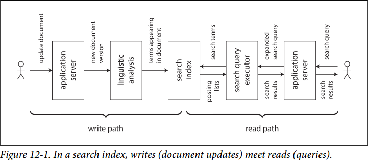

# Chapter 12. The Future of Data Systems

## 数据集成 Data Integration

- **组合使用衍生数据的工具Combining Specialized Tools by Deriving Data**
  - 理解数据流Reasoning about dataflows
    当需要在多个不同的系统中维护相同数据的副本以满足不同的访问模式时就需要对不同的系统以及数据流了如指掌，例如可以通过单个系统来提供所有用户输入，从而决定所有写入顺序，就可以在不同的系统上按相同的顺序处理写入，全局顺序达成共识
  - 衍生数据与分布式事务Derived data versus distributed transactions
    **分布式事务通过原子提交来确保变更只生效一次，而基于日志的系统通过确定性重试deterministic retry和幂等性idempotence来确保只生效一次**；分布式事务通过2PL等方式，可以提供线性一致性，而衍生数据系统通常异步更新，不提供相同的时序保证
  - **全局有序的限制The limits of total ordering**
    - 大多数情况下构建完全有序的日志需要汇报所有事件到一个**领导节点，吞吐量就受此局限**，而如果为了吞吐量进行分区，则不同分区内的事件顺序关系就不明确了
    - 如果数据中心地理位置相距很远，为了容忍整个数据中心掉线，每个数据中心有单独的主库（因为跨地域的同步复制效率低下，使用多主复制），此时会出现**不同数据中心的事件顺序未定义**
    - 进行微服务布置系统时，往往每个微服务独立进行持久化，微服务之间不共享状态，则来自两个不同服务的事件顺序未定义
    - 某些终端程序允许服务器不确认而直接生效，此时如果与服务器同步，服务器和终端可能以不同顺序看到事件

    大多数**共识算法consensus是针对单个节点的吞吐量已满足使用来设计的**，一旦涉及吞吐量超过单个节点、跨地域的服务就是新的研究问题
  - 排序事件以捕捉因果关系Ordering events to capture causality
- **批处理与流处理Batch and Stream Processing**
  - 维护衍生状态Maintaining derived state
  - 为了应用升级而重新处理数据Reprocessing data for application evolution
    应用需要**演化升级（灰度测试），通过旧架构和新架构并行维护，逐步将少量用户转移到新架构**，以测试性能和发现问题，逐步进行转移直到最终删除旧架构完成演化升级
  - Lambda架构The lambda architecture
    **Lambda架构就是并行运行批处理系统和流处理系统**，流处理系统快速消耗事件并产生粗粒度输出，批处理系统批量消耗事件并产生精确输出，但也有需要维护两套系统的额外开销、两套系统的输出难以合并、增加了系统的复杂性等问题
  - 统一批处理和流处理Unifying batch and stream processing
    - **重放数据replay**：通过重放历史数据是的流处理器也可以重复处理"流"数据
    - **故障容错**：对流处理器来说exactly once，对批处理器来说丢弃任何失败任务的部分输出
    - **事件时间**：按事件时间进行窗口化和处理，因为重放历史数据时按处理时间进行窗口化毫无意义

## 分拆数据库 Unbundling Databases

- **组合使用数据存储技术Composing Data Storage Technologies**
  - 创建索引Creating an index
    创建索引时数据库需要重新扫描现有数据集，并从一致性快照中构建索引，并且随后新数据进入时需要保持索引更新，更新索引类似追随者
  - **一切数据的元数据库The meta-database of everything**
    整个数据流就像一个巨大的数据库，每个模块就像数据库的子系统，例如批和流处理器就像触发器，不同的衍生数据系统就像不同的索引类型，根据主库的变化而同步或异步保持更新索引，**某个子系统故障就中断"全局事务"**
    - **联合数据库**：统一读取Federated database: unifying reads 为底层各系统提供一个统一的查询接口，遵循单一继承系统与关系型模型的传统，带有高级查询语言和优雅的语意，但极其复杂
    - **分拆数据库**：统一写入Unbundled databases: unifying writes 将子系统可靠的连接在一起，统一写入，确保整个系统的可靠和容错
  - 开展分拆工作Making unbundling work
    传统的同步写入方法需要跨异构存储系统的分布式事务，这是低效且复杂的，**具有幂等性写入的异步日志是一种更加可靠和实用的方法**
    - 系统级别，**异步事件流使整个系统对各个组件的中断或性能下降更稳健**，如果节点出错，事件日志可以缓冲消息，有问题的消费者也可以及时追赶上而不会错过数据，相比之下，**分布式事务的同步交互往往会放大故障到整个系统不可用**
    - 分拆后的数据系统可以允许不同团队独立开发，事件日志提供了一个足够强大的接口以满足相当强的一致性要求（持久化以及事件顺序）
  - 分拆系统对比集成系统Unbundled versus integrated systems
- 围绕数据流设计应用Designing Applications Around Dataflow
- **观察衍生数据状态Observing Derived State**
  - 物化视图与缓存Materialized views and caching：通过物化视图或缓存将常见的查询预先计算结果
  - 有状态，可离线的客户端Stateful, offline-capable clients：在设备上使用本地数据库保存状态，无需连接服务器即可使用，一旦联网就可以通过后台网络与远程服务器同步
  - 推送状态变更给客户端Pushing state changes to clients：主动推送更新数据给客户端，并且通过偏移量来处理短暂离线的设备推送失败，**每个终端都相当于是流数据的消费者**
  - 端到端的事件流End-to-end event streams：例如即时消息传递或在线游戏，端到端的事件流，**两侧都是有状态的**（但是无状态客户端的请求/响应模式已经根深蒂固）
  - 读也是事件Reads are events too：写入是通过事件日志进行的，而读取是临时的网络请求直接导向数据节点，也可以将**读取也变为事件流，与写入一样送往流处理器，流处理器通过将读取结果发送到输出流来响应读取事件**，读取也作为事件进行流处理可以**更好的追踪因果关系**，但是会产生额外的存储和IO开销
  - 多分区数据处理Multi-partition data processing：对于单个分区没有必要使用流数据来查询和响应，但是对于**多个分区的数据，本身数据就需要从多个分区进行合并、连接等操作，此时可以利用流数据提供的消息路由等功能**

  

## 目标是正确性 Aiming for Correctness

- **为数据库使用端到端的原则The End-to-End Argument for Databases**
  - 正好执行一次操作Exactly-once execution of an operation
    幂等性，对于非原生幂等的操作，需要额外维护一些元数据（例如每个操作ID有一个updated值，只要有updated值说明操作已经执行过了，即将非幂等的操作通过幂等的K-V转换为米等操作）
  - 抑制重复Duplicate suppression
  - 操作标识符Operation identifiers
    **为每个操作生成一个唯一的标识符如UUID**，将UUID存储在数据库中，则每次执行操作时如果数据库中已经有对应的UUID了，说明操作重复，可以由此抑制重复操作
  - **端到端的原则The end-to-end argument**
    低级别的可靠性功能本身不足以确保端到端的正确性，例如用户亲自提交重复的请求、TCP/UDP校验和无法检测BUG导致的数据损坏、TLS/SSL可以阻挡网络攻击者但无法阻挡恶意服务器等，因此需要端到端的功能来确保安全、幂等等特性
  - 在数据系统中应用端到端思考Applying end-to-end thinking in data systems
    仅仅使用了相对更安全的数据系统（例如可序列化事务）并不意味着应用就安全了，应用需要更多端到端的措施
- **强制约束Enforcing Constraints**
  - 唯一性约束需要达成共识Uniqueness constraints require consensus
    唯一性检查可以通过确保请求ID相同的请求都被路由到同一分区，然后每个分区有**唯一的领导节点**，由领导节点来确保只有一个请求成功（本质上就是达成共识问题）
  - 基于日志消息传递中的唯一性Uniqueness in log-based messaging
    **日志确保所有消费者以相同顺序看见事件，即全序广播并且等价于共识**，因此通过使用日志，所有流处理系统就可以看到所有事件的顺序，由此对于冲突ID，第一个请求事件成功，随后的都失败，并输出结果到输出流中，基本原理在于任何可能导致冲突的事件都会由相同的分区进行日志顺序处理解决冲突
  - 多分区请求处理Multi-partition request processing
    **跨分区事务也可以通过分区日志来解决正确性而无需分布式事务的原子提交**：
    1. 某个请求同时操作了分区A和分区B的数据，则由客户端提供一个唯一的请求ID，并按ID写入相应分区
    2. 流处理器读取请求日志，对于每个请求，继续流出两条消息，分区A的处理事件，分区B的处理事件，两条消息均带有原始请求ID
    3. 后续的流处理器根据请求ID进行去重，并分别应用到分区A和B上

    由于请求ID也写入了相应的分区，因此在1/2之间失败时可以根据分区日志重建请求，2/3也有相应的分区日志，失败时也可以根据分区日志重建事件，同时根据ID进行去重，因此A宕机B成功也可以最终A上**重试到成功（deterministic retry）**；还可以通过**额外的流处理器来校验数据**，拒绝会破坏数据约束的操作如账户透支
- **及时性与完整性Timeliness and Integrity**
  - 数据流系统的正确性Correctness of dataflow systems
    完整性Integrity是流处理系统的核心，而由于流处理本身是异步日志式的，不保证及时性Timeliness，**exactly-once semantics是保证完整性的机制**
    1. 将写入操作的内容表示为单条消息从而可以被轻松地原子写入
    2. 使用与存储过程类似地确定性deterministic衍生函数，从一个消息中衍生出其他状态变更
    3. 客户端生成的**请求ID传递通过所有处理层次，即透传**，实现端到端去重，提供幂等性保证
    4. 消息不可变immutable，允许衍生数据能够随时被重新处理，使错误恢复更容易
  - 宽松地解释约束Loosely interpreted constraints
    提供补偿性事务compensating transaction，即即使唯一性约束被破坏，例如超卖机票，也可以通过补偿和道歉来修复，这些也是可以接受的
  - 无协调数据系统Coordination-avoiding data systems
    数据流系统可以维持衍生数据地完整性保证而无需原子提交、线性一致性、同步跨分区协调，虽然严格的唯一性约束需要及时性和协调，但是适当宽松的约束只要保证完整性即可，而约束被临时违反后可以得到修复
- **信任但验证Trust, but verify**
  - 维护完整性，尽管软件有漏洞Maintaining integroity in the face of software bugs
  - 不要轻信承诺Don't just blindly trust what they promise
  - 验证的文化A culture of verification
  - 为可审计性而设计Designing for auditability
  - 端到端原则的思考The end-to-end argument again
  - 用于可审计数据系统的工具Tools for auditable data systems

## 做正确的事 Doing the Right Thing

- **预测性分析Predictive Analytics**
  - 偏见与歧视Biasa and discrimination：人类判断会有主观性，但是即使叫给算法，也不能排除算法存在系统性偏差，另一方面算法基于数据，给定的数据本身也可能存在偏差
  - 责任与问责Responsibility and accountability
  - 反馈循环Feedback loops
- **隐私和追踪Privacy and Tracking**
  - 监视Surveillance
  - 同意与选择的自由Consent and freedom of choice
  - 隐私与数据使用Privacy and use of data
  - 数据资产与权力Data as assets and power
  - 记着工业革命Remembering the Industrial Revolution
  - 立法和自律Legislation and self-regulation
