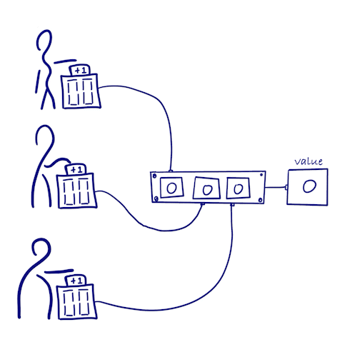
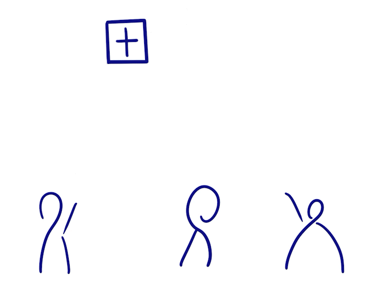
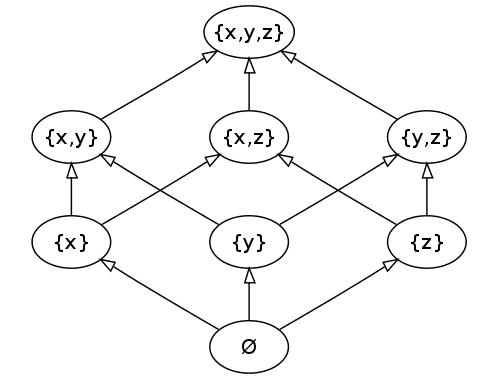
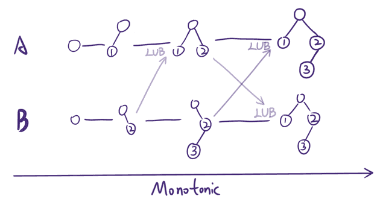

# CRDTs: The Hard Parts

## CRDT简介

[original post 1](https://www.zxch3n.com/crdt-intro/crdt-intro/)

[original post 2](https://www.zxch3n.com/crdt-intro/design-crdt/)

- [CAP定理](https://github.com/JasonYuchen/notes/blob/master/dsaaa/16.Replicated_Data_Management.md#168-brewers-cap-theorem)
- 最终一致性较弱，高可用性又是分布式系统中所追求的，同时达到强一致性和高可用性不可能，**Conflict-free Replicated Data Types, CRDT提供强最终一致性**
- **强最终一致性 Strong Eventual Consistency SEC**在最终一致性的基础上，额外要求一旦网络分区被解决后，重新互联的节点能立即**达成一致而不需要解决冲突**（CRDT在数学上不允许冲突发生），即能够自动收敛到一致

简单的CRDT实例：

- **Grow-only Counter**
  每个进程都维护其他进程计数器的副本，而只修改自己的计数器，一旦网络恢复则同步其他进程的计数器数据到本地，从而每个节点都能获得一个一致的和，显然这种设计不需要解决冲突，且能收敛到相同的结果
  
  

- **Grow-only Set**
  每个进程都维护其他进程集合的副本，而只增加自己的集合元素，一旦网络恢复则同步其他进程的集合元素到本地，从而每个节点都能获得一个相同的最终集合，显然这种设计不需要解决冲突，且能收敛到相同的结果

  

### 术语和定义

- **偏序 partial order**，给定集合`S`，若`<=`满足自反性、反对称性、传递性，则`S`是偏序集
- **半格 semilatice**，半格是一个偏序集，每个非空集合都有其**上确界Least Upper Bound, LUB**

图中`A -> B`箭头代表集合的偏序关系`A <= B`，而比如`{x}`和`{y}`不可比较没有偏序关系

### State-based CRDT, CvRDT

基于状态的CRDT首先需要定义一个State-based object，其要求提供如下定义：

- `state`
- `state_zero`内部状态的初始值
- `<=`定义状态之间的顺序
- `update(s, u)`定义状态的更新方式
- `merge(s, s')`定义状态的合并方式
- 副本之间通过船体状态并执行`merge`来达到一致

如果一个对象满足以下属性，其就被称为**单调半格 monotonic semilatice**，这也是设计State-based CRDT的核心要求：

- 对象集合以`<=`为顺序的半格
- 合并本地状态和远端状态`merge(s, s')`的方式为计算二者的**上确界LUB**
- 在所有更新操作中状态`s`单调递增，即`s <= update(s, u)`

### Op-based CRDT, CmRDT

基于操作的CRDT首先需要定义一个Op-based object，其要求提供如下定义：

- `state`
- `state_zero`内部状态的初始值
- `op`是每个原子操作的类型，副本直接通过传递`op`并`apply`来达到同步
- `apply(state, op)`用于将`op`应用在状态上并获得新状态，且需要满足交换律，即`apply(apply(s, opA), opB) == apply(apply(s, opB), opA)`
- `check(state, op)`用于确认一个状态是否满足`apply`的条件
  - Op-based CRDT的每一个操作都需要检查对应的`check(state, op)`是否满足
  - `check`的目的在于确保`op`所依赖的**因果顺序成立**
- 根据`op`执行的顺序可以定义`op`之间的偏序关系
  - 若某个副本上`opA`先于`opB`执行，则`opA < opB`
  - 若`opA < opB`和`opB < opA`均不满足，则称`opA`和`opB`并发

设计Op-based CRDT的核心要求：

- 出现并发的`Op`必须满足交换律，即不论先应用哪个`Op`最终状态都一致
- 在`apply`时必须保证`Op`依赖的前置状态都满足

### 一些开源的CRDT项目

- [Yjs](https://github.com/yjs/yjs)
- [Automerge](https://github.com/automerge/automerge)
- [diamond-type](https://github.com/josephg/diamond-types)

### CRDT示例：可增减元素的集合 LWWSet

- 事件先后顺序可以由[Lamport Timestamp定序](https://github.com/JasonYuchen/notes/blob/master/ddia/09.Consistency_and_Consensus.md#2-%E5%BA%8F%E5%88%97%E5%8F%B7%E9%A1%BA%E5%BA%8F-sequence-number-ordering)（分布式系统中的[时间和顺序](https://github.com/JasonYuchen/notes/blob/master/dsaaa/06.Time.md#chapter-6-time-in-a-distributed-system)）

`TODO`

## The Hard Parts

[original post](https://martin.kleppmann.com/2020/07/06/crdt-hard-parts-hydra.html)
