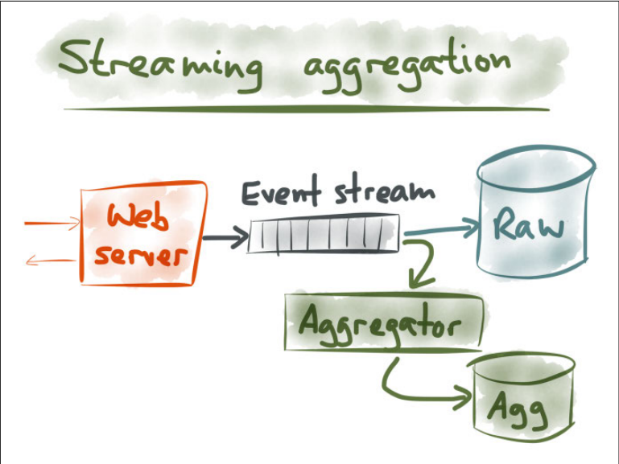

# Making Sense of Stream Processing

## 事件与流处理 Events and Stream Processing

1. **实现Google分析** Implementing Google Analytics: A Case Study
   - 记录所有原始事件，当需要统计信息时，直接Select
   - 记录聚合数据，例如OLAP里的data cube，只记录一些概要的统计信息

   

2. **时间溯源：来自数据驱动开发** Event Sourcing: From DDD Community
   相比于直接更新数据库的记录，采用直接记录所有变化的方式，即**事件溯源 Event Sourcing**，从而所有更新本身是不可变的事件，相对应的如果在数据库直接修改原始数据进行状态更新是一种破坏性的更新，会丢失所有历史变化
3. **整合事件溯源和流处理** Bringing Together Event Sourcing and Stream Processing
   时间溯源与流处理，所有事件的处理都是天然的写入数据库，而对状态的观察就是整合一系列事件得到最新的状态即数据库的读取
4. **对不可变事件使用仅追加的流** Using Append-only Streams of Immutable Events
   - **解耦**：写事件和读事件分开处理，解耦同时提升读写性能
   - **可扩展性**：读/写天然对应生产者/消费者，从而获得极高的可扩展性和灵活性
   - **灵活性**：当有需求变更时，只需要增加读写逻辑，与原来的流程并行，从而不影响原流程的情况，当满足要求时才进行切换，灵活可靠
   - **可查证性/故障恢复**：因为所有事件本身是不可变的，由此当对结果和状态有疑问时，只需要回放所有历史事件就可以进行校对和错误恢复
5. **CEP, Actors, Reactive, and More**
   - **Actors**：基于不可变事件/消息的流，但往往用于提供并行任务处理而不是数据管理，因此在容错、故障恢复等方面并不提供很高的保证
   - **Change Data Capture, CDC**：按类似的方式使用现有的数据库，但捕获所有修改数据的事件（inserts,updates,deletes）并形成事件流由另一个应用来处理

## 基于日志的数据基础设施 Using Logs to Build a Solid Data Infrastructure

`TODO`

## 变化数据捕获 Integrating Databases and Kafka with Change Data Capture

`TODO`

## 分布式数据的UNIX哲学 The Unix Philosophy of Distributed Data

`TODO`

## 再看数据库 Turning the Database Inside Out

`TODO`
