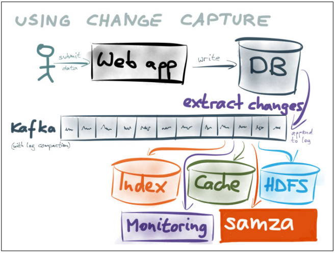
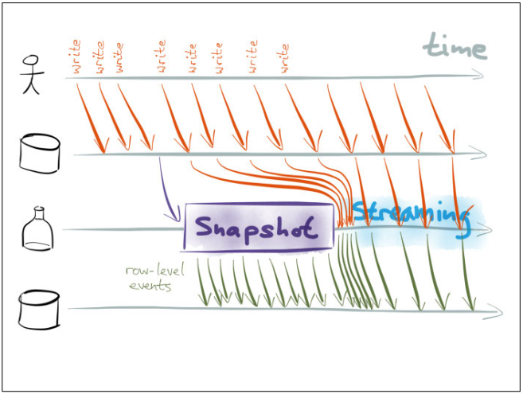
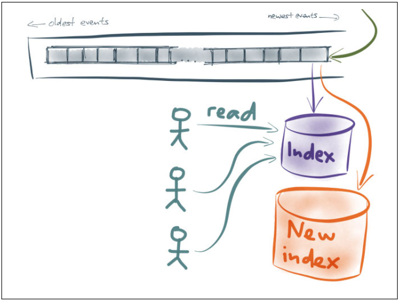

# Making Sense of Stream Processing

## 事件与流处理 Events and Stream Processing

1. **实现Google分析** Implementing Google Analytics: A Case Study
   - 记录所有原始事件，当需要统计信息时，直接Select
   - 记录聚合数据，例如OLAP里的data cube，只记录一些概要的统计信息

   

2. **时间溯源：来自数据驱动开发** Event Sourcing: From DDD Community
   相比于直接更新数据库的记录，采用直接记录所有变化的方式，即**事件溯源 Event Sourcing**，从而所有更新本身是不可变的事件，相对应的如果在数据库直接修改原始数据进行状态更新是一种破坏性的更新，会丢失所有历史变化
3. **整合事件溯源和流处理** Bringing Together Event Sourcing and Stream Processing
   时间溯源与流处理，所有事件的处理都是天然的写入数据库，而对状态的观察就是整合一系列事件得到最新的状态即数据库的读取
4. **对不可变事件使用仅追加的流** Using Append-only Streams of Immutable Events
   - **解耦**：写事件和读事件分开处理，解耦同时提升读写性能
   - **可扩展性**：读/写天然对应生产者/消费者，从而获得极高的可扩展性和灵活性
   - **灵活性**：当有需求变更时，只需要增加读写逻辑，与原来的流程并行，从而不影响原流程的情况，当满足要求时才进行切换，灵活可靠
   - **可查证性/故障恢复**：因为所有事件本身是不可变的，由此当对结果和状态有疑问时，只需要回放所有历史事件就可以进行校对和错误恢复
5. **CEP, Actors, Reactive, and More**
   - **Actors**：基于不可变事件/消息的流，但往往用于提供并行任务处理而不是数据管理，因此在容错、故障恢复等方面并不提供很高的保证
   - **Change Data Capture, CDC**：按类似的方式使用现有的数据库，但捕获所有修改数据的事件（inserts,updates,deletes）并形成事件流由另一个应用来处理

## 基于日志的数据基础设施 Using Logs to Build a Solid Data Infrastructure

1. **双写 Dual Writes**
   双写即由应用程序保证，对每一份数据都切实写入每一个需要写入的位置，实现简单但缺陷明显：
   - **数据竞争race conditions**：如果client1对X写入了A，client2对X写入了B，在两个存储上分别对X写入了或A或B，数据一致性遭到了破坏
   - **部分失败partial failure**：对于单一的数据库，通过ACID保证，但是对于多个写入且缺乏诸如2PC一类的分布式事务，数据的写入很可能出现某些位置成功，某些位置失败，即部分失败Partial Failure，导致数据一致性遭到了破坏
2. **确保数据在正确的状态**
   采用**全序写入totally ordered，仅追加append-only，持久化persistent**的方式，从而确保数据可追溯、无竞争、安全可靠，最终实现整个系统一致
3. **实践中的日志**
   - **数据库存储引擎 storage engines**：数据库存储引擎使用预写式日志Write-Ahead Log (WAL，在磁盘上是append-only的文件)进行数据的更新，数据修改首先写入日志，随后再修改真正的数据，通过WAL保证了性能同时如果真正的数据更新一半宕机就可以通过WAL进行数据的恢复；既然数据和WAL都是写在磁盘上，仅采用WAL就可以作为数据库，采用WAL作为底层存储的数据库称为Log-structured storage例如LSM

     

   - **数据库副本 replication**：实践中往往采用多个数据库互为备份，在主库leader故障时可以迁移failover到从库follower，而主从之间的同步往往采用日志replication log进行同步

     

   - **分布式共识 consensus**：采用日志记录所有达成共识的提交，而达成共识的过程就是相当于创建日志且每一项**仅有一次exactly-once delivery并且全局有序atomic broadcast**
   - **流数据 stream**：诸如AMQP/JMS的消息系统更像是任务队列，对每个任务都会需要订阅者ACK，而没有ACK的会重复发送，此时就会出现后加入的Job被先ACK，不能保证顺序；而诸如Kafka的消息系统是事件日志的处理，每个事件都会确保按顺序分发给订阅者，因此也就不需要ACK，因为所有消息都是按顺序处理的，只需要记录当前处理到的offset即可
4. **解决数据整合问题**
   通过消息队列，所有数据都追加到队列里，而多个消费者严格按照顺序进行消费，即使一部分消费者出现故障，只需要在解决后从上一次的offset开始消费即可，而不会出现不一致，最终整个系统都能达成**最终一致性eventually consistent**

   

5. **事务和完整性限制**
   当采用了消息队列后整个系统是最终一致性的，当有更强的事务需求时如强一致性，可以通过进一步约束达成，例如：
   - **变化数据捕获 Change Data Capture, CDC**
   - **"两阶段提交 2PC"**：对于想要强一致的消息，在消息处理成功后同样发出一条ACK，当所有子系统都ACK这一条消息时，即可以**认为所有系统达成了一致，此时再回复给客户端**，对客户端而言这条消息已经强一致了（基于Kafka系统提供更强的事务如Tango project）

## 变化数据捕获 Integrating Databases and Kafka with Change Data Capture

1. **变化数据捕获 Change Data Capture, CDC**
   由于通过日志流的方式整合使用多个数据源是异步化的，这会导致原先直接使用数据库的一致性不能被保证（只能达到最终一致性），除了分布式系统常见的2PC协议，还可以通过变化数据捕获CDC来达成原先的一致性，即数据依然首先访问数据库，而**数据库的数据变化被捕获并且以日志流的方式传递给其他系统**

   

2. **数据库就是变化的日志**
   实际上数据库数据的变化本身也可以视作是一个日志，**数据库就是记录变化的日志**，如同数据库主从同步时使用的replication log就是一种将变化输出的方式，即CDC，CDC的实现就需要数据库能够输出两种文件给其他系统：
   - 数据库某一个点的**一致性快照consistent snapshot**
   - 从一致性快照之后的所有**实时变化日志real-time stream of changes**
3. **实现快照和变化流**
   使用MVCC机制可以实现不阻塞用户读写的快照

   

4. **CDC连接PostgreSQL和Kafka**
   PostgreSQL通过提供了一个**逻辑解码器logical decoding接口**，解析自己的WAL变化并作为CDC提供给外部接口，同时终止/回滚的事务并不会出现在这个接口上，因此只要严格按照logical decoding提供的事件，就能实现和PostgreSQL达成一致
   Kafka的日志压缩log compaction实现了永久保留每个key最新的值，旧的值会被不断的垃圾回收，因此可以随意部署新的系统作为订阅者，从而获得所有最新数据，此时访问Kafka就和访问原来的数据库一样
   当新索引建立完全后，就可以**逐步将用户读流量迁移到新索引上**，整个过程平滑且可靠

   

5. **逻辑解码器**
   由于PostgreSQL提供的logical decoding只会根据事务提交的顺序输出响应的数据变化记录，而事务处理可能由于并发是交织的，因此logical decoding会**根据WAL以及事务提交的顺序重新组织数据变化记录**，确保记录输出的顺序与提交一致，而其他数据源如果直接解析WAL，可能需要考虑到并发事务，手动处理不同事务的数据修改记录

## 分布式数据的UNIX哲学 The Unix Philosophy of Distributed Data

`TODO`

## 再看数据库 Turning the Database Inside Out

`TODO`
