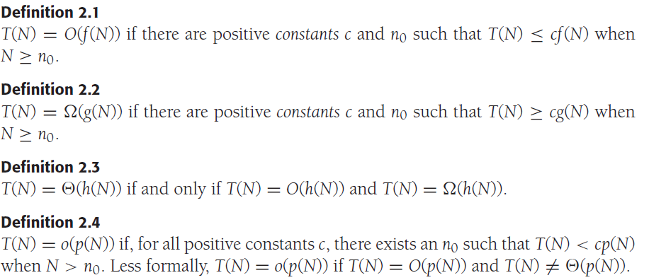
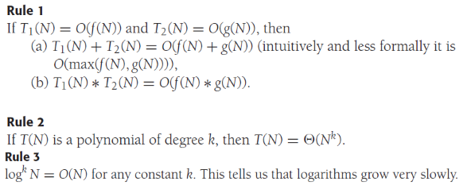

# Chapter 2. Algorithm Analysis

## 1. 数学背景 Mathmatical Background

### 复杂度记法及定义



### 计算规则



## 2. 模型 Model

`TODO`

## 3. 分析内容 What to Analyze

时间复杂度time complexity和空间复杂度space complexity

## 4. 计算运行时间 Running-Time Calculations

以最大子列和Maximum Subsequence Sum为例：

1. 暴力算法，O(N^3)

    ```cpp
    /**
    * Cubic maximum contiguous subsequence sum algorithm.
    */
    int maxSubSum1( const vector<int> & a )
    {
        int maxSum = 0;

        for( int i = 0; i < a.size( ); ++i )
            for( int j = i; j < a.size( ); ++j )
            {
                int thisSum = 0;

                for( int k = i; k <= j; ++k )
                    thisSum += a[ k ];

                if( thisSum > maxSum )
                    maxSum   = thisSum;
            }

        return maxSum;
    }
    ```

1. 优化后的暴力算法，O(N^2)

    ```cpp
    /**
     * Quadratic maximum contiguous subsequence sum algorithm.
     */
    int maxSubSum2( const vector<int> & a )
    {
        int maxSum = 0;
    
        for( int i = 0; i < a.size( ); ++i )
        {
            int thisSum = 0;
            for( int j = i; j < a.size( ); ++j )
            {
                thisSum += a[ j ];
    
                if( thisSum > maxSum )
                    maxSum = thisSum;
            }
        }
    
        return maxSum;
    }
    ```

1. 递归算法，O(NlogN)

    ```cpp
    /**
     * Recursive maximum contiguous subsequence sum algorithm.
     * Finds maximum sum in subarray spanning a[left..right].
     * Does not attempt to maintain actual best sequence.
     */
    int maxSumRec( const vector<int> & a, int left, int right )
    {
        if( left == right )  // Base case
            if( a[ left ] > 0 )
                return a[ left ];
            else
                return 0;
    
        int center = ( left + right ) / 2;
        int maxLeftSum  = maxSumRec( a, left, center );
        int maxRightSum = maxSumRec( a, center + 1, right );
    
        int maxLeftBorderSum = 0, leftBorderSum = 0;
        for( int i = center; i >= left; --i )
        {
            leftBorderSum += a[ i ];
            if( leftBorderSum > maxLeftBorderSum )
                maxLeftBorderSum = leftBorderSum;
        }
    
        int maxRightBorderSum = 0, rightBorderSum = 0;
        for( int j = center + 1; j <= right; ++j )
        {
            rightBorderSum += a[ j ];
            if( rightBorderSum > maxRightBorderSum )
                maxRightBorderSum = rightBorderSum;
        }
    
        return max3( maxLeftSum, maxRightSum,
                        maxLeftBorderSum + maxRightBorderSum );
    }
    ```

1. 动态规划，O(N)

    ```cpp
    /**
     * Linear-time maximum contiguous subsequence sum algorithm.
     */
    int maxSubSum4( const vector<int> & a )
    {
        int maxSum = 0, thisSum = 0;
    
        for( int j = 0; j < a.size( ); ++j )
        {
            thisSum += a[ j ];
    
            if( thisSum > maxSum )
                maxSum = thisSum;
            else if( thisSum < 0 )
                thisSum = 0;
        }
    
        return maxSum;
    }
    ```
