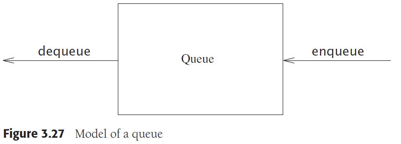

# Chapter 3. Lists, Stack, and Queues

## 1. 抽象数据类型 Abstract Data Types, ADTs

ADT是由一组对象集合和一组操作集合构成的，是实际数据数学上的抽象组合

## 2. 表的抽象数据类型 The List ADT

- 简单数组实现表
- 链表
    
  - 双向链表插入新节点
        `p->prev = p->prev->next = new Node{ x, p->prev, p };`
        
  - 双向链表删除旧节点
        `p->prev->next = p->next; p->next->prev = p->prev; delete p;`
        

## 3. STL中的vector和list

`TODO：参考<vector>, <list>, <forward_list>`

## 4. 栈的抽象数据类型 The Stack ADT

`TODO: 参考<stack>`

## 5. 队列的抽象数据类型 The Queue ADT

`TODO: 参考<queue>, <deque>`

