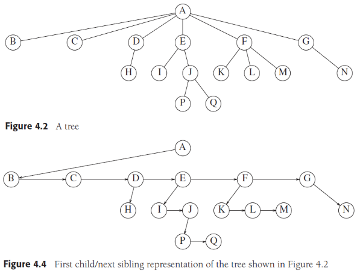
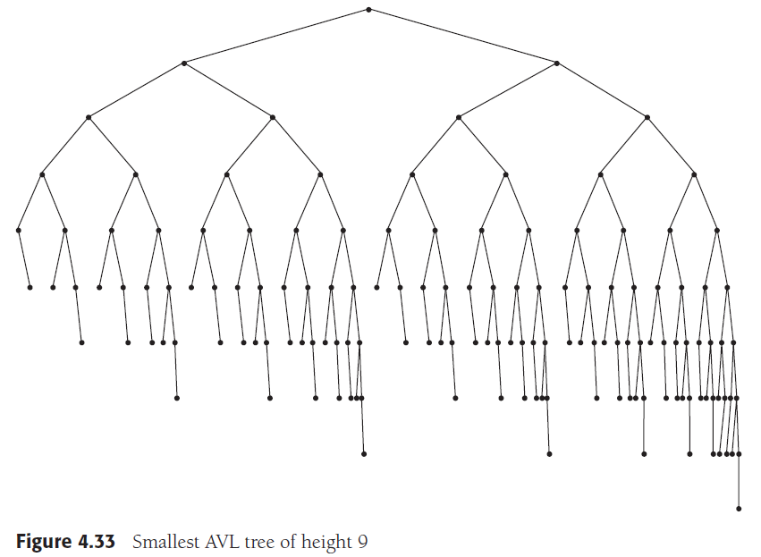
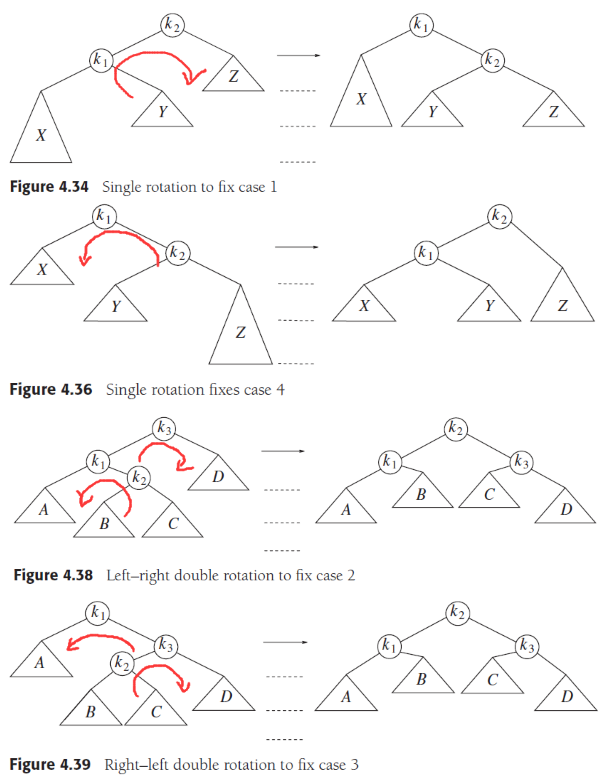
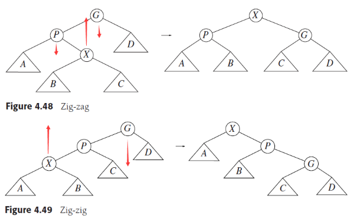
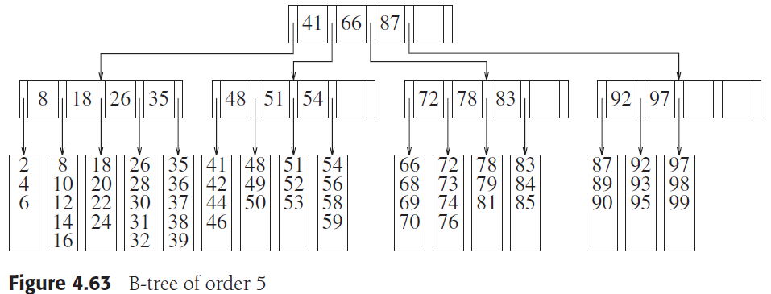

# Chapter 4. Trees

## 1. 预备 Preliminaries

- 定义
    树可以递归定义为：树由节点的集合组成，集合可以为空对应空树，也可以为拥有一个根节点和零个或多个子树的集合，子树通过边与根节点相连
- 其他概念
  - 叶节点leaf：没有子树只有根节点的树节点称为树的叶节点
  - 兄弟节点siblings：拥有同一个根节点的子树根节点互为兄弟节点
  - 节点路径：从节点n1到节点nk的路径定义为一系列节点的串且后一个节点是前一个节点的子节点，路径长就是连接这一系列节点的边的数目k-1，树中从根节点到任意节点的路径唯一
  - 节点深度depth：节点深度就是从根节点到此节点唯一路径的长度，根节点深度为0
  - 节点高度height：节点高度就是从此节点到叶节点最长路径的长度，叶节点高度为0
  - 完全二叉树complete：除底层外每一层都满，底层从左到右填充，高度为⌊logN⌋
  - 完美二叉树perfect：有2^(h+1)-1个节点，完全填满每一层的二叉树
- 实现
    由于树具有多少个子节点是未知且不统一的，因此难以通过每个节点管理自身所有子节点来实现，而是通过每个节点保存下一个兄弟节点指针和第一个子节点指针来实现
- 遍历
  - 前序preorder：根->子节点
  - 后序postorder：子节点->根
  - 二叉树的中序inorder：左子节点->根->右子节点



## 2. 二叉树 Binary Trees

任意节点最多拥有两个子节点的树，平均深度为logN，但是最坏情况下深度为N-1

## 3. 二叉搜索树 The Search Tree ADT—Binary Search Trees

- 定义
    任意节点左侧子树中存储的所有数据小于此节点数据，右侧子树中存储的所有数据大于此节点数据
- 操作
  - 包含contain
  - 最小值findMin/最大值findMax
  - 插入insert
  - 删除remove：
    - 可以用被删除数据左子树的最大值或右子树的最小值来代替被删除的节点，随后递归删除代替值的节点
    - 懒惰删除，节点被标记为删除，等并不从树中移除

    ```cpp
    void remove( const Comparable & x, BinaryNode * & t )
    {
        if( t == nullptr )
            return;   // Item not found; do nothing
        if( x < t->element )
            remove( x, t->left );
        else if( t->element < x )
            remove( x, t->right );
        else if( t->left != nullptr && t->right != nullptr ) // Two children
        {
            t->element = findMin( t->right )->element;
            remove( t->element, t->right );
        }
        else
        {
            BinaryNode *oldNode = t;
            t = ( t->left != nullptr ) ? t->left : t->right;
            delete oldNode;
        }
    }
    ```

- 复杂度
    一般情况下，平均时间复杂度为O(logN)，但是由于删除的存在，若删除总是用左子树的最大值来代替则会导致树出现倾斜，即右侧子树的数量开始增多，影响了性能，反之用右子树的最大值来代替也会有类似问题

## 4. AVL树

- 定义
    在二叉搜索树的基础上，要求左右子树的高度差不超过1的树，确保了树的深度是O(logN)，由此AVL树需要一定的操作来维持平衡
    
- **破坏平衡的情况**
  - 一类：在左子树的左侧insert/remove，在右子树的右侧insert/remove
  - 二类：在左子树的右侧insert/remove，在右子树的左侧insert/remove

  ```cpp
  void insert( const Comparable & x, AvlNode * & t )  //与普通二叉搜索树的insert基本一致，后balance
  {
      if( t == nullptr )
          t = new AvlNode{ x, nullptr, nullptr };
      else if( x < t->element )
          insert( x, t->left );
      else if( t->element < x )
          insert( x, t->right );
      
      balance( t );  //调用平衡算法
  }
  void remove( const Comparable & x, AvlNode * & t )  //与普通二叉搜索树的remove基本一致，后balance
  {
      if( t == nullptr )
          return;   // Item not found; do nothing
      
      if( x < t->element )
          remove( x, t->left );
      else if( t->element < x )
          remove( x, t->right );
      else if( t->left != nullptr && t->right != nullptr ) // Two children
      {
          t->element = findMin( t->right )->element;
          remove( t->element, t->right );
      }
      else
      {
          AvlNode *oldNode = t;
          t = ( t->left != nullptr ) ? t->left : t->right;
          delete oldNode;
      }
      
      balance( t );   //调用平衡算法
  }
  ```

- **维护平衡状态**
    需要在每个节点额外维护一个此节点的高度值，当插入元素时更新到根节点路径的高度，一旦出现高度超过1即执行平衡维护操作，空树的高度定义为-1
    

    ```cpp
    void balance( AvlNode * & t )
    {
        if( t == nullptr )
            return;
        //ALLOWED_IMBALANCE = 1
        //注意：当左子树的左右侧高度相等时用单左旋，因此>=，这是为了remove考虑的
        if( height( t->left ) - height( t->right ) > ALLOWED_IMBALANCE )  //左子树比右子树超出1
            if( height( t->left->left ) >= height( t->left->right ) )     //左子树左侧不低于右侧就单左旋
                rotateWithLeftChild( t );
            else                                                          //左子树右侧更高就左右双旋
                doubleWithLeftChild( t );
        else
        if( height( t->right ) - height( t->left ) > ALLOWED_IMBALANCE )  //右子树比左子树超出1
            if( height( t->right->right ) >= height( t->right->left ) )   //右子树右侧不低于左侧就单右旋
                rotateWithRightChild( t );
            else                                                          //右子树左侧更高就右左双旋
                doubleWithRightChild( t );
                
        t->height = max( height( t->left ), height( t->right ) ) + 1;     //更新高度
    }
    int height( AvlNode *t ) const
    {
        return t == nullptr ? -1 : t->height; //注意空树的高度为-1
    }
    ```

  - 针对一类的维护：单旋转（左子树左侧插入用左旋case1、右子树右侧插入用右旋case4）

    ```cpp
    void rotateWithLeftChild( AvlNode * & k2 )                          //单左旋case1
    {
        AvlNode *k1 = k2->left;
        k2->left = k1->right;
        k1->right = k2;
        k2->height = max( height( k2->left ), height( k2->right ) ) + 1;
        k1->height = max( height( k1->left ), k2->height ) + 1;
        k2 = k1;
    }
    void rotateWithRightChild( AvlNode * & k1 )                         //单右旋case4
    {
        AvlNode *k2 = k1->right;
        k1->right = k2->left;
        k2->left = k1;
        k1->height = max( height( k1->left ), height( k1->right ) ) + 1;
        k2->height = max( height( k2->right ), k1->height ) + 1;
        k1 = k2;
    }
    ```

  - 针对二类的维护：双旋转（左子树右侧插入用左右旋case2、右子树左侧插入用右左旋case3）

    ```cpp
    void doubleWithLeftChild( AvlNode * & k3 )                          //左右双旋case2
    {
        rotateWithRightChild( k3->left );
        rotateWithLeftChild( k3 );
    }
    void doubleWithRightChild( AvlNode * & k1 )                         //右左双旋case3
    {
        rotateWithLeftChild( k1->right );
        rotateWithRightChild( k1 );
    }
    ```

  - 插入后递归维护每个节点的高度，发现超过1即执行平衡操作，若新高度与旧高度一致则结束

## 5. 伸展树 Splay Trees

- 定义
    伸展树定义了一系列操作下的时间复杂度界限，如M次操作下的时间复杂度为O(MlogN)，一些操作可能多于O(logN)，一些少于O(logN)，最终平摊结果是O(logN)的操作复杂度。根据**局部性原理，一些节点被访问后很有可能在不久的未来被再次访问，因此可以通过将这次访问的节点提升到根附近来加速未来的访问**
- **伸展**
    通过AVL的操作也可以实现节点的提升，但是整体性能依然是下降的，由此我们采用另外的方式来实现节点的提升，即Zig-zag和Zig-zig，可以使被访问路径上的所有节点整体提升
  - Zig-zag（即AVL树的双旋转）
  - Zig-zig
  
- 操作
  - 插入
  - 删除
        对于伸展树删除元素，只需要访问一次被删除元素，使其被伸展至根节点，删除后就有了左子树和右子树，随后通过访问左子树的最大值（或右子树的最小值）使其位于子树的根节点，则这个新的根节点只有左子树，那么就可以将右子树作为新根的右子树，删除完成
  - 最大值/最小值

## 6. 树的遍历 Tree Traversals (Revisited)

- 先序遍历（Preorder traversal）：根->遍历左子树->遍历右子树
- 中序遍历（Inorder traversal）：遍历左子树->根->遍历右子树
- 后序遍历（Postorder traversal）：遍历左子树->遍历右子树->根
- 层序遍历（Levelorder traversal）：从根开始同一深度的节点连续扫描

```cpp
// 非递归遍历的先序，中序，后序实现
vector<int> postorderTraversal(TreeNode* root) {
    vector<int> ret;
    if (!root) {
        return ret;
    }
    stack<TreeNode *> s;
    TreeNode *cur = root, *pre = nullptr;
    while (!s.empty() || cur) {
        if (cur) {

            ///for preorder, uncomment this
            // ret.push_back(cur->val);

            s.push(cur);
            cur = cur->left;
        } else {
            cur = s.top();

            ///for postorder, uncomment this
            // if (!cur->right || cur->right == pre) {
            //     ret.push_back(cur->val);
            //     pre = cur;
            //     cur = nullptr;
            //     s.pop();
            // } else {
            //     cur = cur->right;
            // }

            ///for inorder, uncomment this
            // ret.push_back(cur->val);

            ///for preorder & inorder, uncomment this
            // s.pop();
            // cur = cur->right;
        }
    }
    return ret;
}
```

## 7. B树

更为详尽的数据库中B+树的性质见[cs186 B+ trees]

- 定义
    B树往往有不同的变种和实现（此处使用了较为著名的B+树的定义），一般而言，B树的目的是采用更多的分支，来将大量的数据存储深度有限的树内，以实现更少的磁盘IO，一般B树的深度为O(logM/2(N)), M/2是底数
    
- M叉B树的性质
  - 叶节点存储数据
  - 非叶节点存储最多M-1个关键字来引导查找，第i个关键字代表第i+1子树内的最小值
  - 树的根节点要么没有子树（叶节点），要么拥有2到M个子节点
  - 除根节点以外的非叶节点有「M/2到M个子节点
  - 所有叶节点深度相同，且拥有「L/2到L个数据，L为B树的阶数
- 操作
    由于需要保持B树的性质，因此存在合并兄弟节点和拆分兄弟节点的操作，参考右侧图示，当插入导致单个叶子节点无法容纳数据时就近似等分成两个叶节点，同理当非叶节点容纳不下时也近似等分，递归直到根节点，根节点容纳不下时就近似等分成两个非叶节点，并且一个新根节点出现，因此根节点允许最少2个子节点（此时B树增加一层高度），当相邻两个节点不足半满时就自动合并类似拆分的逆动作

## 8. STL中的树

`TODO: 参考<map>, <set>`

## 9. 哈夫曼编码 Huffman code

见[算法设计技巧]