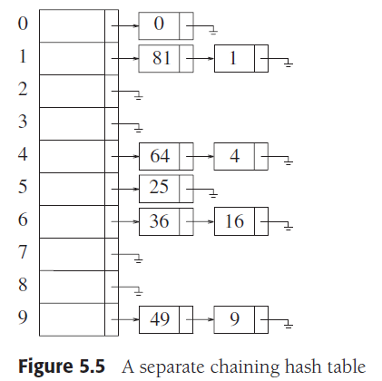
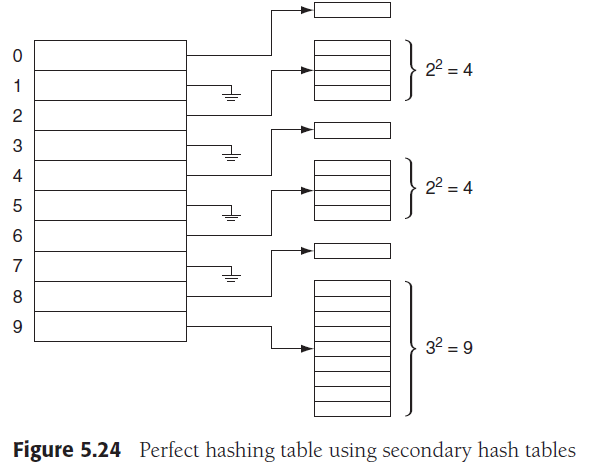
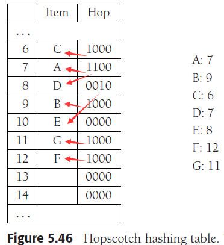
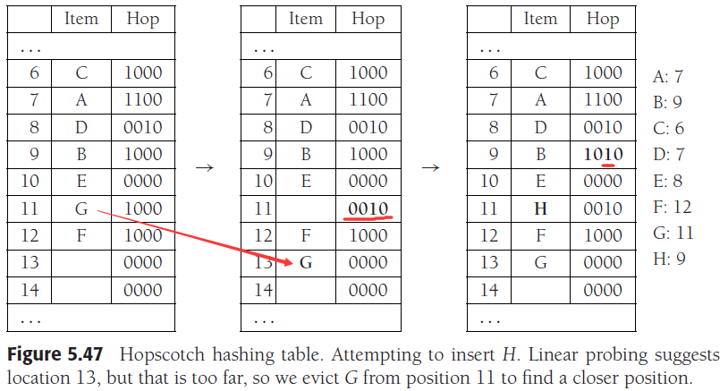
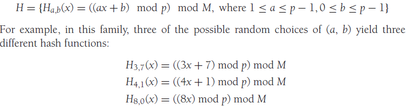
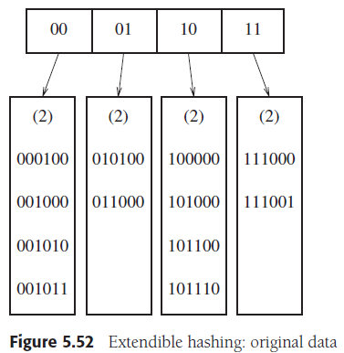
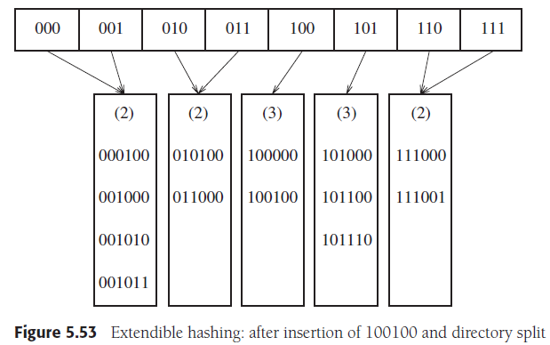

# Chapter 5. Hashing

## 1. 散列函数 Hash Function

实现键值到索引映射关系的函数称为散列函数，好的散列函数将尽可能避免不同的键值映射到同一索引，即尽可能避免**散列冲突**，一些简单设计可以是整数对散列表大小取模来获得索引，此时散列表大小应是素数，或者对字符串进行多项式计算后对散列表大小取模来获得索引

## 2. 分离链接法 Separate Chaining

由于散列函数可能使多个键值映射到同一个索引，如此出现了冲突，解决的方法之一是每个散列表项存储一个链表，**冲突的数据均链接在链表上**，这样解决了冲突但是就不能保证每个数据项都是O(1)的访问了



装填因子`λ`=已有元素数量/散列表大小

`λ`对性能有显著影响，因此一般散列表会取的较大以充分减小出现多个键值映射同一个索引，平均访问次数为：

- 查找成功：`1+λ/2`
- 查找失败或插入元素：`λ+exp(-λ)`

## 3. 非链接散列表 Hash Tables without Linked Lists

又叫开放定址散列表，所有元素都存放在表中，若出现冲突，则按一定的算法寻找下一个为空的散列表项存放，若不为空则继续按这个算法找下一个，即`hi(x)=(hash(x) + f(i))`，不同的`f(i)`实现了各种具体散列表，但是一般非链接散列表要**确保`λ<0.5`保证性能**，同时需要**懒惰删除**

- **线性探测法 Linear Probing**
    `f(i)=i`，即每次冲突就将`i+1`来按线性序寻找下一表项，平均访问次数为查找成功：`1/2*[1+1/(1-λ)]`，查找失败或插入元素：`1/2*[1+1/(1-λ)^2]`
- **平方探测法 Quadratic Probing**
    `f(i)=i^2`，即每次冲突就将`(i+1)^2`来按平方序寻找下一表项，实现是可以是`f(i)=f(i-1)+2i-1`加速计算，平均访问次数为查找成功：`-1/λ*ln(1-λ)`，查找失败或插入元素：`1/(1-λ)`
    **注意：**
  - 可以证明，当散列表至少半空且表的大小是素数时，平方探测法插入一定能成功
  - 可以证明，当散列表大小是4k+3形式的素数时，采用`f(i)=±i^2`的平方探测法一定能成功
- **双散列法 Double Hashing**
    `f(i)=i*hash2(x)`，即冲突时采用第二个散列函数的散列值作为线性增加的系数来寻找下一表项，一般地，`hash2(x)=R-(x % R)`并且`R`是小于散列表大小的素数，会有较好的效果，平均访问次数为查找成功：`-1/λ*ln(1-λ)`，查找失败或插入元素：`1/(1-λ)`

## 4. 再散列 Rehashing

当散列表装填元素过多时会出现显著的性能下降，因此在必要时进行再散列，将散列表大小翻倍以满足较低装填因子的目标，一般可以在半满时进行再散列、第一次插入冲突时进行再散列、指定装填因子达到时进行再散列（往往是最佳选择）

## 5. STL中的散列表 Hash Tables in the Standard Library

见`unordered_map/unordered_multimap/unordered_set/unordered_multiset`

```cpp
.bucket(key)：返回key元素散列后的bucket index
.rehash(count)：强制再散列到有count个buckets
.max_load_factor(a)：要求最大装填因子不超过a，自动再散列
```

## 6. 最差O(1)的散列表 Hash Tables with Worst-Case O(1) Access

球盒问题：N个球随机放入M个盒子中，那么期望下，球最多的盒子拥有Θ(logN/loglogN)个球

对于前述的几种散列，均会由于出现冲突和探测查找的需要，使得实际开销并不是O(1)，以下有其他方案来确保**最坏情况下依然只有O(1)**的复杂度

### 完美散列 Perfect Hashing

1. 原理
    完美散列就是利用多级散列（类似分离链接法，只是用另一个哈希表替代链表），**一级散列表和二级散列表拥有不同的散列函数**，确保对象平均散列两次就可以避免冲突，并且避免了需要N^2个散列表项的巨大散列表，前提是对象提前已知

    

2. 定理
   - N个球放入M=N^2的盒子中，超过1/2的概率会出现所有盒子至多只有1个球
   - N个对象放入有N个表项的主散列表中，则所有次散列表大小的总和的期望值至多是2N

### 布谷鸟散列 Cuckoo Hashing

1. 原理
    布谷鸟散列采用了两个散列表，两个散列函数，每个插入的元素计算一对散列值，**优先插入表1，若已有元素则替换掉，并将表1被替换的元素插入表2，同理若也有元素则替换掉，并将表2被替换的元素插入表1，如此往复“布谷”进行**，注意问题在于形成循环替换
2. 定理
   - 进一步球盒问题，若在放球时随机选择两个盒子，并且放入已有球较少的盒子，则球最多的盒子拥有Θ(loglogN)个球，显著小于Θ(logN/loglogN)
   - 若`λ<0.5`，形成循环的概率极低同时需要替换的次数是小的常数，由此有极低的概率会导致插入需要O(logN)次的替换（此时可以通过检测替换次数，及时再散列）
3. 扩展
    由于布谷鸟散列的原理易于拓展，可以简单衍生出有多个散列表散列函数、每个表项存储多个对象的不同版本的散列算法，一般简单的布谷鸟散列通过一张大散列表和两个能映射全表的散列函数来实现，同时不需要懒惰删除并且有潜在的并发运行能力，但是**布谷鸟散列对散列函数的选择极为敏感**

### 跳房子散列 Hopscotch Hashing

1. 原理
    本身是对开放定址法中线性探测的改进，预先定义一个常数使得**探测范围被限制在散列点开始的常数个大小内，若都装满则按算法替换掉其中一个，并且确保被替换的元素也被重新安置在其对应散列点的常数大小的范围内**，由此来适应计算机架构的特性（**缓存和局部性原理**）

   

   每个散列项需要维护一个固定bits的Hop用来保存当前散列值的散列项实际存储在这个常数范围内的哪一些位置，即bitmap如图： C的散列值是6，并且它处在第6项上，7/8/9项所存数据的散列值均非6，因此`Hop[6]=1000`，而A和D的散列值是7，A处于7，D处于8，因此`Hop[7]=1100`，而`Hop[8]=0xxx`

2. 细节
    要求每个表项维护一个Hop，用常数个位数来作为标记，第i位（从高到低）表示从Hop所在散列项开始第i项是否属于Hop所在的散列项，当插入时会可能涉及到一系列移动操作，由于确保了每个对象都存储在对应散列值项一定范围内，非常有利于并发和缓存

    

## 7. 全域散列 Universal Hashing

1. 定义
   - 全域散列是指一组互相独立的散列函数H，对于任意不想等的两个对象x,y，最多有|H|/M个H中的散列函数会出现散列值相等即`h(x)==h(y)`，由此从H中随机选择一个散列函数h，则对任意两个对象使用h最多1/M的概率冲突
   - k-全域散列是指一组互相独立的散列函数H，对于任意k对不想等的对象xi,yi，最多有|H|/M^k个H中的散列函数会出现散列值相等即`h(xi)==h(yi),i=1~k`
2. 定理
   - 对于散列函数族`H={Ha,b(x)=((ax+b) % p) % M, 1<=a<=p-1, 0<=b<=p-1}`，是全域的，M是散列表大小，p是素数且大于最大可能的输入值，H中有`p(p-1)`种散列函数

     

   - 利用Carter-Wegman方法快速计算上述全域散列函数的值

        ```cpp
        const int DIGS = 31;
        const int mersennp = (1 << DIGS) - 1;
        
        int universalHash(int x, int A, int B, int M)
        {
            long long hashVal = static_cast<long long>(A)*x + B;
        
            hashVal = ((hashVal >> DIGS) + (hashVal & mersennp));
            if (hashVal >= mersennp)
                hashVal -= mersennp;
        
            return static_cast<int>(hashVal) % M;
        }
        ```

3. Carter-Wegman方法的原理
    若`r≡y ( mod p )`，将y表示为`y = q'(p+1)+r'`，则`r≡q'(p+1)+r'`，又`(p+1)≡1 ( mod p )`，则`r≡q'+r' ( mod p )`
    在这里梅森素数正好是2^31-1作为p，则`hashVal ≡ ((hashVal/(p+1)) + (hashVal-hashVal/(p+1))) ( mod p )`
    求商直接用右移实现：`hashVal/(p+1) = hashVal/2^31 = hashVal >> 31`
    求余数就是右移的位数全1来按位与：`hashVal-hashVal/(p+1) = hashVal & p`
    另外由于p是素数，因此超过p后直接减去p不影响%M的结果

    

## 8. 可扩展散列 Extendible Hashing

1. 原理
    考虑到一旦内存无法存放整个散列结构时，就需要磁盘I/O，而磁盘I/O的次数应该尽可能小，回顾B树的实现，若每一结点存放的数据项数M足够大，使得B树高度只有1（两层，叶结点高度为0）则所有数据都只需要1次磁盘I/O，随后根结点伴随着所有分支的指针被存储在内存中，而对数据项的搜索从顺序比较变为了散列，随着分支数据的装满，分裂出更多的数据项，采用更多位的**前缀作为散列值**

    

    如图，4个数据分支在内存中，并且实现映射可以立即根据键值的前几位找到对应的00/01等分支（即基于前缀散列），随后真正的数据
2. 细节（类似B树的操作）
    - 使用D来代表前缀的位数，上图D=2，dL来代表前缀值，上图dL=00/01/10/11，M代表每个分支能存放的数据项数，上图M=4，可以通过对对象进行散列获取足够长的位，然后取前缀
    - 插入：若插入导致数据项无法容纳，则分裂根结点中所有记录的分支，使用**更多位的前缀来保持无二义性**的散列，分裂的项只在需要时才实际指向磁盘中的不同位置，如右图中部分项（例如010/011）指向相同的磁盘位置
    - 性能：期望叶结点数`E=(N/M)loge`，叶结点期望`E(λ)=ln2=0.69`，两者都与B树相同，根结点表项数量即`2^D`期望`O(N^(1+1/M)/M)`
    - 当数据对象较大，叶结点中无法存放太多时（磁盘块概念），可以通过存放指针来确保M不会太小，但这就导致了二次I/O

    
