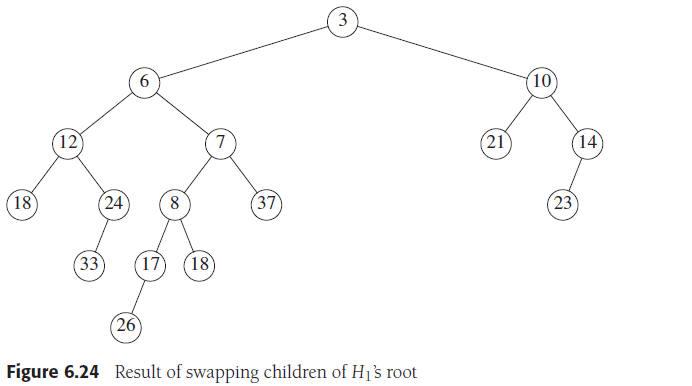

# Chapter 6. Priority Queues (Heaps)

## 1. 二叉堆 Binary Heap

- **结构性质 Structure Property**
    二叉堆是完全二叉树，即除底层外每一层都满且底层从左到右填充数据，任意子结点的数据都大于等于自身的数据，由此可以用最简单的**数组来存储完全二叉树（空出[0]）**

    对于结点位置为`[i]`的结点，其左子结点位于`[2*i]`，右子结点位于`[2*i+1]`，父结点位于`⌊i/2⌋`

    
    

- **元素序列性质 Heap-Order Property**
    以最小堆为例，整个堆的最小元素在根结点，相应的每个子树也是堆，其根结点也是子树的最小元素因此只需要`O(1)`时间找到最小元素，并且插入的平均复杂度为`O(1)`，最坏复杂度为`O(logN)`
- **操作 Heap Operations** (以最小堆为例)
  - 插入 insert
    插入需要将元素安插在合适的位置，对应的策略称为**上滤（percolate up）**，即在最后位置新建一个空位，然后朝着根结点依次用新元素与空位的父结点比较大小，若新元素更小，则将父结点的元素下滑到空位，空位上冒到父结点的位置，持续直到发现父结点元素大于新元素，则此时的空位就是新元素的合适位置，注意以下算法会使有相等元素的新元素在旧元素的子结点中
    
    

    ```cpp
    void insert( const Comparable & x )
    {
        if( currentSize == array.size( ) - 1 )
            array.resize( array.size( ) * 2 );

        // Percolate up
        int hole = ++currentSize;
        Comparable copy = x;

        //由于预先在[0]存放了新元素，因此上滤一定会停在>=[1]位置
        array[ 0 ] = std::move( copy ); 

        //由于父结点位于⌊i/2⌋，因此不断/=2即可朝根上滤
        for( ; x < array[ hole / 2 ]; hole /= 2 )
            array[ hole ] = std::move( array[ hole / 2 ] );
        
        //无论停在哪，说明此时[hole]的位置就是新元素的位置
        array[ hole ] = std::move( array[ 0 ] );
    }
    ```

  - 删除最小值 deleteMin
    删除的最小值就是根结点的位置`[1]`的值，随后通过**下滤（percolate down）**来将删除出现的空位下滑到最末尾，调整新的堆依然是最小堆

    ```cpp
    void deleteMin( Comparable & minItem )
    {
        if( isEmpty( ) )
            throw UnderflowException{ };
        
        //直接获取最小值在[1]位置
        minItem = std::move( array[ 1 ] );

        //从末尾直接获得值放在[1]位置并从[1]下滤
        array[ 1 ] = std::move( array[ currentSize-- ] );
        percolateDown( 1 );
    }

    //即从[hole]位置开始下滤，调整新堆
    void percolateDown( int hole )
    {
        int child;
        Comparable tmp = std::move( array[ hole ] );

        //hole*2<=currentSize确保左子结点在
        for( ; hole * 2 <= currentSize; hole = child )
        {
            //子结点的位置是父结点的2倍
            child = hole * 2;

            //指向较小的子结点或最后结点+1的位置
            if( child != currentSize && array[ child + 1 ] < array[ child ] ) 
                ++child;              

            //若子结点的值小于要调整位置的值，则继续将子结点上冒      
            if( array[ child ] < tmp )
                array[ hole ] = std::move( array[ child ] );
            else
                //子结点的值大于等于要调整位置的值，则找到了合适位置
                break;
        }
        //将要调整位置的值放入找到的合适位置
        array[ hole ] = std::move( tmp );
    }
    ```

  - 减小 decreaseKey：将某个元素的值减小，由此可能导致堆的顺序性质被破坏，需要**上滤**维护
  - 增大 increaseKey：将某个元素的值增大，由此可能导致堆的顺序性质被破坏，需要**下滤**维护
  - 移除 remove：将某个具体元素p删除，一般通过组合使用`decreaseKey(p, ∞)`和`deleteMin()`来实现
  - **建堆 buildHeap**：将已有的一个array构建成堆，可以通过N次`insert`来实现，但是是`O(NlogN)`的复杂度，而以下算法通过**调用数次`percolateDown`实现`O(N)`的复杂度**

    ```cpp
    void buildHeap( )
    {
        //从最后的非叶结点开始不断下滤
        for( int i = currentSize / 2; i > 0; --i )
            percolateDown( i );
    }
    ```

    由于算法从最后的非叶结点开始向前扫描，对每个点都执行`percolateDown`，而`percolateDown`实际上是从当前节点向叶结点下滤，因此**每个节点`percolateDown`实际经过的路径长度就是对应点的高度**，而理论可以证明对于完美二叉树即高度为h，有`N=2^(h+1)-1`个结点，所有结点的高度总和为`S=2^(h+1)-1-(h+1)`，即对每个点都`percolateDown`需要经过的路径数小于等于S，而S与N是同阶复杂度的，因此`buildHeap`是`O(N)`复杂度的

## 2. 优先队列的应用 Applications of Priority Queues

- **选择问题 The Selection Problem：在N个数中选择第k小的数**
  - 暴力算法：全排序，获取第k小的值，平均O(NlogN)
  - 堆排序A：将N个数据建堆`O(N)`，随后连续执行`k次deleteMin`就获取第k小的值`O(klogN)`，总和`O(N+klogN)<=O(NlogN)`
  - 堆排序B：将前k个数据建堆`O(k)`，随后依次访问剩下N-k个数，与堆根结点比较，若大于则替换掉根根结点，替换需要`O(logk)`因此扫描需要`O((N-k)logk)`，总和`O(k+(N-k)logk)=O((N-k)logk)<=O(NlogN)`
- 事件模拟 Event Simulation
    `TODO`

## 3. d-堆 d-Heaps

d-堆是对二叉堆的衍生，二叉堆每个结点至多有两个子结点，而**d-堆每个结点至多有d个子结点**，由于d的增加可以显著增加同样高度的树存储的数据树，类似B树，这对于当数据多到内存无法放下时会有显著好处，但同样的，由于d的增加会使得各项操作的实现更加复杂，并且对于d不是2的幂次的情况下会增加开销


注意：实践中发现**4-堆通常会比二叉堆（2-堆）有更好的性能**

## 4. 左式堆 Leftist Heaps

- 性质 Leftist Heap Property
  - 左式堆能够同时**满足堆的顺序特性且高效实现合并**（`O(logN)`，而其他合并一般都要访问N个结点因此是`O(N)`），但左式堆是极不平衡的
  - 定义一个空路径长度（null path length，`npl(X)`）为任意结点X到没有两个子结点的结点的最短路径长度，对空结点`npl=-1`，对叶结点和只有一个子结点的结点`npl=0`
  - 左式堆中要求，一个结点的**左子结点npl值>=右子结点npl值**
  - 左式堆满足：有r个结点的左式堆其右侧路径最少有2^r-1个结点

  由此可以推导出：有N个结点的左式堆其右侧路径最多有`⌊log(N+1)⌋`个结点，即`O(logN)`复杂度

- 操作 Leftist Heap Operations
    左式堆的主要操作在于**合并merge**，元素插入可以视为是与只有一个元素的左式堆合并，合并通过以下步骤递归或非递归方法完成
  - **递归合并**
    1. 比较左式堆H1和H2的根结点，假定这里H1的根结点小于H2的根结点
        
    2. 取出较小根结点的堆H1的右子树H1R与H2合并，同样回到1步比较H1R和H2的根结点
    3. 1/2两步不断执行直到出现较小根结点的堆没有右结点，此时直接将堆挂接到右结点的位置
    4. 由于挂接会使右子结点的npl大于左子结点的npl，破坏了左式堆的性质，通过简单交换左右即可
        
    5. 不断返回挂接到上次比较取出右子树的位置，必要时交换，到最初始的H1和H2，此时合并完成
        

    ```cpp
    void insert( const Comparable & x )                      
    { 
        //插入通过与单一元素构成堆的合并实现
        root = merge( new LeftistNode{ x }, root ); 
    }

    void deleteMin( )                                                     
    {
        if( isEmpty( ) )
            throw UnderflowException{ };
        LeftistNode *oldRoot = root;
         //通过合并左右子树来实现删除根结点
        root = merge( root->left, root->right );
        delete oldRoot;
    }

    LeftistNode * merge( LeftistNode *h1, LeftistNode *h2 ) 
    {
        if( h1 == nullptr )
            return h2;
        if( h2 == nullptr )
            return h1;
        //确保h1指向根结点较小的堆，对应步骤1
        if( h1->element < h2->element )
            return merge1( h1, h2 );
        else
            return merge1( h2, h1 );
    }

    LeftistNode * merge1( LeftistNode *h1, LeftistNode *h2 )
    {
        if( h1->left == nullptr )// Single node
            h1->left = h2;       // Other fields in h1 already accurate
        else
        {
            // 递归执行合并，返回树挂接到right，对应步骤2/3
            h1->right = merge( h1->right, h2 );             
            if( h1->left->npl < h1->right->npl )
                //交换以维持左式堆的性质
                swapChildren( h1 );
            
            // 合并后需要及时更新npl值，注意由于左式堆的性质，更短的npl一定在右子结点，基于此+1
            h1->npl = h1->right->npl + 1;
        }
        return h1;
    }

    void swapChildren( LeftistNode *t )
    {
        LeftistNode *tmp = t->left;
        t->left = t->right;
        t->right = tmp;
    }
    ```

  - 非递归合并
        `TODO`

## 5. 斜堆 Skew Heaps

- 原理
    斜堆是能够**自动调节的左式堆**，左式堆要求判断左右子结点的`npl`值来选择性进行子结点交换，斜堆不保存这些信息而是只要有两个子结点，总是进行对换，对斜堆的操作有最坏`O(N)`的复杂度以及`O(logN)`的平摊复杂度，而斜堆可能有较长的右侧路径
- 合并 merge
    斜堆较长的右侧路径使得通过递归来合并斜堆是不可能的（栈溢出）
    `TODO`

注意：斜堆目前对复杂度等问题依然有待进一步研究，实践中**斜堆的使用远少于左式堆**

## 6. 二项队列 Binomial Queues

二项队列进一步提升左式堆的性能，实现最坏时间复杂度为合并`O(logN)`、插入`O(logN)`、删除`O(logN)`，且插入的平均时间复杂度为`O(1)`

- **结构 Binomial Queue Structure**
    二项队列本身不是堆序列的树，而是**每个结点都是二项树的特殊队列**，二项树也满足堆的顺序特性，**每个高度值（即每一层）至多有一个二项树**，高度为0的二项树就是图中的B0，高度为k的二项树有`2^k`个结点，对应树中**深度为d的层有二项式因子(k d)个结点**，如图中的B0-B4的5个二项树的结点个数分布为二项式系数：
    `B0:1, B1:1 1, B2:1 2 1, B3:1 3 3 1, B4:1 4 6 4 1`
    

    限制每一层至多一个二项树，则任意大小的优先队列都可以表示为一个**bit串**来代表由多少个不同高度的二项树组成这个优先队列，如下图中H1的bit串就是`110`，对应由`B2+B1`组成，H2的bit串就是`111`，对应由`B2+B1+B0`组成
    

- **操作 Binomial Queue Operations**
  - 寻找最小值 findMin
    基于二项队列的每一项都是不同高度的二项树组成，对一个二项队列**寻找最小值就是顺序扫描这个队列中所有二项树的根结点**，最多有`logN`个二项树，因此最差复杂度为`O(logN)`，若记录下最小值并且在每次元素增减时都及时更新，则可以使得复杂度减为`O(1)`
  - 合并 merge
    对两个二项队列合并，从最小高度0开始，若两个二项队列在同一个高度i上都有一个二项树，则将**根结点较大的二项树直接挂载到另一个二项树的右子节点上形成一个高度i+1的新二项树**，随后迭代直到两个二项队列合并完全合并所有二项树，若i+1高度本身有两个二项树，从i高度额外产生一个i+1的二项树，**类似算数进位**，在i+1保留一个，另两个生成i+2的二项树；最多有`logN`个二项树，每两个二项树合并是`O(1)`的，因此合并最差复杂度为`O(logN)`
    
    

  - 插入 insert
    插入元素是合并的特殊情况，可以视为与只有一个B0树的二项队列进行合并，最多有`logN`个二项树，平均只需`O(1)`就能合并，最坏需要不断"进位"因此是`O(logN)`
    注意：对空二项队列的**连续N次插入可以通过至多N-1次比较实现**：
      1. 每个元素都视为B0树，任意元素之间通过比较构建`N/2=2^(k-1)`个B1树
      2. 继续在`2^(k-1)`个元素之间互相构建`N/4=2^(k-2)`个B2树
      3. 迭代下去最后构建成单个`BlogN=Bk`树
      4. 则一共需要`N/2+N/4+…+1=2^(k-1)+2^(k-2)+…+2^0=2^k-1=N-1`次比较
        **对于N不能表示为2^k的情况，会诞生高度不同的多个二叉树，此时所需比较次数少于N-1次**

  - 删除最小元素 deleteMin
    在插入的基础上，显然对于Bk树，删除其根结点（作为整个二项队列的最小元素）就会使得Bk树可以被分裂成B0,B1,..Bk-1树，随后这些分割产生的树与原队列中其他二项树合并，最后诞生新的二项队列；合并最差复杂度为`O(logN)`，删除之后需要一系列合并操作，最终删除最小元素复杂度为`O(logN)`
    

- 实现 Implementation of Binomial Queues
    `TODO`
