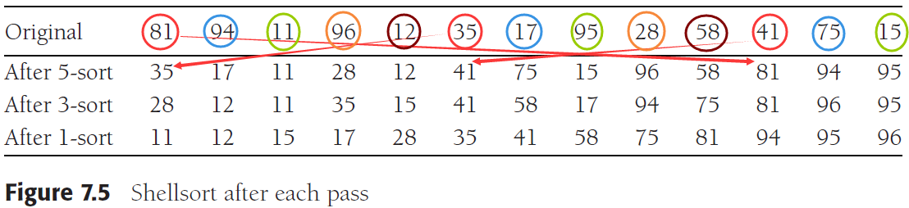
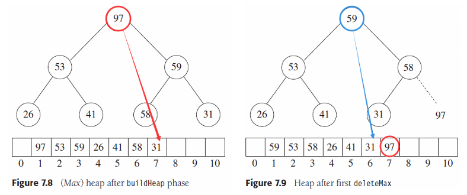
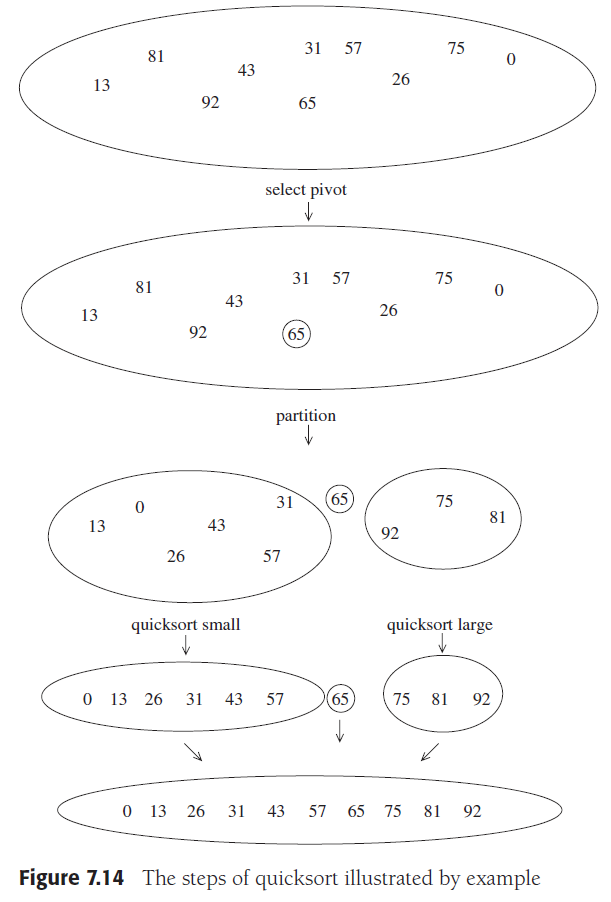
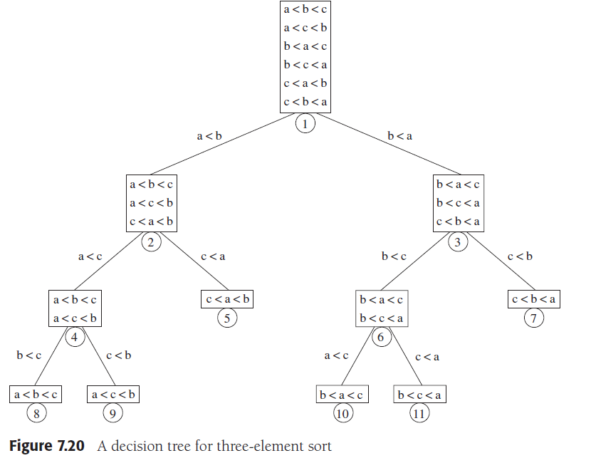
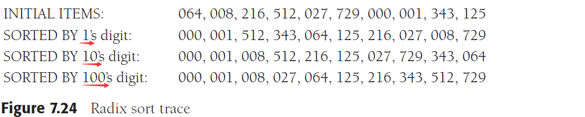
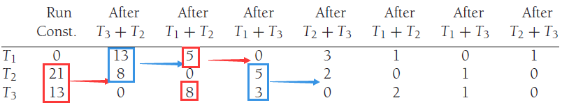
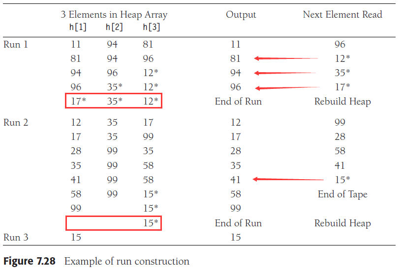

# Chapter 7. Sorting

## 1. 概述

| 方法 | 平均时间复杂度 | 最坏时间复杂度 | 额外空间复杂度 | 稳定性 |
| :-: | :-: | :-: | :-: | :-: |
|选择排序|O(N^2)|O(N^2)|O(1)|不稳定|
|冒泡排序|O(N^2)|O(N^2)|O(1)|稳定|
|插入排序|O(N^2)|O(N^2)|O(1)|稳定|
|希尔排序|O(N^d)|O(N^2)|O(1)|不稳定|
|堆排序|O(NlogN)|O(NlogN)|O(1)|不稳定|
|快速排序|O(NlogN)|O(N^2)|O(logN)|不稳定|
|归并排序|O(NlogN)|O(NlogN)|O(N)|稳定|
|基数排序|O(P(N+B))|O(P(N+B))|O(N+B)|稳定|

> 1.希尔排序的平均时间复杂度参数d取决于增量序列的选取
> 2.基数排序是不基于比较的排序算法

## 2. 插入排序 Insertion Sort

- 原理
    对N个元素扫描N-1遍，进行p遍扫描时0~p-1位置的元素已经有序
    1. 获取`[p]`元素
    2. 不断将`[p]`与`[p-1]…[i-1]…[0]`进行比较并不断将`[i-1]`元素放置到`[i]`，一旦比较获得`[i-1]`元素大于当前元素就退出循环
    3. 将这个元素放置在`[i]`，开始p+1次的扫描

    ```cpp
    template <typename Comparable>
    void insertionSort( vector<Comparable> & a )
    {
        for( int p = 1; p < a.size( ); ++p )
        {
            Comparable tmp = std::move( a[ p ] );
            for( j = p; j > 0 && tmp < a[ j - 1 ]; --j )
                a[ j ] = std::move( a[ j - 1 ] );
            a[ j ] = std::move( tmp );
        }
    }
    ```

- 表现
    平均复杂度O(N^2)，若对于几乎排好序的输入则速度非常快
    注意：因此**std::sort一般是首先快速排序，区间较小时改用插入排序**，实现自适应排序，效率很高

## 3. 简单排序算法的下界 A Lower Bound for Simple Sorting Algorithms

- **逆序 inversion**：为任意一对位于`(i, j)`的数据`a[i], a[j]`，若`i < j`且`a[i] > a[j]`则就是一个逆序，对于一个排好序的数据则逆序数为0，因此排序就是消除逆序的过程（假定没有重复元素，以下也基于此假定）
- 定理：一个N元素数组中平均有`N(N-1)/4`个逆序
- 定理：对任意只交换相邻元素的排序算法，其平均时间复杂度下界是`Ω (N^2)`，简单排序算法如插入排序、冒泡排序、选择排序都使用了只交换相邻元素的方法，因此都是`O(N^2)`的

## 4. 希尔排序 Shell Sort

- 原理
    由于比较相邻元素的排序算法复杂度是`O(N^2)`，因此希尔排序改进了这个算法，通过**比较非相邻元素**来降低复杂度，比较元素的间隔是一个递减的增量序列，每完成一轮比较就用下一个比较间隔值来完成下一轮比较并且会保证此前已参与比较已有序的元素不会被破坏有序性（相当于在原序列的一个等间隔元素构成的子序列上进行插入排序），最终这个递减的序列终止在1

    

    ```cpp
    void shellsort( vector<Comparable> & a )
    {
        //采用了较为简单的递减的增量序列，后序会有改进
        for( int gap = a.size( ) / 2; gap > 0; gap /= 2 )    
            for( int i = gap; i < a.size( ); ++i )
            {
                Comparable tmp = std::move( a[ i ] );
                int j = i;

                //每次比较的两个元素都相隔一个增量值
                for( ; j >= gap && tmp < a[ j - gap ]; j -= gap )  
                    //相当于在相隔gap的子序列上做插入排序
                    a[ j ] = std::move( a[ j - gap ] );                
                a[ j ] = std::move( tmp );
            }
    }
    ```

- 表现
    希尔排序的性能受增量序列的选择极大，若选择Shell增量序列，则很有可能在序列中出现成倍数的增量值，如8,4,2,1则实际上会出现很多重复比较导致性能下降最终在1才会真正完成排序
  - 使用Shell增量序列（`size()/2, size()/4, …, 1`）的最坏情况复杂度是`O(N^2)`
  - 使用Hibbard增量序列（`符合2^k-1：…, 7, 3, 1`）的最坏情况复杂度是`O(N^(3/2))`
  - 使用Sedgewick增量序列（`符合4^k-3*2^k+1：…, 109, 41, 19, 5, 1`）的最坏情况复杂度是`O(N^(4/3))`

## 5. 堆排序 Heap Sort

- 原理
    优先队列中的**二叉堆可以对N个元素进行O(N)的建最大堆**，随后通过**N次deleteMax**并将删除的元素不断放置在堆数组的最末尾（以避免需要额外N空间的数组来存放元素），由此完成排序，实际实现中数据从`[0]`开始，因此堆排序（左子树是`[2*i+1]`）与二叉堆（左子树是`[2*i]`）略有区别

    

    ```cpp
    template <typename Comparable>
    void heapsort( vector<Comparable> & a )
    {
        /* buildHeap */
        for( int i = a.size( ) / 2 - 1; i >= 0; --i )
            percDown( a, i, a.size( ) );

        /* deleteMax */
        for( int j = a.size( ) - 1; j > 0; --j )
        {
            std::swap( a[ 0 ], a[ j ] );
            percDown( a, 0, j );
        }
    }
    template <typename Comparable>
    void percDown( vector<Comparable> & a, int i, int n )
    {
        int child;
        Comparable tmp;
    
        for( tmp = std::move( a[ i ] ); 2 * i + 1 < n; i = child )
        {
            child = 2 * i + 1;
            if( child != n - 1 && a[ child ] < a[ child + 1 ] )
                ++child;
            if( tmp < a[ child ] )
                a[ i ] = std::move( a[ child ] );
            else
                break;
        }
        a[ i ] = std::move( tmp );
    }
    ```

- 表现
    堆排序至少需要`NlogN-O(N)`次比较，平均需要`2NlogN-O(N)`次，因此堆排序是`O(NlogN)`的

## 6. 归并排序 Merge Sort

- 原理
    将需要排序的数据**分割成两块，各自排序后整合在一起**，分割的数据也递归或迭代继续分割直到只有一个元素就退出递归或循环，然后逐步整合回完整的数据，由于整合需要临时数组，若每次归并都重建临时数组则需要`logN`次，反之通过传入一个临时数组供每次调用以避免反复重建

    ```cpp
    // 递归解法 Recursive version
    template <typename Comparable>
    void mergeSort( vector<Comparable> & a )
    {
        vector<Comparable> tmpArray( a.size( ) );
    
        mergeSort( a, tmpArray, 0, a.size( ) - 1 );
    }
    template <typename Comparable>
    void mergeSort(
        vector<Comparable> & a, vector<Comparable> & tmpArray, int left, int right )
    {
        if( left < right ) //隐含着若没有元素则退出循环，递归的基础情况
        {
            //对等分割
            int center = ( left + right ) / 2;
            mergeSort( a, tmpArray, left, center );
            mergeSort( a, tmpArray, center + 1, right );
            //合并左右半侧数据
            merge( a, tmpArray, left, center + 1, right );
        }
    }
    template <typename Comparable>
    void merge( vector<Comparable> & a, vector<Comparable> & tmpArray, int leftPos, int rightPos, int rightEnd )
    {
        //左侧数据终点是右侧起点-1
        int leftEnd = rightPos - 1;
        //临时数组对本次合并的起点是左侧数据起点
        int tmpPos = leftPos;
        //本次合并总元素是右侧终点-左侧起点+1
        int numElements = rightEnd - leftPos + 1;
        // Main loop
        while( leftPos <= leftEnd && rightPos <= rightEnd )
            if( a[ leftPos ] <= a[ rightPos ] )
                tmpArray[ tmpPos++ ] = std::move( a[ leftPos++ ] );
            else
                tmpArray[ tmpPos++ ] = std::move( a[ rightPos++ ] );
    
        while( leftPos <= leftEnd )    // Copy rest of first half
            tmpArray[ tmpPos++ ] = std::move( a[ leftPos++ ] );
    
        while( rightPos <= rightEnd )  // Copy rest of right half
            tmpArray[ tmpPos++ ] = std::move( a[ rightPos++ ] );
    
        // Copy tmpArray back
        for( int i = 0; i < numElements; ++i, --rightEnd )
            a[ rightEnd ] = std::move( tmpArray[ rightEnd ] );
    }

    // 非递归解法 Non-recursive version
    template<typename Comparable>
    void merge_pass(vector<Comparable> &a, vector<Comparable> &tmpArray, int length)
    {
        int i = 0;
        int num = a.size();
        //按length个元素为一组，合并每两组
        for (; i + 2 * length - 1 < num; i += 2 * length)
        {
            merge(a, tmpArray, i, i + length, i + 2 * length - 1);
        }
        //若剩下的元素超过一组但是不足两组
        if (i + length < num)
        {
            merge(a, tmpArray, i, i + length, num - 1);
        }
        //若剩下的元素不足一组，则忽视，最终会被合并
    }
    template<typename Comparable>
    void merge_sort(vector<Comparable> &a)
    {
        vector<Comparable> tmpArray(a.size());
        int length = 1;
        while (length < a.size())
        {
            //第一轮length=1，随后不断翻倍合并
            merge_pass(a, tmpArray, length);
            length *= 2;
        }
    }
    ```

- 表现
    归并排序所需的**比较次数几乎是排序算法中最优的**，对于递归来说，分割的两个部分各需要`T(N/2)`来计算，合并需要N来实现，根据`T(N)=2T(N/2)+N`可以容易推断出`T(N)=NlogN+N`，即最坏情况下`O(NlogN)`
  - Java中的比较需要调用函数，而对象都是引用因此拷贝数据开销小，因此**归并排序比较次数少而移动多**，成了Java标准sort函数的实现(TimSort，基于归并排序优化的一种排序算法)
  - C++中的比较可以inline优化，而对象拷贝则开销大，因此**快速排序比较次数多但是移动少**，成了C++标准sort函数的实现(混合排序，快速排序+小区间内的插入排序)

## 7. 快速排序 Quick Sort

- 原理
    快速排序通过在数组中选择一个主元pivot，然后**将数组划分成大于pivot和小于pivot的两部分，此时pivot所在位置就已经是最终位置**，接下来递归选择pivot并划分产生的两个子数组
    
    1. **选择主元 picking the pivot**
        理想情况下，主元应该都能对半分割数组，但是由于事先不知道序列大小，因此一般通过一些算法来近似选取能够对半分数组的主元，较好的方式是取首元素、中间元素和尾元素的中间值作为主元
    2. 小的数据量 small arrays
        当N<=20时，快速排序的效果差于插入排序，因为快速排序是递归的，因此在实际实践中，一旦分割的数据N<=20时，可以使用插入排序来完成小数据的排序，具体N在小于20的取值取决于实现
    3. 实际快排的实现 actual quicksort routines

        ```cpp
        template <typename Comparable>
        void quicksort( vector<Comparable> & a )
        {
            quicksort( a, 0, a.size( ) - 1 );
        }
        template <typename Comparable>
        void quicksort( vector<Comparable> & a, int left, int right )
        {
            if( left + 10 <= right ) //在N>10时采用快速排序
            {
                //获取pivot并放置在[right-1]
                const Comparable & pivot = median3( a, left, right );   
                // Begin partitioning
                int i = left, j = right - 1;
                for( ; ; )
                {
                    while( a[ ++i ] < pivot ) { }
                    while( pivot < a[ --j ] ) { }
                    if( i < j )
                        std::swap( a[ i ], a[ j ] );
                    else
                        break;
                }
                //将主元放置到[i]（最终完全排序好的位置）
                std::swap( a[ i ], a[ right - 1 ] );
                quicksort( a, left, i - 1 );
                quicksort( a, i + 1, right );
            }
            else  // Do an insertion sort on the subarray
                insertionSort( a, left, right );
        }
        ```

- 表现
    快速排序的性能平均是`O(NlogN)`，最坏情况下`O(N^2)`
- **快速选择 quick selection**
    在堆的应用中，我们可以采用堆来实现`O(NlogN)`下选择N个数中第k小的数，基于快速排序的思想，我们可以实现快速选择算法在**平均`O(N)`（最坏`O(N^2)`）下选择N个数中第k小的数**，核心思想在于只要让k元素位于正确的位置，则直接访问就可以解决选择问题，因此快速排序的递归不需要对所有区间都使用，只需要**递归分区k所在的区间即可**

    ```cpp
    template <typename Comparable>
    void quickSelect( vector<Comparable> & a, int k )     
    {
        // 完成后直接访问a[k-1]
        quickSelect( a, 0, a.size( ) - 1, k );
    }
    template <typename Comparable>
    void quickSelect( vector<Comparable> & a, int left, int right, int k )
    {
        if( left + 10 <= right )
        {
            const Comparable & pivot = median3( a, left, right );
            // Begin partitioning
            int i = left, j = right - 1;
            for( ; ; )
            {
                while( a[ ++i ] < pivot ) { }
                while( pivot < a[ --j ] ) { }
                if( i < j )
                    std::swap( a[ i ], a[ j ] );
                else
                    break;
            }
    
            std::swap( a[ i ], a[ right - 1 ] );
            // 以上都与快速排序相同

            // 根据k落的区间递归解决某个区间a一直是完整数组，因此k不用变
            if( k - 1 < i ) 
                quickSelect( a, left, i - 1, k );
            else if( k - 1 > i )
                quickSelect( a, i + 1, right, k );
            
            //若k-1==i，则主元就是要找的a[k-1]，返回
        }
        else  // Do an insertion sort on the subarray
            insertionSort( a, left, right );
    }
    ```

## 8. 排序算法的一般下界 A General Lower Bound for Sorting

- **决策树 Decision Trees**
    基于比较（Comparisons）的排序算法可以通过决策树来分析其开销
    
- 定理1：深度为`d`的二叉树T最多有`2^d`个叶结点，同理有**L个叶结点的二叉树至少深`⌈logL⌉`**
- 定理2：基于**比较**的排序算法**最坏情况下需要`⌈log(N!)⌉`次比较**
    参考决策树，基于比较的排序，**比较次数就是到叶结点的路径长**，因此最坏情况就是到最深结点的路径长，由此对`N`个元素（对应`N!`个可能的结果，即`N!`个叶结点）的决策树，其深度至少`⌈log(N!)⌉`
- 定理3：基于比较的排序算法需要`Ω (NlogN)`次比较，对定理2的`⌈log(N!)⌉`做进一步推导就能得到这个结果

## 9. 基于决策树的选择问题的下界 Decision-Tree Lower Bounds for Selection Problems

`TODO`

对于选择问题selection problems，基于决策树的分析可以得到，在N个元素中获得第k个小的元素至少需要`N-k+⌈log(N k-1)⌉`次比较：

- 可以简单推导出获得第1小的元素需要`N-1+0=N-1`次比较
- 获得第2小的元素需要`N-2+⌈log(N 1)⌉=N-2+⌈log(N)⌉`次比较
- 获得中间的元素需要`⌈3N/2⌉-O(logN)`次比较

## 10. 对手下界 Adversary Lower Bounds

`TODO`

## 11. 线性时间复杂度的排序：桶排序和基数排序 Linear-Time Sorts: Bucket Sort and Radix Sort

桶排序和基数排序对被排序的**数据有额外的要求**，最后能实现线性的复杂度，但是当数据不断增多，此优势逐渐被削减

- **桶排序 Bucket Sort**
    类似散列表，首先维护一系列按顺序排好的B个桶`count[0]~count[B-1]`，输入的数据**小于B**，扫描到任何一个数据`Ai`就放入桶`count[Ai]`中即`count[Ai]++`，扫描完后按顺序输出有元素的桶中的数据就是排好序的数据，由此完成了不是基于比较的排序（可以认为是B路比较，同时与B个桶比较好并放入其中一个），对应的复杂度是`O(N+B)`
- **基数排序 Radix Sort**
    当输入的数字数量不多，但是范围较大不必要用较多的桶时可以使用基数排序，本质上是**多轮桶排序**；基数比较会扫描多轮数据，每一轮扫描专注于不同的一个标准，根据数据特征投入到不同的桶中（注意放入桶的元素之间的顺序必须是下一轮扫描出桶的顺序一致），最后按标准多次扫描桶来实现排序，反复直到所有的标准都被执行了桶排序，按最后一轮桶的顺序读取桶中元素，就是排好序的数据，对应的复杂度是`O(P(N+B))`，P是标准数（多少轮），B是桶数，实际上就是`P*O(N+B)`，P轮桶排序



1. 个十百位建立桶`1's[10]/10's[10]/100's[10]`，根据个位排序，一轮后:

    ```text
    1's[0]: 000    1's[1]: 001    1's[2]: 512
    1's[3]: 343    1's[4]: 064    1's[5]: 125
    1's[6]: 216    1's[7]: 027    1's[8]: 008
    1's[9]: 729 
    ```

1. 然后再根据十位，以第一轮的桶的顺序进行扫描元素，二轮后：

    ```text
    10's[0]: 000 001 008   10's[1]: 512 216   10's[2]: 125 027 729
    10's[3]:               10's[4]: 343       10's[5]:          
    10's[6]: 064           10's[7]:           10's[8]:
    10's[9]: 
    ```

1. 然后再根据百位，以第二轮的桶的顺序进行扫描元素，三轮后:

    ```text
    100's[0]: 000 001 008 027 064   100's[1]: 125    100's[2]: 216
    100's[3]: 343                   100's[4]:        100's[5]: 512
    100's[6]:                       100's[7]: 729    100's[8]:
    100's[9]: 
    ```

1. 第三轮后的数据按桶的顺序输出就是排序后的顺序：
    ``000 001 008 027 064 125 216 343 512 729``

**注意：扫描过程中加入每个桶的元素前后顺序不能变**

## 12. 外排序 External Sorting

前述排序都是基于所有数据能够存放在内存中，而实际中也可能会发生**数据量过大必须从外存读入**，同时写出到外存的排序，以下假定内存只能存放M=3个数据，一共有超过3个数据需要排序，内存连续**读入+排序+写出**可以通过维护一个优先队列，进行`push`和`deleteMin`简单实现

- 简单归并 The Simple Algorithm
    假定Ta1中有一系列待排序数据，排完序后写出到Tb1中，由于是归并，因此额外还需要Ta2和Tb2用来存放数据：
    1. 从Ta1中每`M`个数据排序，就写出到Tb1中，接下来`M`写出到Tb2中，再接下来`M`写出到Tb1中往复
    2. 随后就从Tb1和Tb2中依次读入较小的数据，此时**发生归并，Tb1和Tb2中各有`M`个已排序数据，因此一共写出`2M`的数据到Ta1**，随后在Tb1和Tb2中再各取`M`个，写出`2M`数据到Ta2如此往复
    3. 从`M`到`2M`到`4M`最终完成排序，实现归并的过程
- **多路归并 Multiway Merge**
    在简单归并（2-路）的基础上，使用**2k个外存Ta1~Tak, Tb1~Tbk，可以实现k-路归并**，数据库的join等算法也会用到多路归并
- 多相归并 Polyphase Merge
    由于**归并就是使得有S组排好序的数据，每组M个，合并到S/2组排好序的数据，每组2M个，以此类推**，因此也可以考虑:
    1. 从原始T1的`S*M`个数据产生的`S`组数据，**不对称分配**`X`组给T2，余下`S-X`组给T3（假设`S-X>X`）
    2. 再从T2, T3不对称合并`X`组数据到T1，此时T1有`X`组，每组`2M`个，T2有`0`组，T3有`S-2X`组，每组`M`个
    3. 如此第一次不对称分配随后**往复不对称合并，大大减少所需的外存T的数量**，最后实现归并

    

    注意：这种方法最好经过能**分割成斐波那契数F(N)=F(N-1)+F(N-2)，能够很好的归并到1**，通过一些改造也可以适用于多路归并Fk(N)=Fk(N-1)+Fk(N-2)+…+Fk(N-k)，最后Fk(k-1)=1
- 替换选择 Replacement Selection
    前述可以用建堆来实现，这里的替换选择是更精细的操作：
    1. 同样建堆，每次`pop`出根结点的最小元素同时从外存中读入一个元素
    2. 若这个元素比刚`pop`的元素大，则`push`进堆，否则就让这个元素留在死区（类似堆排序，每`pop`一个元素，`[N-1]`的位置就空了出来可以认为是这里的死区）
    3. 推进直到内存中堆已经是空，只有死区元素了，就**重启一次读取并根据死区元素重建堆**

    这种替换选择算法能够使得产生更长的有序数据，算法更高效，以下图为例（图里漏了元素75），原先一共有13个元素，对M=3的情况，简单算法每3个元素一轮run，则一共要5轮run，而替换选择只需要3轮run

    

## 13. 常见面试题: TopK

`TODO`
