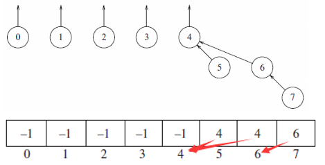
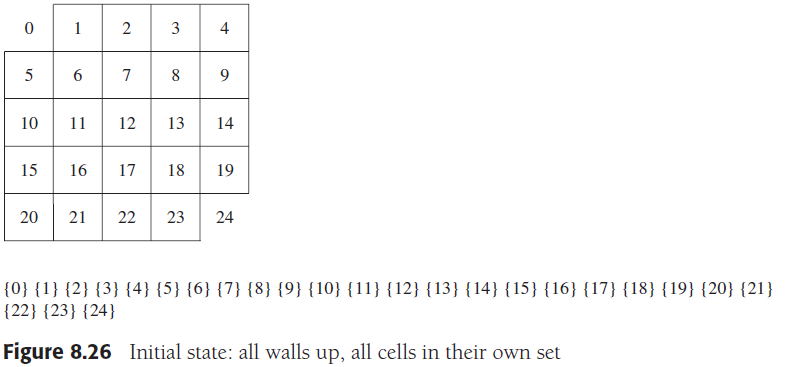
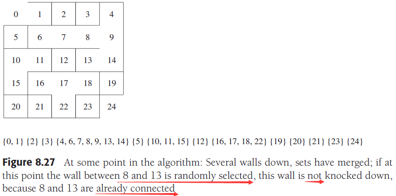
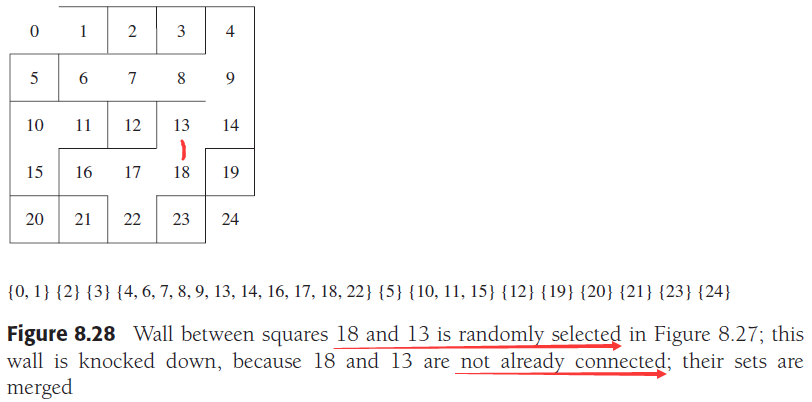
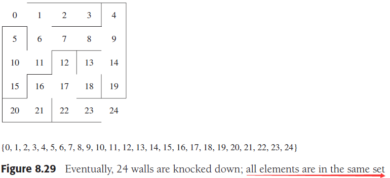

# Chapter 8. The Disjoint Sets Class

## 1. 等价关系 Equivalence Relations

定义一个关系`R`，在一个集合`S`上，若对每一对元素`(a,b),a,b∈S，a R b`是真（true）或假（false），若`a R b`是真则可以说`a`与`b`相关，等价关系是满足以下三条的`R`：

- 自反性：`a R a`，对于所有`a∈S`
- 对称性：`a R b`，当且仅当`b R a`
- 传递性：`a R b`并且`b R c`则`a R c`

## 2. 动态等价问题 The Dynamic Equivalence Problem

一个元素`a∈S`的等价类（equivalence class）是包含所有与`a`相关的元素的`S`的子集，由此实现了对集合`S`的分割，因为等价关系的三个性质，`S`中任意一个元素都只能出现在一个等价类中

定义一个等价关系`~`，为了确认`a ~ b`是否成立，只需要检查`a,b`是否在一个等价类中

初始有`N`个集合，每个集合只有一个元素，因此除自反性以外所有关系都是假，任意`Si`与`Sj`的交集是空集，即这些集合是不相交

对这些集合，可以施加：

- **查找 find**：返回包含指定元素的等价类的类名
- **添加关系`a~b` add relations**：首先查找`a,b`以确认`a,b`不在同一个等价类中，随后合并`a,b`所在的类，即合并`Si,Sj`

由于**添加关系可能会导致等价类的合并，因此是动态的**算法

## 3. 基本数据结构 Basic Data Structure

用树的结构来保存一个集合，树用数组来保存，则对任何元素都可以通过下标快速定位

等价类的名字就可以用**树根结点的下标值**来表示，元素值用`-1`来表示这个元素是一个等价类的根节点，其他在同一等价类中的元素用类的根的下标作为值来表明自己所处的等价类，即类似指向根，如图：



- 查找：通过元素的值**依次找到根结点**，则所在等价类的名字就是根结点的下标
- 添加关系：将元素的值改为等价类的名字，若元素本身是根结点，就实现了两个等价类的合并

## 4. 高效并集算法 Smart Union Algorithm

由于并集是将一个根结点的值改为另一个根结点的下标，不同的根结点所在的等价类已经包含了不同数量的元素，简单合并可能会不利于效率，例如上述例子中，假如要合并`3`和`4`，则将`4->3`会导致整棵树的`depth+1`，更好的选择是将`3->4`

- **按大小合并 union-by-size**
    定义一个集合拥有的元素个数就是这个集合的大小，按大小合并就是在合并时比较两个集合的大小，让**小的集合的根结点指向大的集合的根结点**，确保了集合的深度不会超过`logN`，意味着使得按大小合并下的查找算法（按元素路径找到根结点）是`O(logN)`，可以通过在根结点存储一个`-N`而不是`-1`来简单实现对大小的维护，合并时更新根结点的值

    ```cpp
    void unionSets( int root1, int root2 )
    {
        // 存储的是大小的负值，因此根节点值小于意味着实际大于
        if( s[ root2 ] < s[ root1 ] )
        {
            s[ root2 ] += s[ root1 ];
            // root1->root2
            s[ root1 ] = root2;
        }
        else
        {
            s[ root1 ] += s[ root2 ];
            // root2->root1
            s[ root2 ] = root1;
        }
    }
    ```

- **按秩合并 union-by-height**
    与按大小合并类似，只不过用**高度（秩）代替大小，合并时高度小的集合根结点指向高度大的集合**，也保证了深度不会超过`logN`，并且根节点存储高度值，只有根结点时高度初始为`1`，即根结点值为`-1`

    ```cpp
    void unionSets( int root1, int root2 )
    {
        //集合root2高度>集合root1高度，root1->root2，不需更新高度
        if( s[ root2 ] < s[ root1 ] )
            s[ root1 ] = root2;
        else
        {
            //若相等则合并后高度需要+1，对应负值就是--，此时需更新高度
            if( s[ root1 ] == s[ root2 ] )
                --s[ root1 ];
            // root2->root1
            s[ root2 ] = root1;
        }
    }
    ```

## 5. 路径压缩 Path Compression

在合并时无论按高度还是按秩合并，由于对非根节点的元素并没有做出改动，因此**最终通过不断合并产生的集合变成一棵层数非常多的树**，由此在反复寻找一些较深元素时会导致效率下降，每次都需要按路径找一遍，解决方法是路径压缩

**路径压缩 Path Compression** 是每次查找元素时，**一旦找到根，就将路径上的每个元素都重新指向根**，大大缩短路径上每一个结点的深度，优化此后的寻找，这种优化可以简单通过递归实现

```cpp
int find( int x )
{
    if( s[ x ] < 0 )
        //找到根结点结束递归，并实现了路径上所有结点的重定向
        return x;
    else
        //若还要找，说明是路径上结点，则指向最终返回值（根结点）
        return s[ x ] = find( s[ x ] );
}
```

**注意：由于路径压缩会修改集合中的链接关系，进而修改了高度，因此与按秩合并并不是完美适配的**

## 6. 按秩合并与路径压缩的最坏情况 Worst Case for Union-by-Rank and Path Compression

证明过程见原文P361，对任意连续`N-1`次合并和`M`次路径压缩查找，最多在查找时导致`M*a(M,N)+2*M`次父结点改变，其中`a(M,N)`参考原文P371，是增长极其缓慢的函数，可以**近似看作最坏情况下平摊复杂度`O(1)`**

## 7. 应用 An Application

快速生成迷宫，若有`N`个格点，则打通`N-1`堵墙就可以实现全连通生成迷宫，复杂度为`O(Nlog*N)`，参考原文P372：

1. 初始状态，除了入口和出口，**每个格子都是独立的集合**

    

2. 随机选择一些相邻格点，**若不连通（即不在同一集合中，两次find），则打破之间的墙（一次union）**

    
    

3. 当最终**起终点相连通时（即打通`N-1`堵墙）**，迷宫生成结束

    
