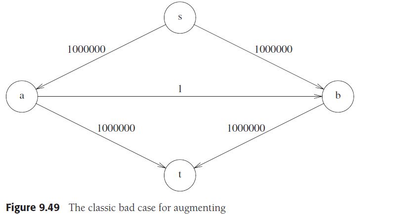

# Chapter 9. Graph Algorithm

## 1. 定义 Definitions

- 定义
  - **图 graph** `G=(V, E)`，`V`是顶点vertices的集合，`E`是边edge的集合，边是顶点对`(v, w),v,w∈V`
    - **无向图 undirected graph**：图里的边是没有方向的，即`(v, w)=(w, v)`\
    - **有向图 directed graph**：图里的边是有方向的，即顶点对存在方向，`(v, w)`表示v指向w的边，即`(v, w)≠(w, v)`
  - **相邻 adjacent**：若`v,w∈V`且存在边连接`v,w`，则称`v,w`相邻
  - **入度 in-degree**：有向图中指向某个顶点的边的数目为该点的入度
  - **出度 out-degree**：有向图中从某个顶点指向其他顶点的边的数目为该点的出度
  - **长度 length**：长度是边的属性，用来表征这条边的权重weight或代价cost
  - **路径 path**：由一些顶点并通过两两相连的边构成的一条通路，即由`w1,w2…,wN∈V`且存在`(wi, wi+1)∈E,i=1~N`构成，路径长度就是构成路径的边的长度之和
  - **环 loop**：一个顶点通过一个路径可以回到自身，即在图中由一系列边和顶点构成了环
  - **简单路径**：在路径的基础上要求路径中任意顶点互异（除起终点可以是同一个点）
  - **圈 cycle**：由互异的边构成，长度至少为1的环，注意对于无向图有`(v, w)=(w, v)`，因此`v,w,v`不是圈
  - **有向无圈图 directed acyclic graph, DAG**：边是有向的，且没有圈的图
  - **连通 connected**：无向图中若任意点有路径可以抵达任意其他点，则是连通的无向图
    - **强连通 strongly connected**：有向图也符合连通的定义，就是强连通的有向图
    - **弱连通 weakly connected**：有向图非强连通，但是去除所有边的方向退化成无向图后若是连通的，就是弱连通的有向图
  - **完全图 complete graph**：任意两个顶点之间都有一条边的图
- 图的表示
  - **邻接矩阵 adjacency matrix**：空间复杂度`Θ(V^2)`：适用于稠密`E=Θ(V^2)`图，即顶点不多但是边很多
  - **邻接表 adjacency list**：空间复杂度`Θ(E+V)`：适用于稀疏图，即顶点很多但是边很少
- 图的遍历
  - **广度优先搜索 breadth-first search, BFS**

    

    ```cpp
    void BFS(MGraph Graph, Vertex S, void(*Visit)(Vertex))
    {
        Queue Q = CreateQueue(MaxSize);                     
        Vertex V, W;
        Visit(S);
        Visited[S] = true;
        AddQ(Q, S);
        while (!IsEmpty(Q)) {
            V = DeleteQ(Q);
            for (W = 0; W<Graph->Nv; W++) {
                if (!Visited[W] && IsEdge(Graph, V, W)) {
                    Visit(W);
                    Visited[W] = true;
                    AddQ(Q, W);
                }
            }
        }
    }
    ```

  - **深度优先搜索 depth-first search, DFS**

    

    ```cpp
    void DFS(MGraph Graph, Vertex V, void(*Visit)(Vertex))
    {
        int i;
        Visit(V);
        Visited[V] = 1;
        for (i = 0; i < Graph->Nv; i++) {
            if (!Visited[i] && Graph->G[V][i] != INFINITY) {
                DFS(Graph, i, Visit);
            }
        }
    }
    ```

## 2. 拓扑排序 Topological Sort

- 拓扑排序问题，即DAG中，若顶点`v,w`之间存在边`(v, w)`，则排序中**v必须在w之前**出现
- 拓扑排序流程：
  1. 扫描入度为0的点加入队列
  2. 每从队列移除并访问一个顶点，都将以这个顶点为起点指向的其他顶点入度-1，同时若**某个顶点入度减为0则将其入队**
  3. 重复1,2步直到队列为空且没有剩余的顶点，或**有剩余顶点但队列为空表示出现了圈**
- **关键路径问题 critical path analysis**
    拓扑排序的一个重要应用就是解决关键路径问题（同样也是最短路径算法的应用），例如**一个拓扑图从起点到终点的全部路径中有一个路径拥有最低代价**，而产生这个最低代价的路径就是关键路径，同时就会出现一些结点上的完成时间可以出现延迟而不影响到最终关键路径的长度

    

    图中的关键路径就是ACFH，红字代表`<最早完成时间, 最晚完成时间>`

  - 从**起点到终点来计算每个点的最短完成时间**（最短路径）：EC for earliest cost

    ```math
    \begin{aligned}
    &EC_w: earliest\ cost\\
    &C_{v,w}: cost\ of\ the\ edge\ (v,w)\\
    &EC_1=0\\
    &EC_w=max(EC_v+C_{v,w})
    \end{aligned}
    ```

  - 从**终点返起点来计算每个点的可供推迟时间**：LC for latest cost，对于关键路径即不能延迟的路，即`Slack(v, w) = 0`的路

    ```math
    \begin{aligned}
    &LC_v: latest\ cost\\
    &Slack: maximal\ delay\\
    &LC_n=EC_n\\
    &LC_v=min(LC_w-C_{v,w})\\
    &Slack_{(v,w)}=LC_w-EC_v-C_{v,w}\\
    \end{aligned}
    ```

    根据EC和LC可以将前述图转化为下图，`A/3/0`代表到`A`点代价`3`可推迟`0`，`B/2/2`代表到`B`点代价`2`可推迟`2`

    

  - 注意：有时候会额外要求一些**任务必须同时开工，则在这些任务的完成结点间加上权重为0的边**

## 3. 最短路径算法 Shortest-Path Algorithms

- 最短路径问题是在一个DAG中，求某顶点到另一顶点代价最小的路径，以下讨论的是**单源最短路径问题（Single-Source Shortest-Path Problem）并给出Dijkstra算法，相应的多源最短路径问题（Multi-Source Shortest-Path Problem）并给出Floyd算法**
- 负代价图
  - **负代价边的出现是Dijkstra算法不能解决的**
  - 不出现负代价的圈就可以用BFS来计算最短路径
  - 若出现负代价圈，BFS可以在一定次数的循环限制内终止表明有负圈，而Floyd算法可以在计算发现负圈时立即终止表明有负圈
- 无圈图
    **若图已知是无圈的，则Dijkstra算法也可以用拓扑排序来替代**，Dijkstra算法中一个顶点被记录意味着不可能再减少到这个顶点的距离，这也意味着这个顶点入度为0，这就符合拓扑排序的情况，而拓扑排序`O(E+V)`的复杂度优于Dijkstra的复杂度
- **Dijkstra算法**
    定义`d(S->V)`表示从`S`到`V`的最短距离，`c(V->Wi)`表示边`(V, Wi)`的长度
  1. 维护一个已知最短路径顶点的集合collected，初始时只有起点`S`，每个顶点的最短距离值`dv`，初始时到起点`S`以外所有点的最短距离为`∞`，到`S`的最短距离为`0`
  2. 从未知最短路径顶点中挑选一个距离最短的点`V`（可以扫描全部点的dv也可以用最小堆存储），作为到达`V`的最短距离并将`V`加入到collected
  3. 依次检查`V`的邻接点`Wi`，若`d(S->V)+c(V->Wi)<d(S->Wi)`，则更新`Wi`的最短路径，记录从`S`到`Wi`的最短路径上是从`V->Wi`（类似集合，令`Path[Wi] = V`），回到2步继续算下个点
  4. 当`S`集合包含了所有点时，算法完成，获得了从起点到任意顶点的最短距离

    Dijkstra算法无法解决负边问题，对于稀疏图，`FindMinDist`采用最小堆更好，总体复杂度是`O(ElogV)`，对于稠密图，`FindMinDist`采用全扫描更好，总体复杂度是`O(E+V^2)`

    ```cpp
    bool Dijkstra(MGraph Graph, int dist[], int path[], Vertex S)
    {
        int collected[MaxVertexNum];
        Vertex V, W;
    
        // 初始化起点能直接抵达的顶点的距离，不能直达的是-1
        for (V = 0; V < Graph->Nv; V++) {
            dist[V] = Graph->G[S][V];
            if (dist[V] < INFINITY)
                path[V] = S;
            else
                path[V] = -1;
            collected[V] = false;
        }
        dist[S] = 0;
        collected[S] = true;
    
        while (1) {
            V = FindMinDist(Graph, dist, collected);
            if (V == ERROR)
                break;                                 
            collected[V] = true;                 
            for (W = 0; W < Graph->Nv; W++) {
                if (collected[W] == false && Graph->G[V][W] < INFINITY) {  
                    // 负边，Dijkstra无法解决负权值
                    if (Graph->G[V][W] < 0)
                        return false;
                    if (dist[V] + Graph->G[V][W] < dist[W]) {   
                        dist[W] = dist[V] + Graph->G[V][W];
                        // 记录最短路径，S经过V到W
                        path[W] = V;
                    }
                }
            }
        }
        return true;
    }
    ```

- **Floyd算法**
  1. 定义`Dk,i,j`代表从`vi`到`vj`并且**仅允许经过`v1,v2…,vk`的最短距离**，`d(vi->vk)`表示从`vi`到`vk`的最短距离，`c(vi, vj)`表示边`(vi, vj)`的长度，此时`D0,i,j = c(vi->vj)`
  2. 从`k=1~N`循环更新`vi`到`vj`的最短距离，若允许`vk`作为中继时`d(vi->vk)+d(vk->vj)<d(vi->vj)`则更新，同时记录`vi`到`vj`的最短距离经过`vk`，即`Dk,i,j=min{Dk-1,i,j, Dk-1,i,k+Dk-1,k,j}`
  3. 循环结束就得到了从任一点到任一点的最短路径

    ```cpp
    bool Floyd(MGraph Graph, WeightType D[][MaxVertexNum], Vertex path[][MaxVertexNum])
    {                                                        
        Vertex i, j, k;
        for(i=0;i<Graph->Nv;i++)
            for (j = 0; j < Graph->Nv; j++) {
                D[i][j] = Graph->G[i][j];
                path[i][j] = -1;
            }
        // 逐渐增加允许作为中继的顶点，本质是动态规划
        for(k=0;k<Graph->Nv;k++)
            for(i=0;i<Graph->Nv;i++)
                for(j=0;j<Graph->Nv;j++)
                    if (D[i][k] + D[k][j] < D[i][j]) {
                        D[i][j] = D[i][k] + D[k][j];
                        // i=j即绕圈回到自身且距离D[i][j]为负，负值圈
                        if (i == j && D[i][j] < 0)
                            return false;
                        path[i][j] = k;
                    }
        return true;
    }
    ```

- **图的性质对算法选择的影响**
  - 稠密图 `E=Θ(V^2)`
    - 单源最短路径：采用`FindMinDist`线性扫描全部剩余点的Dijkstra算法，`O(E+V^2)`
    - 多源最短路径：采用Floyd算法，`O(V^3)`
  - 稀疏图 `E<<V^2`
    - 单源最短路径：采用`FindMinDist`最小堆存储全部剩余点的Dijkstra算法，`O(ElogV)`
    - 多源最短路径：采用V次稀疏图Dijkstra算法，`O(EVlogV)`
  - 其他注意点
    - **Dijkstra无法解决负代价边的问题，Floyd可以在负代价边的情况下依然正确，但是两者都无法解决无代价圈的问题**
    - 实际中由于Floyd算法的内循环性能更高，实践使用时有时候效果很好（实际需要考虑CPU缓存命中等体系架构问题而不仅仅是复杂度），Floyd算法可以容易并行运行

## 4. 网络流问题 Network Flow Problems

- 网络流问题要求一个图中每条边的权重就是该边能流过的最大流量，起点是source而终点是sink，图中任意其他结点的**流入流量都必须等于流出流量，求从source到sink的最大流量**
- 可以通过以下算法来实现
  1. 维护拓扑结构和原图一致边权重不同的**已用容量图flow graph**和一张**剩余容量图residual graph**，前者边的权重初始化为0，后者边的权重初始化为与原图一致，起点标记为s，终点标记为t
    

  2. 基于一定算法选择一条从s到t的路径，并将这条路的流量对应每条边的容量表示到flow graph，同时在residual graph上减掉被用去的容量但**额外也反向生成这条路**
    

  3. 不断重复2直到没有s到t的路径，此时flow graph上的流量就是最大流量
    

- **网络流算法中s->t的路径选择算法**
  - 不同s到t的路径选择，可能会导致震荡极大降低运行效率，下图中可能反复在`a->b,b->a`震荡，虽然显而易见是2000000的结果，但是需要震荡2000000次才最终获得这个值：
    
  - 修改的Dijkstra算法：选择一条容量最大的路径，`O(E^2logVlogCapmax)`，`Capmax`是所有边的最大容量
  - 选择一条拥有边最少的路径：路径上边少则出现容量小的边的可能性也小，同时虽然在residual graph上会随着进展添加反向的边，但反向的边不影响算法寻找从s到t边最少的路径，`O(E^2V)`

- 在此基础上，一些高级数据结构可以进一步优化，同时也有在此基础上考虑成本最低`min-cost flow`问题，目前依然在被研究当中

## 5. 最小生成树 Minimum Spanning Tree

- 最小生成树就是图中选择一系列边构建一棵能连接所有可能连接顶点的无圈树，对应成本最小的树就是最小生成树，以下讨论基于无向图
- **Prim算法**：本质与Dijkstra算法一致，因此复杂度也一致，稀疏图`O(ElogV)`，稠密图`O(V^2)`
  1. 维护一个已在树中的顶点的集合collected，初始时只有起点`S`作为树的根，每个顶点挂接到树中任意一点的最短距离值`dv`，初始时到起点`S`以外所有点的最短距离为`∞`，到`S`的最短距离为0
  2. 从未在树中的顶点中挑选一个距离最短的点`V`（可以扫描全部点的`dv`也可以用最小堆存储），加入到collected
  3. 依次检查V的邻接点`Wi`，若从`Wi`到树的距离>当前`V`到`Wi`的距离，则更新`Wi`的最短路径，记录`Wi`的父结点是`V`（类似集合，令`Path[Wi] = V`），回到2步继续算下个点
  4. 当`S`集合包含了所有点时，算法完成，获得了最小生成树
  5. 若图非全连通，则在**剩余的点中需要调用Prim算法**，图有几个连通分量就有几个最小生成树

    ```cpp
    while (1) {
        V = FindMinDist(Graph, dist);
        if (V == ERROR)
            break;
        E->V1 = parent[V];
        E->V2 = V;
        E->Weight = dist[V];
        // 在最小生成树中添加边以在树中包含新顶点
        InsertEdge(MST, E);
        TotalWeight += dist[V];
        dist[V] = 0;
        VCount++;
        for (W = 0; W < Graph->Nv; W++) {
            // 未在树中且是邻接点（距离非INFINITY）
            if (dist[W] != 0 && Graph->G[V][W] < INFINITY) {
                if (Graph->G[V][W] < dist[W]) {           
                    dist[W] = Graph->G[V][W];
                    // W的父结点是V
                    parent[W] = V;
                }
            }
        }
    }
    ```

- **Kruskal算法**：本质是贪心算法，维护一个基于边的成本的最小堆，复杂度`O(ElogV)`
  1. 维护一个基于边成本的最小堆
  2. 从堆中获取一条目前成本最小的边，若边所连接的两个点都已在树中会构成回路（可以通过集合的find运算）则丢弃这条边，否则就将这条边加入树，并将不在树中的点所代表的点集与树合并
  3. 重复2直到最小堆为空
  4. 若图非全连通，则不需要再调用，**Kruskal会生成最小生成树的集合**，几个连通分量几个树

    ```cpp
    while (1) {
        // 获得下一个最小成本的边
        NextEdge = GetEdge(ESet, NextEdge);
        if (NextEdge < 0)
            break;
        if (CheckCycle(VSet, ESet[NextEdge].V1, ESet[NextEdge].V2) == true) {
            InsertEdge(MST, ESet + NextEdge);
            TotalWeight += ESet[NextEdge].Weight;
            ECount++;
        }
    }

    bool CheckCycle(SetType VSet, Vertex V1, Vertex V2)
    {
        Vertex Root1, Root2;
        // 两次find找到边两个顶点所属集合
        Root1 = Find(VSet, V1);
        Root2 = Find(VSet, V2);
    
        if (Root1 == Root2) {
            return false;
        } else {
            Union(VSet, Root1, Root2);
            return true;
        }
    }
    ```

## 6. 深度优先搜索的应用 Applications of Depth-First Search

- **无向图 Undirected Graphs**
    无向图是连通的，则DFS可以从任何一个点开始遍历到所有的点，并由遍历的顺序构成**深度优先搜索生成树depth-first spanning tree**，对于非连通的图，则有几个连通分量就可以生成由几个生成树组成的深度优先搜索林depth-first spanning forest
- **有向图 Directed Graphs**
    一样可以用DFS从任何一个点开始遍历，生成深度优先搜索生成树/林，另外可以对生成树的边进行分类：
  - 树边 tree edge：构成DFS生成树的树边，如B->C
  - 反向边 back edge：从子孙结点指向祖先结点的非树边，如A->B
  - 前向边 forward edge：从祖先结点指向子孙结点的非树边）如C->D
  - 交叉边 cross edge：没有直接关系（祖先或子孙）的结点之间的非树边，如F->C
    
    利用DFS生成树来判定图是否有圈，**图无圈当且仅当它的DFS生成树中没有反向边**
- **寻找强连通分量 Finding Strong Components**
    连通分量是指图的**极大连通子图**，对于连通图其只有一个连通分量为自身，而对于非连通图就有数个连通分量，强连通分量就是指连通子图是强连通的，利用DFS寻找有向图的强连通分量流程入下：
  1. 在图G上获得DFS生成树（林），并对DFS生成树进行**后序遍历**，根据被遍历的顺序来标记结点序号从1到N，N是结点数
  2. 将图G中所有**边的方向反向获得Gr**
  3. 每次都从**标记数字最大的未访问结点为根结点，对Gr进行DFS**，每一轮DFS能访问的结点组成一个强连通分量

    算法证明见P431，`TODO`
- **双连通 Biconnectivity**
  - 一个连通无向图若是双连通的，则说明去除图中任意一个点，都不会改变图的连通性；相应的在非双连通图中这些去除与否会**影响图连通性的顶点称为割点articulation point**
  - 寻找割点的算法可以是如下：
    1. 对图进行DFS，获得深度优先搜索生成树，并根据访问到的次序给顶点标记`Num(v)`
    2. 对图深度优先搜索生成树进行**后序遍历**，对点标记`Low(v)`代表从`v`出发通过0个或多个树边tree edge及0个或1个反向边back edge能访问到的Num最小的点的值，`Low(v)`可以以下三者的最小值来获得：
       - 自身的`Num(v)`：`v`访问自身是显然的
       - 反向边连接的点`w`中的最小`Num(w)`：0个或1个反向边
       - 树边连接的点`w`中的最小`Low(w)`：0个或多个树边
    3. 对任意一个点`v`及其子节点`w`，若`Low(w)>=Num(v)`则说明`v`是割点

    ```cpp
    void findArt( Vertex v )
    {
        v.visited = true;
        // 对应步骤1及步骤2的规则1
        v.low = v.num = counter++;
        for each Vertex w adjacent to v {
            // 还未访问过w，说明是树边tree edge
            if( !w.visited ) {
                w.parent = v;
                // 递归计算w的low和num并判定w是否是割点
                findArt(w);
                // 满足步骤3说明是割点
                if( w.low >= v.num ) {
                    v is articulation point;
                }
                // 对应步骤2的规则3
                v.low = min( v.low, w.low );
            } 
            // w是v的邻接点，但w已被访问过且非v的父结点，则这是反向边
            else if( v.parent != w ) {
                // 对应步骤2的规则2
                v.low = min( v.low, w.num);
            }
        }
    }
    ```

- **欧拉回路 Euler Circuits**
  欧拉回路是指在一个图中，存在一条路径能够使得每条边仅访问一次就将图上所有点都连接起来的回路，与此类似的有**在无向图里的哈密顿回路问题**（一条路径使得每个顶点仅访问一次）目前依然无有效解
  - **有向图里的欧拉回路**：连通图，每个顶点入度等于出度
  - **无向图里的欧拉回路**：连通图，每个顶点都必须有偶数的度（起点可以是任意顶点，终点与起点相同），或两个顶点有奇数的度，其余顶点都是偶数的度（起点必须是奇数度的顶点，终点是另一个奇数度的顶点）

  符合以上情况的欧拉回路可以在线性的时间内被找到，本质上是通过对每个点判定是否符合条件然后构建回路，可以采用Fleury算法寻找欧拉回路：
  1. 从起点开始获得一条路径回到起点（若是有两个奇数度的顶点，则初始起点必须是其中之一）
  2. 在路径上获取一个还连接着未被访问过边的顶点，以其为起点找到一点回到自身的路径
  3. 反复1,2并将每个新起点获取的路径嵌入到上一条路径中，最终获得欧拉回路

    
    
    
    

    ```cpp
    void DFS(int x) 
    {
        // 堆栈用来实现多次DFS的路径嵌入上一条路径
        S.push(x);
        for (int i = 1; i <= n; i++) {
            if (edge[x][i]>0) {
                // 删除此边
                edge[i][x] = edge[x][i] = 0;
                DFS(i);
                // 由于只需要形成一条回路，因此找到一条路就可以break
                break;
            }
        }
    }

    void Fleury(int x)
    {
        S.push(x);
        while (!S.empty()) {
            // 标记当前栈顶的顶点是否还有未访问的边
            int b = 0;
            for (int i = 1; i <= n; i++) {
                if (edge[S.top()][i]>0) {
                    b = 1;
                    break;
                }
            }
            // 已经没有未访问的边的点就可以直接输出
            if (b == 0) {
                printf("%d", S.top());
                S.pop();
            } else {
                int y = S.top();
                S.pop();
                // 对还有未访问的边的点继续DFS
                DFS(y);
            }
        }
    }
    ```
