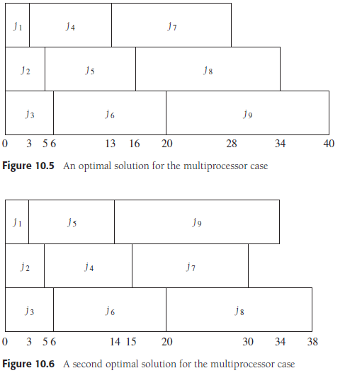
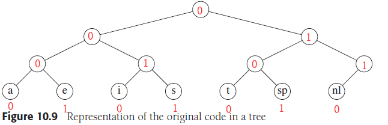
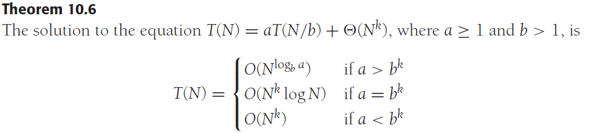
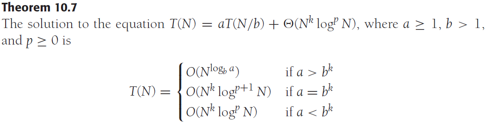
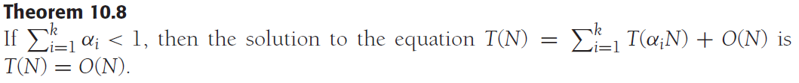
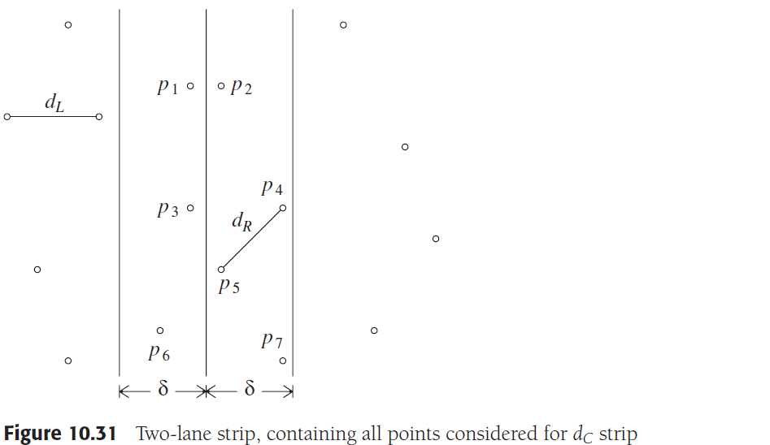
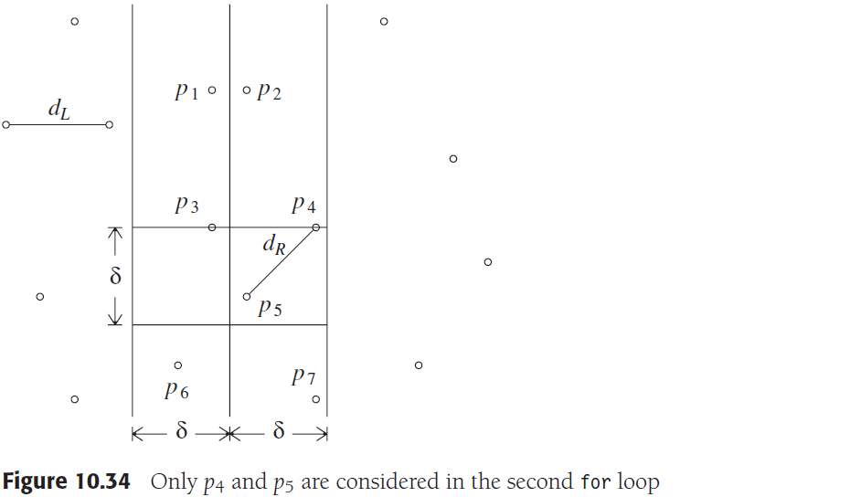
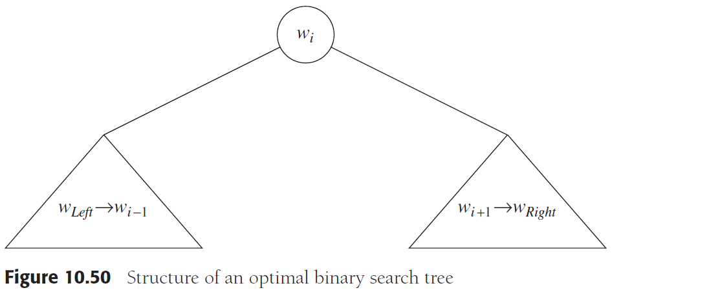
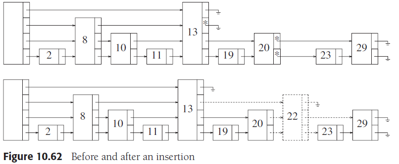

# Chapter 10. Algorithm Design Techniques

## 1. 贪心算法 Greedy Algorithms

- 概念
    贪心算法就是在**每一步都取当前条件下最优的结果（local optimum）**，在一些情况下，这样运行到最后可能会得到全局最优解（global optimum）也可能是次优解（suboptimal solution）
- **调度问题 A Simple Scheduling Problem**
  - 定义
    参考CPU处理任务，假定有`j1,j2…,jN`个任务需要处理，每个任务耗时`t1,t2…,tN`，在不抢占的情况下，如何安排任务处理顺序以使得**所有任务平均完成时间最小**
  - 最短耗时任务优先
    根据每个任务的耗时，短耗时在前，长耗时在后，可以获得**最优解**
  - 多处理器的情况
    多处理器下依然根据短耗时在前，长耗时在后，排出多个处理队列，也可以获得最优解，但是由于排列顺序，可以获得细节不同的最优解
  - 最短最终完成时间
    在多处理器下虽然根据最短耗时任务优先可以获得平均完成时间最小的最优解，但是从下图可以看出，**最终完成时间（40vs38）是不同的**，而如何达到最短最终完成时间是NP完全问题

    

- **哈夫曼编码 Huffman Codes**
  - 定义
    例如ASCII编码是由7bits二进制码构成的，每个ASCII字符都有7bits，但是每个ASCII字符在一段信息中出现的频率并不一致，若只有少数字符出现而依然使用7bits来编码就会出现空间浪费，因为只要更短的编码就足以表现这些少数字符，由此**哈夫曼编码是一种根据出现频率尽可能将高频字符用更短的位来编码，来将整段信息在不引起歧义的情况下压缩**
  - 查找树 Trie
    编码实际上就是从根结点开始找到叶结点的路径，例如下图，叶结点是被编码的字符，则找到`a`的路径`0000`就是`a`的编码，`t`就是`0100`，任何**停留在非叶结点的编码都是二义性的**，例如`001`无法明确是指`i`还是`s`，而整棵查找树在一段信息里的代价就是每个字符的编码长度乘以出现的频率，若`a`的频率远高于`e`，则两者都是4bits的编码是存在优化空间的

    

  - 加权路径长度 Weighted Path Length, WPL
    每个叶结点有权重，WPL就是所有叶结点的权重乘以从根结点到叶结点路径长度的总和，哈夫曼树的WPL最小，即**最优二叉查找树，但WPL相同的哈夫曼树可以是多种形态的**
  - **哈夫曼树 Huffman Tree**
    哈夫曼根据每个字符的频率来将高频率的字符安排在接近根的位置，低频率的字符在远离根的位置，来达到最低成本，如下图，显然高频率的`i`和`sp`只需要3bits，低频率的`s`和`nl`需要6bits，同时编码也是**前缀码（prefix code）并且不会引起二义性**，构成哈夫曼树的算法也非常简单，可以如下构建，复杂度是`O(NlogN)`
    1. 初始有一系列已知频率的待编码字符，作为结点，**权重就是频率**（可以采用最小堆存储）
    2. 选取频率最低的两个结点构建哈夫曼树，并将**根结点权重设为两个结点的频率和**
    3. 重复2直到形成一棵树，即哈夫曼树

    ```cpp
    HuffmanTree Huffman(MinHeap H)
    {
        int i; 
        HuffmanTree T;
        // 做N-1次合并，每次合并取权重最小的2个结点
        for (i = 1; i < H->Size; i++) {
            T = (HuffmanTree)malloc(sizeof(struct TreeNode));
            T->Left = DeleteMin(H);
            T->Right = DeleteMin(H);
            T->Weight = T->Left->Weight + T->Right->Weight;
            WPL += T->Weight;
            Insert(H, T);
        }
        // 合并N-1次后完成了哈夫曼树，此时Delete返回的即是哈夫曼树的树根
        T = DeleteMin(H);
        return T;
    }
    ```

    注意：**哈夫曼编码是不唯一的，同样WPL值可以是不同构的哈夫曼树**，代码中`T->Left`和`T->Right`可以交换左右子树

- **近似装箱问题 Approximate Bin Packing**
  - 定义
    近似装箱问题将给出装箱问题的**非最优解决但是也有足够好的性能**，这是贪心算法在实践中的很好提现，给定归一化容积为1的箱子和一系列大小在`(0, 1]`的物品`s1,s2…,sN`，要求用**最少的箱子数量来装上这N个物品**
  - **在线装箱问题 Online bin packing**：当前物品未装就不能装后续物品，保证装箱顺序
    无论采用什么算法，**最终在线装箱都至少使用`4/3`倍最优解数量M的箱子**，一些可供参考的算法如下，确保不会使用2倍于最优解数量的箱子（似于内存分配）：
    - 下一个适配（Next Fit）：每次有新物品都**检查上一个物品存放的箱子**是否放的下，若放不下就采用一个新箱子，时间复杂度`O(N)`，最多使用`2M-2`个箱子
    - 第一个适配（First Fit）：每次有新物品都**从头检查每个箱子**，在第一个能放得进的箱子放入，都无法放入才采用一个新箱子，时间复杂度`O(N^2)`（通过二叉树等改进可以使得复杂度在`O(NlogN)`），最多使用`17/10*(M-1)`个箱子
    - 最佳适配（Best Fit）：每次有新物品都**查找一个空余体积大于且相差最小的箱子**，都无法放入才采用一个新箱子，时间复杂度`O(NlogN)`，大约最多使用`1.7M`个箱子
  - 离线装箱问题 Offline bin packing：所有物品已知，不保证装箱顺序
    - 降序第一个适配（First Fit Decreasing）：根据物品尺寸从大到小，并应用第一个适配算法，最多使用`11M/9+6/9`个箱子，并在实践中效果良好，对于随机产生的物品序列期望在`M`外还需要`Θ(√M)`个箱子
    - 降序最佳适配（Best Fit Decreasing）：根据物品尺寸从大到小，并应用最佳适配算法

## 2. 分治法 Divide and Conquer

- 概念
  - **分（divide）**：将原问题根据情况分割成子问题（subproblems），递归解决（recursive）或是基础情况（base case）
  - **治（conquer）**：原问题的解就是整合子问题的解
  
  一般来说，包含两次及以上递归调用的才是分治法，并且分割出的子问题之间是不相交的
- 分治法运行时间 Running Time of Divide-and-Conquer Algorithms

  
  
  
- **最近点对问题 Closest-Points Problem**
  - 定义
    平面上有一系列点`pi=(xi, yi)`，点之间的欧几里得距离为`d(pi, pj) = sqrt[(xi-xj)^2+(yi-yj)^2]`，如何找到最近点对，即`min{d(pi, pj)},i=1..N,j=1..N,i≠j`，若有两个点在同一位置，则最近点对距离就是0
  - 暴力搜索
    `N`个点可以组成`N(N-1)/2`对不同的点对，则可以直接搜索这些点对来找最近点对，`O(N^2)`
  - `O(NlogN)`的算法
    1. 首先用`O(NlogN)`将`N`个点根据`x`坐标排序，由此可以很容易将`N`个点分为两半，最近点对只有三种可能，一是在左半侧对应`dL`，二是在右半侧对应`dR`，或者一个点在左侧一个点在右侧跨过分界线对应`dC`，递归解决左半侧获得`dL`，递归解决右半侧获得`dR`，利用`O(N)`的时间获得`dC`，由此就可以得到`O(NlogN)`的解法
      
    2. 获取`dC`可以在分界线两侧划定一个极小的范围`2δ`，可以使`δ=min{dL, dR}`，容易理解若横跨距离大于`δ`则最近点对肯定不是`dC`，同时`y`方向若大于`δ`也不会是`dC`，因此在`2δ`范围内进一步压缩`y`轴范围到`2δ`，此时任意一个在左侧的点至多需要检测的点是6个，就是6个顶点
      
    3. 通过维护一个基于`x`排序的`P`集合和一个基于`y`排序的`Q`集合，分别处理后传入两个递归调用，使得总复杂度是`O(NlogN)`，若每次在`2δ`范围内都对点基于`y`排序，则总复杂度是`O(Nlog^2(N))`
- **选择问题 The Selection Problem**
  快速选择quick select能够达到`平均O(N)`的复杂度，最坏O(N^2)，在实践中已经有非常好的效果，而基于median-of-median-of-five分割法可以达到最坏O(N)的复杂度，但是在实践中由于程序复杂边界情况多，并没有广泛使用而仅仅是理论分析
- 运算问题的理论改进 Theoretical Improvements for Arithmetic
  - **整数相乘 Multiplying Integers**
    一般的两个`N`位整数相乘复杂度是`O(N^2)`，假定两个8位数`X,Y`相乘，分别拆成高低4位数`XL, XR, YL, YR`，则`XY=XLYL*10^8+(XLYR+XRYL)*10^4+XRYR`，注意到`XLYR+XRYL=(XL-XR)(YR-YL)+XLYL+XRYR`，则实际需要计算的是`XLYL, XRYR, XL-XR, YL-YR`最后再整合到一起为`XY`，可以获得`T(N)=3T(N/2)+O(N)=O(N^1.59) < O(N^2)`的更佳性能
  - 矩阵相乘 Matrix Multiplication
    多重循环、大量数据等由于缓存命中率等问题，有时候一些高时间复杂度的算法未必比低时间复杂度的算法慢

## 3. 动态规划 Dynamic Programming

- **使用表代替递归 Using a Table Instead of Recursion**
  例如计算斐波那契数列，如果采用递归，就会导致重复计算一些元素例如`f(4)=f(3)+f(2), f(3)=f(1)+f(2)`即重复了`f(2)`，而若将每个已计算好的元素都存在表中，计算下一个值就是前两个表中的值之和，可以大大提高速度，即**使用表代替递归**
- 矩阵乘法的顺序 Ordering Matrix Multiplications
  矩阵乘法由于不同的矩阵有不同的行数和列数，因此不同的顺序进行一系列矩阵连乘最后的开销会显著不同，例如假定A=50X10, B=10X40, C=40X30, D=30X5
  1. `(A((BC)D))`：`BC=12000`次乘法，`(BC)D=13500`次，`A((BC)D)=16000`次
  2. `(A(B((CD))`：`CD=6000`次，`B(CD)=8000`次，`A(B(CD))=10500`次
  3. `((AB)(CD))`：`CD=6000`次，`AB=20000`次，`(AB)(CD)=36000`次
  4. `(((AB)C)D)`：`AB=20000`次，`(AB)C=60000`次，`((AB)C)D=87500`次
  5. `((A(BC))D)`：`BC=12000`次，`A(BC)=27000`次，`(A(BC))D=34500`次
  
  显然不同的顺序会有显著差异，对于矩阵乘法所需次数，可以通过一个转移方程来描述：
  
  ```math
  M_{Left,Right}=\underset {Left\leqslant i<Right}{min}\{M_{Left,i}+M_{i+1,Right}+c_{Left-1}c_ic_{Right}\}
  ```

  将`Left,…i, Right`多块矩阵相乘，以`i`为分割，相乘次数为左侧的`Left,i`的相乘次数加右侧的`i+1,Right`的相乘次数加将左右两块矩阵相乘的次数，如此可以打表并不断更新找到最小值

    ```cpp
    void optMatrix(const vector<int> &c, matrix<int> &m, matrix<int> &lastChange) 
    {
        // c[0]为第一个矩阵的rows，c[i]为第i个矩阵的columns
        // m[i][j]为从第i个矩阵连乘到第j个矩阵所需要的最小次数
        // lastChange[i][j]为从第i个矩阵连乘到第j个矩阵最小次数时的分割位置（矩阵）
        int n = c.size() - 1;
        for (int left = 1; left <= n; ++left) {
            // 任意单个矩阵所需要的乘法次数初始化为0
            m[left][left] = 0;
        }
        // k是当前考虑连乘的矩阵块数，即k=right-left
        for (int k = 1; k < n; ++k) {
            for (int left = 1; left <= n - k; ++left ) {
                int right = left + k;
                m[left][right] = INFINITY;
                for (int i = left; i < right; ++i) {
                    int thisCost = m[left][i] + m[i+1][right] + c[left-1]*c[i]*c[right];
                    if (thisCost < m[left][right]) {
                        m[left][right] = thisCost;
                        lastChange[left][right] = i;
                    }
                }
            }
        }
    }
    ```

- **最优二叉查找树 Optimal Binary Search Tree**
  哈夫曼树就是最优二叉查找树之一，哈夫曼树基于贪心算法构建，而最优二叉查找树也可以采用DP实现，同理类似矩阵乘法的顺序，通过**在不同位置作为根并分割左右子树求得最小的路径权重和来实现最优二叉查找树**，转移方程如下：

  ```math
  C_{Left,Right}=\underset {Left\leqslant i<Right}{min}\{C_{Left,i-1}+C_{i+1,Right}+\sum_{j=Left}^{Right}{p_j}\}
  ```

  即，将`i`作为根结点，`Left,i-1`作为左子树，`i+1,Right`作为右子树，则此时总权重为左子树权重+右子树权重+所有结点权重（深了一层所以所有结点再算一次），同样通过打表不断更新找到最小值

  

- 所有点对最短路径 All-Pairs Shortest Path
  **即[Floyd算法](https://github.com/JasonYuchen/notes/blob/master/ds/09.Graph_Algorithms.md#3-%E6%9C%80%E7%9F%AD%E8%B7%AF%E5%BE%84%E7%AE%97%E6%B3%95-shortest-path-algorithms)**

  转移方程如下：

  ```math
  D_{k,i,j} = min\{D_{k-1,i,j},D_{k-1,i,k},D_{k-1,k,j}\}
  ```

## 4. 随机算法 Randomized Algorithms

- 随机数发生器 Random-Number Generators
- **跳表 Skip Lists**
  每个结点有随机多个指针指向后序的结点，查找时会出现类似二分的过程，最终可以达到`O(logN)`的期望复杂度
  
- 素性测试 Primality Testing
  利用下述定理，随机挑选多个X进行素性测试，可以**显著降低判断大整数是否是素数的开销**，但是可能会误判为素数（若**判断是合数则100%正确**），因此通过多次随机挑选并测试可以显著降低误判率

  ```math
  if\ P\ is\ prime\ and\ 0<A<P,\ then\ A^{P-1}\equiv 1(mod\ P)\\
  if\ P\ is\ prime\ and\ 0<X<P,\ the\ only\ solutions\ to\ X^2\equiv 1(mod\ P)\ are\ X=1,P-1
  ```

## 5. 回溯法 Backtracking Algorithms

- **剪枝Pruning可以大大减小回溯法的时间复杂度，即在搜索过程中回避已被发现不存在解的空间**

- **收费公路重建问题 The Turnpike Reconstruction Problem**
  一条公路上有`N`个收费站，则任意两个收费站的距离有`N(N-1)/2`个，给定这`N(N-1)/2`个距离，重建`N`个收费站的位置，可以通过回溯完成
  1. 首先根据`N(N-1)/2`来计算出收费站个数`N`，并且对这些距离进行排序，在`x0`放置`0`，在`xn`放置最大距离
  2. 假定某一个时刻，`x[0]…x[left-1]，x[right+1]…x[n]`都已经满足，算法进行到`x[left]..x[right]`时
  3. 判断余下距离中最大距离`dmax`能否放置在`x[right]`的位置即`x[right]-x[0]=dmax`（**放在一个新的位置时，要求新位置与其他所有点的距离都存在于当前残余的距离集合中**），若不能，则再判断能否放置在`x[left]`的位置即`x[n]-x[left]=dmax`，若不能则返回`false`
  4. 递归进入下一步判断，重复1-2过程

    ```cpp
    /**
     * Backtracking algorithm to place the points x[left] ... x[right].
    * x[1]...x[left-1] and x[right+1]...x[n] already tentatively placed.
    * If place returns true, then x[left]...x[right] will have values.
    */
    bool place(vector<int> &x, set<int> d, int n, int left, int right)
    {
        int dmax;
        bool found = false;
        if (d.empty()) {
            return true;
        }
        dmax = *d.rbegin();
        
        // check if setting x[right]=dmax is feasible
        if (|x[j]-dmax| in d for all 1<=j<left and right<j<=n) {
            x[right] = dmax;
            for (1<=j<left, right<j<=n) {
                d.erase(|x[j]-dmax|);
            }
            found = place(x, d, n, left, right - 1);
            if (!found) {
                for (1<=j<left, right<j<=n) {
                    d.insert(|x[j]-dmax|);
                }
            }
        }
        // if first attempt failed, try to see if setting
        // x[left]=x[n]-dmax is feasible
        if (!found && (|x[n]-dmax-x[j]| in d for all 1<=j<left and right<j<=n)) {
            x[left]=x[n]-dmax;
            for (1<=j<left, right<j<=n) {
                d.erase(|x[n]-dmax-x[j]|);
            }
            found = place(x, d, n, left+1, right);
            if (!found) {
                for (1<=j<left, right<j<=n) {
                    d.insert(|x[n]-dmax-x[j]|);
                }
            }
        }
        return found;
    }
    ```

- 博弈
  - **bash游戏**
    假设一堆石子共`n`个，A/B两人轮流取`1-k`个，取到最后一个石子获胜，两人都绝对理智，A先手
    **`n % (k+1) == 0`则A必输，`n % (k+1) != 0`则A必胜，面对必胜局面，每次只需要取到`n % (k+1) == 0`即可**，这样无论B取多少，A都可以取使得剩余`n % (k+1) == 0`，最后就会剩余`k + 1`个给B取而B只能取`1-k`个，A获胜

  - **nim游戏**
    假设有`n`堆石子，每堆分别有`a[1], a[2], …, a[n]`个石子，A/B两人轮流取，一次只能从具体的第`i`堆中取`1-a[i]`个石子，取到所有石子的最后一个获胜，两人都绝对理智，A先手
    **`a[1] ^ a[2] ^ … ^ a[n] == 0`则A必输，`a[1] ^ a[2] ^ … ^ a[n] == k (k != 0)`则A必胜，面对必胜局面，每次只需要取到`a[1] ^ a[2] ^ … ^ a[n] == 0`即可**
    分为P-position和N-position，P成功，N失败，则需要证明:
    - **终止position是P-position**
      显然终止position时`a[1] = a[2] = … a[n] = 0`，`a[1] ^ a[2] ^ … ^ a[n] = 0`
    - **某个N-position一定可以移动到某个P-position**
      对于某个N-position，则`a[1] ^ a[2] ^ … ^ a[n] = k != 0`
      那么对于异或和非0，`k`的二进制位里最高的1**一定对应至少有第`i`堆的石子也在这一位为1**才能使得异或和k在这一位也是1（其他堆只要这一位有**偶数对的1**也保证了异或和k在这一位为1），那么对于`a'[i]`可知其二进制位在这一位从`1->0`，因此`a'[i]`一定小于变化前的`a[i]`
      此时只要**取使得`a'[i]=a[i] ^ k`就可以使得`a[1] ^ a[2] ^ … ^ a'[i] ^ … a[n] = k ^ k = 0`，前述可知`a'[i] < a[i] ^ k`**
    - **P-position无法移动到另一个P-position**
      对于某个P-position，则`a[1] ^ a[2] ^ … ^ a[n] = 0`，显然不可能通过`a[i]->a'[i]`移动到`a[1] ^ a[2] ^ … ^ a'[i] ^ … ^ a[n] = 0`，**因为`a[1] ^ a[2] ^ … ^ a[i] ^ … ^ a[n] = a[1] ^ a[2] ^ … ^ a'[i] ^ … ^ a[n] = 0`，则消去相同元素得到`a[i] = a'[i]`，矛盾**
  - **wythoff游戏**
    假设有2堆石子，每堆分别由`m, n`个石子，A/B两人轮流取，一次可以从一堆中拿1-拿完或从两堆中拿同样多的石子，取到所有石子的最后一个获胜，两人都绝对理智，A先手
    `TODO`
