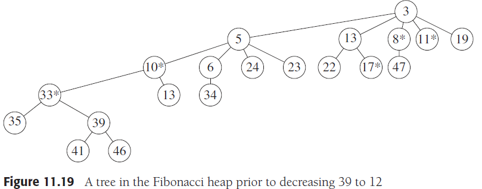
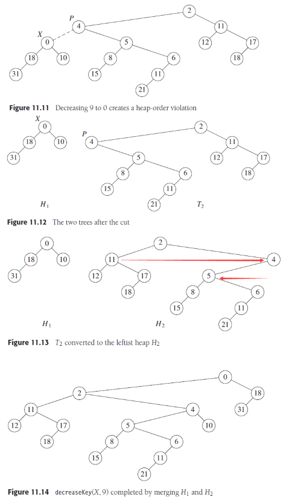
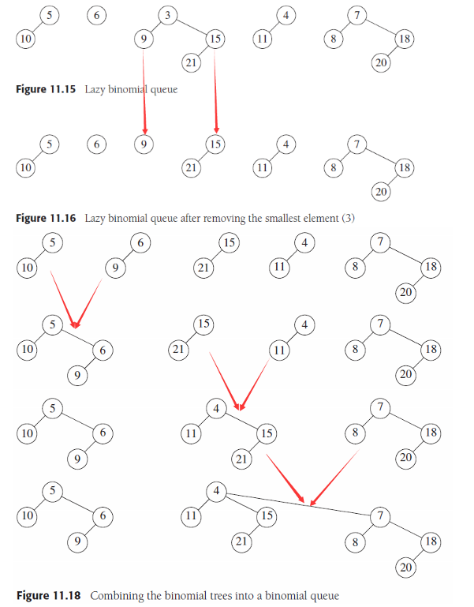
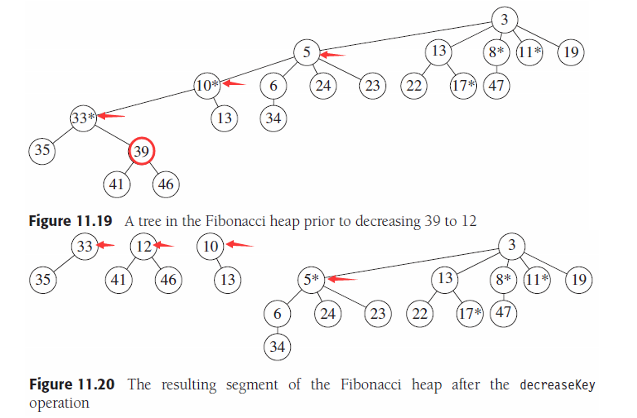

# Chapter 11. Amortized Analysis

证明过程参考原文

## 1. 二项队列 Binomial Queues

对于平摊分析，**关键在于选择一个势函数**，使得在单个操作开销小时，势函数的值增大，单个操作开销大时，势函数的值减小，最终使得**Tactual+Potential达到平摊的Tamortized的复杂度**

```math
T_{actual} + \Delta Potential = T_{amortized}
```

对于二项队列，势函数可以选择二项队列中树的数量，最终平摊时间复杂度为插入操作`insert=O(1)`，删除最小值操作`deleteMin=O(logN)`，合并操作`merge=O(logN)`，`N`为二项队列的总结点数

## 2. 斜堆 Skew Heaps

合并斜堆的平摊复杂度为`O(logN)`，由于插入和删除都可以通过合并来实现，因此也是`O(logN)`

## 3. 斐波那契堆 Fibonacci Heaps

在图论中最短路径算法有Dijkstra算法，其中涉及到求取目前的最短边`FindMinDist`，可以通过堆来实现，同时对于有`V`个结点`E`条边的图而言，二叉堆并非是最优的，**往往是`d=max(2,⌊E/V⌋)`的d-堆更好**，同时还要求能够高效修改堆中结点的值（Dijkstra会修改堆里的结点的最短距离）

**斐波那契堆是一种形式上与二项队列相同、每个树类似d-堆（不超过d个子结点）且有斜堆高效合并性质的一种堆**，并且支持高效修改堆内结点的值并维护堆的性质，如下图是斐波那契堆中的一棵树



- **左氏堆中切断结点**
  在二叉堆中`decreaseKey`操作通过减小值后上滤结点（percolate up）来实现，最坏情况下是`O(logN)`，而在左氏堆中这样操作最坏情况下是`O(N)`，但是可以直**接切断违背堆性质的连接，并对切下的子树和原树进行合并来保证`O(logN)`的复杂度**，如下图，原树若因切割导致不符合左氏堆形式，只需要**在冲突的位置交换左右子树**以复合形式，维护左氏堆的开销是`O(logN)`，合并的开销是`O(logN)`

  

- **二项队列的懒惰合并**
  一般二项队列要求**每个度（rank）至多只有一个树**，而懒惰二项队列并不在插入或合并时维护这一性质，懒惰二项队列允许存在多个相同度的数，而在**删除最小值时才进行合并使得每个度至多一棵树**，对于懒惰二项队列，插入和合并的平摊复杂度是`O(1)`，删除最小值的平摊复杂度是`O(logN)`

  

- **斐波那契堆的操作**
  斐波那契堆对每个结点维护一个标记，任何结点初始标记为0，一旦丢失一个子树（左氏堆切断结点导致丢失）则被标记为1，若再丢失一个子树则将这个结点也切断与其父结点的连接（级联切割cascading cut）并形成一个新树且重新初始化其标记为0，如下图，`39->12`，直接切断`33-39`，由于`33`标记为1 （图中*）继续切断`10-33`，由于`10`标记为1，继续切断`5-10`，由于`5`标记为0，改为1并停止
  
  

  证明参考原文P549，**斐波那契堆拥有`O(1)`的插入`insert`、合并`merge`、减小值`decreaseKey`平摊时间复杂度，`O(logN)`的删除最小值`deleteMin`平摊时间复杂度**

## 4. 伸展树 Splay Trees

伸展树伸展操作的平摊时间复杂度是`O(logN)`
