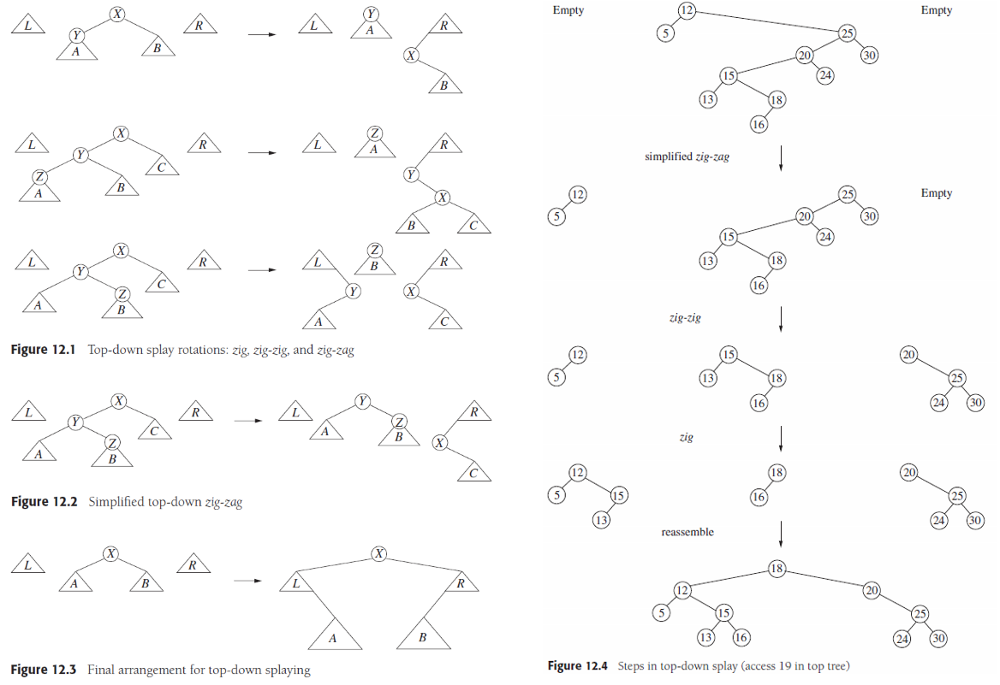
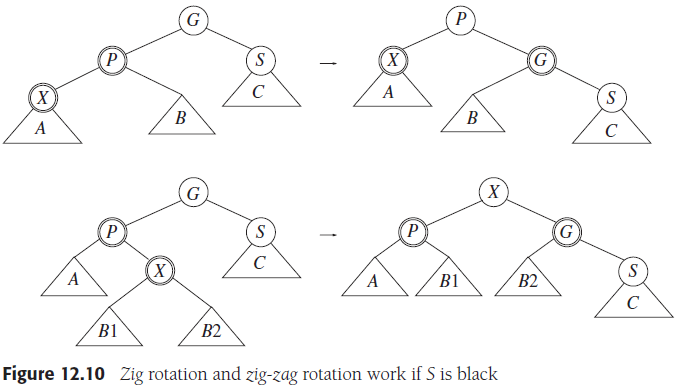

# Chapter 12. Advanced Data Structures and Implementation

## 1. 自顶向下伸展树 Top-Down Splay Trees

- **基本操作**

  zig/zig-zig/zig-zag以及镜像对称，共六种，`L`是所有小于`X`的节点组成的树，`R`是所有大于`X`的节点组成的树，伸展树的平摊复杂度均为`O(logN)`，由于若从底部向上伸展，则每个节点需要保留父节点的指针、或用栈保留访问的路径，会有额外的开销，同时要处理多种边界条件，因此**自顶向下伸展top-down splay是更好的选择**

  

## 2. 红黑树 Red-Black Trees

- **性质**
  1. 每个节点是红色或者黑色
  1. 根节点是黑色
  1. 若一个节点是红色，则其子节点都必须是黑色
  1. 从任意一个节点到空节点的最短路径上，必须含有相等数量的黑色节点
  
  由以上性质导致红黑树的深度最多不超过`2log(N+1)`，并且**与AVL树相比，红黑树放宽了平衡的限制，从而插入操作时维护平衡的开销比AVL树小，但查找的时间复杂度就比AVL树要大**
- **插入操作**
  由于新插入的节点若是黑色，则一定违背了性质4，因此**新插入的节点必须是红色**的，此时若新插入节点的父节点是黑色的，则结束插入，否则需要调整红黑树以保持性质3
  - **自底向上插入 bottom-up insertion**

    

    可以发现，`X`和`P`都是红色，违背了性质3，通过**zig/zig-zag操作**并改变部分节点的颜色，可以使其重新符合红黑树的性质，同样基于伸展树中所说自底向上的缺点，也可以采用自顶向下的方式来维护红黑树的性质
  - **自顶向下插入 top-down insertion**

    
  
    维护四项指针：`great` - Great-grandparent, `grand` - Grandparent, `parent` - Parent, `current` - Current

    从根节点开始向需要插入的节点前进，每当遇到当前节点`current`是黑色且有两个红色子节点时就进行**颜色上滤，即子节点都变成黑色而当前节点变成红色**，这种上滤保证了性质4，同时考虑当前节点的父节点是否是红色，若父节点`parent`是红色就进行zig/zig-zag变化来保证性质3并获得新的当前节点，随后继续向插入的节点前进，最终可以确保插入节点是红色且挂在一个黑色节点的下方

    注意：这种方式一定可以使得若父节点是红色而当前节点被翻转成红色时，父节点的兄弟节点一定是黑色（若是红色，而父节点也是红色，则在父节点是当前节点时一定也会颜色上滤）

- **删除操作**
  - **各种情况**
    1. 当要删除一个有两个子节点的节点时，将这个**节点与右子树中最小的节点值交换、颜色不变**（后者一定至多只有一个子节点），然后再继续尝试删除位于新位置的要删除的节点
    2. 当要删除一个只有右子节点的节点时，方法同上
    3. 当要删除一个只有左子节点的节点时，将这个**节点与左子树中最大的节点值交换**，方法同上，注意：删除只有一个子节点的节点**不能通过直接绕过被删除节点构建连接**（bypass），这可能会连接两个红色节点引起问题
    4. 当要删除的节点**没有子节点且是红色时，直接删除**即可
    5. 当要删除的节点没有子节点且是黑色时，直接删除会破坏性质4，因此要**确保被删除的是红色节点**
  - **自顶向下删除过程 top-down deletion**
    1. 首先将根节点变为红色，`P` - Parent, `T` - Sibling of `X`, `X` - Current，向下出发
    2. 若当前节点是红色，判断是否要删除（即执行情况1的判断和替换），直接向下
    3. 若当前节点是黑色，可以尝试通过颜色变换和zig/zig-zag变换确保当前节点`X`是红色
       - 若当前节点`X`有两个黑色子节点（若`X`是叶子节点也符合，因为认为空节点是黑色）则有下图所示的三种子情况，对于2、3使用zig/zig-zag变换，对于1直接颜色下滤，由此确保了`X`变为红色，随后判断是否要删除（即执行i的判断和替换）
       - 若当前节点`X`至少有一个红色子节点，先判断是否要删除（即执行i的判断和替换），`X`不是要删除的节点，则继续向下（无须变红），若正好接下来的当前节点就是红色的则直接继续向下，若接下来的当前节点是黑色的，则`X`黑、`T`红、`P`黑，旋转`TP`使得`X`的新父节点为红，回到了前一种情况；`X`是要删除的节点，则执行情况1的判断和替换，直接向下
    4. 最终遇到要删除的节点是当前节点`X`时，由于**确保了红色，可以直接删除**

    

## 3. 树堆 Treaps

**Treap = Tree + heap**，即**有优先级的二叉搜索树**，其与跳表类似，使用随机数作为优先级（值越小优先级越高），并且满足堆的性质即子树的优先级一定大于父节点的优先级，空节点的优先级无穷大，由此来使得整个树的平衡性比一般二叉搜索树要好，操作的平摊复杂度为`O(logN)`，并且结构和实现简单（只需要左旋和右旋两种操作）

## 4. 后缀数组和后缀树 Suffix Arrays and Suffix Trees

- **后缀数组**

  `Index`记录起始下标，`LCP`记录最长相同前缀的长度，对于长度为`N`的字符串，简单获得`0~N-1`开头的不同字符串并排序就可以获得上表，复杂度由排序约束，即`O(NlogN)`

  

- **后缀树**

  使用树来存储后缀的起点及相应的`LCP`，每个树节点分支出所有可能作为下一个字符的树枝，并且将所有单路径到叶结点的分支压缩

  

  进一步将叶节点改写为起始下标，内部节点internal node改写为从根节点开始到此内部节点的共同字符串长度letter depth，因此**内部节点所代表的共同字符串就是其下所有节点的共同字符串**，根节点的值为0，因此**每个内部节点能向下抵达的叶节点数目就是这个非叶节点的共同字符串重复次数**

  

  对后缀树进行中序遍历并提取其得到的叶节点顺序就可以获得后缀数组及相应的`LCP`值，`LCP`可以如下计算：若叶节点的值（起始下标）+父节点的值（共同字符串长度letter depth）= 字符串长度（`N`），则祖父节点的值就是`LCP`，否则父节点的值就是`LCP`，例如anana节点起始点为1，共同字符串长度为3，`1 + 3 != 6`，则anana的`LCP`是父节点的值3；反之也可以通过后缀数组和相应的`LCP`值来唯一地构建后缀数组

- **应用**
  - 寻找串`T`中的最长的重复子串：遍历后缀树，找到有最大值的内部结点，代表着最大的`LCP`，由此也可以推广到寻找最长的重复至少`k`次子串
  - 寻找`T1`和`T2`中的最长公共子串
  - 寻找某个子串`P`在`T`中的重复次数：直接找到第一个中间结点所代表的共同字符串是P的前缀，则这个结点下部的叶结点数量就是重复次数
  - 寻找长度为`L`的最共同的子串：找到值至少为`L, letter depth>=L`的拥有最多叶节点的中间节点，`O(T)`
