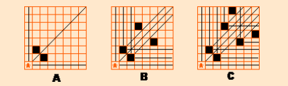

# Game Problem

## bash

假设一堆石子共`n`个，`A`和`B`两人轮流取`[1, k]`个，取到最后一个石子获胜，两人都绝对理智，`A`先手

- `n % (k+1) == 0`则`A`必输
- `n % (k+1) != 0`则`A`必胜

**面对必胜局面的一方，每次只需要取到`n % (k+1) == 0`即可**，这样无论`B`取多少，`A`都可以取使得剩余`n % (k+1) == 0`，最后就会剩余`k + 1`个给`B`取而`B`只能取`1-k`个，`A`获胜

[292. Nim Game](https://leetcode.com/problems/nim-game/)

## nim

假设有`n`堆石子，每堆分别有`a[1], a[2], ..., a[n]`个石子，`A`和`B`两人轮流取，一次只能从第`i`堆中取`[1, a[i]]`个石子，取到所有石子的最后一个获胜，两人都绝对理智，`A`先手

- `a[1] ^ a[2] ^ ... ^ a[n] == 0`则`A`必输
- `a[1] ^ a[2] ^ ... ^ a[n] != 0`则`A`必胜

**面对必胜局面的一方，每次只需要取到`a[1] ^ a[2] ^ ... ^ a[n] == 0`即可**，证明如下，局面分为赢P-position和输N-position，则：

- **终止状态为P-position**
  显然全部取完时的状态满足所有石子堆均为空，那么`a[1] ^ a[2] ^ ... ^ a[n] == 0`
- **任意N-position一定可以通过一次操作转移到P-position**
  对于任意一个N-position都满足`a[1] ^ a[2] ^ ... ^ a[n] != 0`，从而对于异或和非`k != 0`的情况下，`k`的二进制表示中最高位的1一定对应至少有第`i`堆的石子数量也在这一位为1从而才能使得异或和`k`的这一位为1（其他堆也有可能在这一位为1，但是只要是偶数数量的堆就可以通过异或抵消）

  假定在一次操作后实现了P-position，即一次操作第`i`堆的石子使得异或和`k = 0`，即`a[1] ^ a[2] ^ ... ^ (a[i] ^ k) ^ ... ^ a[n] = k ^ k == 0`，可以看出操作就是在第`i`堆取出一定数量的石子使得`a[i]`转变为`a[i] ^ k = a'[i]`（由于`k`的最高位1在这次操作后从`1->0`即`a[i]`在操作后是变小的，意味着一定是`a'[i] < a[i]`满足取出石子的数量限制`[1, a[i]]`）
- **任意P-position无法通过操作转移到另一个P-position**
  对于某个P-position，则`a[1] ^ a[2] ^ ... ^ a[n] = 0`，显然不可能通过`a[i]->a'[i]`移动到`a[1] ^ a[2] ^ ... ^ a'[i] ^ ... ^ a[n] = 0`，因为`a[1] ^ a[2] ^ ... ^ a[i] ^ ... ^ a[n] = a[1] ^ a[2] ^ ... ^ a'[i] ^ ... ^ a[n] = 0`意味着`a[i] = a'[i]`，即取出0个石子与取出石子的数量限制不符合

## wythoff

假设有两堆石子，每堆分别有`m`和`n`个石子，`A`和`B`两人轮流取，一次可以选择两类操作中的一种，从一堆中至少取出一个至多全部取完，或从两堆中拿同样多的石子，取到所有石子的最后一个获胜，两人都绝对理智，`A`先手

先手必输的状态如下表：

|n    |1    |2    |3    |4    |5     |6     |7     |n  |
|:-:  |:-:  |:-:  |:-:  |:-:  |:-:   |:-:   |:-:   |:-:|
|(m,n)|(0,0)|(1,2)|(3,5)|(4,7)|(6,10)|(8,13)|(9,15)|...|
|diff |0    |1    |2    |3    |4     |5     |6     |n-1|

可以发现两堆石子中较少的数量和较大的数量越来越接近黄金比例`0.618`即`(sqrt(5)-1)/2`，可以通过直接判定黄金比例（注意精度），或是根据差值获得`n`从1开始递推来判断给定的`(m, n)`是否先手必胜，若**符合给定的规律则先手必输**，反之先手必胜

- 首先确立**终止状态为P-position即剩余石子为`(0,0)`的情况**，标记`(0,0)`为P-position，根据这两种可能的操作，标记所有`(0,k)`、`(k,0)`和`(k,k)`为N-position，因为可以从单个堆取任意多石子以及从两个堆取相同任意多石子
- 进一步此时最小的P-position就是剩余石子为`(1,2), (2,1)`，同理对`(1,2)`继续（对称点也同样对称标记）标记所有`(1,k)`、`(k,2)`和`(1+k,2+k)`为N-position
- 从而未被标记的最小P-position就是`(3,5), (5,3)`，继续就可以获得类似上表格的状态

