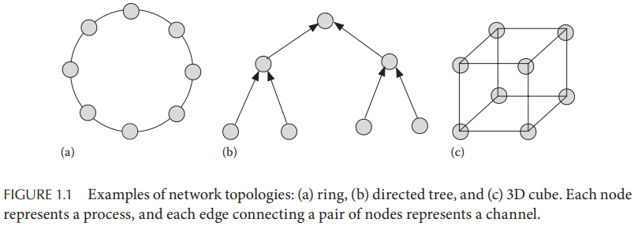

# Chapter 1. Introduction

## 1.1 What is a distributed system?

分布式系统包含多个串行处理的进程，且满足：

- **多进程 Multiple processes**: The system consists of more than one sequential process.
- **进程间通信 Interprocess communication**: Processes communicate with one another using messages that take a finite time to travel from one to another.
- **独立地址空间 Disjoint address spaces**: Processes have disjoint address spaces. 因此对于共享内存的多处理器系统严格来说不能算一个分布式系统，例如现代多核处理器的主机，但是这种主机上多核之间的通信协作也具有一些分布式系统的特征
- **协作 Collective goal**: Processes must interact with one another to meet a common goal.

## 1.2 Why distributed systems?

- **地理上的分布 Geographically distributed environment**
- **加速 Speed up**
- **资源共享 Resource sh*aring**
- **容错 Fault tolerance**

## 1.3 Examples of distributed systems

## 1.4 Important issues in distributed systems

- **有限知识 Knowledge of a process**: The knowledge of a process is local. 一个进程只对自己的环境和状态有感知，而无法感知到其他进程或是全局的状态，通常实际情况下**一个进程可以知道自身身份identity和状态state，以及周围直接通信的其他进程的身份identity，其他知识都必须通过合适的算法来感知，并且这些感知到的信息可能随时会过时**
- **网络拓扑 Network topology**: 进程网络可能是完全连接的（**强连通的**），也可能是稀疏连接的，因此实际情况下任意节点之间的通信可能是双向的、单向的、需要其他节点转发的

  

- **同步程度 Degree of synchronization**: 理论上来说假如所有节点的本地时钟都能严格遵循UTC时间，并且不会出现时间飘逸，那么可以简单的通过预定义的调度来准确同步所有节点（例如节点A知道13:00时节点B应该会执行任务b），但是实际情况下这种**时间上的共识由于本地时钟漂移是不可能达成的**，[Google Spanner](https://github.com/JasonYuchen/notes/blob/master/mit6.824/13.Spanner.md)通过每个数据中心设立原子钟来利用这种"同步时间"实现更高效的分布式系统

  注意：完全**异步**的系统中会出现时钟漂移、消息传递延迟无限大（丢失）、消息乱序、进程的处理处于任意速度（极慢接近失联），因此实践中往往将系统建模为半同步系统
- **故障 Failures**：故障包括很多种类，最常见的就是宕机crash，而在**拜占庭故障模型**下，所有进程可以有任意的行为
- **扩展性 Scalability**

## 1.5 Common subproblems

分布式系统通常会面临一些共同的子问题（可以间接解决或缓解上述主要的问题）：

- **主节点选举 Leader election**: 通常多个节点会选举出一个主节点作为所谓的single source of truth而其他节点作为从节点，当主节点宕机时就再选举出新的主节点
- **互斥 Mutual exclution**: 部分全局资源是不能被并发访问的，从而需要有互斥的机制确保任意时刻都只有单个节点在访问
- **时间同步 Time synchronization**: 时间虽然存在漂移，但是可以通过周期性同步来确保时间的准确度，从而对延迟、丢失等事件有较为可靠的时间估计
- **全局状态 Global state**: 每个进程只对自身的局部状态有感知，并且消息传递存在延迟，因此计算全局状态并不是一个简单的问题
- **多播 Multicasting**: 高效、可靠、可扩展的传递相同的信息给多个进程是分布式系统中的常见问题
- **副本管理 Replica management**: 多副本的管理、副本的同步

## 1.6 Implementing a distributed system

## 1.7 Parallel versus distributed systems

并行系统和分布式系统都没有良好的定义，通常可以用目的来区分，并行系统旨在提升性能，而分布式系统旨在提升容错性
