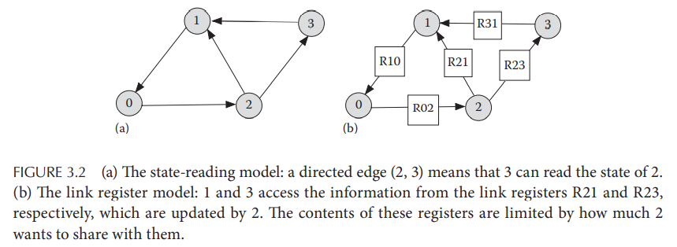

# Chapter 3. Models for Communication

## 3.1 Need for a model

## 3.2 Message-passing model for interprocess communication

- **进程的行为 Process Actions**
  - 内部 Internal action：进程在自己的地址空间内做计算和修改本地状态
  - 通信 Communication action：进程发送/接受消息
  - 输入 Input action：从系统外（例如管理员）接受数据
  - 输出 Output action：将数据输出到系统外（例如显示系统状态）
- **信道 Channels**
  一个较为常见采用的信道模型（不同的系统会设计不同的信道的模型来实现不同的目标）：
  - 每个接收者收到的消息一定是由系统中的一个节点发出的，每个发送者发出的消息一定会被系统中的一个节点接收
  - 每个消息可以存在任意但有界的延迟
  - 消息有序传播，服从FIFO原则
- **同步和异步系统 Synchronous versus Asynchronous Systems**
  同步系统通常有以下表征：
  - **同步时钟 Synchronous clocks**：每个进程的本地时钟都有相同的值，读取多个时钟可能有时间的漂移，即使用原子钟也会带来漂移只是程度非常小
  - **同步进程 Synchronous processes**：每个时间段，所有进程一起执行，实际中可能会有中断等各种原因导致进程的执行速率不一致，甚至可以任意慢接近停机，通常有时对执行速度有一个下界的系统也可以称之为同步系统，另外存在**逻辑上phase-synchronous系统**，即每一轮执行一步，每一步耗时可以是任意的，通过通信来达成每一步的同步，所有节点完成第i步再进入第i+1步
  - **同步信道 Synchronous channels**：即信道传输延迟有界，也称为bounded-delay channels
  - **同步消息顺序 Synchronous message order**：即消息发送的顺序和接收的顺序一致
  - **同步通信 Synchronous communication**：只有在接收者能够接受（就绪）的时候发送者才可以发送消息，非同步通信就是发送者可以在任意时刻发送消息给接收者
- **实时系统 Real-Time Systems**
  这种系统要求响应时间短且可预测，一旦错失任何一个deadline都会有严重后果

## 3.3 Shared variables

部分进程通过重叠的部分地址空间进行变量的共享，即**共享内存模型shared-memory model**，从而可以进行通信（**"不要通过共享内存进行通信，通过通信来共享内存"**），而对共享内存进行并发操作时，这些操作应该串行化执行

共享内存模型在分布式算法中有两个常见变种：

- **state-reading model** a.k.a. locally shared variable model：每个节点可以读取自身或由channel相连的相邻节点的数据，但只能更新自身数据
- **link register model**：节点之间通过single-reader single writer register相连，发送节点将数据写入register，接收节点从register中读取，register确保写入和读取是串行化的（参考原子变量）

## 3.4 Modeling mobile agents

移动主体mobile agent是一段能够在进程间迁移的代码，并且与message不同的是mobile agent能够**主动与宿主机上的数据交互且自由选择迁移的目标进程**（自由进行路由）

*似乎message相当于是一个纯数据对象，而mobile agent则是数据+代码即闭包closure*

## 3.5 Relationship among models

- **强模型和弱模型 Strong and Weak Models**
  通常可以认为**若在模型B中实现一个对象或操作比在模型A中需要更多的步骤，则模型A强于模型B**，例如一个支持多播的模型比只支持点对点通信的模型要强，前者可以通过在后者中对每个点通信来实现
- 采用Non-FIFO通道实现FIFO通道
  参考TCP的做法，每个乱序抵达的数据包通过index标记缓存，逐个index数据包交付，从而Non-FIFO可以模拟FIFO
- 共享内存实现消息传递
  参考线程安全的并发队列实现
- 消息传递实现内存共享
  每个进程需要获得完全一致的共享数据变化顺序，即共享数据变化的**全序广播total order multicast**，参考CPU缓存一致性算法
- **Impossibilities Result with Channel**
  由于channel传递消息的延迟没有上界，因此一个进程不可能准确判断一个channel是否为空，若延迟有界则可以通过等待足够长的时间来判断channel是否为空

## 3.6 Classification based on special properties

1. **Reactive versus Transformational Systems**
   - Reactive: 系统随着输入、环境变化而相应的动作并产生输出，例如基于事件循环的UI等
   - Transformational: 系统不断变化将初始输入转换成最终结果，例如MapReduce等
2. **Named versus Anonymous Systems**
   - Named: 算法会考虑不同进程的名字/身份，进而执行不同的调度、分配等操作
   - Anonymous: 算法不会考虑不同进程的名字/身份，每个进程是对称等价的，这给算法设计带来了更多难题

## 3.7 Complexity measures
