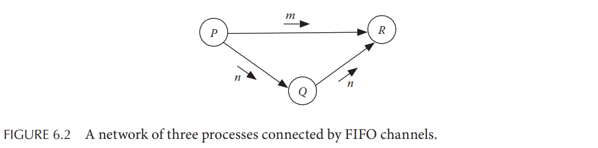
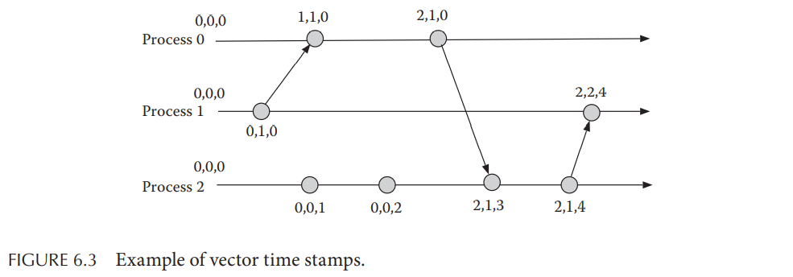
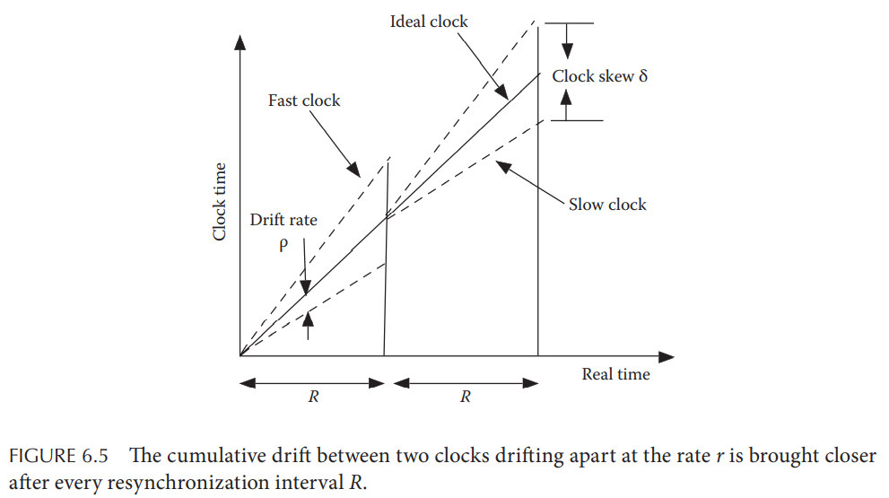
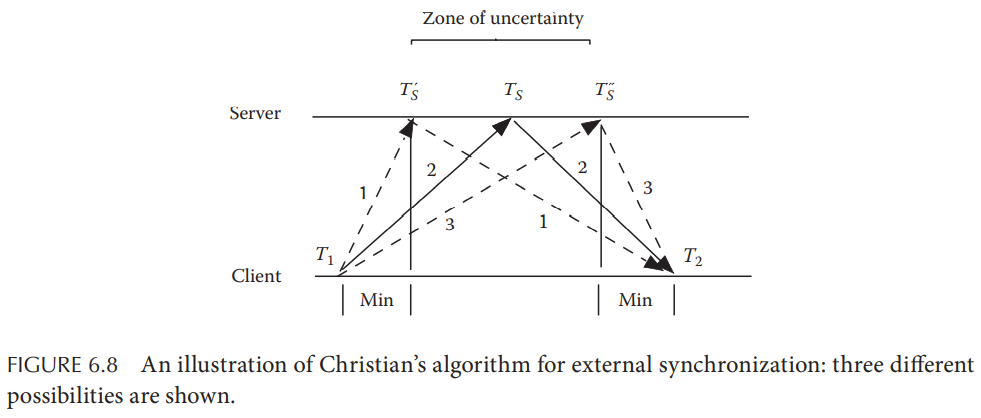
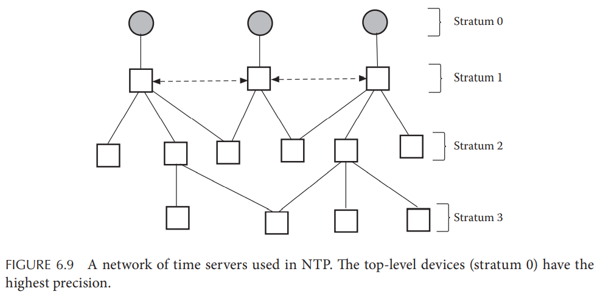

# Chapter 6. Time in a Distributed System

## 6.1 Introduction

- **物理时间 Physical Time**
- **顺序和并发事件 Sequential and Concurrent Events**
  由于原子钟过于贵重，不可能在常见的分布式系统中应用，因此**缺乏整个系统的全局时间共识**就会导致一些分布式系统中的难题，例如难以计算分布式系统的全局状态（在给定时间点下所有进程局部状态的集合）

  实际上在分布式系统中**因果关系causality**更为重要，基于因果性的事件发生顺序比基于物理时间的顺序更有意义，并且**因果顺序也是逻辑时钟logical clocks的基石**

## 6.2 Logical Clocks

单个进程中的所有事件的发生都是**串行的sequential**，并且可以在该进程内**根据进程本地时钟全序totally ordered**，而在多个进程的多个时钟下（即使周期性同步）则不能根据时钟进行顺序判定，时钟总是存在偏移

多个进程中发生的事件**必须根据因果性causality来确定happened before `<`的顺序关系**，而没有因果依赖的事件就称为**并发concurrent**，因此可以导出三条基本规则：

1. 每个进程都有一个单调递增的物理时钟，如果`a`，`b`是发生在进程`P`内的两个事件，则当发生`a`的时间早于发生`b`的时间时，`a < b`
2. 如果事件`a`是进程`P`发送消息的事件，而事件`b`是进程`Q`接收该消息的事件，显然接收一定是晚于发送的，那么`a < b`
3. 因果依赖传递性，若`(a < b) and (b < c)`则`a < c`

将规则中的物理时钟改为逻辑时钟，并且定义每个事件发生则逻辑时钟前进一格，即**逻辑时钟LC就是事件的计数器**，那么：

1. 每当本地发生新事件时，`LC = LC + 1`
2. 每当发送消息给其他进程时，消息内追加进程识别符以及逻辑时钟的值
3. 每当收到消息时，将本地逻辑时钟的值更新为`LC = max(msg.LC, LC) + 1`，从而确立了跨进程的事件发生顺序，确保全局下的事件满足`a < b`则`LC(a) < LC(b)`（注意反之并不成立，因为并发事件的`LC`相互比较没有意义，因此**逻辑时钟实际上定义了全局的偏序partial order**）

逻辑时钟（也即**Lamport时钟**）定义了因果事件的全序，但对并发事件没有定义顺序，而通常实际系统往往希望得到所有事件的全序，一个简单的做法就是**对并发事件按照进程编号再进行定序**，定义发生在进程`i`和`j`的两个事件`a`和`b`的全序`<<`如下：`(LC(a) < LC(b)) or (LC(a) = LC(b) and i < j)`则`a << b`

即使在定义了全序后，一些分布式系统的问题依然存在，例如**分布式下的FIFO通信**，假定进程`P`给进程`R`发送了消息`m`，随后给进程`Q`发送了消息`n`，进程`Q`收到后继续给进程`R`转发了消息`n`，显然整个场景下`P.send(m) < P.send(n) < Q.receive(n)`，但是`R.receive(m)`和`R.receive(n)`并没有顺序限制，因此在实际场景中一个进程收到了某个节点发送的多条消息（存在中间节点）并不能保证每条消息的时间戳是单调增加的，也不能保证收到了更大时间戳的消息后能否再收到较小时间戳的消息，即**即使通道本身是FIFO的但也不能保证多节点的FIFO通信**



## 6.3 Vector Clocks

逻辑时钟较大的问题就是**无法通过每个事件的`LC`值来判定事件是否是因果依赖的**，而**向量时钟Vector Clock**就可以解决这个问题，定义`V`为分布式系统下`n`个进程的所有事件集合，定义`A`为非负整数的向量的集合，每个向量的长度为`n`，向量时钟就是`V -> A`的映射，设`a`和`b`都属于`V`，向量时钟的第i个元素为$VC[i]$，则：

```math
VC(a) < VC(b)\ iif \\
i.\ \forall i: 0 \leq i \leq n-1: VC[i] \leq VC[i] \\
ii.\ \exists j: 0 \leq j \leq n-1: VC[j] < VC[j]
```

1. 即对于事件`a`来说，若**当前进程已知的**所有其他进程（第`i`个元素即当前进程认为的第`i`个进程的计数值）下该事件的时间戳$VC[i]$均不大于对应事件`b`的时间戳，并且
2. 存在任意一个进程`j`中`a`的时间戳小于事件`b`的时间戳就说明了`a < b`

当两个事件**既不满足`VC(a) < VC(b)`也不满足`VC(b) < VC(a)`时，则属于并发事件**，即`a || b`，通过上述这种方式VC可以确立（弥补了LC的不足） $a \prec b \iff VC(a) < VC(b)$

向量时钟的实现如下，每个进程i的向量时钟$VC_i$都初始化为`{0, 0, ..., 0}`（长度为`n`），$VC_i[j]$的含义为第`i`个进程中保存的第`j`个进程的计数值，并且满足以下三条规则：

1. 在进程`i`中**每发生一次事件，该进程就更新本地向量时钟**：$VC_i[i] = VC_i[i] + 1$
2. 每个进程在发送消息给其他进程时，都会**带上发送事件的向量时钟**
3. 当进程`j`收到消息并收到向量时钟`T`时，其首先**新增自身的计数**：$VC_j[j] = VC_j[j] + 1$，并且**更新其余进程对应的值**：$\forall k:0 \leq k \leq n-1:VC_j[k] = max(T_k, VC_j[k])$

例如下图有3个进程发送消息，因此每个进程的向量时钟初始均为`{0, 0, 0}`，发生如下事件：

- `P1`需要发送消息，更新$VC_1[1]=1$并且发送`T={0,1,0}`给`P0`
- `P0`收到消息，首先更新自身$VC_0[0]=1$，随后根据`T={0,1,0}`将更新$VC_0[1]=1$，此时为`{1,1,0}`
- `P2`独立发生两次事件，更新自身$VC_2[2]$变为`{0,0,2}`，**此时对`P0`和`P1`的事件并未感知**
- `P0`需要发送消息，更新$VC_0[0]=2$并且发送`T={2,1,0}`给`P2`
- `P2`收到消息，首先更新自身$VC_2[2]=3$，随后根据`T={2,1,0}`将更新$VC_2[0]=2$及$VC_2[1]=1$，此时为`{2,1,3}`
- `P2`需要发送消息，更新$VC_2[2]=4$并且发送`T={2,1,4}`给`P1`
- `P1`收到消息，首先更新自身$VC_1[1]=2$，随后根据`T={2,1,4}`将更新$VC_1[0]=2$及$VC_1[2]=4$，此时为`{2,2,4}`



从流程中可以看出，显然`P0`发送消息的事件`{2,1,0}`是早于`P2`发送消息的`{2,1,4}`事件的，也满足判定条件`{2,1,0} < {2,1,4}`，而与其并发的`P2`独立事件`{0,0,2}`与`{2,1,0}`就不存在先后关系显然这两个`VC`也没有大小关系

**向量时钟可以检测到因果关系，但是其可扩展性非常差**，随着系统规模的提升，时钟的大小线性增加带来了维护和通信的开销，并且每当节点加入或离开系统都会引起整个系统的向量时钟状态空间重组，大规模系统无法充分使用向量时钟

## 6.4 Physical Clock Synchronization

### 6.4.1 Preliminary Definitions

- **外部同步 External Synchronization**：将时钟尽可能与UTC时间同步，例如NTP协议，主要目的是与外部系统保持一致性
- **内部同步 Internal Synchronization**：将系统内不同时钟相互之间保持同步，主要目的在于内部时钟的一致性
- **相位同步 Phase Synchronization**：相位同步主要指逻辑时钟同步，所有逻辑时钟被同步为共同走一步，而每个逻辑时钟每一步可以消耗不一样的物理时间长度，通常逻辑时钟一旦同步后理论上就不再需要同步，这里的相位同步主要是为了将时不时的宕机等原因后**处于任意状态的逻辑时钟同步到相同的步骤中**
- **有限和无限时钟 Bounded and Unbounded Clocks**：有限时钟代表其值范围是有限的，当增加到M时就会回到0，即其可能值为`[0, M-1]`，而无限时钟则始终单调递增，而现实系统中时钟总是有限的（例如64位以微秒计的时钟需要20,000,000,000,000年后才会溢出）
- **漂移率 Drift Rate**：与理想时钟相比最大漂移的比例
- **时钟偏差 Clock Skew**：任意两个时钟的最大偏差
- **同步周期 Resynchronization Interval**：两个时钟进行同步的间隔



### 6.4.2 Clock Reading Error

- **传播延迟 Propagation Delay**：即使时钟是理想的，读取时钟导致的传播延迟依然会引入误差
- **处理开销 Processing Overhead**：时钟的读取本身引入的处理开销也会产生延迟

### 6.4.3 Algorithms for Internal Synchronization

- **伯克利算法 Berkeley Algorithm**
  所有参与时间处理的进程选举出一个**主节点leader来协调时钟同步**，leader周期性读取所有进程的本地时钟，计算出平均值以及每个进程需要调整的偏差值后（不只是传输平均值，计算出的**调整值会考虑传输偏差**），发送给所有参与进程，同时为了保证时钟不会回拨（保证时钟的单调性），若出现**负向的调整值则通过减慢时钟**来达成修正
- **Lamport-Melliar-Smith's Algorithm**
  属于伯克利算法的改进算法，考虑到了**two-faced clocks**的问题，即两个正常运作的时钟从一个不正常的时钟上读取到了冲突的数值，假设不考虑传播延迟和处理开销，所有读取都是立即的，设$c_k[i]$代表`clock i`读取`clock k`的值，每个时钟重复执行以下三步：
  1. 读取系统中所有节点的时钟
  2. 丢弃不可靠的大偏差值outliers，并以自身的值替代
  3. 采用读取到的值的平均值来更新自身的时钟

### 6.4.4 Algorithms for External Synchronization

- **Cristian's Method**
  客户端从时间服务器time server获取到时间，而时间服务器则从可靠的外部时间源获取高精度时间值（例如原子钟），并且客户端**假定传播延迟是对称的，根据RTT进行修正**后将时间服务器返回的结果应用到本地时钟，但是传播延迟对称假设并不总是成立，网络拥塞等原因会导致这样的假设下计算出现偏差
  
  

- **Network Time Protocol, NTP**
  整个互联网中并不是所有设备都能够接触到高精度的时间服务器，因此通过类似**时钟分发网络**的设计，根据精度从高到低，从少数的高精度时间服务器将时间逐级同步给所有节点，显然越低层的节点可能误差更大，一个客户端会同时与多个节点进行时间同步并采用一个更可靠更高精度的结果

  

  NTP中的服务可以通过以下三种方式支持：

  - **Multicasting**：采用UDP广播时间给下一层的客户端机器，通常是最简单最不精确的方式，传播延迟并未得到补偿
  - **Procedure Call, RPC**：类似Cristian's method，RPC请求的方式并补偿传播延迟
  - **P2P Communication**：多个同一层的时间服务器相互之间通过P2P的方式相互同步，确保精度始终处于较高水平，通常应用在较高级别的时间服务器间，如上图的Stratum 1
