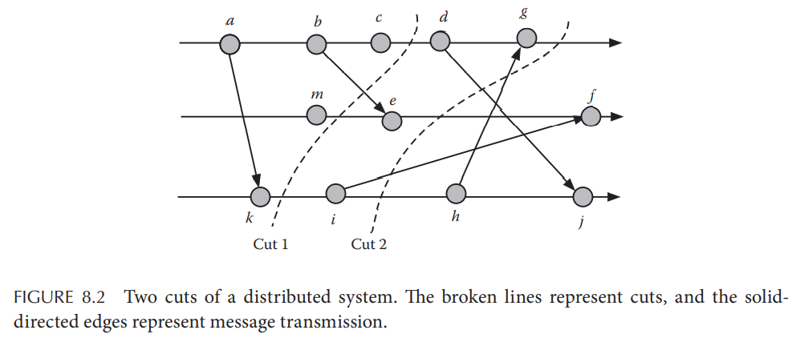
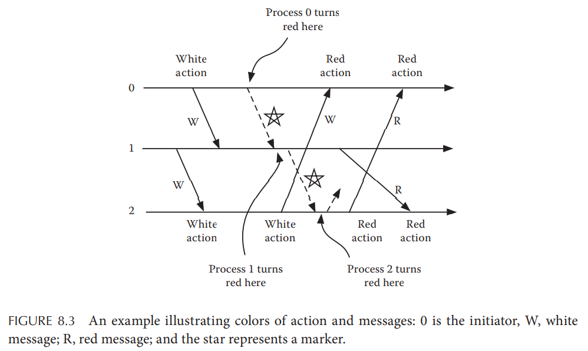
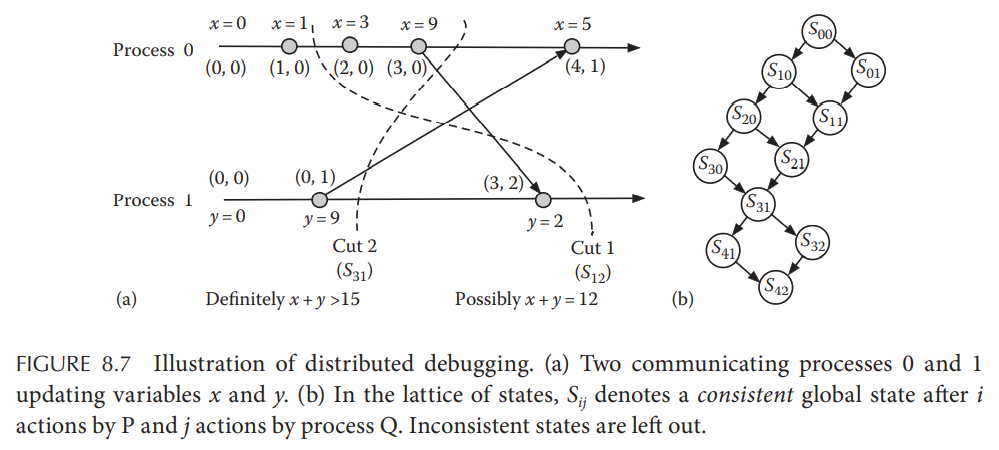

# Chapter 8. Distributed Snapshot

## 8.1 Introduction

由于分布式系统下没有完美同步的时钟，因此**不可能在相同的时刻获得所有节点和信道的快照**，而对系统全局快照的需求却是非常普遍的，例如全局快照可以用在：

- 分布式死锁检测 Deadlock Detection
- 终止检测 Termination Detection
- 系统回滚 System Reset or Rollback

## 8.2 Properties of Consistent Snapshots

### 8.2.1 Cuts and Consistent Cuts

一个**切割cut**是一组事件，包含每个进程的至少一个事件，如下图，而一个**一致性切割consistent cut**指这个切割内的每个事件的**因果前序causally ordered before**事件也一样在该切割内

- **Cut 1** `{a->k, b, c, m}`：属于一致性切割，`e`是`b`引发的事件因此并不需要被包含在切割内
- **Cut 2** `{a->k, b->e, c, d, g, i}`：属于非一致性切割，因为`g`的因果前序`h`并不在切割内

随着系统进展，**一致性切割也跟随着最新的事件更新**，因此可以将一致性切割的计算过程视为一致性切割的最前沿不断更新为新的事件，从而可以定义：

- **快照 Snapshot**：一组所有进程的局部状态集合，包含了每个进程内最新的事件
- **一致性快照 Consistent Snapshot**：由一致性切割约束下，包含了每个进程在切割内的最新事件的所有进程的局部状态集合

通常符合一致性快照定义的快照可以有很多（因为一致性切割可以有很多），而往往更受关注的则是**最新的一致性快照**

## 8.3 Chandy-Lamport Algorithm

假定所有进程的**信道都是FIFO的**，一个进程作为initiator启动分布式快照算法，发送一个特殊的消息称为**标记marker**到其他进程使得收到的进程开始记录本地状态，并且将标记继续发送给下游进程

- **initiator**在一个原子操作中完成
  - 变为红色
  - 记录自身的局部状态
  - 将标记发送给下游进程
- 所有进程在**第一次**接收到标记的时候立即在一个原子操作中完成
  - 变为红色
  - 记录自身的局部状态
  - 将标记发送给下游进程
- 进程`p`和进程`q`之间的**信道`(p,q)`的状态**可以采用以下方式来记录
  - `sent(p)`代表由`p`发出给该信道的所有消息集合
  - `receive(q)`代表由`q`接收到的该信道的所有消息集合
  - `(p,q)`信道的状态就是`sent(p) - receive(q)`，可以通过两进程各自的局部状态进而计算出`(p,q)`
- 整个一致性快照算法的**结束点**为
  - 每个进程都变为红色
  - 每个进程都已经从所有**入流信道incoming channels**收到标记，并已发送给所有**出流信道outgoing channels**

**算法的核心基石为没有一个白色进程会收到红色消息**

## 8.4 Lai-Yang Algorithm

在Chandy-Lamport Algorithm的基础上，Lai-Yang Algorithm放宽约束使得**信道不必是FIFO的**，具体做法为：

- 一个进程一旦已经记录了自身状态后，发出的消息都是红色，initiator首先记录自己的状态并后续发送消息时都标记为红色（**不需要发送标记marker消息**）
- 当一个进程收到红色消息后，**若自身还未记录状态，则首先开始记录状态，变为红色，再接收该消息**，这也是为了满足相同的核心基石，即没有白色进程接收红色消息

这种算法是消极的，由于没有标记的存在，initiator**不能保证最终一定会生成一个一致性快照**，但是算法保证假如最终有快照生成，一定是一致性的，因此Chandy-Lamport算法搭配FIFO信道（例如TCP）被更为广泛的使用在实际系统中（例如Flink）

## 8.5 Distributed Debugging

分布式系统的进程状态演化可以认为是类似下图右侧的**lattice**，箭头代表了可能的状态转化方向，则存在三种类型的状态：

- **可能存在 Possibly**：在不同的转换路径上有可能经过的状态，取决于进程中无因果依赖的消息先后顺序，可能转换出现的状态，也可能不出现，例如下图中的`S21: x=3, y=9`
- **必然存在 Definitely**：由于因果依赖使得系统在转换过程中一定会出现的状态，例如下图中的`S31: x=9, y=9`
- **必不存在 Never**：由于因果依赖使得系统不可能出现的违背因果的状态，例如下图中不可能存在的`S22: x=3, y=2`

可以通过例如**向量时钟vector time stamps的方式来构建State Lattice**，但是显然随着事件和进程数量的增加，状态空间复杂度指数上涨，因此这种方式并**不适合用来分析复杂系统，可扩展性不佳**
