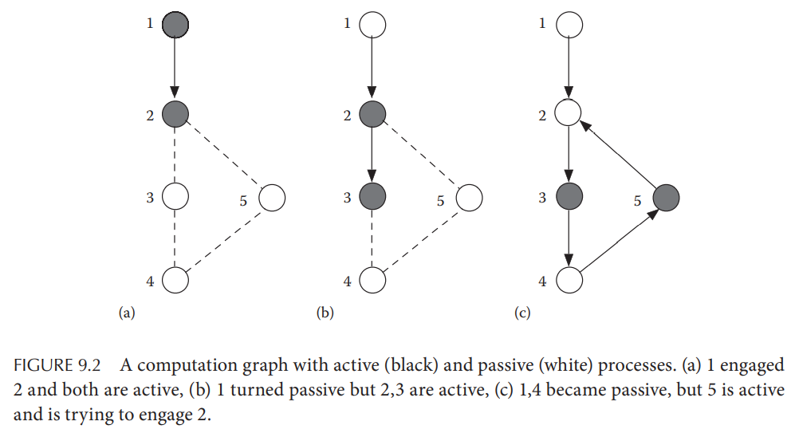

# Chapter 9. Global State Collection

## 9.1 Introduction

第八章中的一致性算法使得获得一致性的全局快照成为可能，但是这些**一致性快照依然以碎片化的局部状态分散在每个进程**，需要一种全局状态收集算法来获得每个进程产生的部分快照

## 9.2 Elementary Algorithm for All-to-All Broadcasting

假定一个网络包含`n`个进程，每个进程都可以广播一个值`si`给其他进程，从而每个进程`i`可以收集到一组数据`Vi = {si[k], 0 <= k < n}`，同时需要注意一些工程要点：

- 每个进程`i`会周期性的广播自己当前的`Vi`给所有其他进程，也会收到其他进程`j`发送的`Vj`来更新自身的`Vi`
- 显然每次都只是更新`V`中的一部分数据，若都是全量传输则浪费了过多资源，因此可以在每次更新`V`时**传输增量数据**

每个进程都有一个`Vi`集合代表当前所有值的集合，一个`Wi`集合代表最后一次广播时的`Vi`值，`(i,j)`代表从进程`i`到进程`j`的信道，当所有进程都没有收到能够引发更新的数据、所有信道都为空时算法结束，每个进程的行为为：

- 起始时`Vi={si}`并且`Wi={}`，每个信道都为空
- 当`Vi != Wi`时就将`Vi - Wi`的数据广播出去，并且更新`Wi`为此时的`Vi`
- 当收到广播的数据时，更新`Vi`

## 9.3 Termination-Detection Algorithm

假定某一个节点作为initiator进程发起一个任务，并且分割成子任务交给相邻节点执行，每个节点原本处于**passive状态**，收到任务就会执行并转入**active状态**，执行任务过程中可能会派生更多子任务交给相邻节点执行，不断迭代后最终算法执行结束，其**termination标志**为：

- 所有进程处于passive状态
- 所有信道都没有任何在途消息
- 整个系统的全局状态满足给定要求（若不满足给定要求则是**deadlock标志**）

显然判定整个算法结束的算法也非常重要，可以用于检测终止、死锁等各种情况

### 9.3.1 Dijkstra-Scholten Algorithm

`TODO`

### 9.3.2 Termination Detection on a Unidirectional Ring

### 9.3.3 Credit-Recovery Algorithm for Termination Detection

## 9.4 Wave Algorithm

## 9.5 Distributed Deadlock Detection

### 9.5.1 Resource Deadlock and Communication Deadlock

假如有一个进程作为中央协调者监控系统内所有资源时，死锁检测是非常简单的，因为中央协调者进程具有整个系统的完整视图，可以通过构建**进程等待图wait for graph**并且运行死锁检测算法来检测出死锁进程，例如数据库中的[事务检测](https://github.com/JasonYuchen/notes/blob/master/cmu15.445/17.Two_Phase_Locking.md#%E6%AD%BB%E9%94%81%E6%A3%80%E6%B5%8B%E5%92%8C%E9%81%BF%E5%85%8D-deadlock-detection--prevention)，并通过终止部分任务来打破死锁

**在一个缺乏中央协调者的分布式系统中，构建一个一致性等待图是非常困难的**

### 9.5.2 Detection of Resource Deadlock
