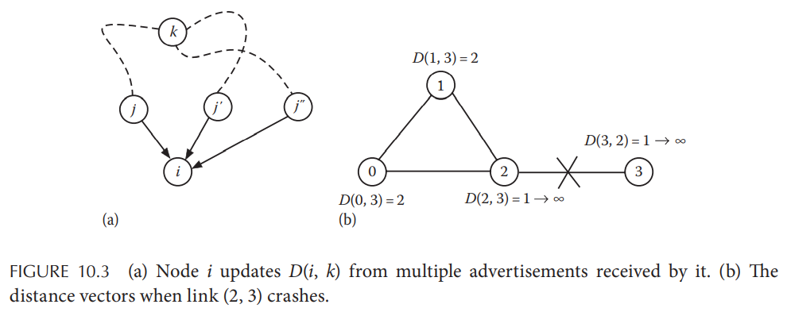
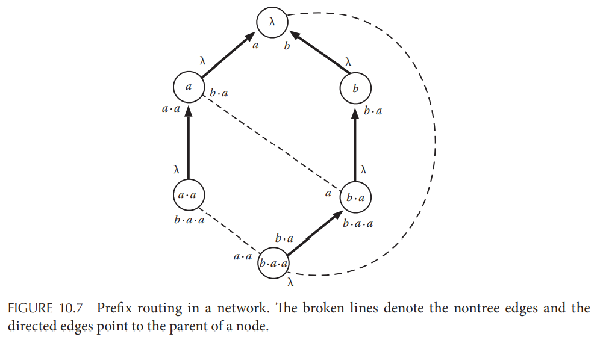
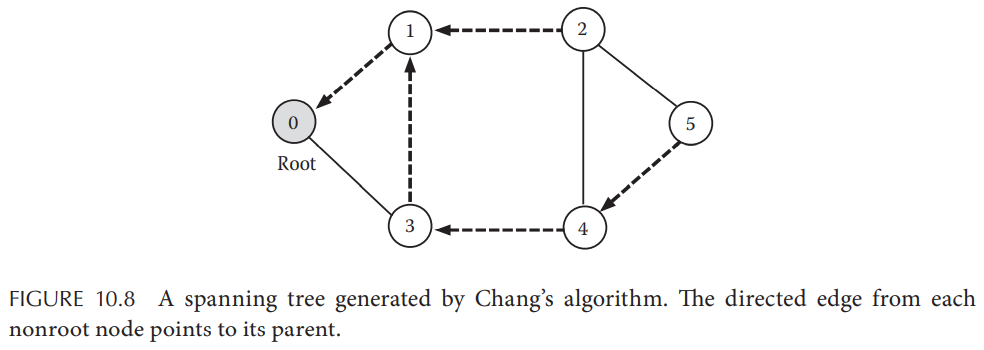
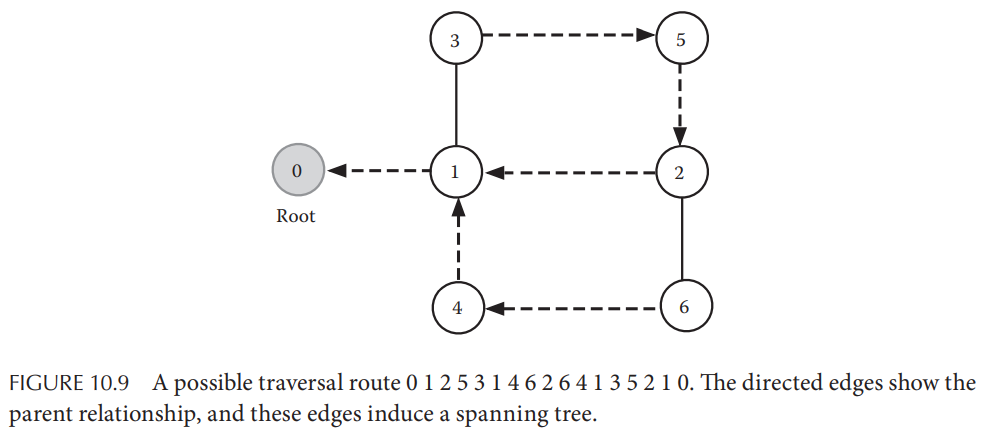
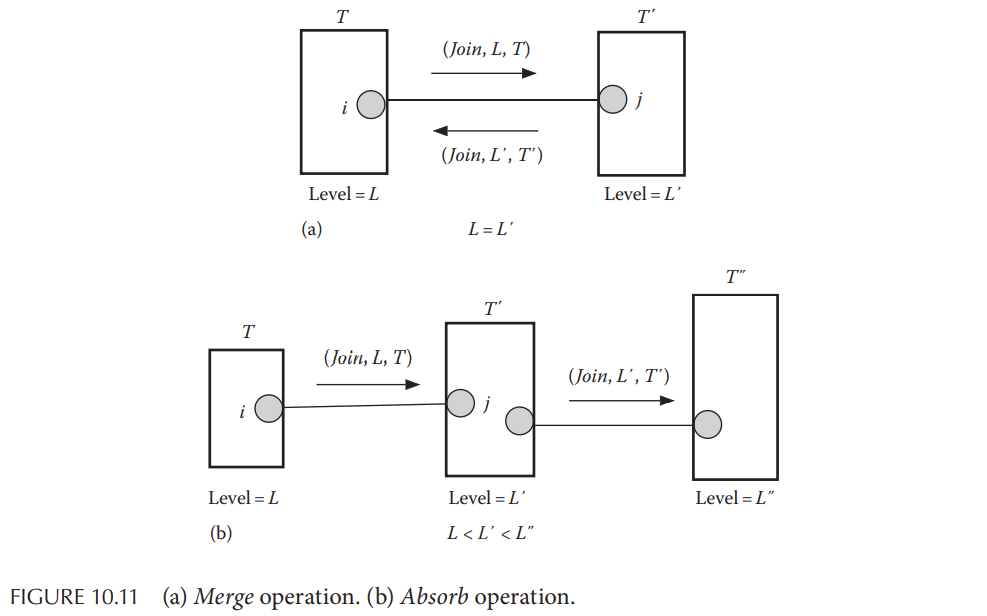
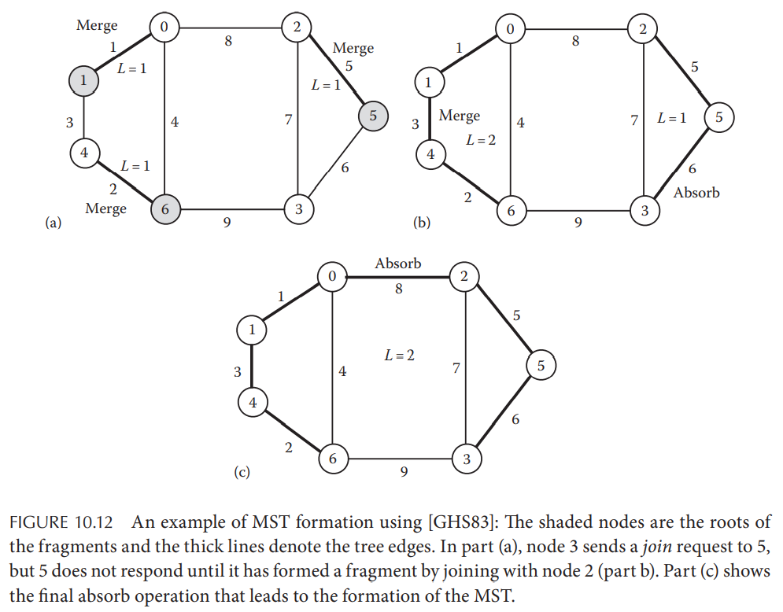

# Chapter 10. Graph Algorithms

## 10.1 Introduction

## 10.2 Routing Algorithms

### 10.2.1 Computation of Shortest Path

假定图`G = (V, E)`，`V = {0, 1, ..., n-1}`，每条边`(i,j)`的权重为`w(i,j)`，节点`i`的邻接点集合为`N(i)`，**Bellman-Ford算法**如下：

- 定义`D(i)`为节点`i`认为的自身到起点`0`最近的距离，`parent(i)`为该最近距离对应路径中`i`的前序节点
- 初始化时，`D(0) = 0`，`parent(0) = null`且其余节点`parent(i) = i`并且`D(i) = inf`
- 算法如下：

  ```cpp
  // for process 0
  send {D(0) + w(0,j), 0} to j

  // for process j > 0, after receiving a message from i
  if (D(i) + w(i,j) < D(j)) {
    D(j) = D(i) + w(i,j);
    parent(j) = i
    for (k in N(j) and k != i) {
      send {D(j) + w(j,k), j} to k
    }
  }
  ```

**Bellman-Ford算法可以处理有向图和无向图，以及带有负权重边（负权重环）的图**

### 10.2.2 Distance-Vector Routing

距离向量路由的思路就是最短路径的算法但是能够**支持网络拓扑结构的变化**，路由表的每一项都是一个元组（目的节点destination、下一跳next hop、距离distance），因此数据包每抵达一个节点，都根据destination选择相应的next hop发出，每个节点都有一份**距离向量`D(i,j)`定义为节点`i`与节点`j`之间的最短距离**

显然每个节点到自身的距离为零，起始时每个节点的距离向量只有自己与邻接点的距离为有效值，与其他节点的距离均为无限（初始时每个节点无法得知自己是否能够抵达非邻接点的目标），每个节点周期性广播自己的距离向量到所有邻接点（类似[gossip协议](https://en.wikipedia.org/wiki/Gossip_protocol)），从而节点在收到距离向量广播时就会更新自身的距离向量`D(i,k) = min(w(i,j) + D(j,k))`，而当某个节点宕机不可达时，相应的权重`D(j,k) = inf`也会被广播出去



向量距离路由的主要问题就是出现波动时系统整体**收敛慢**，且随着系统规模的增加（节点增多），算法的**可扩展性并不好**

### 10.2.3 Link-State Routing

[链路状态路由](https://en.wikipedia.org/wiki/Link-state_routing_protocol)（被应用在Open Shortest Path First, OSPF中）比距离向量路由能够更快收敛，且有更好的可扩展性，其过程分为两个阶段：

1. 每个节点周期性广播link-state packet, LSP给所有其他节点（**reliable flooding**），包含了自身感知到的所有边的权重信息`w(i,j)`，例如某个节点监测到一个路径的变化就会作为initiator进程发起一次广播，广播的内容包含路径权重信息，因此**一次路径变化引起的广播并不会像distance-vector算法一样需要迭代**
2. 节点收集到其他节点的所有LSPs时就可以**独立计算出网络的拓扑结构**以及任意节点对的最短路径

reliable flooding必须保证最终所有节点都收到了LSPs，这里有两个难点在于**控制flooding termination**以及**应对节点宕机重启**：

- 控制reliable flooding的结束可以通过要求每个节点都仅推送LSP一次来解决**exactly-once**
  当**每个节点都收到其他节点的LSPs时**（并且重复LSP会被丢弃）就可以认为第一阶段结束，LSP包含了`id`标记initiator进程、`state`是initiator里所有边的权重信息、`seq`是LSP的序列号，由这个三元组`L(id, state, seq)`进行LSP去重保证exactly-once语义，`seq`的单调递增可以使得更新的LSP覆盖旧数据，每个节点只会推送更新的LSP，一次路径的变化引起的广播消息数量就是边的数量`|E|`
- 由于节点宕机重启后不会记住`seq`，因此对每个LSP还要包含`TTL`值来确保重启后新节点的LSP最终能够被其他节点接收

### 10.2.4 Interval Routing

### 10.2.5 Prefix Routing

每个节点采用一个**标签label**，采用特殊标记lambda代表空标签，首先对网络构造一个**生成树spanning tree**，选择一个节点作为根节点root：

1. 将root标记为lambda
2. 若一个节点有标记`L`，则将其子节点标记为`Lx`，对于多个子节点来说`x`必须唯一，例如有两个子节点则标记为`La`和`Lb`
3. 对每个父节点到子节点的端口标记为子节点的标签，对每个子节点到父节点的端口标记为lambda
4. 若一个边`(u,v)`不属于相应的生成树，则将节点`u`的端口标记为`v`的标签，**注意如果这里`v`是root则与规则3重复**，因此此时的`u`到`v`的端口标记为lambda并且`u`到其父节点的端口标记为其父节点的标签（与规则3不同）



假定一条消息的目的地为标签`X`，且当下收到该消息的节点标签为`Y`，则将消息推送给**标记有`X`最长前缀的端口**：

```cpp
Y = label of the current node
X = label of the destination
if (X == Y) {
  local_delivery()
} else {
  send to the port labeled with the longest prefix of X
}
```

当有新的节点加入生成树时，所有**现有的节点标签都不需要改变**，直接根据该新节点加入对应的父节点进行标签，这种设计的网络拓扑可扩展性非常好，其变种算法应用在P2P中

## 10.3 Graph Traversal

### 10.3.1 Spanning Tree Construction

图遍历的一种方式是首先采用生成树算法构造生成树，随后对树进行遍历，异步构造生成树的Chang算法描述如下：

1. 选择一个root节点，发送作为的探针空消息**probe**到所有邻接点
2. 每个进程若**第一次收到probe，就会转发probe消息**给自己所有邻接点（除了发送probe的节点，该节点也被作为父节点保存），若**不是第一次收到则直接回送echo消息**给发送节点
3. 每个进程都会统计收到的echo数量，当收到的echo数量等于发送出去的探针probe数量时，就会发送echo给父节点，当root节点收到的echo数量等于probe数量时，算法结束

从而在这个过程中，通过根节点和每个节点的父节点关系，可以构造出一个生成树，例如下图是一种生成的结果：



上图过程是**异步**的，其流程可以是，并且每次运行相同的算法可能导致不同的生成树：

|# of step|condition|sender|receiver|type |echo count                   |
|:-       |:-       |:-    |:-      |:-   |:-                           |
|1        |initiator|0     |1, 3    |probe|all:0                        |
|2        |receive 0|1     |2, 3    |probe|all:0                        |
|3        |receive 1|2     |4, 5    |probe|all:0                        |
|4        |receive 1|3     |0, 4    |probe|all:0                        |
|5        |receive 0|3     |0       |echo |0:1                          |
|6        |receive 3|0     |3       |echo |0:1, 3:1                     |
|7        |receive 3|4     |2, 3    |probe|0:1, 3:1                     |
|8        |receive 2|4     |2       |echo |0:1, 3:1, 2:1                |
|9        |receive 4|2     |4       |echo |0:1, 3:1, 2:1, 4:1           |
|10       |receive 4|5     |2       |probe|0:1, 3:1, 2:1, 4:1           |
|11       |receive 5|2     |5       |echo |0:1, 3:1, 2:1, 4:1, 5:1*     |
|12       |receive 2|5     |2       |echo |0:1, 3:1, 2:2*, 4:1, 5:1     |
|13       |receive 2|5     |4       |echo |0:1, 3:1, 2:2, 4:2*, 5:1     |
|14       |receive 5|2     |1       |echo |0:1, 3:1, 2:2, 4:2, 5:1, 1:1 |
|15       |receive 5|4     |3       |echo |0:1, 3:2*, 2:2, 4:2, 5:1, 1:1|
|16       |receive 4|3     |1       |echo |0:1, 3:2, 2:2, 4:2, 5:1, 1:2*|
|17       |receive 3|1     |0       |echo |0:2*, 3:2, 2:2, 4:2, 5:1, 1:2|
|18       |receive 1|0     |N/A     |echo |done                         |

### 10.3.2 Tarry's Graph Traversal Algorithm

由Tarry在1895年提出，已知最古老的遍历算法，定义如下：

1. initiator发送一个token来发现遍历路径
2. 节点在首次收到token时，记录前序节点为自身的父节点，并将token送给**非父节邻接点恰好一次**
3. 若不能满足送给非父邻接点恰好一次，则返回token给父节点



需要注意的是由于**送给非父邻接点恰好一次**并没有严格限定执行顺序，因此这种算法每次运行并不一定与DFS的结果一致，如上图中从3->1后可以继续前往4（因为1->4还未走过，不违背非父邻接点恰好一次）而不是返回3（DFS会返回到3），而当6->2之后由于2已经发送给过5且1是2的父节点，因此只能返回token给6

### 10.3.3 Minimum Spanning Tree Construction

通常对于图来说可以有多种不同的生成树，若对于每条边都有权重，则总权重最低的生成树也叫**最小生成树 Minimum Spamming Tree, MST**，最经典的**串行算法sequential algorithm**为：

1. **Prim算法**（Prim-Dijkstra算法）：与单源最短路径Dijkstra算法类似，每次挑选抵达已构造树的路径最短的节点作为下一个扩展点
2. **Kruskal算法**：：属于贪心算法的一种，构造树的过程就是每次挑选最短权重的边拼接成最终的树，保证了无环

对于分布式系统下的[异步算法（包含详细伪代码过程）](http://www.cs.yale.edu/homes/lans/readings/general/ghs83.pdf)，**假定所有边的权重唯一，此时MST也是唯一的**：

假定两个MST分别包含边的集合和点的集合，表示为`T1 = (V1, E1)`和`T2 = (V2, E2)`，且`V1`和`V2`没有重合的节点，此时选择一条拥有最小权重的边`e`，并且其能够连接`T1`和`T2`，则可以获得一个新的MST包括了`T1 + T2 + e`，起始时所有单个节点都可以认为是一个MST

- 在一个MST中的节点**如何判定一条边拥有最小的权重**并能够连接另一个MST？
  每个MST需要确定一个root节点作为**协调节点coordinator**发起搜索寻找这条边，并且由coordinator来去确定所选择的边
- 在一个MST中的节点**如何判定一条边的对端节点是属于同MST还是另一个MST**？
  每个MST中的节点都必须获取当前MST的名字，不同的MST拥有不同的名字，因此当连接完成生成新的MST时也要对名字做处理

节点通信通过所属MST的边完成，基本流程如下：

1. 起始时每个节点都是一个MST，且也作为该MST的root节点，这种单节点MST为level 0的MST
2. 每个节点寻找权重最低的边来连接其他MST：
   - 如果两个节点相互选择，则发生**合并merge**过程，构造成level 1的MST，拥有更大ID的节点可以作为新的root
   - 如果该节点选择更高level的MST，则会发生**吸收absorb**过程，新MST保持原有的root

在上述过程中，最重要的一点就在于节点**检测对外的最小权重边**，从而可以完成合并或吸收：

1. root节点发出`initiate`消息（该消息也用于启动合并/吸收过程并且更新所有节点对MST名字的信息），所有收到的节点都会继续扩散`initiate`消息同时寻找最低权重边least weight outgoing edge, lwoe，并且将结果以`report`消息沿着MST路径回传给root
2. **每个节点判断一条边是否是连接到外部MST的边**，通过发送`test`消息给对端，对端则根据消息内携带的MST名字来返回`reject`代表属于同一MST或是`accept`代表属于不同MST，判定`reject`比较直接因为同属于一个MST是容易确定的，但是判定`accept`则比较困难，因为对端节点所属MST可能**正在与发送端所属MST的合并/吸收**的过程当中，因此对端实际判定过程是：
   - 如果`name(i) == name(j)`则直接发送`reject`
   - 如果`name(i) != name(j) && level(i) <= level(j)`可以发送`accept`，因为即使此时处于合并/吸收的过程，结束时也一定是`i`节点收到了新的名字，所属MST的名字被修改成`j`所属的MST的名字，**那么`current name(i) != name(j)`依然成立**，并且即使`j`所属的MST正在与其他MST进行合并，此时`name(i) != name(j)`的条件在`j`与其他MST**合并后`name(i) != current name(j)`依然成立**
   - 如果`name(i) != name(j) && level(i) > level(j)`则延迟发送响应，直到条件变为`level(i) <= level(j)`或是`name(i) == name(j)`

当lwoe被发现时，root节点就会发送`changeroot`消息给MST内所有节点，并且lwoe的节点收到该消息时就会沿着lwoe向对端MST发送`join`消息来启动一次合并/吸收过程，其中可能的场景有合并/吸收如下：

- **合并**：节点`i`发送`join, L, T`给对端节点`j`，节点j也回送`join, L', T'`，两个MST完成合并
- **吸收**：节点`i`发送`join, L, T`给对端节点`j`，此时：
  - 若`T'`仍在搜索lwoe的过程中，则其可以接受`T`，返回`join, L', T'`并且驱使其中的节点也一同搜索lwoe
  - 若`T'`已经找到了lwoe，则一定是不是边`(i, j)`，那么`T'`处于等待加入`T''`的过程，一旦加入就会发起吸收`T`



完整的过程示例如下：



1. 图(a)
   - `(2,5)`对于节点2和5来说都是权重最小的，因此2正在与5完成合并，并升级到level 1
   - `(3,5)`对于节点3来说是权重最小的，因此3发起合并5，但是需要等待5
   - `(0,1)`对于节点0和1来说都是权重最小的，因此0正在与1完成合并，并升级到level 1
   - `(4,6)`对于节点4和6来说都是权重最小的，因此4正在与6完成合并，并升级到level 1
2. 图(b)
   - 2和5完成合并后，吸收处于level 0的节点3，构成level 1的MST包含2、3、5
   - 0和1完成合并，4和6完成合并，`(1,4)`对于这两个MST来说权重都是最小的，因此合并构成level 2的MST包含0、1、4、6
3. 图(c)
   - 显然`(0,2)`的权重短于`(3,6)`的权重，所有节点构成单独的level 2的MST

## 10.4 Graph Coloring

节点着色问题是图论中非常普遍的问题，即给定图`G = (V,E)`以及色彩集合，要求任意两个相邻节点不能有相同的色彩，可以达成这个要求的最小色彩集合的大小称为**色数chromatic number**，由于在分布式系统中每个节点只有当前节点的信息，因此给着色问题增加了额外的复杂度

### 10.4.1 (D+1)-Coloring Algorithm

假定一个图中节点的最大度为`D`，色彩集合为`C`，系统处于共享内存模型下且有一个中央调度进程且不保证公平性，则算法可以表示为**每个节点的颜色都会根据所有邻接点的颜色来设置**一个不重复的色彩，`chromatic number = D+ 1`，由中央调度进程来确定所有节点的颜色，显然这种算法可以得出的色数远非最优解

若将图转换为**有向无环图Directed Acyclic Graph, DAG**，并且定义若存在`i -> j`边，则`j`就是`i`的后继节点，上述算法可以优化为每个节点的颜色都会**根据所有后继节点的颜色**来设置一个不重复的色彩

### 10.4.2 6-Coloring of Planar Graphs

**平面图（边不会有交叉）**可以采用最多6种颜色完成着色，基本原来就是将任意平面图转换为一个有向无环图且每个节点的度小于6

给定图`G = (V,E)`且`e = |E|, n = |V|`，由欧拉定理`if n >= 3 then e <= 3n - 6`，推论为对于任意一个平面图，至少有一个节点的度小于等于5，从而将该度小于等于5的节点称为核心节点，转换DAG的算法为：

```cpp
// for node i
if (undirected_edge.size() <= 5) {
  for_each(undirected_edge, mark_as_outgoing);
}
```

示例过程如下图，从核心节点开始转换边，最终所有边都会变为有向边，且图无环：


而实际的**着色算法可以和DAG生成算法并行运行**，不需要等待DAG完全生成才开始，两者的复合算法（复杂度为`O(n^2)`）为：

```cpp
// for node i
if (undirected_edge.size() <= 5) {
  for_each(undirected_edge, mark_as_outgoing);
}
if (outdegree <= 5) {
  set_color_according_to(successors_color);
}
```

由前述D+1算法分析可得，对于这种平面图而言节点的**度不可能超过5，因此不超过6种颜色可以完成着色**

## 10.5 Cole-Vishkin Reduction Algorithm for Tree Coloring

`TODO`

## 10.6 Maximal Independent Set: Luby's Algorithm

`TODO`
