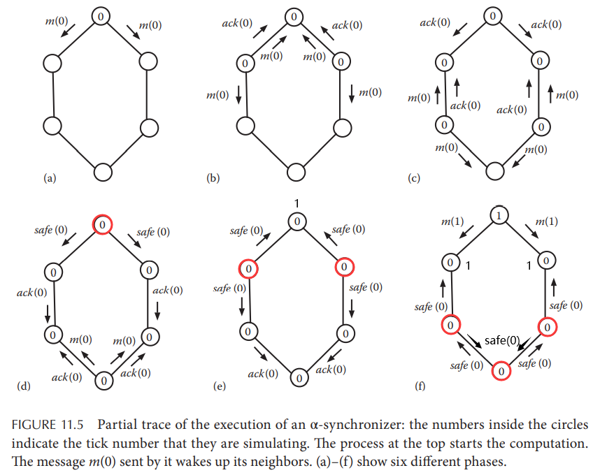
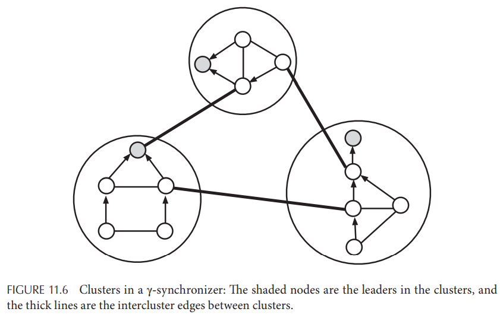

# Chapter 11. Coordination Algorithms

## 11.1 Introduction

## 11.2 Leader Election

**互斥问题mutual exclusion**在形式上与**主节点选举leader election**有一定相似性，例如首个进入临界区critical section的节点可以被认为就是主节点，但是他们本质上不同且有不同的范式：

1. 互斥问题通常不考虑节点宕机，而主节点选举需要考虑主节点宕机后在非故障节点中选举
2. 互斥问题需要解决饥饿，而选举主节点并不要考虑饥饿，节点不需要轮流被选为主节点
3. 与互斥问题中节点离开临界区不同，被选举出来的主节点并不一定需要下台

### 11.2.1 Bully Algorithm

Bully算法假定网络是全相连的，并且信道不会出现故障而只有节点会宕机，当主节点宕机后，**未故障进程中带有最大ID的节点会最终成为新的主节点**，其流程如下：

1. 所有进程都会检测主节点的存活情况（通过心跳与超时机制），当认为主节点宕机时就会发送`election`消息给ID比自身更高的进程
2. 某个发出`election`消息的进程若收到了来自更高ID进程的`reply`消息，则立即放弃成为主节点，并且等待其他节点发送`leader`消息
3. 若在一定时间内，某个节点发出的`election`消息得不到任何响应，则自身选举成为主节点，并广播`leader`消息给所有节点
4. 若在一定时间内，收到`reply`进入等待的节点始终没有收到`leader`消息，则重启选举过程

显然这个算法的正确性是容易验证的，假定某个节点发出`election`消息，且其收到回复，则不会发送`leader`消息，因此不会有节点认为该节点是主节点；假如其未收到回复，则在ID高于该节点的所有进程里都已经认可其作为主节点，随后发出`leader`消息后所有节点都认为其是主节点；若有超时就发起新的选举，因此最终一定是未故障的最大ID节点成为主节点，注意**该算法假定信道可靠**

### 11.2.2 Maxima Finding on a Ring

假定忽略错误和故障检测，则主节点选举就退化成了找到一个带有UID的节点并形成共识，Bully算法假定网络结构是全相连的，其他一些算法则假定一个环状网络结构：

`TODO`

- Chang-Roberts Algorithm
- Fraklin's Algorithm
- Peterson's Algorithm

### 11.2.3 Election in Arbitrary Networks

采用**洪范的方式flooding**可以在任意拓扑结构的网络中进行主节点选举，假定算法按逻辑步骤执行，则需要`D`轮过程来完成选主，`D`就是网络的直径，其流程如下：

1. 初始时每个节点都认为主节点是自身，即`L(i) = i`，并且将该信息发送给所有邻接点
2. 每个节点在每次收到邻接点广播过来的消息时，选择更大的节点作为主节点，即`L(j) = max(L(j), L(i))`，并且将新的最大节点信息推送给所有邻接点
3. 假如按轮次执行，则在`D`轮后算法停止并可以选出拥有最大ID的正常节点作为主节点

若是完全异步网络，则该算法实际上就是利用了**gossip算法**

### 11.2.4 Election in Anonymous Networks

`TODO`

## 11.3 Synchronizers

通常异步系统下的异步算法更难设计和实现，而**同步协议synchronizer允许将异步模型转换成同步模型**，从而允许同步算法在异步系统中运行（以**逻辑时钟logical clock tick**的方式），在一个时钟周期内，进程可以完成一次本地运算以及发送接收邻接点的消息

同步协议的难点在于需要让一个节点在收到所有邻接点第`i`步的消息后，才发出新一轮`i+1`的时钟周期，在异步系统中消息收发可能有任意大的延迟

### 11.3.1 ABD Synchronizer

**Asynchronous Bounded Delay, ABD同步器假定网络的消息延迟RTT有上界**，并且假定节点间的物理时钟不存在漂移（可以通过周期时间同步和限定时钟精度来模拟），因此可以简单通过限定在消息延迟的上界内能够收到所有邻接点的消息，并且在延迟上界的时刻就可以进入`i+1`周期开始下一轮计算

### 11.3.2 Awerbuch's Synchronizers

在物理时钟不可靠、消息延迟无上界的情况下，ABD同步器就不再可用，Awerbuch提出了三类这种情况下可用的同步器，核心在于**一个进程在什么情况下可以安全的开始`i+1`下一轮时间周期**，进程可以**安全**开始下一轮的条件为：

- 收到了当前`i`周期内所有发出消息的ACK
- 进程的所有邻接点都已经发出了当前`i`周期的消息

当一个进程确定满足上述条件时就可以**广播`safe`消息给所有邻接点**，而如果在开始第`i+1`周期收到了邻接点第`i`周期的消息就代表违背了安全性

- $\alpha-synchronizer$
  对每个进程第`i`周期的执行流程入下：
  1. 收发消息，对接收的消息返回`<ack, i>`，对发送的消息要求等待`<ack, i>`
  2. 当接收了所有`i`周期的消息（不包括`safe`消息）并且也已发出所有消息后，发送`<safe, i>`给所有邻接点
  3. 收到了所有邻接点的`<safe, i>`后，自身进入`i+1`周期

  

  注意，在这种流程下，即使某个进程在某个阶段没有任何消息需要发送，也**必须发送空白消息**表明自身没有消息需要发送，并且等待相应的ACK

- $\beta-synchronizer$
  需要在时钟周期开始前进行一次**初始化阶段，构造整个网络拓扑图的生成树**，而相应的初始化节点就是生成树的根节点，随后由根节点发出`next`消息来指示所有子节点的时钟周期`i`进入下一轮`i+1`，对于每个进程而言流程与$\alpha-synchronizer$相似，只是消息只通过生成树的边进行传递

  当一个进程处于安全状态时，就会**向生成树的父节点发送`<safe, i>`代表自身作为根节点的子树已经全部安全**，因此当根节点收到所有子树的`<safe, i>`就会发送`next`消息指示所有节点进入下一轮`i+1`

- $\gamma-synchronizer$
  从流程上容易看出$\alpha-synchronizer$拥有相对好的时间复杂度，而$\beta-synchronizer$拥有相对好的空间复杂度，因此$\gamma-synchronizer$希望能同时达到较好的时空复杂度，在$\gamma-synchronizer$的初始化过程中，会将整个网络分割成数个**进程集群clusters of processes，每个进程集群内部采用$\beta-synchronizer$，而跨进程集群间采用$\alpha-synchronizer$**

  每个集群内生成树的根节点就作为集群内的**主节点leader**，而跨集群通信会采用一条特定的边作为**跨集群边intercluster edge**，当集群主节点确认集群安全后，就会广播`cluster.safe`给所有相邻集群

  
