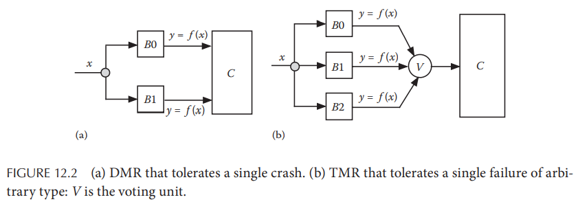

# Chapter 12. Fault-Tolerant Systems

## 12.1 Introduction

## 12.2 Classification of Faults

- **Crash Failure**：由于分布式系统下对进程的执行速度没有任何假设，因此一个**crash故障是难以与slow节点相区分**的，通常通过心跳和超时来检测一个节点是否存活，大部分算法的容错都设计成针对crash错误，因此大部分错误被转换成crash错误从而能够更适应容错算法，这种模型也叫做**fail-stop model**：
  - 当错误发生时，进程停止工作
  - 进程的所有易失性数据volatile data均立即丢失
- **Omission Failure**：信道传输丢失，即一个节点确认已经发送的数据永久从信道中丢失，本应接收数据的节点无法收到该数据
- **Transient Failure**：临时故障，信道传输丢失也属于临时故障，通常会一时影响全局状态，这种故障难以通过测试发现，也难以重现
- **Byzantine Failure**：最弱的故障模型，**允许任意可能的故障和错误，包括恶意节点、不可靠信道等等**
- **Software Failure**：例如代码逻辑错误、配置错误、设计缺陷、内存泄漏等等，前述的各种错误可以由软件故障导致，例如代码逻辑错误导致栈溢出随后崩溃
- **Temporal Failure**：对于实时系统来说，如果某次任务耗时超过了给定值，则可以认为出现了时间错误，并且可能继续导致其他更严重的错误
- **Security Failure**：病毒、木马等导致故障

## 12.3 Specification of Faults

## 12.4 Fault-Tolerant Systems

### 12.4.1 Masking Tolerance

当一个错误`f`发生时对应用没有任何影响，就称**该错误`f`被掩盖了**，通常在极端关键的领域对masking tolerance有要求，例如航空航天、医疗等等

### 12.4.2 Nonmasking Tolerance

当一个错误`f`发生时对应用会有暂时性的影响，并且**最终系统能够恢复到正常状态**，例如数据传输时出现了丢包，但是系统通过重传使得数据包最终正确抵达节点，而暂时性的影响就是数据传输延迟短暂升高

- **backward error recovery**
  系统会周期性的生成快照，并记录在可靠存储中，一旦错误发生，系统就整体回滚到最近的快照从而消除错误的影响
- **forward error recovery**
  系统并不会回滚，而是在错误发生时依然继续执行，并最终稳定到正常状态，此类系统也可以称为具有**自稳定性self-stabilizing**，即可以从任意初始状态下恢复到正常状态

### 12.4.3 Fail-safe Tolerance

有一些错误并不会对系统造成有害的影响即**无害错误**，fail-safe放宽了错误的约束，**仅避免有害错误**，例如交通灯中全是绿灯是一种有害错误，可能导致交通事故，而全是红灯则是一种无害错误，仅仅阻塞了通行但不会导致事故

fail-safe系统对**活性liveness**没有任何保证，但是通常一些错误的最佳处理方式就是暂停执行并保证系统停留在安全状态下

### 12.4.4 Graceful Degradation

一些系统既无法掩盖错误，也不能从错误中完全恢复，而是会**限制一部分正常行为**，继续在有限功能中运行，也是可以接受的（这种接收因场景而异），称为**优雅降级graceful degradation**

## 12.5 Tolerating Crash Failures

最简单也是最经典的容错方式就是将**功能复制到多个模块上运行**，从而双冗余模块 Double Modular Redundancy, DMR可以容忍单个crash，而三冗余模块 Triple Modular Redundancy, TMR则可以容忍任意单个failure（注意区分crash和failure）

## 12.6 Tolerating Omission Failures

可靠的信道应该满足以下三个条件：

- **不丢 No loss**
- **去重 No duplication**
- **有序 No reordering**

### 12.6.1 Stenning's Protocol

接收进程`R`在收到每一条消息`m[i]`都会相应的发送ACK，并且基于超时进行重传，仅当双方确认了第`i`条消息已经可靠抵达后才进行`i+1`的传递来确保有序，因此这个协议也称为**stop-and-wait协议**

### 12.6.2 Sliding Window Protocol

参考[TCP的实现](https://github.com/JasonYuchen/notes/tree/master/tcpip1)

### 12.6.3 Alternating Bit Protocol

在FIFO信道上的Sliding Window Protocol的变种（`w = 1`）
