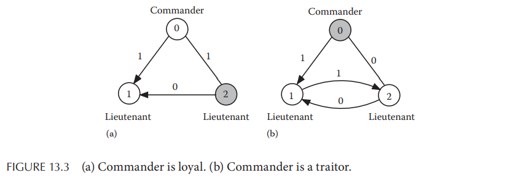
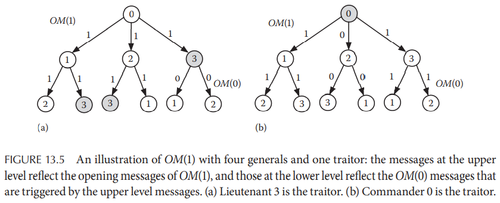
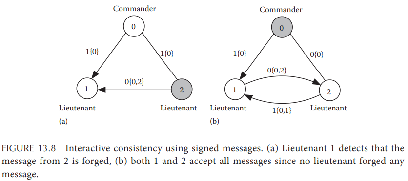
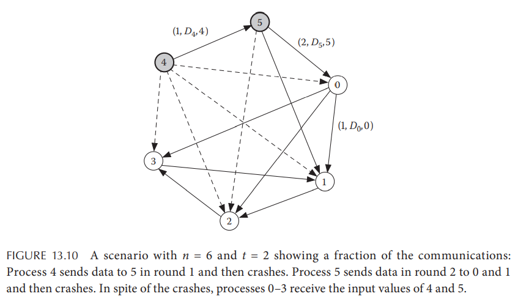

# Chapter 13. Distributed Consensus

## 13.1 Introduction

## 13.2 Consensus in Asynchronous Systems

共识问题的解决要求满足以下三个条件：

- **Termination**：非故障进程最终要决定值
- **Agreement**：所有非故障进程最终决定的值是相同的
- **Validity**：若所有非故障进程以值`v`为起始值，则最终所有故障进程的决定值都是`v`

**而在完全异步的系统中，共识问题被证明是无解的**（无法满足上述三个条件）

> In **asynchronous** distributed systems, it is impossible to design a consensus protocol that will tolerate the crash failure of a single process. (FLP impossibility)

## 13.3 Consensus in Synchronous Systems: Byzantine Generals Problem

在完全异步的系统下只要存在最简单的crash错误就不可能解决共识问题，Lamport在**同步系统**，（**即计算速度有下界，信道传输延迟有上界，通过超时来检测的系统**）下解决了拜占庭将军问题

### 13.3.1 Solution with No Traitor

没有恶意节点的同步系统下达成共识是简单的，每个节点广播自己的决定，每个节点在收集了所有节点的决定后采用相同的方式从决定集合中计算出最终的决定

### 13.3.2 Solution with Traitors: Interactive Consistency Criteria

**交互一致性interactive consistency**要求如下：

- 每个忠诚的从节点都从主节点收到相同的命令
- 如果一个主节点是忠诚的，则所有忠诚的从节点都能收到其发送的命令

### 13.3.3 Consensus with Oral Messages

拜占庭将军问题的解法依赖于消息通信模型，**oral message model**满足以下三个条件：

- 传输中**消息不被损坏**（可以通过校验和等方式）
- 消息可以丢失，并且**丢失可以被检测到**（同步模型下可以通过ACK和超时来检测）
- 消息被收到时（或被检测到丢失时），接收者可以**知道消息的发送者**

定义有`m`个非忠诚节点、满足interactive consistency并且基于oral message model的拜占庭问题解法为`OM(m)`

`OM(0)`即不存在非忠诚节点的算法就是每个主节点**直接发送消息**给所有从节点，而当存在非忠诚节点时仅仅直接发送消息是不够的，还需要**从节点的相互通信来检测一致性**，需要注意这些从节点中也可能存在非忠诚节点

1. Impossibility Result
   在上述规则之下，当仅仅有**少于等于3个节点且存在1个非忠诚节点时，拜占庭将军问题无解**，例如2个节点中1个忠诚节点和1个非忠诚节点，则忠诚节点不需要与任何节点达成共识

   对于3个节点而存在1个非忠诚节点时，效果如下图，显然在这两种情况下即使存在从节点的通信，忠诚节点1依然无法区分0和2的情况：

   

   进一步可以推广得到（证明见原文），**对于不超过3m个节点并存在m个非忠诚节点的情况，采用oral message model的拜占庭问题无解**

2. `OM(m)`算法
   基于上述推论，**存在m个非忠诚节点的集群需要至少有3m+1个节点**
   - `OM(0)`算法
     1. 主节点`i`将值`v = 0 or 1`广播给所有从节点`j`
     2. 每个从节点`j`都接受从`i`收到的值`v`
   - `OM(m)`算法
     1. 主节点`i`将值`v = 0 or 1`广播给所有从节点`j`
     2. 若`m > 0`，则每个从节点`j`收到值后，继续自身作为主节点广播给所有其余从节点，即执行`OM(m-1)`算法
     3. 在所有节点都广播过之后，任意从节点`j`应收到了`n-1`个值，其中`n-2`个其他从节点发送的间接消息，`1`个原始主节点`i`的直接消息
     4. 任意从节点`j`都选择这`n-1`条消息中的**绝大多数值majority**作为主节点`i`发出的命令

     整个过程中需要传递`(n-1)(n-2)...(n-m+1)`条消息，即复杂度为`O(n^m)`

     

### 13.3.4 Consensus Using Signed Messages

在oral message model的基础上，signed message model额外满足两个条件：

- 忠诚节点的消息有签名，签名无法被伪造，即**伪造的命令可以被检测到**
- 所有节点都可以验证签名的合法性

在signed message model下，共识算法可以被简化，因为假如某个从节点伪造了主节点发送的命令，其余**从节点可以立即检测出伪造以及该节点是非忠诚节点**，而若主节点是非忠诚节点，则所有从节点在交互完信息后就可以发现主节点发送了不同的命令从而判定主节点是非忠诚的

与oral message model下的`OM(m)`算法要求`n >= 3m + 1`不同，**采用signed message model的`SM(m)`算法要求`n >= m + 2`从而有更好的可靠性**，其流程如下：

1. 主节点`i`发送一个签名后的值`v{i}`给所有从节点`j`
2. 从节点收到消息`v{S}`后首先校验是否伪造，若非伪造且第一次接收到，则加入集合`V j`
3. 若`S`的长度短于`m + 1`则从节点`j`追加自身的签名到`S`并且将集合`V j`发送给其余签名未出现在`S`的从节点
4. 当从节点`j`不再收到新消息时，其根据一个预先确定的算法从集合`V j`中计算出最后选择的命令

整个过程中需要传递`(n-1)(n-2)...(n-m+1)`条消息，即复杂度为`O(n^m)`，与`OM(m)`算法相同，但`SM(m)`算法的优点在于容忍更多的非忠诚节点

## 13.4 PAXOS Algorithm

**PAXOS算法解决了非拜占庭情况下，完全异步系统中仅满足agreement和validity的共识问题**，具体[见此](https://github.com/JasonYuchen/notes/blob/master/papers/2001_Paxos_Made_Simple.md)

**工业界更为广泛使用可理解性更好的Raft算法，通常被认为是PAXOS算法的一个变种**，具体[见此](https://github.com/JasonYuchen/notes/tree/master/raft)

## 13.5 Failure Detectors

**故障检测器failure detector**是一个检测分布式系统下节点是否故障的服务，并生成一个潜在故障的节点列表，其难点在于分布式系统下每个独立的故障检测器本身可能都对故障节点无法达成共识，故障检测器的基本属性为：

- **完整性 Completeness**：每个故障的节点都能被检测到
  - **强完整性 Strong Completeness**：每个故障节点最终会被所有正常节点检测到
  - **弱完整性 Weak Completeness**：每个故障节点最终会被至少一个正常节点检测到，可以通过弱完整性来实现强完整性
- **准确性 Accuracy**：正常的节点不应该被检测为故障
  - **强准确性 Strong Accuracy**：所有正常节点都不会被怀疑是故障节点（可以采用“最终”进一步弱化）
  - **弱准确性 Weak Accuracy**：至少有一个正常节点不会被怀疑是故障节点（可以采用“最终”进一步弱化）

基于以上属性，故障检测器可以被分为以下四类：

|Type                  |Completeness |Accurate         |
|:-:                   |:-:          |:-:              |
|Perfect P             |Strong       |Strong           |
|Strong S              |Strong       |Weak             |
|Eventually perfect ◊P |Strong       |Eventually strong|
|Eventually strong ◊S  |Strong       |Eventually weak  |

### 13.5.1 Solving Consensus Using Failure Detectors

**在同步系统下可以通过超时机制来可靠的构建出完美的故障检测器Perfect P**，而给定Perfect P则可以在同步和异步分布式系统下解决共识问题（但在异步系统下无法实现Perfect P）

- **Consensus Using P**
  Perfect P允许每个正常节点都能从所有其他正常节点接收输入值，并且通过**多轮异步的多播multicast**来实现最终所有正常节点拿到所有数据（一个节点发出的数据只要**抵达至少一个正常节点，最终就可以抵达所有节点**，如下图）

  

  通过P实现共识的算法有两个阶段（假定有**t个节点故障**）：
  1. 首先阶段一中所有节点进行异步（**限定t+1轮**）的数据交换，t+1轮确保在阶段一结束时所有正常节点都持有完全相同的数据，具体来说就是每个节点收到其他节点的数据发现自身没有某个节点的数据时，都会存储该数据并继续广播给其他节点
  2. 通过确定性的算法在相同的数据上选择值并达成共识
- **Consensus Using S**
  采用Strong S实现共识的算法与采用Perfect P类似，但是分为三个阶段如下（假定有**t个节点故障**）：
  1. 与Perfect P的第一阶段类似，但是S的弱准确性允许一些正常的节点被怀疑为故障节点，因此在第一阶段（**限定n轮而非t+1轮**）结束时每个正常节点的数据并不一定完全相等，**允许未收到一部分正常节点的数据**
  2. 通过额外的步骤来确保所有正常的节点持有的数据在此阶段内完全一致，具体来说就是通过额外一轮数据交换，若节点p收到节点q的相应发现节点q没有收到节点k的数据，则**节点p也会将自身存储节点k的位置置空**（注意与Perfect P的算法中存储数据相区分，该**阶段2是清除自身持有但其他节点不持有的数据，从而对于部分节点持有的数据进行清空，保证留下的数据所有正常节点都有**）由于S保证至少有一个正常节点的数据能够被所有节点收到，因此最终阶段3内的数据至少有该正常节点的数据，可以达成共识
  3. 与Perfect P的第二阶段相同，在相同的数据上选择值并达成共识

**通常在同步系统下通过超时机制就可以实现一个故障检测器**
