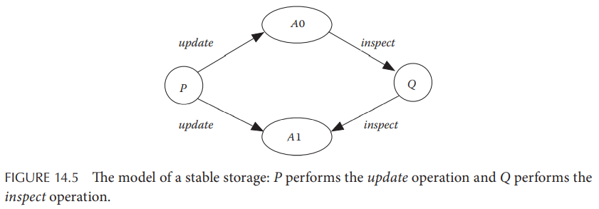
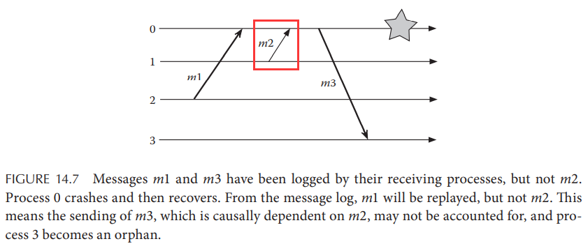

# Chapter 14. Distributed Transactions

## 14.1 Introduction

事务可以参考[CMU15.445相关的课程内容](https://github.com/JasonYuchen/notes/blob/master/cmu15.445/16.Concurrency_Control.md)，或是[DDIA的事务章节](https://github.com/JasonYuchen/notes/blob/master/ddia/07.Transactions.md)

- **原子性 Atomicity**：Either all operations are completed or none of them is executed.
- **一致性 Consistency**：Regardless of what happens, the database must remain consistent.
- **隔离性 Isolation**：If multiple transactions run concurrently, then it must appear as if they were 
executed in some arbitrary sequential order.
- **持久性 Durability**：Once a transaction commits, its effect will be permanent.

## 14.2 Classification of Transactions

- **扁平事务 Flat Transactions**：事务包含了一组操作和相关的对象，并且这些操作本身都不是一个子事务
- **嵌套事务 Nested Transactions**：事务包含了子事务，子事务之间可以独立提交或终止
- **分布式事务 Distributed Transactions**：横跨多个服务器的事务

## 14.3 Implementing Transactions

- 方法一：采用**影子分页shadow paging**（事务私有工作空间private workspace），事务的修改仅在私有空间中生效，提交时再写回主数据
- 方法二：采用**日志logging**记录所有操作，当需要回滚时就依据日志记录内容进行回滚

## 14.4 Concurrency Control and Serializability

### 14.4.1 Testing for Serializability

[依赖图 Dependency Graphs](https://github.com/JasonYuchen/notes/blob/master/cmu15.445/16.Concurrency_Control.md#%E4%BE%9D%E8%B5%96%E5%9B%BE-dependency-graphs)

### 14.4.2 Two-Phase Locking

[两阶段锁 Two-Phase Locking](https://github.com/JasonYuchen/notes/blob/master/cmu15.445/17.Two_Phase_Locking.md#lecture-17-two-phasing-locking)

### 14.4.3 Concurrency Control via Time Stamp Ordering

[时间戳定序 Time Stamp Ordering](https://github.com/JasonYuchen/notes/blob/master/cmu15.445/18.Timestamp_Ordering.md#lecture-18-timestamp-ordering-concurrency-control)

## 14.5 Atomic Commit Protocols

分布式事务可能涉及多个节点，每个节点完成事务的一部分操作，而所有节点**对于事务整体提交或终止应达成共识**，并且无论是否出现宕机等错误，**结论都不可逆转 irrevocable decision**，原子提交协议就解决了这种共识问题的变种：

- **Termination**：所有非故障节点都必须最终达成不可逆转的决定
- **Agreement**：若某个节点决定提交，则所有节点一定已经决定提交
- **Validity**：若所有节点决定提交且没有故障发生，则所有节点必须提交

### 14.5.1 One-Phase Commit

事务协调者coordinator将事务分配给相应的事务参与者participants并要求各自在完成时直接提交，由于仅仅只有一阶段，因此若participants出现错误无法提交时，coordinator和其他participants对此一无所知，一部分节点提交一部分节点无法提交**违背了事务的原子性**

### 14.5.2 Two-Phase Commit

[两阶段提交 Two-Phase Commit](https://github.com/JasonYuchen/notes/blob/master/cmu15.445/23.Distributed_OLTP.md#%E4%B8%A4%E9%98%B6%E6%AE%B5%E6%8F%90%E4%BA%A4-two-phase-commit-2pc)

### 14.5.3 Three-Phase Commit

在2PC的基础上额外引入了**预提交阶段pre-commit phase**，但多了一次网络RTT时间，实际环境中使用极少

## 14.6 Recovery from Failures

### 14.6.1 Stable Storage

即使是磁盘也会因为故障宕机导致数据丢失，因此可靠的稳定存储通常通过一组磁盘来实现（**RAID**）

**磁盘镜像disk mirroring**（也称为**RAID1**）维护一对磁盘，在写入数据时顺序写入两个磁盘上的两个副本，并采用校验和+时间戳来标记写入，读取时也会检查校验和和时间戳来选择完整可靠的副本

### 14.6.2 Checkpointing and Rollback Recovery

分布式系统下的快照机制分为两种，除了有协调机制的[分布式一致性快照](08.Distributed_Snapshot.md)能够捕获全局的逻辑一致性状态，每个节点的**独立快照uncoordinated checkpointing**更为简单，但是跨界点的快照并不能代表满足一致性的跨节点逻辑状态，从而当**采用独立快照时就需要更为智能的回滚算法**，确保所有节点都能回滚到一致的状态

### 14.6.3 Message Logging

- **Pessimistic Protocol**：节点在发出一条消息之前会先等待写入可靠存储
- **Optimistic Protocol**：节点在消息写入可靠存储之前就已经发出，提高性能但也提高了风险，一旦出现错误时就需要额外判定全局状态来将系统回滚到一致点并处理**孤儿节点orphans**（收到的消息来自于还未持久化就宕机的节点，导致系统**不同节点恢复后所处的状态不一致**）

对于任意一条给定消息，定义`depend(m)`为发送消息`m`或者由于消息`m`而发出`m'`（即`m -> m'`）的一组进程，**则重建/恢复这组进程中的任意进程依赖于重放replay消息`m`的能力**，而持久化记录消息`m`就是一种重放的能力；定义`copy(m)`为发送或接收消息`m`但没有持久化记录`m`的一组进程

上图中`depend(m2) = {0, 1, 3}`，`copy(m2) = {0, 1}`，从而由于宕机的进程为`{0}`位于`copy`中，因此消息`m2`无法在宕机进程上重放，从而导致所有`depend(m2) \ copy(m2)`中的进程即`{3}`均成为孤儿进程
