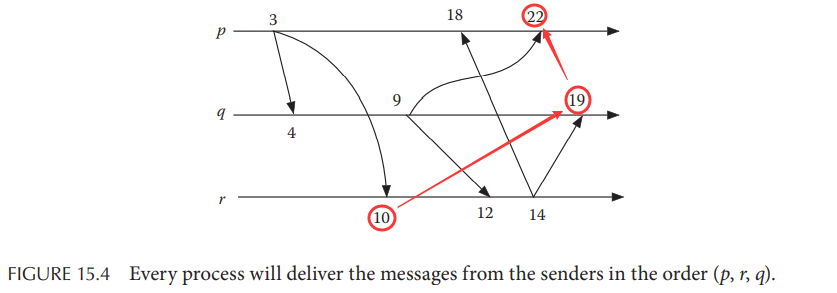
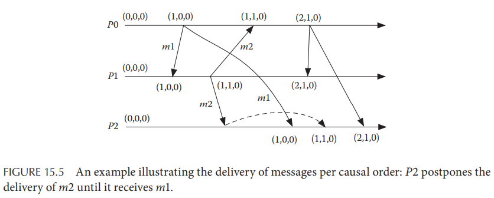
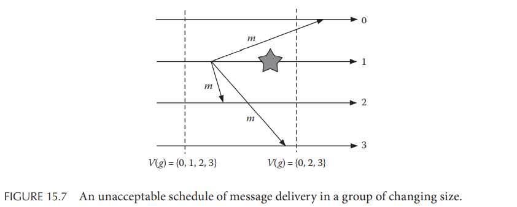

# Chapter 15. Group Communication

## 15.1 Introduction

## 15.2 Atomic Multicast

组内广播也称为原子多播，所有非故障节点都能收到该多播消息或是所有非故障节点都未收到该消息，原子多播可以分为**基本basic**和**可靠reliable**两种，基本原子多播不考虑故障的情况，因此无故障的情况下任意一个简单多播都是原子的；而**可靠原子多播**就必须满足：

- **Validity**：若一个正常进程多播了消息`m`，则最终`m`会被传递出去
- **Agreement**：若一个正常进程传递了消息`m`，则最终所有正常进程都会传递`m`
- **Integrity**：每个正常进程传递至多一次`m`

## 15.3 IP Multicast

`TODO`

## 15.4 Application Layer Multicast

- **Peer-to-Peer, P2P模式**：每个节点维护了组相关的信息和路由信息
- **Overlay Multicast模式**：需要有策略的部署一组代理节点来支持主节点，需要广播的内容首先通过overlay网络分发到所有代理节点上，即**内容分发网络Content Distribution Network, CDN**

## 15.5 Ordered Multicast

有序多播是在原子多播（仅关注每一条消息本身）的基础上，**对多个消息的顺序有要求的多播**，构建能够容错场景下的**有序可靠原子多播**是非常困难的（可以参考[DDIA一致性与共识](https://github.com/JasonYuchen/notes/blob/master/ddia/09.Consistency_and_Consensus.md#chapter-9-consistency-and-consensus)），本章节主要关注**有序基本原子多播**（即假设不存在故障和出错）

通常顺序可以分成以下三种：

- **本地有序多播 Local order multicast**：也称为单源先进先出 single-source FIFO，若一个节点多播了两个消息且顺序为`m1, m2`，则所有组内的进程也都能够按照`m1, m2`的顺序收到这两个消息
- **因果序多播 Causal order multicast**：假定一个组内的**两条消息`m1`和`m2`的多播存在因果关系**，即`sent(m1) -> sent(m2)`，即发送`m2`是因果依赖于发送`m1`的，那么组内所有节点也都应该以`m1, m2`的顺序处理这两个消息，注意这两个消息并**不一定要在同一个节点发出，但接收者一定以`m1, m2`的顺序处理**
- **全序多播 Total order multicast**：要求组内所有节点都以完全相同的顺序处理收到的所有消息，即所有节点发出的多播消息的顺序在组内达成共识（**原子全序广播、线性一致性、共识是等价的**，解决其中之一就可以解决其余）

对于本地有序多播来说，若考虑消息丢失错误，则可以需要采用Stenning算法或sliding window算法（采用TCP即可）

### 15.5.1 Implementing Total Order Multicast

- 采用**Sequencer**实现：组内一个特别成员`S`作为序列号进程Sequencer对每个收到的以及自己需要发送的消息都分配一个单调递增的序列号`seq`，所有组内其他成员当需要发送消息时首先将消息发送给`S`，由`S`分配序列号后再多播给组内所有成员，**从而`S`作为single source of truth对全局消息的顺序进行确定**，参考Raft/ZAB等算法的**主节点leader**
- **分布式实现**：类似两阶段提交算法，假定信道都是FIFO的，其流程如下
  1. 阶段一：若发送者希望广播消息`m`，则将带有时间戳的消息`(m, ts)`发送给组内在所有节点，当接收节点收到消息后就返回确认给发送者同样带有时间戳`(a, ts')`
  2. 阶段二：当发送者收到了所有成员的确认消息时，选择确认消息内的最大时间戳`ts'' = max(ts')`，并将之作为提交消息发送给所有组内节点，从而**每个消息实际上都根据所有节点中最大时间戳进行定序**，而每个节点的**时钟不需要同步，只需要保证单调递增不回拨就可以实现全局有序**，由于引入了额外的确认和提交消息，因此延迟和消息总量会更多

  

### 15.5.2 Implementing Causal Order Multicast

实现因果序多播需要采用[向量时间戳](https://github.com/JasonYuchen/notes/blob/master/dsaaa/06.Time.md#63-vector-clocks)，基本原理与向量时间戳定序一致



## 15.6 Reliable Multicast

可靠多播要求只有正常节点会收到所有正常节点的消息，而故障节点（包括发起多播尚未完成时出现错误的节点）发出的消息或者被所有正常节点收到，或者没有任何节点收到（即原子性），通常**部分节点收到消息的情况可以通过这些节点继续广播转发消息从而所有节点收到**，参考[共识协议]()中的做法

```cpp
// sender
for (auto node : nodes) {
  send(node, message);
}

// receiver
while (true) {
  receive(node, message);
  if (!duplicate(message)) {
    accept(message);
    multicast(nodes, message);
  }
}
```

### 15.6.1 Scalable Reliable Multicast

实际工程中使用的多播系统往往会处理**节点宕机、数据丢失和网络分区**三种常见的错误，通常就是采用TCP中的**快速重传、滑动窗口和选择确认**等机制实现FIFO信道、宕机节点超时检测，有效减少冗余的数据量并提升整个多播系统的吞吐量

### 15.6.2 Reliable Ordered Multicast

**纯异步网络下存在节点宕机故障的系统无法实现全序原子多播**（在完全异步的系统中，共识问题被证明是无解的），显然在同步网络下就可以实现

## 15.7 Open Groups

开放小组意味着组内成员可以随时离开小组，组外节点也可以随时加入小组，因此**每个节点对于当前小组的组成有不同的视图**也会导致新的问题，成员进入/离开（也包括节点宕机、网络分区、网络分区恢复等事件）事件需要被多播给所有节点，且这一系列事件必须在所有节点上有相同的顺序，即**有序原子多播**

**同步视图通信view-synchronous group communication**，也称为virtual synchrony，要求所有节点对组成员都有一个**一致性全序视图**，并且一条在当前视图`V`下发出的消息即使随后成员出现变更变为视图`G`后，也应该被`V`中的所有成员节点接收，即对每一条消息而言，**所有进程在传递每一条消息时都应该有对该消息而言相同的视图**

在有节点宕机故障的可能性下，同步视图通信同样有三个核心点：

- **Agreement**：若成员`k`在视图`Vi(g)`下传递了消息`m`，随后再传递了新试图`Vi+1(g)`，则所有非故障节点且同时属于`Vi(g)`和`Vi+1(g)`都应该传递消息`m`后再传递`Vi+1(g)`
- **Integrity**：若成员`j`传递了视图`Vi(g)`，则相应的`Vi(g)`一定也包括了成员`j`
- **Validity**：若成员`k`在视图`Vi(g)`下传递了消息`m`，且另一个同属于`Vi(g)`的成员`j`没有传递该消息`m`，则成员`k`传递的下一个视图`Vi+1(g)`一定不包含`j`

例如假定节点1在发出消息`m`后宕机并且被感知到从而触发了一次视图变化，下图情况是违背了同步视图的：



- 可能性一（不违背）：节点`{0, 2, 3}`均传递了消息`m`并作为视图`V{0, 1, 2, 3}`时期的数据，随后再传递了新视图`V{0, 2, 3}`
- 可能性二（不违背）：节点`{0, 2, 3}`均不传递消息`m`，而是直接传递了新视图`V{0, 2, 3}`
- 可能性三（违背）：节点`{2, 3}`传递了消息`m`再传递新视图`V{0, 2, 3}`，而节点`{0}`先传递新视图再传递消息`m`
