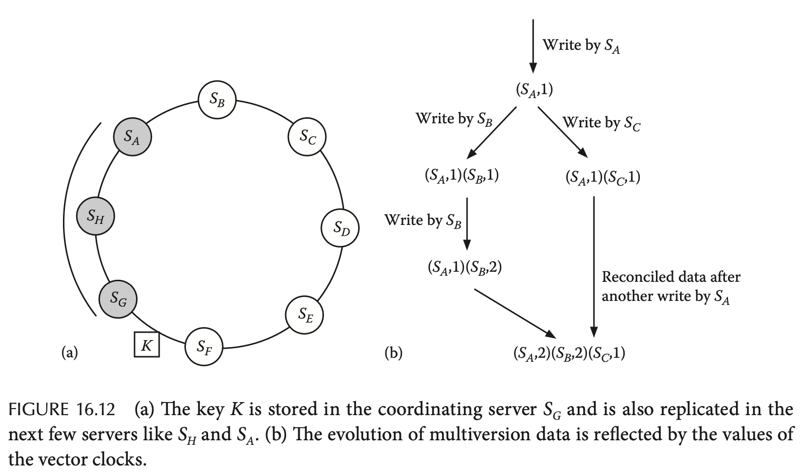

# Chapter 16. Replicated Data Management

## 16.1 Introduction

> **Reliability** and **availability** address two orthogonal issues. A server that is reliable but rarely available serves no purpose. Similarly, a server that is available but frequently mal- functions or supplies incorrect or stale data causes headache for all.

## 16.2 Architecture of Replicated Data Management

### 16.2.1 Passive versus Active Replication

- **Passive**
  **主从备份 primary-backup replication**，所有请求都由primary进行处理，当有修改时，primary通过atomic broadcast的方式通知所有backups进行相应的修改随后才返回响应给客户端，当primary不可用（例如心跳消息超时）时从backups选择一个副本作为新的primary，在主从备份的模式下，`m + 1`个副本足以容忍`m`个副本不可用

  

- **Active**
  **主动复制 active replication**，每个客户端都与所有服务器通信，而服务器之间并没有主从关系而是对等的P2P关系，当客户端更新自己所连接的服务器数据时，相应的节点通过**全序广播 total order broadcast**的方式扩散给所有节点，从而每个服务器上的数据最终一致

  

### 16.2.2 Fault-Tolerant State Machines

客户端-服务端 C/S结构在分布式系统中广泛使用，一个服务节点可以被看作一个**确定状态机 deterministic state machine**，接收客户端发送的指令，根据指令执行状态迁移并将相应的输出结果返回给客户端

当采用一组确定状态机，并且从相同的初始状态开始执行，接收客户端相同的指令并以完全相同的顺序进行状态迁移和结果输出，此时任意一部分状态机故障都不会影响其他状态机器的运行，客户端可以采纳任意一个正常运行的状态机产生的结果，则**容错问题就转变为了对客户端指令顺序的共识问题**，即达成共识的第`i`条命令在所有非故障状态机上可以获得相同的结果

实现容错状态机 fault-tolerant state machine的要求就是（也即[全序可靠原子多播total order reliable atomic multicast]()的要求）：

- **Agreement**：每个正常的副本都能够收到所有请求
- **Order**：每个正常的副本都能以相同的顺序收到请求

在前序章节中已经证明了**纯异步系统中全序可靠原子多播的不可能性**，因此通常在现实中基于同步模型进行构建，对于最多`m`个故障副本来说，采用`m+1`个副本就足以实现容错，而采用`2m+1`个副本就足以实现拜占庭问题下的容错，这样的容错程度则**要求每个副本在故障前必须处于完全相同的状态**，换句话说就是每一次修改必须确保写入了所有副本

## 16.3 Data-Centric Consistency Models

Jepsen关于[一致性的讨论]()

### 16.3.1 Strict Consistency

**严格一致性 Strict Consistency**要求假如在某个实时时刻`t`某进程写入了数据`x := 5`，则对于随后的实时时刻`t' > t`任意进程都应该能够读到`x = 5`，对于单进程系统并且只有一个数据拷贝的系统天然满足严格一致性，而由于对实时性的要求，**存在延迟的实际分布式系统中不可能实现严格一致性**

### 16.3.2 Linearizability

**线性一致性 Linearizability**通过对严格一致性的实时性要求上放宽得到，将一个变量所有读写请求串行化成一个全序序列，若所有**外部观测者都能及时**观测到该一致的操作顺序和相应的结果，即任意进程每个读取都能返回前序最近的任意进程成功写入数据，则满足线性一致性（也称为**强一致性、外部一致性**）

### 16.3.3 Sequential Consistency

**顺序一致性 Sequential Consistency**通过对线性一致性的外部观测者要求上放宽得到，一个变量的读写请求依然串行化成一个序列，每个外部观测者都能观测到一致的操作顺序和相应的结果但**不一定及时**，不保证跨进程的外部一致性，即有可能A进程已经观测到`x = 5 -> x = 10`的修改，而B进程还只观测到`x = 5`，绝大多数现实系统都采用了顺序一致性（上图16.6b是满足顺序一致性的）

### 16.3.4 Causal Consistency

**因果一致性 Causal Consistency**主要对存在因果关系的操作提出了要求，即**每个进程都必须以相同的顺序看到所有存在因果依赖关系的写入数据**，而对于没有因果依赖的写入，则对任意进程都可以有任意顺序

如图中对`x`的两次写入没有因果依赖关系，因此在进程C和D上看到了相反的顺序但依然不违背因果一致性（可以通过在B上加入`if x = 10 then x := 20`这种方式来加入因果依赖，从而将C这种顺序可能性排除）

### 16.3.5 FIFO Consistency

**先进先出一致性 FIFO Consistency**则是进一步放宽了因果一致性，仅要求**单个进程中的修改在其他进程中的顺序是一致的**，而对于跨多个进程的写入可以以任意顺序出现在其他进程中，如下图只需要保证所有进程中的`x = 10`都在`x = 30`前出现即可（即A中写入的顺序），而对于`x = 20`则没有任何要求

## 16.4 Client-Centric Consistency Protocols

### 16.4.1 Eventual Consistency

在大型分布式系统下最终一致性往往是广泛使用的，其保证在没有新更新的情况下，**最终所有副本都能保持一致**，但对保持一致的时间没有任何约束

### 16.4.2 Consistency Models for Mobile Clients

当副本节点是**全球分布的 geographically distributed**情况下，一个移动的客户端通常更希望访问离**当前位置最接近的副本节点**（从而可以获得更低的访问延迟和更高的带宽），针对不同的场景通常会考虑实现以下不同的一致性：

- **Read-after-read Consistency**
  也称为**单调读 monotonic read**，即客户端多次读取返回的数据一定总是至少和上一次读取一样新（即使随着位置变化访问到不同的副本节点）
- **Write-after-write Consistency**
  也称为**单调写 monotonic write**，即客户端多次写入的数据一定不会被丢失，即写入`A`到副本节点`S`后再写入`B`到副本节点`S'`，则`B`在`S'`上写入前首先`A`一定在`S'`上先生效，不会出现覆盖更新的写入，可以理解为在**任意节点上的对单个原子变量的写入最终构成了全局顺序**，并且所有节点都按照这个全局顺序应用更新，对于多个变量的写入则不需要构成全局顺序
- **Read-after-write Consistency**
  也称为**读己之写 read your writes**，即客户端在写入后立即读取（写入和读取未必在同一副本节点）必须能够至少读取到自己先前的写入
- **Write-after-read Consistency**
  即客户端在读取后再执行写入，则写入数据可以至少覆盖自己先前读取的值，通常会与read-after-write一起实现

## 16.5 Implementation of Data-Centric Consistency Models

通常不同级别的一致性都是通过不同约束的多播multicast来实现：

- **线性一致性 Linearizability**
  通常可以使用全序多播 total order multicast实现，当一个进程读取/写入变量时，首先将**读写请求全序多播**到所有节点，副本节点收到请求后进行更新并返回结果，随后该读写进程再响应客户端，从而所有副本都对所有读写请求的顺序达成共识
- **顺序一致性 Sequential Consistency**
  每个**读取请求可以立即返回**当前副本节点的数据，而写入请求则需要采用全序多播确保每个副本节点的数据都以相同的顺序更新数据，从而读取的顺序也一定跟随这个顺序，但是显然同一时刻不同节点可以读取到不同的值，即**不保证新鲜度 freshness**
- **因果一致性 Causal Consistency**
  每个**读取请求可以立即返回**当前副本节点的数据，而写入请求则需要采用向量时间戳 vector timestamps对存在因果依赖的数据构建因果关系，每个写入请求需要附带有当前的向量时钟并采用因果有序多播协议causal order multicast protocol
- **最终一致性 Eventual Consistency**
  每个读取请求可以立即返回当前副本节点的数据，而写入请求通过多播即可，例如洪泛 flooding、生成树 spanning tree、谣言 gossip等协议，读取和写入的顺序没有任何保证
- **单调读/写 Read-after-read/Write-after-write**
  通常可以通过维护**读集合 read set**或**写集合 write set**（分别对于实现单调读或单调写），在读/写请求时必须广播相应的集合到所有副本节点，当一个节点收到客户端的请求和读/写集合时，首先**根据集合内的数据来判定自身数据是否已经至少和读/写集合要求的一样新**，若不够新则可以通过转发请求或是等待数据更新的方式来保证单调读/写一致性

## 16.6 Quorum-Based Protocols

- 系统容忍的故障节点数满足`f <= (N / 2) - 1`
- 通过采用**读写锁的方式来控制quorum系统的并发读写**，读锁允许并发读，例如两个读者可以并发分别从`{S0, S1, S2, S4}`和`{S1, S3, S5, S6}`中读取
- 并发**写操作必须被全局串行化**处理（全序广播），每个写入操作都必须有一个版本号，并且写入和读取的quorum必须存在重叠
- 出现**网络分区 network partition**时，拥有majority节点的子分区依然可以正常提供服务

常见的quorum系统通常有以下几种模型：

- **majority**：`W + R > N`且`W > N / 2`，即读写各自需要得到majority节点的支持就可以
- **read-one-write-all**：`W = N, R = 1`，即写入必须在所有节点上完成，从而任意一个节点读取都是最新值，对读取友好
- **write-one-read-all**：`W = 1, R = N`，即写入一个副本即完成，而读取必须获取所有节点数据来选择最新值，对写入友好

Quorum系统也存在一些[需要在具体实现中强化的场景](https://github.com/JasonYuchen/notes/blob/master/ddia/05.Replication.md#2-quorum%E7%9A%84%E9%99%90%E5%88%B6-limitation-of-quorum-consistency)

## 16.7 Replica Placement

- **镜像站点 Mirror sites**
- **服务端副本 Server-generated replicas**
- **客户端缓存 Client caches**

## 16.8 Brewer's CAP Theorem

- **一致性 Consistency**：类似ACID中的原子性atomicity，即更新某个数据到分布式系统中，并能够从系统中读取到自己的更新，由于分布式系统下涉及到了多个副本，因此不同的一致性保证对读取的更新有不同的要求，**通常CAP的C指强一致性保证**，也即[线性一致性linearizability](#1632-linearizability)
- **可用性 Availability**：可用性指当客户向任意一个未宕机节点发出请求，都可以得到相应的响应
- **分区容错性 Partition tolerance**：即要求当分布式系统出现网络分区，被分割成无法通信的子集时，也可以理解为部分节点之间的所有消息都被丢弃，系统整体应依然正常可用

**CAP猜想指出三者只能取其二而不能同时达成**，而在现实系统中网络分区故障总是会发生而不是可选择的一项，因此**实际分布式系统往往在CP和AP中选择**（可以认为非分布式的单机系统满足CA），并且完全丢弃一致性或完全放弃可用性的分布式系统通常并没有实用价值，因此即使选择了CP也会对A提供基本的保障，例如选择基本可用性，选择了AP也会对C提供基本的保障，例如选择一些特定的弱一致性，**与ACID对应存在BASE，即Basically Availability, Soft state, Eventual consistency**

## 16.9 Case Studies

### 16.9.1 Coda

`TODO`

### 16.9.2 Bayou

`TODO`

### 16.9.3 Amazon Dynamo

Dynamo采用**分布式散列表 distributed hash tables, DHTs**来保存所有键值对，即**一致性散列 consistent hashing**，每个节点都负责散列环上一小个区间的数据，从而在节点加入/退出时仅需要迁移最近的前后两个相邻节点的数据

写入数据时会根据散列表选择一个节点作为协调者coordinator进行写入，而协调者就会将数据复制到后序的数个节点上，从而实现宕机容错

- **向量时钟 Vector clocks**
  采用[向量时钟](https://github.com/JasonYuchen/notes/blob/master/dsaaa/06.Time.md#63-vector-clocks)来追踪数据的多版本和修改历史并解决冲突问题，如上图b，**实际环境中发现并发写入的情况非常罕见**，24小时的profiling中有高达99.94%的请求只看到了一个版本
- **读写操作 Implementing write and read**
  对于写入操作，协调者首先对新版本生成向量时钟，并将数据发送给`T`个可达节点，若至少`W`个节点响应写入则认为写入成功
  
  对于读取操作，协调者首先发送请求给`T`个可达节点要求获取请求数据的所有现存版本，若至少`R`个节点响应读取则认为读取成功，获得了所有版本的协调者此时需要进行**reconciliation**，并将最终版本的数据返回给客户端由客户端来解决冲突情况

  Dynamo采用了较为松弛的quorum系统**sloppy quorum**，即读写的`T/R/W`是散列环上的**后续非宕机节点集合**而并不是固定的节点集合，**因此`R/W`有可能并不重叠，这种方式显著加快了写请求的处理 always writable**
  
  例如Dynamo采用`T = 3, R = W = 2`，此时有4个节点`{S1, S2, S3, S4}`，客户A写入`X`，由于`{S1, S2}`宕机，因此写入了后续的`{S3, S4}`，随后客户B写入`Y`，此时`{S1, S2}`恢复因此直接写入，注意读写quorum没有重叠，数据存在冲突，最终客户C读取`{S1, S3}`，发现了两个数据`X`和`Y`，**由客户/应用程序来执行冲突解决conflicts resolution，决定最终保留的数据**
- **故障转移 Hinted hand off**
  为了保证写入的性能，当一个节点`S`无法写入时就会直接写入数据到另一个节点`S'`中，并且带有标记表明应该写入的实际节点为`S`，从而当`S'`恢复时就由`S'`负责将数据推送到`S`上

另外可以[参考此slides](https://www.cs.cornell.edu/courses/cs6410/2017fa/slides/22-p2p-storage.pdf)
