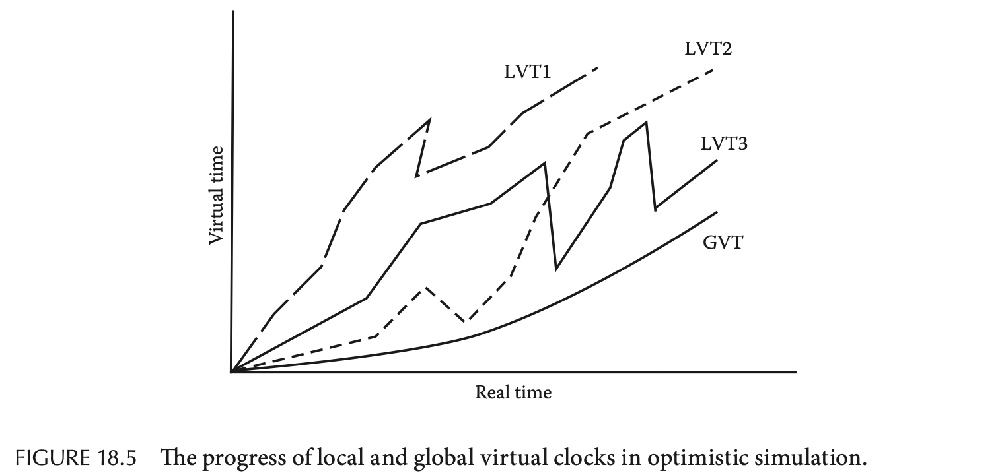

# Chapter 18. Distributed Discrete-Event Simulation

## 18.1 Introduction

对于事件驱动的模拟系统有以下三个要求：

- 若物理系统在时刻`t`产生了消息`m`，则模拟系统必须调度一个事件`(t, m)`
- 若模拟系统调度了一个事件`(t, m)`，则物理系统也必须在时刻`t`产生消息`m`
- 若事件`E1 < E2`是物理系统中的两个事件，则模拟系统也必须保证先于`E2`调度`E1`，即保证因果一致性

## 18.2 Distributed Simulation

### 18.2.1 Challenges

真实世界中的"处理器"可以认为是**物理进程 physical processes, PP**，而相应的模拟系统中的处理器为**逻辑进程 logical processes, LP**，则显然每个LP可以模拟一个或多个PP（相应的每个LP运行一部分事件`(t, m)`），极端条件下由一个LP模拟所有PP的模拟器也可以称为**中央模拟/顺序模拟sequential simulation**

正确的模拟需要满足以下标准：

- **现实性 Realizability**：每个LP在时刻`t`的输出是LP当前状态和时刻`t`以前收到的消息的函数，显然PP不能猜测未来会收到什么消息，LP模拟也需要遵循这一点
- **可预测性 Predictability**：对每个LP存在一个时间值`L`，该LP在`t+ L`时间内的所有输出可以通过当前状态和`t`以前收到的消息来预测，例如接待员在`12:00`接待了客户且每个客户需要`5`小时，则可以预测`17:00`之前接待员不会有任何输出

并且一个正确的分布式模拟也拥有以下两个属性：

- **安全性 Safety**：对应无死锁 absence of deadlock，至少一个LP能够持续运行直到模拟结束
- **进度 Progress**：对应活性 liveness，所有虚拟时钟virtual clock必须最终一致前进直到模拟结束

对于不同的模拟可以分为两大类，即**保守模拟conservative**和**乐观模拟optimistic**，前者通过运行时的策略直接避免违背因果一致性，而后者允许出现因果不一致并通过额外的检查和回滚措施来修复，参考乐观并发和悲观并发

## 18.3 Conservative Simulation

每个LP在调度时，只有确信收到了`T`及之前所有事件时才会调度`(T, m)`，从而确保了不会违背因果一致性，属于一种保守模拟策略，但是这种假设无法满足活性，假如一个节点会接受来自上游节点`A`和上游节点`B`的消息，而`A`持续发送消息并且`B`从未发送消息，那么**该节点就无法递增自己的虚拟时钟，无法得知`B`确实idle还是消息尚未抵达，造成该节点始终无法前进**

解决这种问题的策略之一是允许这种死锁发生，并采用[死锁检测和解决算法](09.Global_State_Collection.md)，另一个种策略是**采用`(t, null)`空消息null message**来促使虚拟时钟增加但不改变状态

空消息的方式允许所有链路和LP都能够正确递增本地虚拟时钟，从而保证了活性，**保守模拟依赖可预测性predictability来提升性能**，若一个LP发出的事件`(t, m)`可以保证在接下来的`(t, t+L)`时间窗口内都不会有新的事件，则所有下游节点就可以安全的直接模拟`t+L`时刻之前的所有进展（类似Google Spanner里采用的[TrueTime API](https://github.com/JasonYuchen/notes/blob/master/mit6.824/13.Spanner.md#真实时间-truetime)）

而保守模拟的缺点就在于**无法充分发现物理系统中可能存在的并发性parallelism**，从而导致性能不佳，即使在执行时通过并发执行无关的任务来提升性能，也无法完全挖掘并发性，因为**有一些事件的因果依赖是在运行时才能决定的**

## 18.4 Optimistic Simulation and Time Warp

**乐观模拟容忍暂时的因果不一致性**从而更加挖掘事件之间的并行性，并且随后通过检测因果不一致和补偿来修正错误

通常在收到一条时间戳少于节点虚拟时钟的消息时，就可以认为出现了因果不一致性，从而需要针对该事件后的所有事件做出回滚rollback，（可以参考流数据[事件时间的处理](https://github.com/JasonYuchen/notes/blob/master/streamingsystems/02.What_Where_When_How.md#when-earlyon-timelate-triggers-ftw)）并且这个回滚也会导致后续节点会滚，出现**级联会滚**，因此只有在错误率非常低的时候采用乐观模拟才能获得更高的并发性能，需要注意每个节点此时还需要额外记录一段事件以备回滚时使用

**由于最终节点与外部交互的操作是难以会滚的**（除非外部系统也支持类似2PC等事务协议，见[Flink实现E2E exactly-once的原理](https://github.com/JasonYuchen/notes/blob/master/streamingsystems/05.Exactly_Once.md#2-apache-flink)），因此系统需要维持向外界的输出结果为未提交uncommitted状态，直到确信不会发生会滚，即提交committed状态，此时才可以真正发起向外部系统的结果输出，而如何判断是否不会发生回滚则需要依赖**全局虚拟时钟 global virtual time, GVT**

全局虚拟时钟GVT（概念非常类似于**流处理中的[水印watermark](https://github.com/JasonYuchen/notes/blob/master/streamingsystems/03.Watermarks.md#chapter-3-watermarks)概念**）在任意真实时间内都等同于**所有LPs持有节点虚拟时钟值、系统中所有在传递消息的时间戳中的最小值**，因此存储的额外事件记录若带有比GVT更小的时间戳，则可以安全的进行垃圾回收，最终节点感知到的GVT比缓存的事件时间戳大时，就可以提交这些事件并向外输出

这一章节的分布式离散事件处理，非常贴近流数据处理，更深入的解析可以见[Streaming Systems](https://github.com/JasonYuchen/notes/blob/master/streamingsystems)

