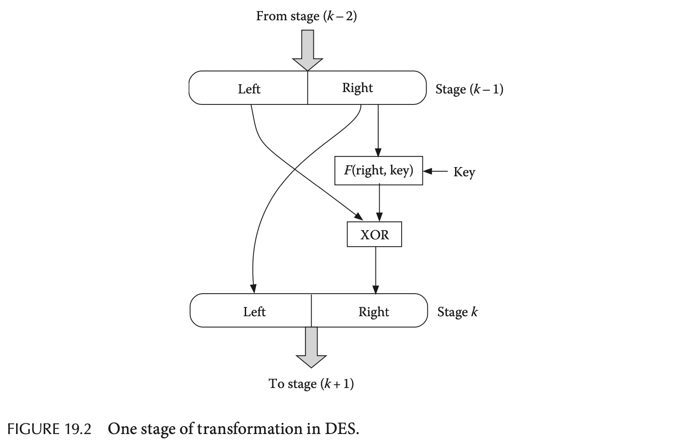

# Chapter 19. Security in Distributed Systems

## 19.1 Introduction

安全领域的六大要求：

- **保密 Confidentiality**：非授权无法访问
- **完整 Integrity**：保证数据完整一致，所有修改都应该是合法的方式
- **验证 Authentication**：在操作前必须验证合法性
- **授权 Authorization**：每个实体只能执行被授权的操作
- **不可抵赖 Nonrepudiation**：操作不可抵赖，操作实体可追溯
- **可用 Availability**：合法用户必须能够在需要时接触数据

## 19.2 Security Mechanisms

- **加密 Encryption**
- **签名 Signature**
- **散列 Hashing**

## 19.3 Common Security Attacks

- 窃听 Eavesdropping
- 拒绝服务 Denial of Service
- 数据篡改 Data Tampering
- 伪装 Masquerading
- 中间人 Man in the Middle
- 恶意软件 Malicious Software
- 病毒 Virus
- 蠕虫 Worms
- 间谍软件 Spyware

## 19.4 Encryption

- **明文 Plaintext**
- **密文 Ciphertext**
- **密钥 Key**

## 19.5 Secret Key Cryptosystems

属于对称加密，包含一个加密函数`E`和解密函数`D`，以及一个发送方和接收方共享的密钥secret key `k`，加解密函数本身不需要保密，只需要通信前双方对密钥达成共识即可开始加密通信

- **Confusion and Diffusion**
  `TODO`
- DES

  

- 3DES
- AES
- One-Time Pad
- Stream Ciphers
- Steganography

## 19.6 Public Key Cryptosystems

属于非对称加密，每一方都有一个公布的**公钥public key** `e`以及一个私有的**私钥private key** `d`，同样加密函数`E`和解密函数`D`不需要加密，其核心的特点为：

- 明文密文的转换关系为 `P = D_d(E_e(P))`
- 加解密函数容易计算
- 实际中无法从公钥`d`中计算出私钥`e`，从而公布公钥不会成为安全隐患

### 19.6.1 Rivest-Shamir-Adleman, RSA Cryptosystem

RSA加密首选选择合适的两个大质数`s`和`t`，并获取其乘积`N = s * t`，随后将明文分割成固定大小的数据块（512或1024位）并且其对应的数值满足小于`N`（注意`N`是公开的），随后根据以下步骤来选择公钥和私钥并完成加解密：

1. 选择公钥`d`从而满足`d`和`(s-1)*(t-1)`互质（公因数只有1）
2. 选择私钥`e`从而满足`(e*d) mod (s-1)*(t-1) = 1`
3. 加密过程`C = P^e mod N`，其中`C`和`P`都是每一个数据块
4. 解密过程`P = C^d mod N`

例如选择`N = 143 = 11 * 13`，随后选择与`10*12 = 120`互质的公钥`d = 7`，则随后可以选择的最小`e = 103`满足`(103 * 7) mod 120 = 1`，从而密钥对就是`(103, 7)`

证明`TODO`

### 19.6.2 ElGamal Cryptosystem

## 19.7 Digital Signatures

- 采用Secret-Key Cryptosystems加密
- 采用Public-Key Cryptosystems加密

## 19.8 Hashing Algorithm

也称为加密散列函数cryptographic hash function，例如MD5，SHA-1，SHA-2，SHA-256等，必须满足：

- 容易从给定的数据计算出散列值，即`m = H(M)`，但不可能反向通过`m`唯一确定`M`
- `M != M' -> H(M) != H(M')`，对原数据的任意修改都会改变产生的散列值

## 19.9 Elliptic Curve Cryptography

## 19.10 Authentication Server

- Secret-Key Cryptosystems验证服务
- Public-Key Cryptosystems验证服务

## 19.11 Digital Certificates

- public key infrastructure, PKI

## 19.12 Case Studies

`TODO`
