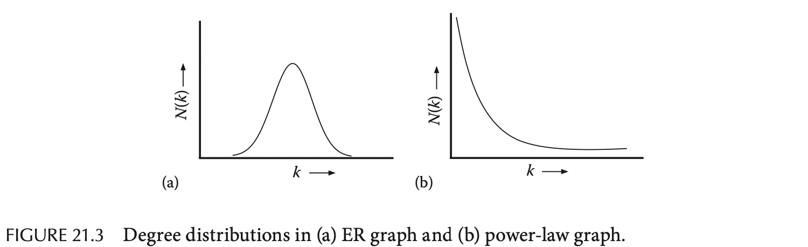
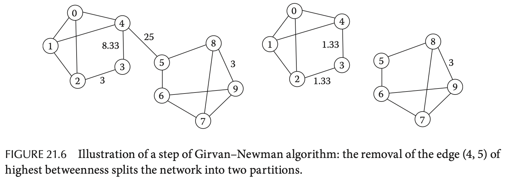
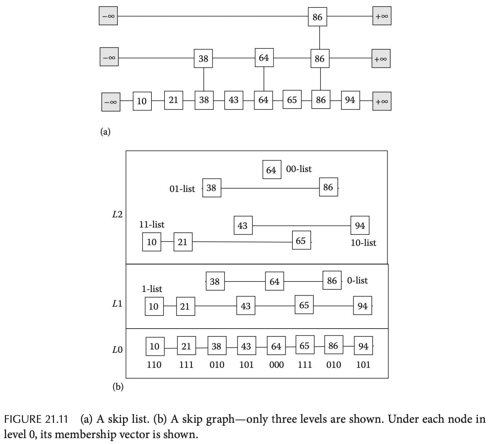
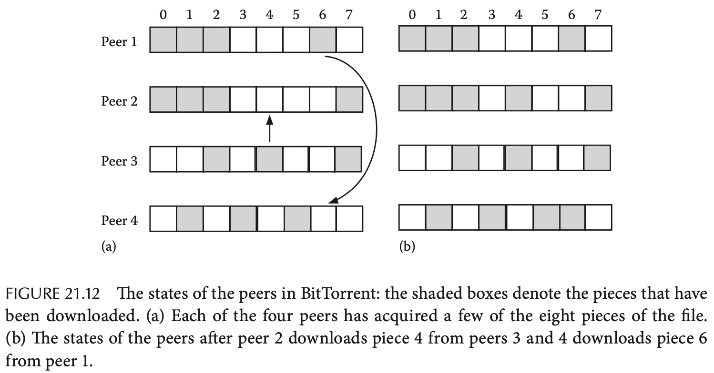

# Chapter 21. Social and Peer-to-Peer Networks

## 21.1 Introduction to Social Networks

## 21.2 Metrics of Social Networks

- **聚集系数 Clustering Coefficient**：对某个节点的邻接点之间也相互连接的比例，取值范围为0-1，显然对于树结构而言每个节点的系数总是0，而对于全相连的clique而言每个节点的系数总是1
- **直径 Diameter**：两个节点的最短距离称为geodesic distance，而对所有节点对中，最大的距离就称为网络的直径diameter

## 21.3 Modeling Social Networks

### 21.3.1 Erdos-Renyi, ER Model

对于一个包含`n`个孤立节点的图，每一对节点间以概率`p`随机加上边，从而构造出ER图`G(n, p)`，其具有一些有趣属性：

- 每个节点的边的期望数量为`(n - 1) * p`
- ER图边的期望数量为`n(n-1)/2 * p`
- 直径的期望为`log_k(n)`
- 聚集系数的期望为`p`
- 在ER图中**度degree**为`k`的节点`N(k)`数量服从`(n, k, p)`二项分布binomial distribution

### 21.3.2 Small-World Model

`TODO`

### 21.3.3 Power-Law Graphs

`TODO`

### 21.4 Centrality Measures in Social Networks

**Centrality**用来衡量一个节点或一条边的重要性，主要有以下三种具体形式：

- **Degree Centrality**：一个节点有越多的邻接点，则其重要性越大，计算方式就是每个节点边的数量
- **Closeness Centrality**：一个节点距离其他节点越近（也可以理解为这个节点越容易被其他节点抵达），则其重要性越大，计算方式就是**所有其他节点到所求节点的最短距离之和**，持有最小最短距离和的就是最重要的节点
- **Betweenness Centrality**：由于不同节点的通信通常需要经过一个中间节点，则承载越多通信路径的节点（中继）重要性越大，计算方式就是**所有节点间最短路径包含所求节点的路径数量之和**，路径数量越多则越重要

## 21.5 Community Detection

社交网络的一个特点在于一小部分节点之间可能有极高的边密度，从而这一小部分节点组成了**社区community**的概念，同时社区也可以分**层级hierarchy**

### 21.5.1 Girvan-Newman Algorithm

Girvan等人提出了社交网络下的社区检测算法，通过迭代识别跨社区的边，并移除这些边来实现将社区逐渐分割出来，**识别跨社区的边就是通过计算边的betweenness centrality**

这个算法在稀疏图上的时间复杂度高达`O(n^3)`，其中`n = |V|`，因此并不可扩展

### 21.5.2 Raghavan Algorithm

Raghavan等人提出的算法可以在`O(|E|)`时间内解决社区识别，通过**标签扩散label propagation**的设计来实现，基本思路为首先每个节点都分配一个唯一的标签，随后**每一步节点都获取周围所有节点的标签，并选择其中大多数标签majority作为自己的标签**，最终若是社区内的节点则由于其稠密性都会获得统一的标签（类似gossip协议的变种），因此经过一段时间的迭代后持有相同标签的节点就被认为是同一组

## 21.6 Introduction to Peer-to-Peer Networks

`TODO`

## 21.10 Skip Graph

将**跳表skip list**的思路应用在图中，通过不同节点间的额外链接实现跳过某些节点的路由，起路由思路也与跳表相同，若同层下一个节点可能过头时就会进入下一层，从而迭代到最终抵达目标节点，注意每一层的节点都持有**成员向量membership vector**来保存下一层节点的地址

## 21.11 Replication Management

`TODO`

## 21.12 BitTorrent and Free Riding

将大文件分割成大量的小数据片，并且每一片数据末尾都追加SHA-1散列值，为了分享这个大文件，起始节点首先创建`.torrent`包含了大文件的元数据（文件大小、数据片尺寸、数据片到文件位置的映射、所有数据片的SHA-1三裂值、tracker的信息）

**tracker作为协调节点会协调文件的分布，并且维护了所有参与分享该大文件的参与节点peers，节点全体称为一个swarm**，当一个节点希望下载该文件时，首先获取到`.torrent`，并且连接到tracker进而获取到所有参与节点的当前状态（已经下载了的数据片、进度、地址等等），每个参与节点的角色是：

- **seeder**：已经持有大文件的完整拷贝，并且持续上传其他节点请求的数据片，显然起始时只有文件分享的发起者是seeder角色
- **leecher**：尚未持有完整拷贝，正在通过其他节点下载数据，同时其已经有的数据片也可以上传分享给其他节点

通常请求其他节点的数据片的选择会严重影响到整个swarm的速度，策略可以是：

- **稀有优先 rarest first**：优先下载swarm中最稀有的数据片，从而该数据片迅速被所有节点获得不再成为瓶颈
- **随机优先 random first**：随机选择数据片，从而不存在热点数据hot spot，并且不同数据片迅速被随机复制到不同节点，swarm整体效率迅速达到较高的状态

Facebook通过在服务器上采用BitTorrent协议，似的数百MB的应用程序可以在极短的时间内部署到数千台服务器上
