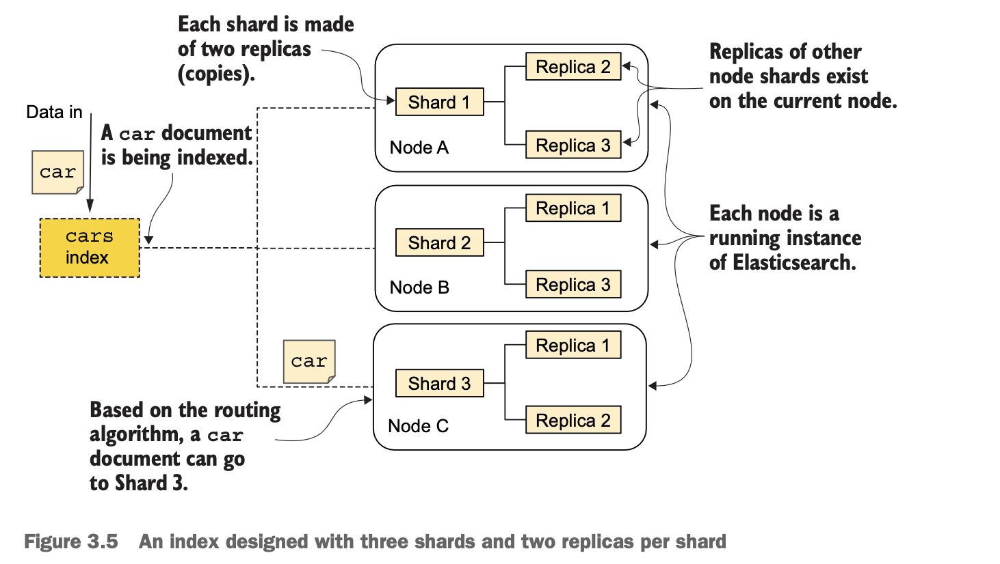
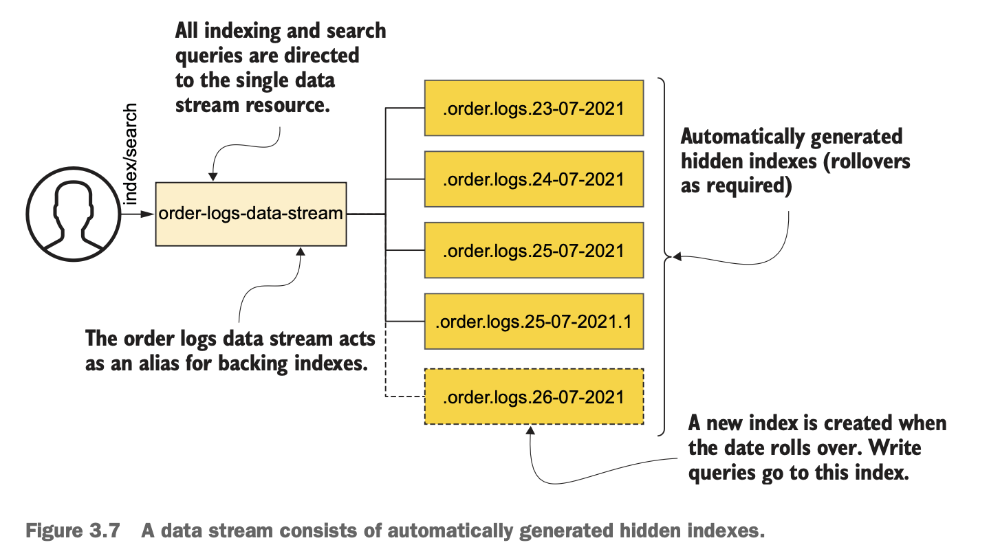
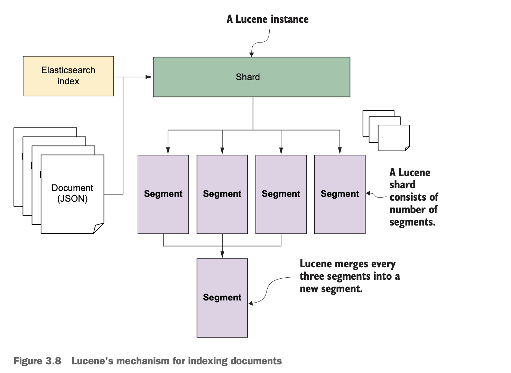
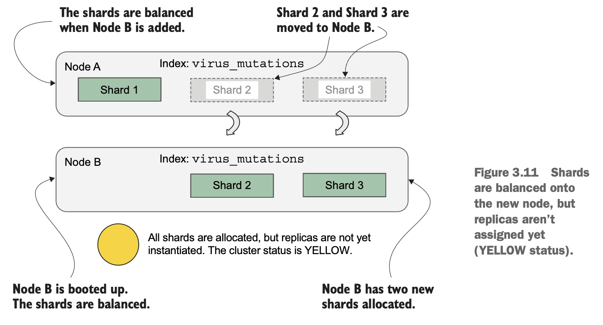
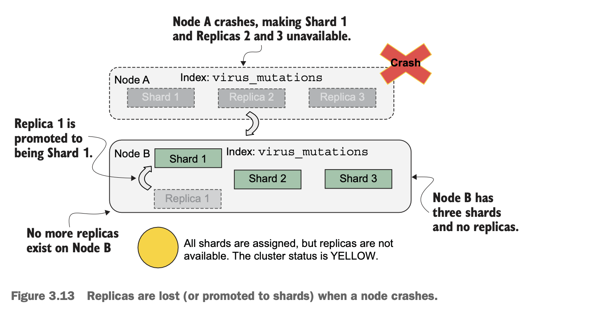
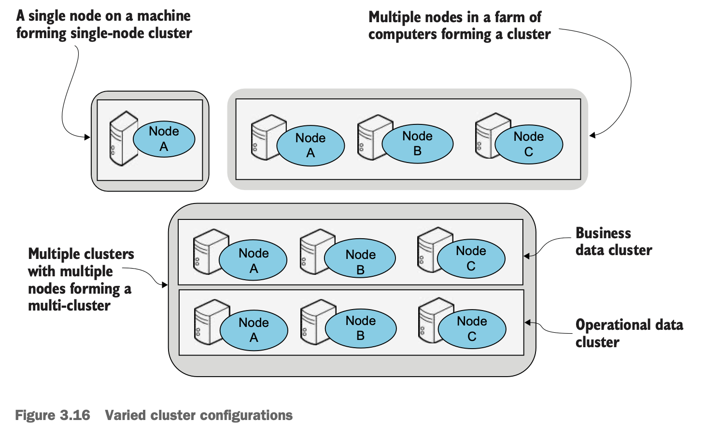
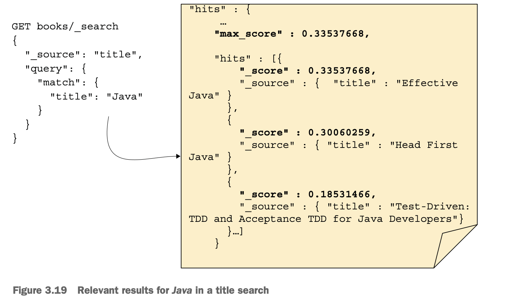

# Chapter 03 Architecture

## The building blocks

### Documents

```json
{
  "title": "John Doe",
  "date_of_birth": "1972-14-03",
  "age": 23,
  "address": {
    "location": {
      "lat": "51.5",
      "long": "0.12"
    }
  }
}
```

### Indexes

- **Shards**: physical instances of Apache Lucene



### Data streams



### Shards and replicas



- Heath status of a cluster, `GET _cluster/health`
  - **RED**: not all shards are assigned and ready
  - **YELLOW**: shards are assigned and ready, but replicas are not
  - **GREEN**: shards and replicas are assigned and ready

- Rebalance of an index when new node joins the cluster

  
  
  

- **Sizing**: normally 25-40 GB / shard, (up to 20 shards per GB of heap memory)
- Shards number cannot be modified on a live index due to routing algorithm (use **reindex**)

  `shard_number = hash(document_id) % number_of_primary_shards`

### Nodes and clusters



- **Master node**: cluster management, indexes management, admin-related jobs
- **Data node**: indexing, searching, deleting, document-related operations
- **Ingest node**: ingest operations
- **Machine learning node**: ml-related tasks, detects anomalies
- **Coordinating node**: all nodes take on this special role to coordinate client's requests

## Inverted Indexes

- **Inverted index** for full-text fields
- **Block k-dimensional (BKD) trees** for non-text fields (numeric, geoshapes, etc)

```
"<h2>Hello WORLD</h2>"
 |
 | Character filter: `html_strip` strips the HTML markup
 v
"Hello WORLD"
 |
 | Tokenizer: `whitespace` tokenizes the words
 v
[Hello] [WORLD]
 |
 | Token filter: `lowercase` lowercases the tokens
 v
[hello] [world]
```

| Word | Frequency | Document ID |
| :--- | ---- | ---- |
| hello | 2 | 1,2 |
| world | 1 | 1 |
| mate | 1 | 2 |

## Relevancy

- **TF-IDF** (Term Frequency-Inverse Document Frequency)
- **Okapi Best Match (BM25)** algorithm (default): TF-IDF with nonlinear correction and document length normalization to avoid bias
- Divergence from Randomness (DFR)
- Divergence from Independence (DFI)
- LM Dirichlet
- LM Jelinek-Mercer
- Manua
- Boolean similarity



## Routing algorithm

`shard_number = hash(id) % number_of_shards`

- number of primary shards cannot be changed when the index is in operation
- number of replicas can be changed

## Scaling

- **vertical scaling**: requires the cluster to be shutdown, may experience downtime unless using disaster recovery model
- **horizontal scaling**
