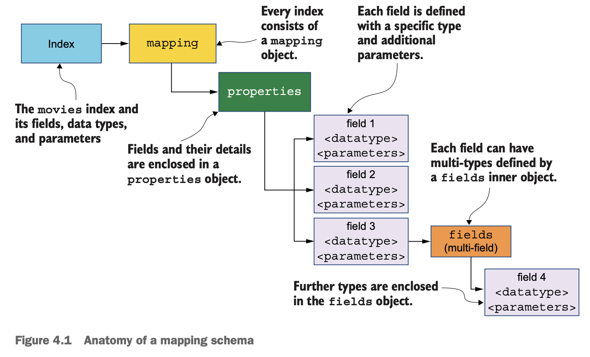
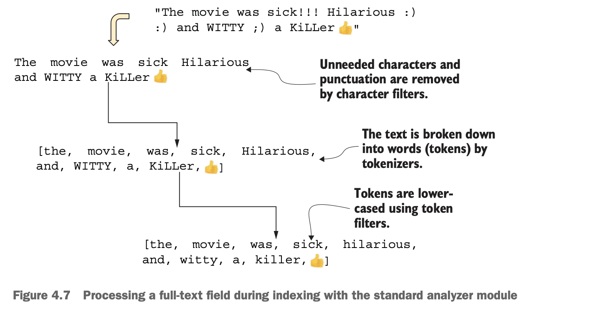
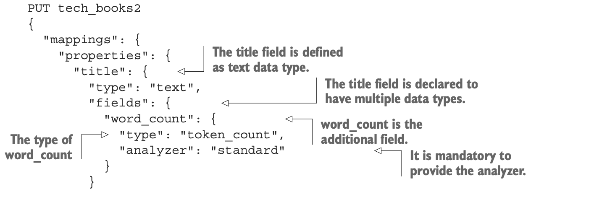

# Chapter 04 Mapping

## Overview of mapping



## Dynamic mapping

handy during development or testing, should not use in production, **prefer explicit mapping**

## Explicit mapping

- Indexing APIs (creating `movies` index with initial fields)

  ```
  PUT movies
  {
    "mappings": {
      "properties": {
        "title": {
          "type": "text"
        }
      }
    }
  }
  ```

- mapping APIs (adding fields to the `movies` index)

  ```
  PUT movies/_mapping
  {
    "properties": {
      "title": {
        "type": "text"
      }
    }
  }
  ```

- **modifying existing fields is not allowed** if index is in operation (use **reindexing APIs**)
  1. create new index with updated schema
  2. copy old data from old index to new index (using reindexing APIs)
  3. new index is ready once reindexing is complete
  4. application switches over to it, and remove the old index

  ```
  POST _reindex
  {
    "source": { "index": "orders" },
    "dest": { "index": "orders_new" }
  }
    ```

- **aliases** help switch between indexes seamlessly with zero downtime

## Data types

common types:

- **text**: unstructured text
- **integer, long, short, byte**
- **float, double**
- **boolean**
- **keyword**: structured text that must not be broken down or analyzed
- **object**: JSON object (flatterned)
- **nested**: JSON objects (inner relations are maintained)

## Core data types

### text

- Analyzing text fields (e.g. `standard analyzer`): use `_analyze` to test how text is analyzed against different analyzer

  

- Stemming: reduce words to their root words, e.g. `fighter, fight, fought -> fight`, language dependent
- `token_count`: store **the number of tokens** in corresponding field

  

### keyword

- **keyword**: un-tokenized, not analyzed, untouched, can be used in aggregation, range queries, filtering, sorting
- **constant_keyword**: same value for every document in that index
- **wildcard**: supports searching using wildcards and regex

### date

### numerical

### boolean

### range

- **date_range**

  ```
  PUT trainings/_doc/1
  {
    "name": "Functional Programming in Java",
    "training_dates": {
      "gte": "2021-08-07",
      "lte": "2021-08-10"
    }
  }
    ```

- **integer_range**
- **float_range**
- **ip_range**

### IP address

```
PUT networks/_doc/1
{
  "router_ip": "35.177.57.111"
}

GET networks/_search
{
  "query": {
    "term": {
      "router_ip": { "value": "35.177.0.0/16" }
    }
  }
}
```


## Advanced data types

### geo_point

```
PUT restaurants/_doc/1
{
  "name": "Sticky Fingers",
  "address": {
    "lon": "0.1278",
    "lat": "51.5074"
  }
}

GET restaurants/_search
{
  "query": {
    "geo_bounding_box": {
      "address": {
        "top_left": {
          "lon": "0",
          "lat": "52"
        },
        "bottom_right": {
          "lon": "1",
          "lat": "50"
        } 
      }
    }
  }
}
```

### object

```
PUT emails
{
  "mappings": {
    "properties": {
      "to": {
        "type": "keyword"
      },
      "subject": {
        "type": "text"
      },
      "attachments": {
        "properties": {
          "filename": {
            "type": "text"
          },
          "filetype": {
            "type": "text"
          }
        }
      }
    }
  }
}
```

**The array of the object data will be flattened**, inner objects are not stored as individual documents:

```
{
  "attachments.filename": "file1.txt",
  "attachments.filetype": "private"
}
{
  "attachments.filename": "file2.txt",
  "attachments.filetype": "confidential"
}

==> flattened, the inner relations of filename and filetype are lost

{
  "attachments.filename": [ "file1.txt", "file2.txt" ]
  "attachments.filetype": [ "private", "confidential" ]
}
```
### nested

the individual object of the array of inner objects is stored and indexed as a hidden document.

```
PUT emails_nested
{
  "mappings": {
    "properties": {
      "attachments": {
        "type": "nested",
        "properties": {
          "filename": {
            "type": "keyword"
          },
          "filetype": {
            "type": "text"
          }
        }
      }
    }
  }
}
```

use `nested` query to search nested objects:

```
GET emails_nested/_search
{
  "query": {
    "nested": {
      "path": "attachments",
      "query": {
        "bool": {
          "must": [
            { "match": { "attachments.filename": "file1.txt" }},
            { "match": { "attachments.filetype": "confidential" }}
          ]
        }
      }
    }
  }
}
```

### flattened

A `flattened` field can hold one or more subfields, each **subfield will be indexed as a keyword**

```
PUT consultations
{
  "mappings": {
    "properties": {
      "patient_name":{
        "type": "text"
      },
      "doctor_notes":{
        "type": "flattened"
      }
    }
  }
}

PUT consultations/_doc/1
{
  "patient_name": "John Doe",
  "doctor_notes": {
    "temperature": 103,
    "symptoms": ["chills", "fever", "headache"],
    "history": "none",
    "medication": ["Antibiotics", "Paracetamol"]
  }
}
```

### join

**Be cautious about join in ES**, implementing parent-child relationships in ES has performance implications.

```
PUT doctors {
  "mappings": {
    "properties": {
      "relationship": {
        "type": "join",
        "relations": {
          "doctor": "patient" <- doctor:patient relation
        }
      }
    }
  }
}

PUT doctors/_doc/1
{
  "name": "Dr. Mary Montgomery",
  "relationship": {
    "name": "doctor" <- one of the relations
  }
}
```

**Parents and associated children are indexed into the same shard** to avoid cross-shard overheads, thus, **a routing flag is required** for indexing children documents.

```
PUT doctors/_doc/2?routing=mary <- must have routing flag
{
  "name": "John Doe",
  "relationship": {
    "name": "patient",
    "parent": 1 <- document id of the doctor
  }
}

PUT doctors/_doc/3?routing=mary
{
  "name": "Mrs. Doe",
  "relationship": {
    "name": "patient",
    "parent": 1
  }
}
```

Search children belonging to a doctor:

```
GET doctors/_search
{
  "query": {
    "parent_id": {
      "type": "patient",
      "id": 1
    }
  }
}
```

### search_as_you_type (autocomplete)

Subfields created by the engine for `search_as_you_type`:

- `title`

  indexed with a chosen (or default) analyzer, e.g. `"Elasticsearch for Java developers"` -> `["elasticsearch", "for", "java", "developers]`

- `title._2gram`

  indexed with a (2) shingle-token filter, e.g. `"Elasticsearch for Java developers"` -> `["elasticsearch for", "for java", "java developers"]`

- `title._3gram`

  indexed with a (3) shingle-token filter, e.g. `"Elasticsearch for Java developers"` -> `["elasticsearch for java", "for java developers"]`

- `title._index_prefix`

  apply an edge n-gram token filter to `title._3gram`, e.g. `"Elastic"` -> `["e", "el", "ela", "elas", "elast", "elasti", "elastic"]`

## Fields with multiple data types

Single field with multiple data types, use `subject.kw / subject.comp` to access sub types.

```
PUT emails_multi_type
{

  "mappings": {
    "properties": {
      "subject": {
        "type": "text",
        "fields": {
          "kw": { "type": "keyword" },
          "comp": { "type": "completion" }
        }
      }
    }
  }
}
```
