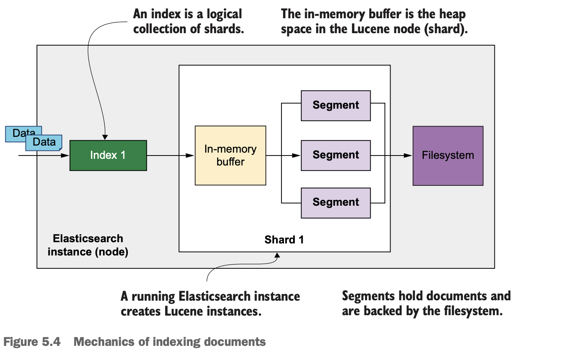
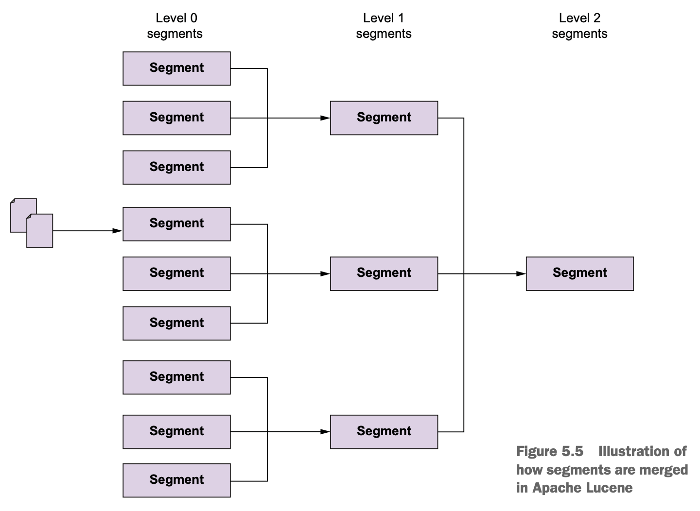

# Chapter 05 Working with documents

## Indexing documents

- ID can be the predefined identity strategy (**primary key**) of the domain objects
- using system-generated random ID for documents that do not have such identity strategy, e.g. system alerts, heartbeats, etc



- **Immutable segment** holds a batch of documents
- Lucene waits for the **refresh interval** (1 second, configurable) before pushing to segment to reduce I/O
- Lucene **collects all documents in the in-memory buffer** to create a new segment
- **Deletions are lazy** (marked for removal later)
- Lucene instantiates a **new segment by merging** 3 ready segments, essentially **similar to LSM tree**
- Documents are ready for searching once moved to segments (latency)



## Retrieving documents

## Manipulating responses

- removing metadata from the response
- suppressing the source document: `_source=false`
- including/excluding fields: `_source_includes / _source_excludes`

## Updating documents

- `_update` API updates a single document
  1. fetch the given document
  2. modify/add fields
  3. reindex the updated document, bump up the document version
- `_update_by_query` modifies multiple documents at the same time, **be cautious**
  1. parse the query and identify the corresponding shards to find all documents
  2. check the document version, do update if match with the query phase
  3. retry query -> check -> update if version not match, failed documents are logged and skipped
  4. reindex the updated document and mark the old ones as deleted
- scripted updates, use `ctx._source.<field>` to access original data, use `params` to provide volatile data to reduce compilation cost

  ```
  POST movies/_update_by_query
  {
    "query": {
      "match": {
        "actors": "Al Pacino"
      }
    },
    "script": {
      "source": "ctx._source.actors.add('Diane Kaeton')"
    }
  }
  ```

## Deleting documents

- delete by ID
- `_delete_by_query`: similar to `_update_by_query`

## Working with documents in bulk

```
POST _bulk
{"index": {"_index": "books"}}
{"title": "Elasticsearch in Action"}
{"create": {"_index": "flights", "_id": "101"}}
{"title": "London to Bucharest"}
{"index": {"_index": "pets"}}
{"name": "Milly", "age_months": 18}
{"delete": {"_index": "movies", "_id": "101"}}
{"update": {"_index": "movies", "_id": "1"} }
{"doc": {"title" : "The Godfather (Original)"} }
```

## Reindexing documents

Use **reindexing together with alias** is effectively a **zero-downtime migration**

```
POST _reindex
{
  "source": {"index": "<source_index>"},
  "dest": {"index": "<destination_index>"}
}
```