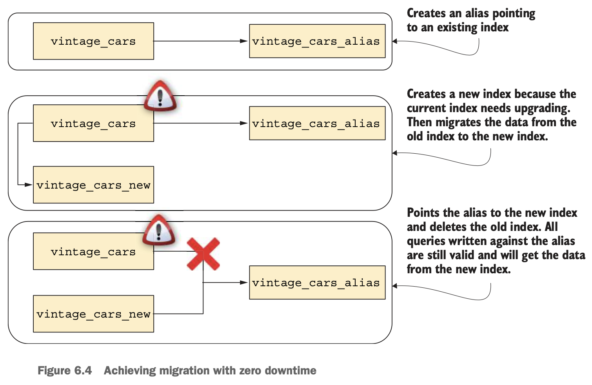
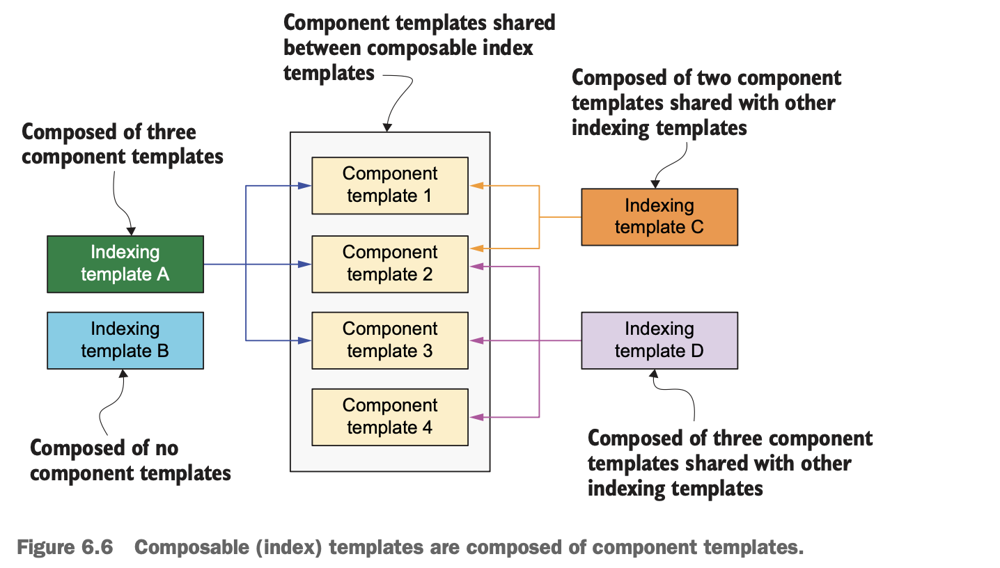
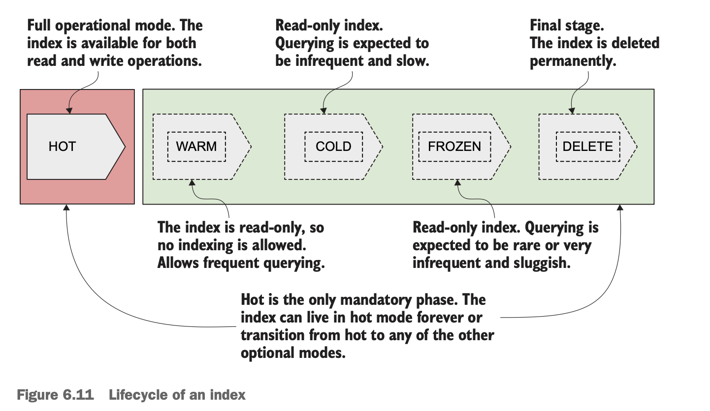

# Chapter 06 Indexing operations

## Creating indexes

- **Implicit (automatic) creation**: usually enabled for hidden administrative indices
- **Explicit (manual) creation**
  - **Mappings**
  - **Settings**
  - **Aliases**: one alias can point to multiple indexes with at least one writable index (`is_write_index: true`)

### **Migrating data with zero downtime using aliases**

1. Create an **alias** to refer to the current index, e.g. `vintage_cars_alias -> vintage_cars`
2. Create the new index with new mappings/settings to reflect the business needs
3. Copy (e.g. use `reindex` API) the data from the old index to the new index
4. Re-create the existing alias to refer to the new index, e.g. `vintage_cars_alias -> vintage_cars_new`
5. All queries are now carried out on the new index
6. Delete the old index when reindexing and releasing have been shown to work



## Reading indexes

## Deleting indexes

## Closing and opening indexes

## Index templates



## Monitoring and managing indexes

- index statistics `GET <index>/_stats`
- segment statistics `GET <index>/_stats/segments`

## Advanced operations

- **Splitting an index**: similar reindex, `_split` API
  - target index must not exist before
  - number of shards in target index must be a multiple of number of shards in current index
  - target index cannot have fewer primary shards
- **Shrinking an index**: similar to splitting an index
- **Rolling over an index alias**: useful in time-series data
  - create an alias for rollover operations, and make sure `is_write_index: true`, old index will become read-only
  - issue a rollover operation, `_rollover` API, which creates a new index with the same configuration as the old one, and remaps the alias to point to the new index

## Index lifecycle management (ILM)

### Index lifecycle



### Managing the index lifecycle manually

- **Define a lifecycle policy**, e.g. `hot_delete_policy`

  - hot phase: the index is expected to **enter the hot phase after at least one day** before carrying out the set-priority action
  - delete phase: the index is **deleted once the hot phase completes all the actions** because there is no `min_age` defined in delete phase

  ```
  PUT _ilm/policy/hot_delete_policy
  {
    "policy": {
      "phases": {  <- define policy and phases
        "hot": {
          "min_age": "1d",
          "actions": {
            "set_priority": {
              "priority": 250
            }
          }
        },
        "delete": {
          "actions": {
            "delete": {}
          }
        }
      }
    }
  }

  PUT hot_delete_policy_index
  {
    "settings": {
      "index.lifecycle.name": "hot_delete_policy"
    }
  }
  ```

- **Phase transition**

  ILM moves indices through the lifecycle according to their age. To control the timing of these transitions, you set a _minimum age_ for each phase. For an index to move to the next phase, all actions in the current phase must be complete and **the index must be older than the minimum age of the next phase**.

### Lifecycle with rollover

- Example: rollover an index based on the following conditions:
  - on each new day
  - when the number of documents hits 10000
  - when the size of index hits 10 GB

  ```
  PUT _ilm/policy/hot_simple_policy
  {
    "policy": {
      "phases": {
        "hot": {
          "min_age": "0ms",
          "actions": {
            "rollover": {
              "max_age": "1d",
              "max_docs": 10000,
              "max_size": "10gb"
            }
          }
        }
      }
    }
  }

  PUT _index_template/mysql_logs_template
  {
    "index_patterns": ["mysql-*"],
    "template": {
    "settings": {
      "index.lifecycle.name": "hot_simple_policy",
      "index.lifecycle.rollover_alias": "mysql-logs-alias"
    }
    }
  }

  PUT mysql-index-000001
  {
    "aliases": {
      "mysql-logs-alias": {
        "is_write_index": true
      }
    }
  }
  ```

*Policies are scanned per 10 minutes by default (configurable)*

