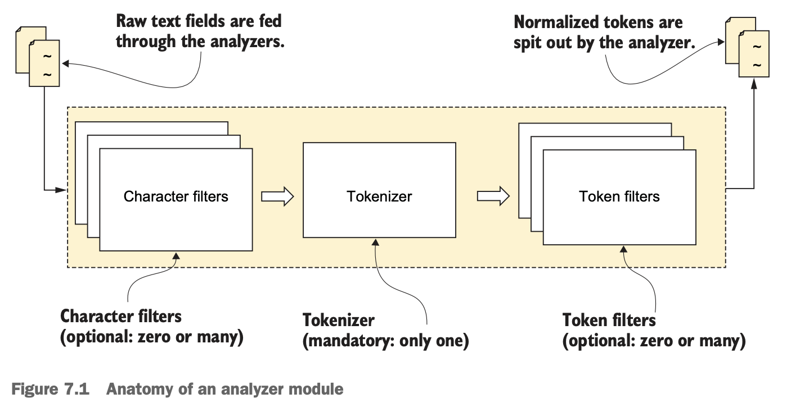
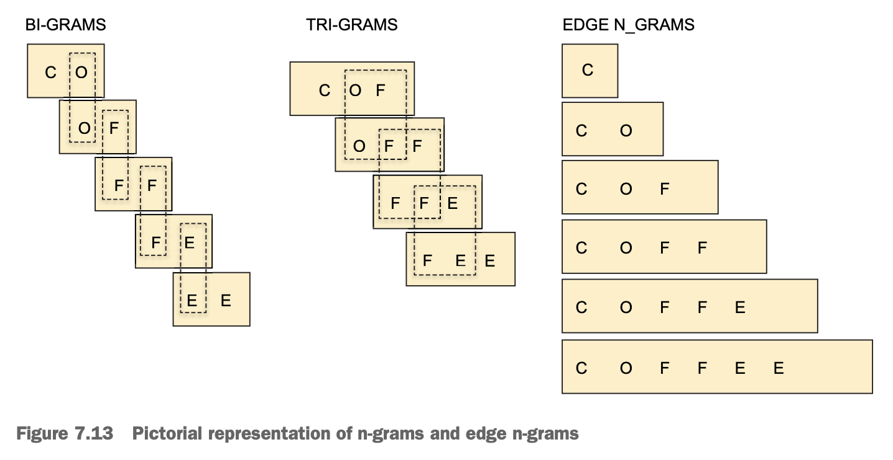

# Chapter 07 Text analysis

## Analyzer modules

- **Tokenization**: sentences are tokenized into tokens by tokenizer
- **Normalization**: tokens are transformed, modified, and enriched using stemming, synonyms, stop words by token filters
- **Anatomy of an analyzer**
  - **Character filters**: applied on the character level, mainly used to remove unwanted characters, e.g. `html_strip, pattern_replace`
  - **Tokenizers**: split text into words using a delimiter, e.g. `whitespace`
  - **Token filters**: further process the tokens, change case, create synonyms, produce n-gram, etc. e.g. `n-gram, shingles`

  

- **Testing analyzers**

  Use `_analyze` API to investigate how a text is analyzed by specific analyzer

## Built-in analyzers

- **standard**
- **simple**
- **stop**
- **whitespace**
- **keyword**
- **language**
- **pattern**
- **fingerprint**

## Custom analyzers

```
PUT index_with_custom_analyzer
{
  "settings": {
    "analysis": {
      "analyzer": {
        "greek_letter_custom_analyzer": {
          "type": "custom",
          "char_filter": [ "greek_symbol_mapper" ],
          "tokenizer": "standard",
          "filter": [ "uppercase", "greek_keep_words" ]
        }
      },
      "char_filter": {
        "greek_symbol_mapper": {
          "type": "mapping",
          "mappings": [
            "α => alpha",
            "β => Beta",
            "γ => Gamma"
          ]
        }
      },
      "filter": {
        "greek_keep_words": {
          "type": "keep",
          "keep_words": [ "alpha", "beta", "gamma" ]
        }
      }
    }
  }
}
```

## Specifying analyzers

 - **Analyzers for indexing**
   - setting the index/field analyzer with `analyzer`
 - **Analyzers for searching**
   - analyzer in a query
   - setting the index/field search analyzer with `search_analyzer`
 - **Order of precedence of search analyzers**
  1. query level
  2. `search_analyzer` on a field in settings
  3. index level
  4. indexing analyzer set on a field or an index

## Character filters

- **HTML strip filter**
- **Mapping character filter**
  - **Mapping via a file**
- **Pattern replace character filter**

## Tokenizers

- **standard**

  Based on word **boundaries** (whitespace) and **punctuation** (comma, hyphen, colon, semicolon, etc)

- **ngram** and **edge ngram**

  

- **pattern**: regex based
- **uax_url_email**: preserve URLs and emails
- **whitespace**: no-op
- **keyword**
- **lowercase**
- **path_hierarchy**: filesystem-oriented, based on path separators

## Token filters

- **shingle**: word n-grams generated at the token level
- **synonym**
  - **synonym via a file**
