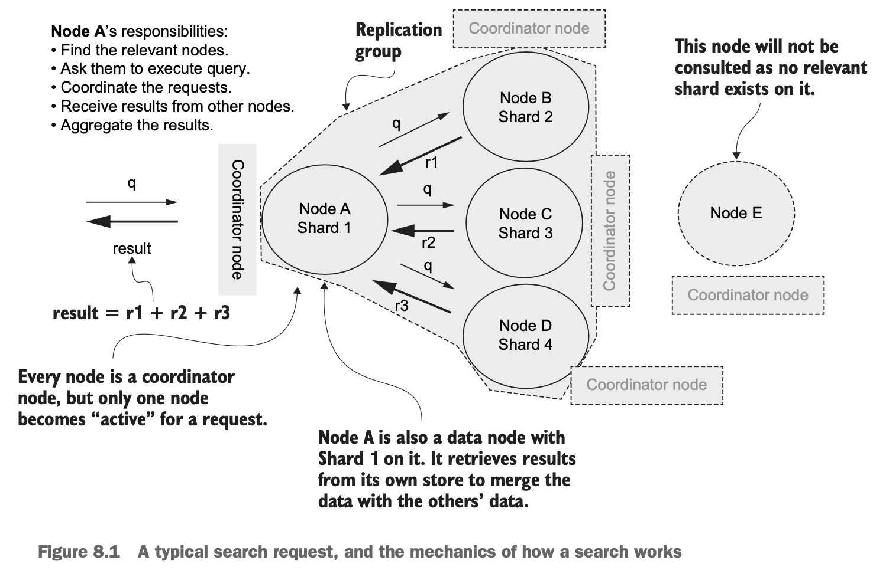
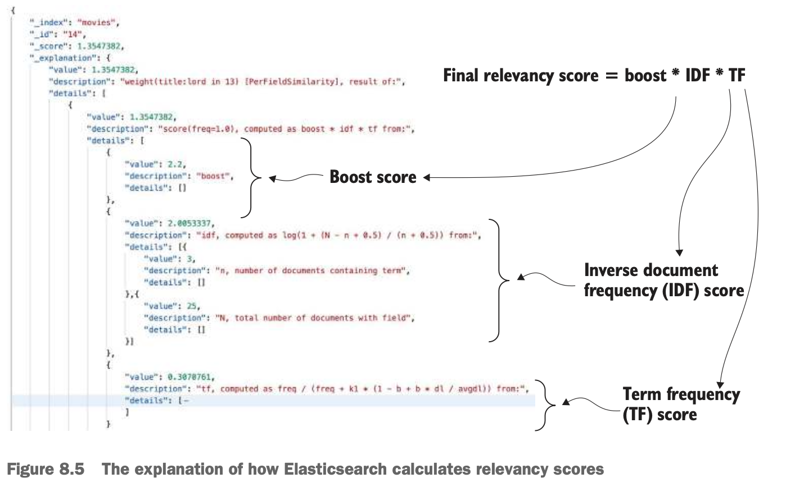

# Chapter 08 Introducing search

## How does search work?



## Search fundamentals

- **Query context**: computes a **relevancy score**
- **Filter context**: will not compute a relevancy score, more performant, more idempotent
- **Boolean query**
  - `must_not` contradicts the `must`
  - `filter` and `must_not` are executed in a filter context
  - `must` and `should` are executed in a query context

## Anatomy of a request and a response


- `took`: milliseconds, from when a coordinator receives the request to the time it aggregates the response before sending it back
- `timed_out`: any shards failed to respond in time (then the results maybe partial)
- `_shards`: shards execution results
- `hits`: result details
  - `total`: total number of results, by default will not report an accurate value larger than 10000
  - `hits`: document details


## URI request searches

***Always prefer Query DSL***

`GET|POST <index>/_search?q=<field:value> AND|OR <field:value>`

Use `query_string` query in Query DSL to wrap a URI request call

## Query DSL

see official documents for various Query DSL operators

## Search features

- **Pagination**: `search_after` (avoid `from/size` in deep pagination)
- **Highlighting**: `hightlight` to make the search keywords engaging and appealing in the results
- **Explaining the match of documents**: `_explain` API
- **Explaining relevancy scores**: `explain: true`

  

- **Sorting**
  - sorting on relevancy scores `_score`: (default) equivalent to `"sort": [ "_score" ]`
  - sorting on (multiple) fields: `"sort": [ { "rating": { "order": "desc" } } ]`
- **Manipulating results**
  - suppressing documents: `"_source": false`
  - fetching selected fields: `"fields": [ "title", "rating" ]`
  - **scripted fields**: **compute a field on the fly** and add it to the response

    ```
    GET movies/_search
    {
      "_source": ["title*","synopsis", "rating"],
      "query": {
        "match": {
          "certificate": "R"
        }
      },
      "script_fields": {
        "top_rated_movie": {
          "script": {
            "lang": "painless",
            "source": "if (doc['rating'].value > 9.0) 'true'; else 'false'"
          }
        }
      }
    }
    ```

  - **source filtering**: `"_source" : [ "title*", "synopsis" ]`

- **Searching across indexes and data streams**: manipulate the scores of documents hit of different indexes

  ```
  GET movies,movies_new,movies_top/_search
  {
    "indices_boost": [
      { "movies": 0.1 },
      { "movies_new": 0 },
      { "movies_top": 2.0 }
    ],
    "query": {
      "match": {
        "title": "Redemption"
      }
    }
  }
  ```
