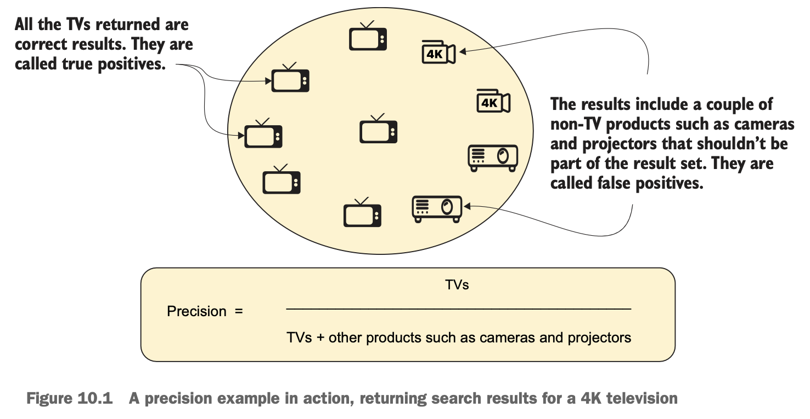

# Chapter 10 Full-text searches

## Overview

- **Precision**

	`precision = relevant retrieved / all retrieved`

	

- **Recall**

	`recall = relevant retrieved / all relevant`

	

## Full-text queries

- **match_all**: return all available documents, 100% recall
- **match_none**: return no results
- **match**
- **match_phrase**: match the exact phrase (words group), use `slop` to ignore some words
- **match_phrase_prefix**: use the last word in the query as a prefix
- **multi_match**: search across multiple fields, it is rewritten using a `dis_max`  (compound query) that splits each field into a separate `match` query
- **query_string**
	- specify which fields (`field`, `default_field`) to search
	- operators (`AND`, `OR`) to concatenate fields (`default_operator`)
	- use quotation to emit a phrase search, e.g. `"\"Design Patterns\""` (`phrase_slop` to relax the phrase)
- **fuzzy**
- **simple_query_string**: ignore syntactical errors and continue searching, forgiven variant version of `query_string` with limited syntax