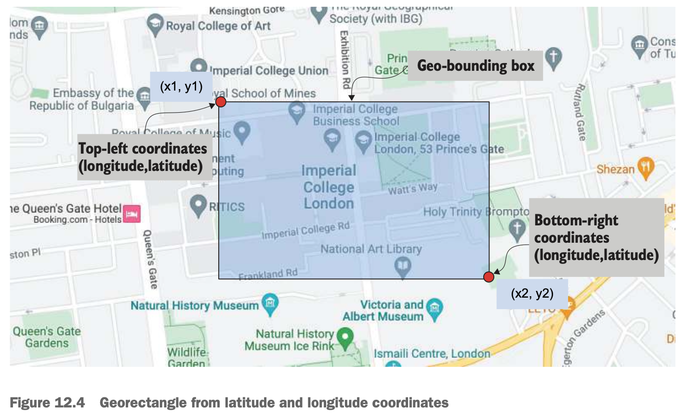

# Chapter 12 Advanced search

## Geospatial data types

- **geo_point**: longitude & latitude
  - WKT point: `POINT (51.49 0.14)`
  - location object: `{ "lon": -0.12, "lat": 51.50 }`
  - array: `[51.54, 0.23]`
  - geohash: `gcpvh2bg7sff`
- **geo_shape**: [GeoJson](https://geojson.org)
  - point: point represented by lat & lon
  - multipoint: array of points
  - polygon: multi-edge shape
  - multipolygon: list of polygons
  - line string: line between two points
  - multiline string: list of lines

## Geospatial queries

- **bounding_box**
  - `top_left` and `bottom_right`
  - `wkt`

  

- **geo_distance**

  

- **geo_shape**
  - `relation` to define the relationship between the evnelope and the resulting geoshape
    - **intersects** (default)
    - **within**: query shape contains document's shape
    - **contains**: document's shape contains query shape
    - **disjoint**

  

## The shape query

```
PUT myshapes/_doc/1
{
  "name": "A point shape",
  "myshape": {
    "type": "point",
    "coordinates": [12,14]
  }
}

PUT myshapes/_doc/2
{
  "name": "A multipoint shape",
  "myshape": {
    "type": "multipoint",
    "coordinates": [[10,13],[13,16]]
  }
}

GET myshapes/_search
{
  "query": {
    "shape": {
      "myshape": {
        "shape": {
          "type": "envelope",
          "coordinates": [[10,16],[14,10]]
        }
      }
    }
  }
}
```


## The span query

Span queries can **enforce the positional requirements** of the tokens/words in a search


- **span_first**

  

  ```
  GET quotes/_search
  {
    "query": {
      "span_first": {
        "match": {
          "span_term": {
            "quote": "aristotle"
          }
        },
        "end": 5  <- only search in the first N tokens
      }
    }
  }
  ```

- **span_near**
  - support multiple clauses

  

  ```
  GET quotes/_search
  {
    "query": {
      "span_near": {
        "clauses": [
          {
            "span_term": {
              "quote": "plato"
            }
          },
          {
            "span_term": {
              "quote":  "aristotle"
            }
          }
        ],
        "slop": 3,        <- acceptable gap between tokens
        "in_order": true  <- must match the span_term order
      }
    }
  }
  ```

- **span_within**
  - `little` block expects to be enclosed in the `big` block
  - `big` block is just a `span_near` query

  


```
GET quotes/_search
{
  "query": {
    "span_within": {
      "little": {     <- tokens you are searching for
        "span_term": {
          "quote": "aristotle"
        }
      },
      "big": {        <- blocks that should wrap the wanted tokens
        "span_near": {
          "clauses": [
            {
              "span_term": {
                "quote": "friend"
              }
            },
            {
              "span_term": {
                "quote": "friend"
              }
            }
          ],
          "slop": 4,
          "in_order": true
        }
      }
    }
  }
}
```

- **span_or**: `OR`, match one or more `span` queries
- **span_not**
- **span_containing**
- **span_multi_term**

## Specialized queries

`TODO`

- **distance_feature**: the proximity of documents to a given focal point increases the relevance score
- **pinned**: bundle additional (even unmatched) documents with the original result set
- **more_like_this**: related or similar-looking results
- **percolate**: "reverse" search, test if a document can be matched by stored queries, [reference](https://www.elastic.co/guide/en/elasticsearch/reference/current/query-dsl-percolate-query.html)
