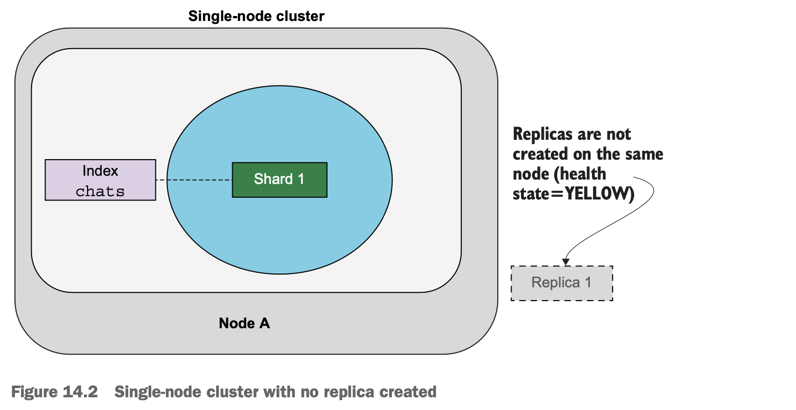
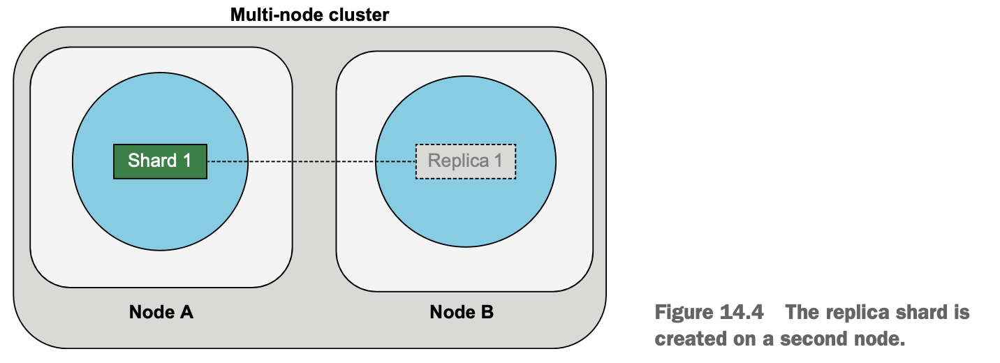
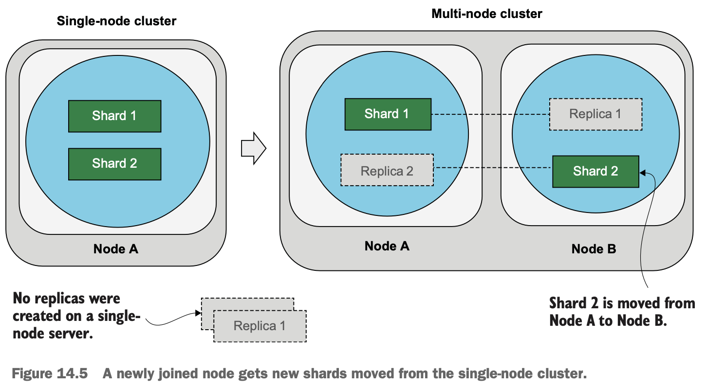
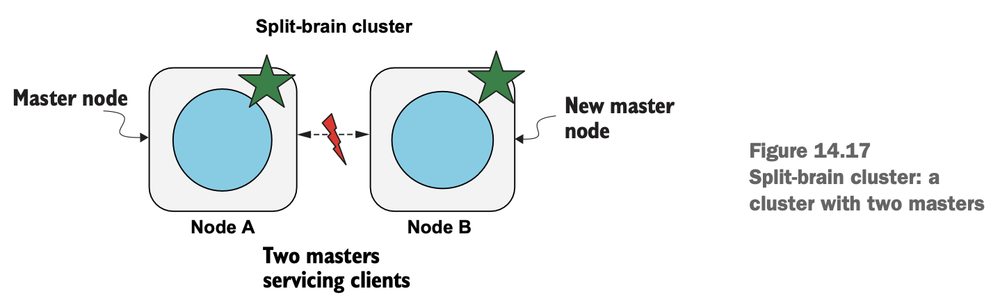

# Chapter 14 Administration

## Scaling the cluster



- **Adding node**

  boot up Elasticsearch on a **different machine** but in the **same network** with the **same `cluster.name` in config** (and same security config if enabled)






- **Increasing read throughput**

  Reads (queries) can be served by the replicas while the shards do the indexing (**separation of read/write**), adding more replicas improves read throughput (dynamically change `number_of_replicas` config)

## Node communication

- HTTP interface for interactions between clients and nodes using RESTful APIs
- Transport layer interface for node-to-node communications

## Shard sizing

## Snapshots

- **Register a snapshot repository**
- **Snapshot the data**
- **Restore from the store**

Other than [reindex](06.indexing_operations), we can use **snapshot to migrate data** from an old index:

1. create a new index with the new mappings
2. take a snapshot of the current index
3. **restore the snapshot to the newly created index**
4. delete the snapshot and the old index

Use **snapshot lifecycle management (SLM)**, `_slm` API to manage the lifecycle of snapshots automatically

```
PUT _slm/policy/prod_cluster_daily_backups
{
  "name": "<prod_daily_backups-{now/d}>",
  "schedule": "0 0 0 * * ?",    <- cron job schedule for midnight
  "repository": "es_cluster_snapshot_repository",
  "config": {
    "indices": ["*movies*", "*reviews*"],
    "include_global_state": false
  },
  "retention": {
    "Expire_after": "7d"
  }
}
```

*Enterprise feature: Searchable snapshots*

## Advanced configurations

- **The main configuration file**: `elasticsearch.yml`
- **Logging options**: `log4j2.properties`
- **Java virtual machine options**: `jvm.options`

## Cluster masters

### Master nodes

- Responsible for **cluster-wide operations**, e.g. allocating shards, index management, etc
- `master` role means **master-eligible**, one cluster has only one master

### Master elections

- **Slow/Dead master** will make master-eligible nodes call for an election
    - `cluster.eletion.duration`
    - `cluster.eletion.initial_timeout`

### Cluster state

- **Only master node can commit the cluster state** (all metadata about shards, replicas, schemas, mappings, field information, etc) in phases, **similar to 2PC** transaction protocol
    1. master computes the cluster changes, **publishes to the every  nodes** and awaiting ack
    2. each recipient responds with **ack before applying** the change to local state
    3. master **commits once receives a quorum of acks from master-eligible nodes**
    4. after committing, master **broadcasts a final message** to individual nodes
    5. each recipient commits the change

- `cluster.publish.timeout` sets a **time limit to commit** each batch of cluster updates, master will **wait for this period before starting the next** batch of cluster updates
    - master may have died if cluster updates are not committed in 30s, election begins
    - even updates are committed, master still waits for all acks for this period, and further waits for another `cluster.follower_lag.timeout` before **marking failed nodes** and removing them from the cluster

### A quorum

`Quorum = (N / 2) + 1`

### The split-brain problem




### Dedicated master node

- All nodes can be assigned all roles
- Dedicated master node are more performant if the cluster is heavyweight
