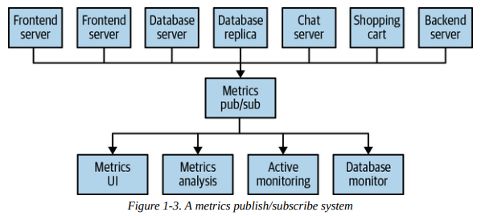
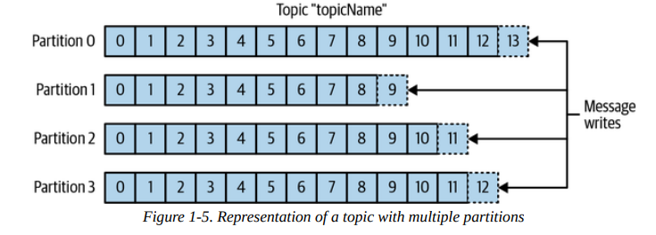
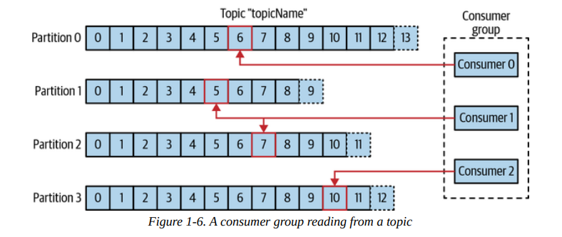
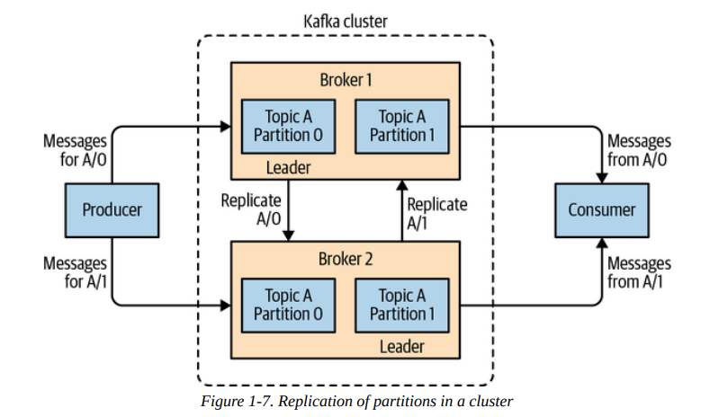
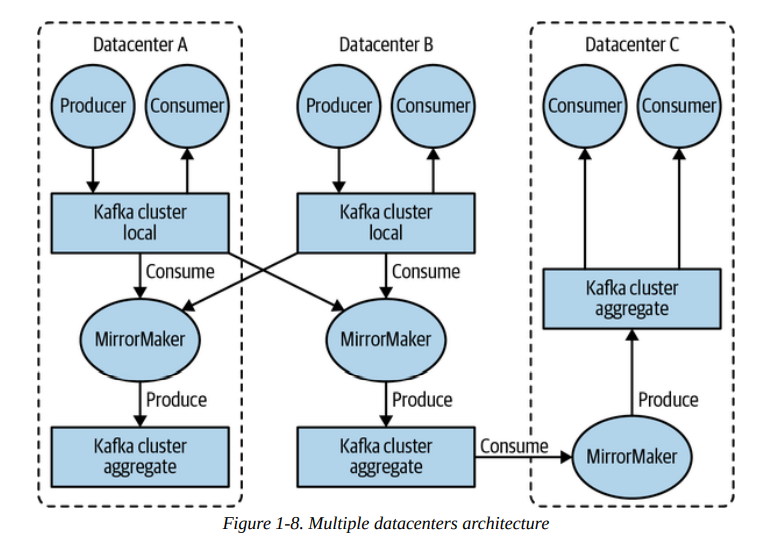
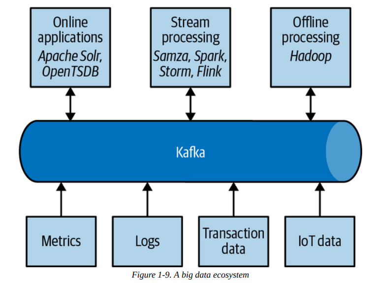

# Chapter 01. Meet Kafka

## 发布/订阅消息流 Publish/Subscribe Messaging

## 初识 Kafka Enter Kafka

Kafka通常被称为**分布式流数据平台 distributed streaming platform**，支持消息持久化保存、有序、幂等读，容灾且对扩容友好

### Messages and Batches

Kafka的数据**最小单位为一条消息message**，消息本身是一个字节数据，对Kafka没有特别含义，同时每条消息的元数据作为一个key，也是一个字节数据，通常通过对key计算一致性散列的值来确定其所属的分区partition，Kafka通常会**批量处理一组消息batch**，从而减少额外的开销并增加处理吞吐量，相应的可能会提高单条消息的延迟，**类似TCP的nagle算法**

### Schemas

Kafka对处理的消息都视为字节数组，没有特定的含义，但是通常通过**定义一个schema来使得消息更容易被理解**，例如强类型的Google Protocol Buffer、Apache Avro，或是灵活的弱类型JSON等

### Topics and Partitions

Kafka中的消息**根据topic进行归类**，可以类比数据库中的表，或是文件系统中的目录，**topic进一步会分割成partition**，每个分区就是单独的一个commit log，写入相应分区就是append-only模式写入到commit log中（分布式系统中常见的segemented logs），读取消息就是从给定的offset从commit log中读取消息，因此整个topic内有多个分区，因此**topic级别不存在顺序关系，而partition内存在顺序关系**

**topic的partition也是Kafka提供数据冗余和高可用的方式**，topic下的**多个partitions可以存储在多个主机上**提供并发访问，这也是线性扩展提升系统吞吐量的方式，另外**partition也可以多副本备份replication**，从而提供高可用和数据冗余

### Producers and Consumers

生产者producer产生消息，并且默认情况下会将消息均匀写入到topic的所有partitions上，同样也可以通过key指定写入到具体的一个partition中，从而**采用相同key的消息一定写入同一个分区并构成顺序关系**，另外Kafka支持使用**自定义的partitioner**来更精细的控制分区方式

消费者consumer消费消息，并且会**追踪所消费的消息在分区中的offset**，从而消费可以将offset存储在Kafka自身中实现重启后继续消费，消费者往往在一个**消费者组consumer group**中消费同一个topic，消费者组确保**每个分区只会被一个消费者消费**，分区与消费者的**映射关系也称为ownership**，采用这种方式使得消费者可以根据需要线性扩展，并且当某个消费者宕机时可以指定另一个消费者从相应的位置继续开始消费

### Brokers and Clusters

单个Kafka服务器称为一个broker，broker从producer中收取消息、分配offset、持久化保存消息、服务consumer的读取请求，更常见的情况下会由**多个Kafka服务器组成一个cluster，包含多个broker**，在集群所有健康的brokers中**某个成员会被选举成为controller**（过往采用外部的zookeeper实现选主，后续切换到Kafka自身的raft实现选主）负责cluster级别的管理，包括分配partitions给brokers、broker的故障检测

Kafka cluster中**一个partition只由一个broker拥有，该broker也称为该partition的leader**，而副本则会被分配给其他brokers，这些brokers称为followers，当leader broker宕机时，就会由某个follower broker接替称为新leader broker，所有**producers必须连接到leader broker**才能完成相应partition数据的写入，但是**consumer可以连接到leader/follower brokers**上就能完成数据读取

Kafka支持**topic级别的数据过期回收策略 retention policy**，可以配置为一定时间或是partition达到一定大小，就触发数据回收过程，删除消息并释放磁盘空间；同时topic也支持**log compacted模式，即一个topic下的相同key的消息只保留最新的一条**，假如使用同一个key发布了两条消息，则第一条消息在第二条消息发布时就会被视为过期并删除

### Multiple Clusters

随着Kafka部署规模的发展，Kafka也支持**多集群multiple clusters模式**，通常用于进一步基于数据类型的分离部署、安全原因的隔离部署、多数据中心容灾部署，Kafka默认的partition副本备份功能只支持集群内的数据备份，而**多集群的数据备份通过额外的一个工具MirrorMaker来实现**，本质上MirrorMaker只是一个简单的Kafka producer/consumer对，用于将一个cluster的数据传递给另一个cluster实现replication

## 选择Kafka的动机 Why Kafka?

- 多生产者 Multiple Producers
- 多消费者 Multiple Consumers
- 基于磁盘的数据回收 Disk-Based Retention
- 可扩展 Scalable
- 高性能 High Performance
- 平台功能 Platform Features

## 数据生态 The Data Ecosystem

Kafka常见的使用场景包括：

- Activity Tracking
- Messaging
- Metrics/Logging
- Commit Log
- Stream Processing

## 起源 Kafka's Origin

`SKIP`
