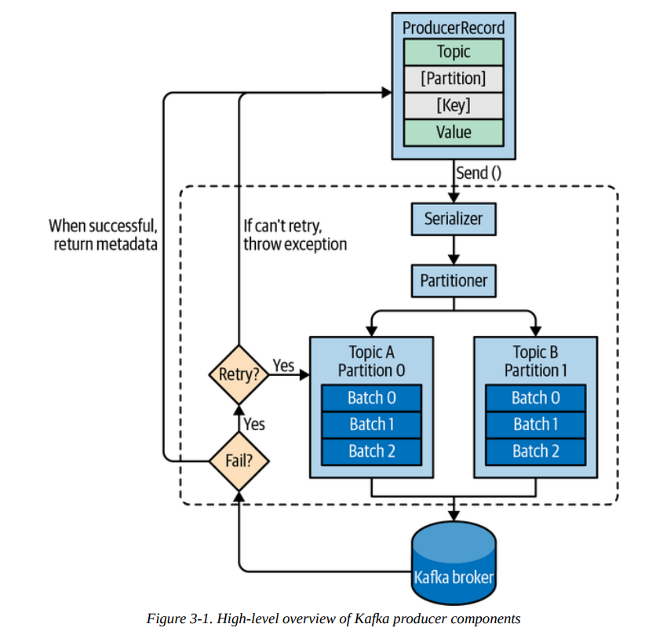
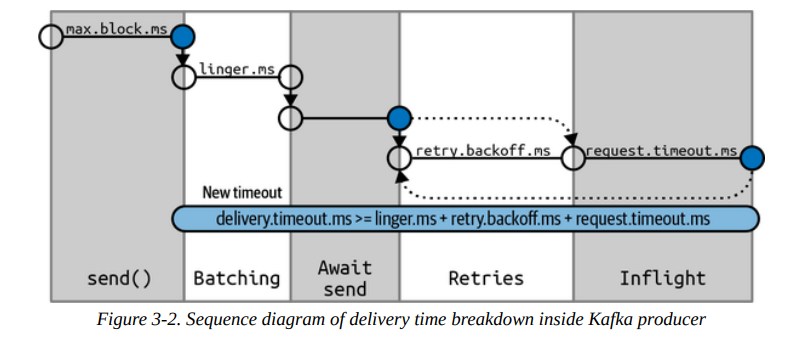
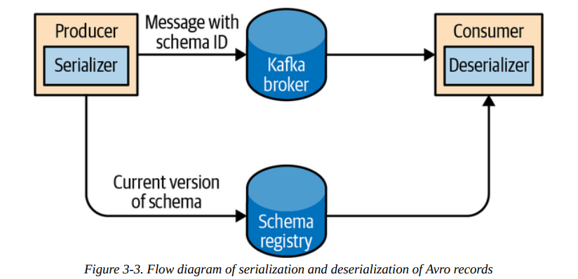

# Chapter 03. Kafka Producers: Writing Messages to Kafka

## Producer Overview



## Constructing a Kafka Producer

Kafka producer有三个必须提供的配置项：

- `bootstrap.servers`
  通常建议producer**至少指定两个Kafka broker的`host:port`从而当某个broker无法提供服务时会自动切换到其余broker上，即提高可用性**，并且只要有一个broker能够连接成功，producer就能获得更多的集群信息，因此也不必在这里包含整个集群所有的broker地址
- `key.serializer`
  用于序列化消息的key
- `value.serializer`
  用于序列化消息的value

在发送消息时有三种常见模式：

- **仅发送不确认 Fire-and-forget**
  仅发送消息而不关心是否真的抵达Kafka broker，通常producer有配置多个broker地址、重试等机制会尽力确保依然发送成功
- **同步发送 Synchronous send**
  实际上Kafka总是支持异步发送，`send()`会立即返回`Future`对象，从而可以通过`get()`阻塞等待到`Future`就绪来实现同步发送
- **异步发送 Asynchronous send**
  调用`send()`并提供完成时的回调函数，当发送结束时就会调用回调函数来通知成功与否

## Sending a Message to Kafka

Kafka Producer会产生两类错误：

- **可重试的retriable**，即出现错误时可以通过重试发送来尝试解决，例如网络错误、非主节点错误等，非主节点错误待主节点被选出后重试就会成功
- **不可重试的irretriable**，即出现的错误无法通过重试解决，例如消息过大等，此时producer就不会重试而是直接抛出异常

```java
// topic, key, value
ProducerRecord<String, String> record =
  new ProducerRecord<>("CustomerCountry", "Precision Products", "France");

// sending asynchronously
private class DemoProducerCallback implements Callback {
  @Override
  public void onCompletion(RecordMetadata recordMetadata, Exception e) {
    if (e != null) {
      e.printStackTrace();
    }
  }
}

producer.send(record, new DemoProducerCallback());
```

需要注意采用异步的方式发送消息，其**回调会由producer的主线程来执行**，从而能够保证顺序异步发送的多个消息其回调也是相同顺序的，因此回调中不应该有特别慢的操作阻塞producer

## Configuring Producers

除了上述三个必须提供的配置项以外，大多数参数有合理的默认值，其中以下参数的值会显著影响producer的性能、可靠性、资源占用：

- `client.id`
  可以是任意字符串，作为逻辑标识符标记每个唯一的producer，通常用于日志记录、指标、限流等
- `acks`
  Kafka通过对一个partition进行副本备份replication来实现高可用，`acks`参数指定**一条消息被写入多少个副本才会返回**，该参数会极大的影响可靠性和延迟，常见的选择包括：
  - `acks=0`：不等待任意partition写入即返回，消息存在丢失的可能性，性能表现最佳
  - `acks=1`：等待写入leader partition即返回，若无法写入leader partition（例如原leader宕机，尚未选举出新leader）则会报错并重试，需要注意此时依然存在**写入了leader partition但是leader尚未备份到follower上即宕机，此时依然存在消息丢失的可能性**
  - `acks=all`：等待写入所有副本才会返回，最安全的模式保证消息不会丢失，但延迟会更加高，受集群内最慢的partition约束
  
  需要特别注意的是，**上述`acks`的选择只影响producer侧的延迟**，而若是考虑端到端延迟，即从producer生产的消息被consumer消费的时间，则由于**Kafka为了保证一致性，只允许写入了所有副本的消息才可读**，因此端到端延迟并不会收到`acks`的影响
- Message Delivery Time
  在发送消息时`send()`所花费的时间，或者是希望不超过的最大时间，基本上可以分割两大部分，包括调用`send()`直接导致的阻塞等待时间，以及从`send()`返回后直到其回调被调用的时间，更加具体可以根据producer的实现（Kafka 2.1版本）分为以下部分：
  
  

  - `max.block.ms`：调用`send()`时被阻塞的最大时间，当producer的发送端缓存已满、或是希望获得partition metadata的请求无法立即满足时，就会阻塞直到这个时间，随后抛出超时异常
  - `delivery.timeout.ms`：即从进入等待预备发送到发送的最大时间，包括了等待成批量发送的延迟`linger.ms`（类似TCP nagle算法）、实际发送时间、重试时间等，若超过这个时间依然没有发送成功，就会调用`send()`提供的回调并传入相应异常，通常**建议采用无限重试和合理的`delivery.timeout.ms`搭配，从而在给定超时时间内尽可能重试发送**，而不是通过计算重试时间来限定最大时间
  - `request.timeout.ms`：producer在发送消息后等待broker响应的最大时间，若超过后，根据配置，client会选择传给回调超时异常，或是进入重试等待并随后再次发送
  - `retries`和`retry.backoff.ms`：常见的重试和重试等待配置，`retrie=0`意为从不重试，不建议修改该参数，而是只使用`delivery.timeout.ms`限制总时间，并且测试实际环境中broker从宕机到重启可提供服务的实际所需时间，从而使得在`delivery.timeout.ms`的设置内可以容忍一次broker宕机重启耗时

- `linger.ms`
  即等待批量发送的延迟，类似TCP nagle算法，较小的设置有利于低延迟，较大的设置有利于高吞吐，默认情况下为`0`即一有消息就发送
- `buffer.memory`
  producer维护的准备发送的消息占用缓存的大小
- `compression.type`
  对消息进行压缩后发送可以减少带宽使用，代价是额外的CPU资源，支持`snappy/gzip/lz4/zstd`
- `batch.size`
  对**同一个partition发送**的消息会被批量发送，每一批数据占用内存字节数的最大值，较大的设计并不会影响延迟而只会影响内存占用，不会等到一批数据充满才发送，参考`linger.ms`
- `max.in.flight.requests.per.connection`
  在broker尚未响应的情况下producer也可以持续发送请求，这一参数限定了尚未响应的在途请求数量的最大值，需要特别注意的是当该参数`>=2`且启用了`retries`，则有可能出现发送了多个批量的数据而**前面的失败后面的成功，导致前面的重试后成功违反了顺序发送消息的约定**，解决方法是**启用幂等性发送`enable.idempotence=true`来保证在这种情况下不超过`5`个在途的批量数据不会乱序，并且保证重试引起的可能重复数据自动去重**
- `max.request.size`
  单次请求所包含数据的最大尺寸，默认为`1MB`，则单词请求可以包括1条`1MB`的消息或是1024条`1KB`的消息
- `receive.buffer.bytes` and `send.buffer.bytes`
  TCP维护的发送接收缓存区尺寸，当配置为`-1`时则采用OS默认实现，建议根据实际网络情况修改
- `enable.idempotence`
  启用幂等性发送时，**producer将会对每一条发送的消息搭配一个唯一的序列号，从而当broker收到的消息对应的序列号存在时就会自动去重避免重复**，producer会收到一个无害的序列号重复异常，注意启用这个参数有额外的要求，包括`max.in.flight.requests.per.connection <= 5`、`retries > 0`、`acks = all`

## Serializers

序列化协议例如Avro，需要在解析数据时拥有完整的schema，因此在发送数据时往往除了数据本身，还会发送相应的schema版本，schema及其版本则保存在**注册中心Schema Registry**中



## Partitions

消息通常会包含一个key信息，用于**决定该消息所属的partition**，同时**相同的key保证后续会被同一个消费者消费**

- 若不提供key，即key为`null`，则会**由实现来决定消息所属的partition**，例如从Kafka 2.4开始producer会采用**round-robin + sticky**的方式来决定key为空的消息所属的partition
  - **sticky粘性策略**的目的在于减少延迟，由于producer会等待某个分区的批量满`batch.size`或是延迟时间`linger.ms`达到时才会发送，假如一批消息分属于不同partition且都未满，则必须等到`linger.ms`，此时**将没有提供key的消息尽可能放在同一个batch中**使其满足`batch.size`就可以立即发送，而结合round-robin就是**轮流使未提供key的消息去填充不同目标partition的batch**
- 若提供key，则**默认的partitioner会对key求散列后决定所属的partition**，同时为了保证一致性，散列后会**基于所有partitions来决定**，而不是目前可用的partitions，例如某个partition尚未选举出leader而导致不可用，此时若消息应该写入该partition则会抛出异常
  - 当topic下**partition总数保持不变时**，默认的hash partitioner保证相同key总是写入相同partition，因此若分区较重要，尽可能一开始就设计好分区模式和数量，**避免后期追加分区**

在默认的hash partitioner以外，Kafka还提供了：

- `RoundRobinPartitioner`：将所有消息轮次平均分配到所有partition上，相同key不一定会发送到相同分区中
- `UniformStickyPartitioner`：统一对所有消息使用**粘性策略**，并且轮流指向不同目标分区，相同key不一定会发送到相同分区中
- 自定义partitioner的接口
  
    ```java
    public class MyPartitioner implements Partitioner {
      public void configure(Map<String, ?> configs) {
        // do some resource allocation, class initialization, etc
        // before other methods being invoked
      }
      public int partition(String topic, Object key, byte[] keyBytes, Object value, byte[] valueBytes, Cluster cluster) {
        List<PartitionInfo> partitions = cluster.partitionsForTopic(topic);
        int num = partitions.size();
        if (((String) key).equals("Important")) {
          // special handler for special key
          return num - 1;
        }
        // default behaviour is the same as that of hash partitioner
        return Math.abs(Utils.murmur2(keyBytes)) % (num - 1);
      }
      public void close() {
        // do some resouce deallocation, cleanup, etc
      }
    }
    ```

## Headers

在key和value以外，**一条消息还可以包括headers，用于作为元数据描述消息**，通常会包含例如消息源、追踪信息、路由信息等（例如消息本身加密无法访问，而上层希望携带一些追踪信息等）

```java
ProducerRecord<String, String> record =
  new ProducerRecord<>("CustomerCountry", "Precision Products", "France");
record.headers().add("privacy-level", "YOLO".getBytes(StandardCharsets.UTF-8));
```

## Interceptors

Kafka producer提供了两个注入回调的位置，从而**允许在不修改producer源代码的情况下实现一部分定制行为**，例如发送前检查或修改消息体添加统一的header信息、统计ack的数量等，在`ProducerInterceptor`中提供了：

- `ProducerRecord<K, V> onSend(ProducerRecord<K, V> record)`
  该回调会在消息发送前（序列化前）被调用，从而在回调中可以修改相应的数据
- `void onAcknowledgement(RecordMetadata metadata, Exception exception)`
  该回调会在消息发送后被broker确认时被调用，从而可以获知broker的一些确认信息

## Quotas and Throttling

**Kafka brokers支持限流**，限流可以通过默认配置对所有client生效、或是通过`client id`指定对象生效、或是通过`user id`指定用户生效（需要启用安全配置和client鉴权），包括三类quota：

- **produce**：producer可以发送的数据量，`bytes/s`
- **consume**：consumer可以接收的数据量，`bytes/s`
- **request**：broker可以处理的用户请求量，`qps`

当client达到设定的quota值时，broker会通过**延迟响应**进而client自动降低流量（例如`max.in.flight.requests.per.connection`）来实现限流，而对于恶意或是问题客户端（即使延迟响应也不会降低数据发送速率）broker也会暂时**关闭信道**来达到限流的目的

在producer侧，假如一直通过`Producer.send()`超量发送消息，则**背压 backpressure**的传递过程如下：

1. 超过broker给定的quota限制，延迟响应
2. 达到在途请求数量的阈值，消息在producer侧缓冲区堆积
3. producer缓冲区耗尽，从而`Producer.send()`阻塞在进入缓冲区的过程中
4. `Producer.send()`阻塞时间逐步变长直到超过配置值，抛出`TimeoutException`

注意：在上述2-4过程中**堆积在缓冲区的消息也可能因为超过了`delivery.timeout.ms`而触发回调**并传入`TimeoutException`
