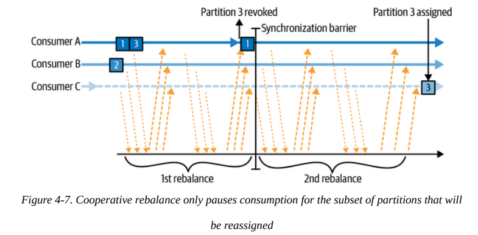

# Chapter 04. Kafka Consumers: Reading Data from Kafka

## Kafka Consumer Concepts

- **Consumer 和 Consumer Groups**
  如同多个producers可以写入同一个topic，多个consumers也可以订阅同一个topic从而允许水平扩容来提升消费吞吐量，当属于同一个consumer group的consumers订阅了某个topic时，**每个consumer实际上会收到topic下partitions互不重叠的子集的数据**，如下图：

  

  因此**consumers数量的上限可以认为就是partitions数量**，此时每个consumer恰好收到一个partition的数据，进一步增加的consumer只会处于闲置idle状态而不会收到任何数据，通常consumer会做一些数据库更新、计算等耗时较高的作业，因此Kafka的消费侧扩容通常就是向一个consumer group中增加consumers

  对于希望获得所有数据的下游应用，只需要维护自己的consumer group即可，consumer group可以是每个希望获取完整数据的下游维护一个，相同consumer group内部再根据负载来选择增减consumers

  

- **Consumer Groups 和 Partition Rebalance**
  在同一个consumer groups内的consumers相当于共享了所有partitions的数据，因此当添加一个新的consumer时，其会**从其他consumer当前消费到的位置继续消费**，同样减少一个consumers时（主动关闭节点或宕机崩溃）其他consumer也会从相应的位置继续开始消费

  Kafka brokers中的某一个节点会作为consumer group的协调者coordinator（不同group可以由不同的broker作为协调者），consumer通过发送定时心跳给协调者来确认存活，同时**通过心跳来维护group membership和partition ownership的信息**，协调者通过心跳来确认consumer的存货情况以及是否需要重平衡

  这种**重新分配consumer所消费的partitions的过程称为重平衡rebalance**，在consumer groups消费的topics被修改时也可能发生，例如增加了新的partitions，重平衡可以分为两类：

  - **积极重平衡 Eager Rebalances**
    在积极重平衡的过程中，所有consumers立即停止消费，并且放弃他们目前所对应的所有partitions，重新加入consumer group从而获得新的partitions，在这个过程中会**造成整个consumer group一小段不可用的窗口**

    

  - **协作重平衡 Cooperative Rebalances**
    协作重平衡往往在一小部分partitions和consumers关系需要修改时发生，也被称为**增量重平衡incremental rebalances**，在这个过程中首先consumer group中所有consumers都会被通知**需要放弃的部分partitions**，正在消费相应partitions的consumers随后就会停止消费该partitions而其他保持不变，随后这些**被放弃的部分partitions再被重新分配给新的consumers**开始消费，这个过程包括了多步变动逐渐达到新的状态，避免了整个group都不可用的窗口

    

  - **静态成员 Static Group Membership**
    通常，所有consumer在加入consumer group时会获得一个成员ID并且发生重平衡，在后续**崩溃/离开到再加入时获得一个新的成员ID**并且发生重平衡，而通过`group.instance.id`可以使得一个consumer不受心跳超时限制，**在`session.timeout.ms`有效期内始终使用同一个ID，并且不会触发重平衡**，称为静态成员，静态成员在离开后重新加入不会获得新的ID，并且会**重新获得与离开前相同的partitions**，需要注意的是这可能导致部分partitions上的消息在一段时间内没有consumer能够消费

    **静态成员通常用于consumer带状态的场景**，例如维护了较为复杂的与partitions相关的缓存，重平衡则会破坏缓存导致高昂的重建缓存开销，采用静态成员牺牲了短暂的可用性（短暂的不可用窗口）但是保证了缓存的可用性

    **特别注意**：静态成员下线后直到`session.timeout.ms`超时前依然是consumer group的成员，因此不会重平衡，但是超过`session.timeout.ms`后则依然会触发重平衡，因此该参数的选择较为关键

## Creating a Kafka Consumer

与创建producer的方式完全一致，同样有三个必须参数`bootstrap.servers`，`key.deserializer`和`value.deserializer`，另外consumer还可以提供一个可选但通常会指定的参数`group.id`用于指定该consumer所属的consumer group

## Subscribing to Topics

提供订阅的topic就可以通过`subscribe`来读取消息

另外consumer可以提供**正则表达式作为topic**，此时只要符合该正则表达式的所有topic都会被该consumer订阅，并且consumer需要支持能够处理不同topic的消息

```java
consumer.subscribe(Collections.singletonList("customerCountries"));
consumer.subscribe(Pattern.compile("test.*"));
```

需要特别注意的是当集群中包含大量topic，海量partitions时，采用正则表达式可能会导致大量系统资源被用在交换topic和partition的元数据上，形成性能瓶颈

## The Poll Loop

consumer的核心部分就是一个事件循环，**轮询broker来获取新消息并处理**，基本逻辑如下：

```java
while (true) {
  ConsumerRecords<String, String> records = consumer.poll(timeout);
  for (ConsumerRecord<String, String> record : records) {
    System.out.printf("topic = %s, partition = %d, offset = %d, customer = %s, country = %s\n",
                      record.topic(), record.partition(), record.offset(), record.key(), record.value());
    int updatedCount = 1;
    if (custCountryMap.containsKey(record.value())) {
      updatedCount = custCountryMap.get(record.value()) + 1;
    }
    custCountryMap.put(record.value(), updatedCount);
  }
}
```

consumer必须持续不断的调用`consumer.poll(timeout)`，从而broker才会认为该consumer一直存活，避免出现重平衡，`poll()`实际上完成了非常多的工作：

- 首次调用`poll()`时，会负责确定集群中的broker作为协调者group coordinator
- 加入相应的consumer group，或是作为第一个consumer而成为group leader
- 获得partition的分配信息
- 当触发重平衡时，也会在`poll()`内部完成重平衡过程
- `poll()`必须在小于`max.poll.interval.ms`时间内被调用，否则会被认为consumer已经失活（处理**长耗时的消息时必须注意**这一点）

注意：**每个consumer不应该被多个线程共享，同时一个线程也不应该有多个属于同一group的consumer**，通常的做法就是封装consumer并由`ExecutorService`来在每个线程中运行一个consumer

## Configuring Consumers

除了三个必须提供的配置项以外，大多数参数有合理的默认值，其中以下参数的值会显著影响consumer的性能、可靠性、资源占用：

- `fetch.min.bytes`
  单次获取消息的最小数据量，默认是`1B`，若新消息的数据量小于这个值，则broker会等待更多的消息，暂时不推送给consumer，这种方式可以减少consumer和broker的压力，但会带来更高延迟
- `fetch.max.wait.ms`
  设置了`fetch.min.bytes`后，broker会等待不超过这个配置的时间，避免不活跃的topic下broker为了获得最小数据量而等待过长
- `fetch.max.bytes`
  单次获取消息的最大数据量，默认是`50MB`，用于限制consumer的内存占用
- `max.poll.records`
  单次获取消息的最大条数，应用程序应考虑到单次能批量处理的消息数量来设置
- `max.partition.fetch.bytes`
  单次获取消息每个partition的最大数据量，用于限制`poll()`返回的一批数据中属于单个partition的消息数据量，通常避免修改，仅在希望精细控制时才调整该参数
- `session.timeout.ms`和`heartbeat.interval.ms`
  在没有心跳的情况下broker在超过`session.timeout.ms`时就会认为consumer已经宕机，此时会触发partition重平衡；而`heartbeat.interval.ms`就控制了consumer发送心跳的周期且必须小于前者配置的时间
- `max.poll.interval.ms`
  **心跳是consumer单独线程持续发送的**，证明consumer进程依然存活，但是实际上consumer主循环处理任务有可能会出现死锁等逻辑问题，此时需要类似应用层心跳的机制来保证可用性，`max.poll.interval.ms`定义了consumer在两次`.polL()`之前的最长时间，超过这一限制而未调用`.poll()`同样会被认为consumer不可用，触发重平衡

  注意：该参数只是作为最后退路的备份选择，**不应该依赖该参数**，因为由于消息数量、处理速度等难以预测，过小的值会导致consumer不稳定，默认值是五分钟，远大于`session.timeout.ms`和`heartbeat.interval.ms`
- `default.api.timeout.ms`
- `request.timeout.ms`
  consumer等待broker响应的超时时间，若超时则认为broker不可用，此时consumer会关闭连接并尝试重新链接
- `auto.offset.reset`
  **当consumer无法找到一个有效的partition committed offset时**（第一次读取到该partition，或是consumer宕机时间过长导致原有的committed offset对应的数据已经被垃圾回收从而失效），就会根据该参数有不同的行为
  - `"latest"`：从当前最新的数据开始读取消费
  - `"earliest"`：从目前还存在的最早的有效数据开始读取消费
  - `none`：在没有找到有效partition committed offset时抛出异常
- `enable.auto.commit`
  默认为真，consumer在消费数据时会自动提交消费位置，通常会结合`auto.commit.interval.ms`一起使用，**提交消费位置也是一个有开销的操作**
- `partition.assignment.strategy`
  每个consumer所分配的partition是在一个consumer group中分配的，通常由`PartitionAssignor`类来进行计算和分配，基本策略有：
  - **范围 Range**
    每个consumer都会被分配**每个topic下均分连续的一组partitions**，例如有T1P1，T1P2，T1P3，T2P1，T2P2，T2P3两个topic分别三个partitions，且有C1，C2两个consumers，则C1会获得T1P1-P2，T2P1-P2，而C2会获得T1P3，T2P3
  - **轮次 RoundRobin**
    **所有topics的所有partitions按顺序依次分配**给所有consumer，同样上述的例子，则C1获得T1P1，T1P3，T2P1，而C2会获得T1P2，T2P1，T2P3
  - **粘性 Sticky**
    粘性分配器的目的在于首先保证平衡性，随后出现consumer成员变化时尽可能减少需要重平衡的partitions，**尽可能保留每个consumer所属的partitions**
  - **协作式粘性 Cooperative Sticky**
    分配策略与粘性分配器完全一样，差别在于协作式粘性分配器下，即使某个partition被回收不再分配给原先的consumer后，其依然可以**继续消费未被分配的partition**
  - 另外可以实现自定义的分配器
- `client.id`
  用于识别consumer以及相关的logging、metrics和quotas
- `client.rack`
  默认情况下consumer从leader partition中读取数据，当kafka集群横跨多个数据中心或是可用性区域时，就近从replica partition中获取数据可以有更高的性能，即**rack-awareness**，同样用户也可以提供自定义的`replica.selector.class`
- `group.instance.id`
  用于提供静态成员配置的consumer
- `receive.buffer.bytes`和`send.buffer.bytes`
  TCP连接的收发缓存区大小
- `offsets.retention.minutes`
  注意这是broker的配置选项，当一个consumer group始终有活跃的consumer时，其会负责维护提交的消息位置，而**当一个consumer group为空时，Kafka只会保存group的committed offset不超过该回收时间**，默认是七天

## Commits and Offsets

相比于大多数基于ACK追踪消息处理位置的消息队列，Kafka则是由**broker来追踪每个consumer所消费的partition offset**，consumer会通过**提交commit**操作来表明已经处理完成了被提交的位置及之前的所有消息（而不是每条消息单独提交，即积累批量提交）

提交操作通过将相应的partition和offset写入一个特殊的topic `__consumer_offsets`来完成，当出现重平衡rebalance时，就通过读取所要消费的partition在这个topic下记录的offset来开始消费，显然**有一种场景就是offset比consumer所实际已经消费的位置要落后**，从而这一批中间的数据会被consumer处理两次，即**At-least Once语义**，相应的若**committed offset多于实际处理的位置**，则consumer可能会跳过一些消息，即**At-most Once语义**


- **自动提交 Automatic Commit**
  当配置了`enable.auto.commit=true`时，consumer会自动进行offset提交，默认为每5秒提交一次，可以通过`auto.commit.interval.ms`调整间隔，自动提交的过程在`.poll()`中完成（`.close()`也会执行一次自动提交）
- **提交当前位置 Commit Current Offset**
  consumer提供了`commitSync()`的API用于提交当前`.poll()`返回的最后一条消息的offset，并且提交完成时才返回，确保可靠，注意在处理消息前调用意味着可能在crash后错过一部分消息，在处理消息后调用意味着可能尚未提交完成时crash导致重复处理一部分消息
- **异步提交 Asynchronous Commit**
  由于`commitSync()`是同步调用，可能会阻塞当前线程，降低整体吞吐量和性能，另一种方式是采用`commitAsync()`进行异步提交，**注意`commitSync()`会保持重试直到成功或是遇到不可重试的错误，而`commitAsync()`在失败时不会进行任何重试**，因为作为异步调用，当出现临时错误时可能后面已经处理了更多消息，并且后续更大的offset已经可以提交成功

  注意：在`commitAsync()`中，**若要重试，需要重试提交当前最新的offset**，因为消息此时一直被主循环消费
- **混合提交 Combining Synchronous and Asynchronous Commits**
  通常情况下偶尔发生的提交失败并不影响，后续会持续消费与提交，但是当consumer需要退出时，就必须确保提交成功再退出，示例用法如下：

  ```java
  try {
    while (!closing) {
      ConsumerRecords<String, String> records = consumer.poll(timeout);
      // handle records
      consumer.commitAsync();
    }
    consumer.commitSync();
  } catch (Exception e) {
    log.error(e);
  } finally {
    consumer.close();
  }
  ```

- **提交指定的位置 Committing a Specified Offset**
  前述提交方法只会提交`.poll()`返回的最后一条消息的位置，当一次处理一大批数据时可能希望在中途也进行提交，此时可以给上述接口传入`Map<TopicPartition, OffsetAndMetadata>`来准确要求提交每个partition的具体位置

## Rebalance Listeners

当consumer需要退出、或是发生了重平衡需要停止处理某个partition的消息时，往往需要执行提交位置等清理工作，通过实现接口并提供一个`ConsumerRebalanceListener`给框架，相应的方法就会在特定事件触发时被调用，从而可以执行一些清理操作：

- `onPartitionsAssigned`
  当partitions被分配给当前的consumer，但consumer尚未开始消费时，会调用该回调，可以用于做一些消费消息前的准备工作，例如找到消费的位置、读取缓存状态等，特别**注意这里的操作也应该在`max.poll.timeout.ms`内完成**，否则会被视为consumer宕机
- `onPartitionsRevoked`
  当partitions被分配给其他consumer要求当前consumer停止时会调用该回调，例如重平衡触发时，可以用于提交此consumer消费的位置，从而其他consumer就可以从相应的位置开始继续消费

  通常在**eager rebalancing算法下**，该回调会在重平衡发生前、当前`poll`返回的消息处理完并停止处理消息后被调用，若是**cooperative rebalancing算法下**，则是在重平衡结束时才会调用该回调，并且只有变化的partitions会提供给回调

  ```java
  private Map<TopicPartition, OffsetAndMetadata> currentOffsets = new HashMap<>();
  Duration timeout = Duration.ofMillis(100);

  private class HandleRebalance implements ConsumerRebalanceListencer {
    public void onPartitionsAssigned(Collection<TopicPartition> partitions) {}
    public void onPartitionsRevoked(Collection<TopicPartition> partitions) {
      consumer.commitSync(currentOffsets);
    }
  }
  try {
    consumer.subscribe(topics, new HandleRebalance());
    while (!closing) {
      ConsumerRecords<String, String> records = consumer.poll(timeout);
      // handle records
      // update currentOffsets
      consumer.commitAsync(currentOffsets, null);
    }
    consumer.commitSync(currentOffsets);
  } catch (Exception e) {
    log.error(e);
  } finally {
    consumer.close();
  }
  ```

- `onPartitionsLost`
  只有在cooperative rebalancing算法下，partitions被分配给其他consumer而**未经原先的consumer放弃**的少见情况下会被调用，这个函数中需要特别注意一些可能会被共享的状态的处理，因为**新consumer可能已经开始消费**并且修改一些共享的数据

  正常情况下可以确保的时间顺序是`old consumer onPartitionsRevoked() -> new consumer onPartitionsA是signed()`

## Consuming Records with Specific Offsets

consumer提供了可以寻找**给定位置消息并开始消费**的方法：

- `seekToBeginning`：回到最早可消费的位置
- `seekToEnd`：回到最新消息的位置
- `seek`：寻找给定位置，有时候需要根据需求**向broker发起请求来找到希望开始消费的消息所对应的位置**

  ```java
  Long oneHourEarlier = ...;
  Map<TopicPartition, Long> partitionTimestampMap =
    consumer.assignment() // all partitions that are assigned to this consumer
            .stream()
            .collect(Collectors.toMap(tp -> tp, tp -> oneHourEarlier));
  Map<TopicPartition, OffsetAndTimestamp> offsetMap =
    consumer.offsetsForTimes(partitionTimestampMap); // query broker for offsets
  for (Map.Entry<TopicPartition, OffsetAndTimestamp> entry : offsetMap.entrySet()) {
    consumer.seek(entry.getKey(), entry.getValue().offset()); // seek to desired offsets
  }
  ```

## But How Do Wer Exit?

当主循环阻塞在`poll()`等待消息时，可以通过另一个线程调用`consumer.wakeup()`来显式唤醒`poll()`并抛出`WakeupException`，随后主循环就可以执行清理并退出，若主循环正在消费消息时其他线程调用了`wakeup()`则会推迟到下一个`poll()`再抛出异常，通常对该异常无需特殊处理，只需要在**退出前调用`consumer.close()`进行提交消息处理位置并通知group coordinator触发重平衡**

```java
// hook will be invoked when receives ctrl-c
Runtime.getRuntime().addShutdownHook(new Thread() {
  public void run() {
    System.out.println("Starting exit...");
    consumer.wakeup();
    try {
      // waiting for polling thread exiting
      mainThread.join();
    } catch (InterruptedException e) {
      e.printStackTrace();
    }
  }
});


try {
  // looping until ctrl-c, the shutdown hook will cleanup on exit
  while (true) {
    ConsumerRecords<String, String> records = movingAvg.consumer.poll(timeout);
    // handle records
    movingAvg.consumer.commitSync();
  }
} catch (WakeupException e) {
  // ignore for shutdown
} finally {
  consumer.close();
  System.out.println("Closed consumer and we are done");
}
```

## Deserializers

参考[Serializers](https://github.com/JasonYuchen/notes/blob/master/kafka/03.Kafka_Producers.md#serializers)

## Standalone Consumer: Why and How to Use a Consumer Without a Group

在一些场景下，**consumer希望能够独立读取所有partitions或者固定一部分partitions的数据**，而不出现重平衡改变读取的partition，可以通过**主动订阅指定的partitions**来实现

此时就不能够订阅topic，并且不受重平衡的影响，当topic下被新增partitions时该consumer也不会被通知，而要靠周期性手动`consumer.partitionsFor()`来获取最新的partitions

```java
List<PartitionInfo> partitionInfos = null;
partitionInfos = consumer.partitionsFor("topic");

if (partitionInfos != null) {
  for (PartitionInfo partition : partitionInfos) {
    partitions.add(new TopicPartition(partition.topic(), partition.partition()));
  }

  // explicitly assign desired partitions to self
  consumer.assign(partitions);
  while (true) {
    ConsumerRecords<String, String> records = consumer.poll(timeout);
    // handle records
    consumer.commitSync();
  }
}
```
