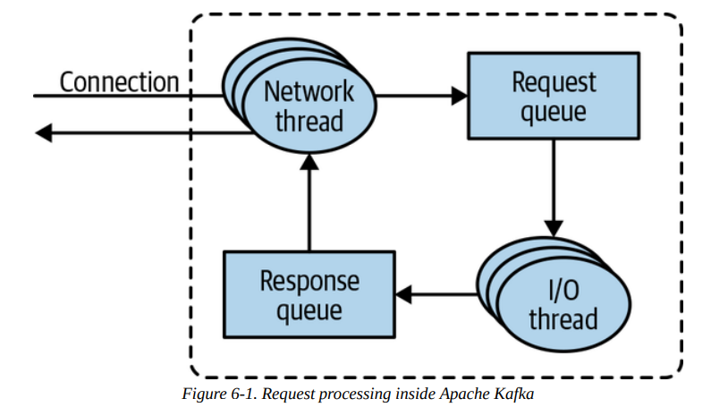
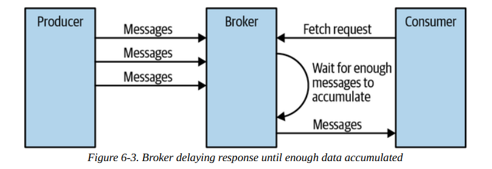
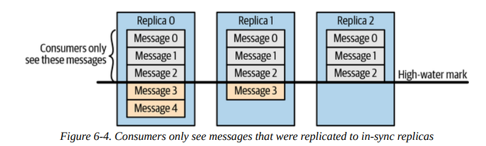
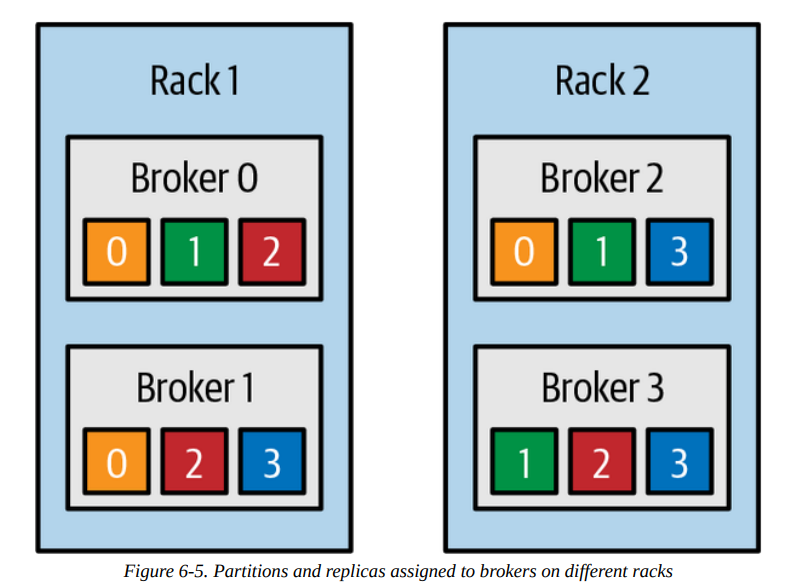
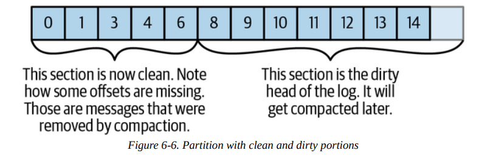

# Chapter 06. Kafka Internals

## Cluster Membership

目前Kafka通过Apache ZooKeeper来维护集群信息，每个broker都有一个UID（配置或自动生成），在启动运行时就会将自身注册到ZK上，构造一个**临时节点ephemeral node**，而其他broker、controller、tools等节点就通过**订阅ZK上的`/brokers/ids`路径**来获得broker变化的通知

broker的失联会导致ZK通知所有订阅`/brokers/ids`的节点，但是该UID依然存在于系统中的多个部分，例如partitions的replica list中，若永久失去一个节点时，新节点采用相同的UID启动就会直接加入到集群中（`TODO：是否会有time travel问题？`）

## The Controller

**controller本身也是broker，其特殊性在于负责选举出partition leaders**，默认情况下集群中的第一个broker就会成为controller节点，并且会在ZK中注册一个临时节点为`/controller`，其他brokers后续启动时注册该临时节点失败就会让他们认识到controller已经存在，所有brokers同样会订阅`/controller`路径来获得controller变更的信息

每当认定一个新的controller时，ZK都会赋予一个**单调递增的任期号epoch**，从而所有brokers也会获知该epoch并且**忽略掉epoch小于该值的请求，即zombie fencing避免脑裂split brain**（例如来自于旧controller的过时数据），新的controller会从ZK中读取**副本状态图replica state map**，随后才可以正常控制集群、选举partition leader等

当某个broker离开集群时（宕机或通过发送`ControlledShutdownRequest`有序下线），controller会获得ZK的通知并且找出所有该broker担任partition leader的部分，决定新的leader（通常就是replica list中的下一个broker节点）后再将信息写回到Zookeper，再通知所有相关的replica partitions所在的brokers

### KRaft: Kafka's New Raft-Based Controller

Kafka希望采用自身的**基于Raft共识协议的KRaft组件**来替换原先的ZK依赖，主要动机在于：

- 元数据的更新会同步写入ZK但是异步发送给brokers，而从ZK获得更新也是异步的，这导致了brokers、controllers、ZK所持有的元数据存在一定的**一致性问题**
- 每次controller的重新启动，都必须从ZK读取所有brokers和partitions的元信息，一旦集群规模增加、partitions增多，这一开销成为了主要瓶颈，导致了**controller重启异常缓慢**
- 当前架构下**元数据所有权模糊**，一些元数据更新操作由controller完成、一些操作由broker完成、甚至还有直接在ZK上进行修改的操作
- ZK本身作为分布式系统也需要专业的维护操作，因此**采用Kafka还需要掌握ZK**，带来了额外的开发、运维负担

对于所有用户操作，包括集群修改、增减partition、成员变更等都是一个事件流event stream，**只要能够对这一个事件流达成共识，任意节点在重放replay事件流后就能达到确定的状态，抽象为一个可复制状态机replicated state machine天然适合基于log的Raft共识协议**

KRaft的设计下，**controllers就是一个Raft quorum**管理着元数据的变更，Raft log包含了所有元数据的变更事件，在controllers中会选举出一个**Raft leader作为active controller**执行实际的管理功能，而其余**Raft followers作为follower controllers**持续复制元数据变更日志，并作为热备节点随时可以称为active controller

这些**follower controller一直持有元数据的事件流并且有较新的状态**，被选出作为active controller后几乎不需要花费的时间进行集群状态的读取，并且与原先的brokers被动等待controller推送元数据变更不同，新模式下brokers通过`MetadataFetch`主动向active controller获取最新的元数据更新并带有相应的**最新元数据操作index，即Raft log index**

每个brokers都会持有该元数据index且在每次获取更新时基于index仅获取**增量更新**，并将元数据事件流持久化到本地磁盘，从而**允许读取本地数据加上增量更新以极快的速度完成broker重启**（即使有百万级别的partitions）

集群中所有brokers都会注册在controller quorum中，宕机离线等情况并不会影响注册，在线的brokers若所持有的元数据并非最新状态就会继续通过`MetadataFetch`进行更新，期间会拒绝服务client请求，保证了**只有持有最新元数据状态的节点（active controller、brokers、tools）才能够提供服务**，依赖Raft的**一致性共识解决了上述提到了多节点元数据不一致**问题

更加详细的设计和修改可以参考KIP-500，KIP-595，KIP-631

## Replication

Kafka中的topic会分割成partitions，每个partition都会拥有多个副本replicas存储在不同的brokers上进行容灾，replica分为：

- **Leader replica**
  只有一个leader replica用于接收生产者的写入请求，从而确保一致性，而消费者的读取请求则可以由任意一个replica提供服务，需要特别注意的是leader replica会维护一个**latest committed offset**，只有被这个值包括的消息才可以被读取，来确保一致性，这个值也会由leader replica发送给follower replicas，显然从leader replica上进行读取会略微快于follower replica
- **Follower replica**
  非leader replica都称为follower replica，作为备份存在，所有leader replica的写入都会复制到follower replica上，一旦leader replica所在的broker宕机，follower replica就会被选举成为新的leader replica

**leader replica还需要追踪所有follower replicas持有的消息位置**，follower replicas会发送`Fetch`请求给leader并带上希望获得的消息偏移量（总是有序递增的值），从而leader replica就可以获得follower replica的相应状态：

- **Out-of-sync replicas**
  当一个follower replica持续一段时间（`replica.lag.time.max.ms`）没有尝试`Fetch`来获取最新消息时，就认为该replica已经不再同步，从而当leader出现宕机故障时也不会考虑out-of-sync replicas
- **in-sync replicas**
  相对应的，若一个follower replica持续通过`Fetch`来尝试获得最新的消息，则认为该replica时保持同步的，leader容灾时就会考虑in-sync replicas

另外通常在topic的partitions创建时就会**基于负载均衡的原因**在不同brokers上创建leader replicas，这些起始leader replicas同样也是这些partitions的**preferred leader**，brokers会周期性检查partition的**leader replica是否是preferred leader，若不是且preferred leader属于in-sync replica，则会触发leadership转移**（`auto.leader.rebalance.enable=true`）

### Replicated Logs: Quorums, ISRs, State Machines

补充内容来自[Kafka Doc - Replication](https://kafka.apache.org/documentation/#replication)

**日志复制模型replicated log model**非常适合分布式系统中实现状态机模型，日志就是操作日志，确定性的状态机通过相同的日志可以达到相同的状态，关键就在于对日志达成共识，最简单的方式就是采用**强leader复制协议**，由leader对所有写入进行串行化提交，而**对follower的提交则是一个权衡**，若要求所有follower都提交才认为是leader提交（类似于2PC协议）则延迟受限于最慢的节点，且一旦一个节点宕机会阻塞后续整个写入；若仅要求leader写入就认为提交则一旦leader提交后尚未复制旧宕机，新任leader不持有该数据就出现了数据丢失

通常会要求**写入的副本数与容灾时必须参与选举的副本数存在重叠**，从而确保一定有一个副本拥有最新的数据，这也称为**quorum**，常见的共识算法包括**简单多数投票majority vote**，即`2f+1`个副本可以容忍`f`个副本丢失，每次写入`f+1`个副本才可以提交，例如ZAB，Raft，VR算法，而**Kafka并没有采用简单多数投票，而是采用了与PacificA类似的共识协议**

**majority vote的优缺点较为明显**：其延迟不受限于集群中慢节点的限制，仅需过半节点写入即视为提交，但是其**为了容忍`f`个副本失败需要维护两倍多的`2f+1`个副本**，对存储和网络的压力较大，并且当存活不足`f+1`时整个系统直接陷入不可用；因此majority vote的共识算法大多使用在存储集群元数据等场景

Kafka维护了一个**in-sync replicas, ISR**列表，这些in-sync replicas被要求与leader保持同步、数据足够新从而可以成为下一任leader，而在leader上写入一条数据被视为**提交就是所有ISR都完成写入**（可以通过参数配置），ISR列表通过Zookeeper（新版本中应该是KRaft）进行维护，此时Kafka可以**仅用`f+1`个副本就实现容忍`f`个副本宕机**依然保持服务，从而磁盘和带宽需求显著优于majority vote模式

另一方面Raft等算法要求节点重启后必须携带所有已提交的日志信息，而Kafka没有该约束，分布式系统下节点磁盘同样不可靠，Kafka同样不要求所有ISR写入每一条数据都采用`fsync`强制落盘，**leader或follower replicas宕机重启后可以丢失数据，并且作为follower replica继续从leader replica获取数据**

- 理论上若已提交了数据，即写入所有的ISR，此时全部宕机，则存在丢失数据的可能，但这种场景极端罕见，通常**只要有一个ISR存活就不会发生数据丢失**，假如真的发生了这种事件，实际上应该做的就是停止服务，并执行下述策略的一种：
  - **选择一致性 consistency**：等待至少一个ISR恢复上线并作为leader replica提供服务
  - **选择可用性 availability**：直接采用一个非ISR作为leader replica提供服务并且容忍暂时丢失数据直到ISR上线

注意：[前述](https://github.com/JasonYuchen/notes/blob/master/kafka/03.Kafka_Producers.md#configuring-producers)提到的**producer指定`acks=all`参数实际上是等到所有ISR完成写入**，而不是所有replicas，另外可以通过关闭`unclean leader election`防止非最新数据replica成为leader并指定`minimum ISR size`确保写入至少达到该指定的replica数量来提高消息的可靠性（降低可用性）

## Request Processing

Kafka定义了二进制协议用于client和broker的信息交互，所有client的请求必须包含一个标准的头字段：

- 请求类型 API key
- 请求版本，从而brokers可以根据不同版本进行交互，以满足兼容性
- 相关ID，用于唯一标识每一个请求，从而可以在追踪问题时通过这个ID找到所有日志
- 客户端ID，用于唯一标识每一个client

请求处理流程基本如下，较为经典的事件循环+线程池模型：

- **元数据 Metadata Request**
  produce的请求和默认配置的consume的请求都需要发给partition leader，因此当follower收到请求时就会拒绝，此时client需要**向任意broker（每个broker都缓存了集群的元数据）发送元数据请求**，来获得相应的partition leader，后续就会将请求发给相应的leader
- **生产 Produce Requests**
  leader partition所在的broker收到生产请求后会根据`ack`配置的情况做出不同的处理，并且都包含写入自身的磁盘缓存（并**不会通过`fsync`来确保落盘，而是依赖多个replicas来做到数据可靠**），此时若`ack=0`或`ack=1`就会返回成功，若`ack=all`就会放在**等待队列purgatory**中直到leader partition确保所有in-sync replicas也都写入数据
- **消费 Fetch Requests**
  client发送消费请求，包含了所需的topics、涉及的partitions及相应的消息offsets，同时还会有**消息数量的限制以防止过多消息导致client OOM**（通常默认配置下消费请求也必须发送到leader partition上），在发送消息给client时，Kafka使用知名的**零拷贝zero-copy**技术，将磁盘上的文件数据直接发送给网络信道而不涉及操作系统、应用程序的缓存

  

  在相应消费请求时，尚处于等待in-sync replicas写入的消息并不会提供读取服务（**除了follower replicas**，它们本身就通过读取leader replica的消息来完成replication），只有确保可靠的数据（即写入了ISR）才可以被读取到

  

  由于consumer需要发送元数据请求来获得所有的topic和partitions的元信息，带来较大的开销，且这些元信息在稳定的系统中变化较少，因此Kafka支持`fetch session cache`用于缓存元数据，一旦**初次获得所有元数据后可以构建`fetch session cache`，此后只需要再增量获得元数据变化**的消息即可（类似change data capture, CDC）

- **其他 Other Requests**

## Physical Storage

Kafka中存储的**基本单元是partition replica**，一个partition无法进一步分割（跨brokers或跨disks分割都不可行），因此其尺寸被单个挂载点mount point最大可用空间限制，Kafka通过`log.dirs`来配置可供存储数据的目录列表，通常做法就是**每个挂载点一个目录**

### 分层存储 Tiered Storage

分层存储的基本理念在于**冷热数据分离**，Kafka集群可以配置两层存储，分别为**本地local**和**远端remote**，本地存储低延迟但容量有限，直接存储活跃中的分段日志，远端存储（例如HDFS，S3）延迟高但容量无限，可以存储更早的完整的分段日志，这两层都可以配置不同的数据回收策略storage retention policy，这种冷热数据分离存储的好处包括：

- 本地存储热点数据，远端存储冷数据，**本地提供高效读写服务，远端实现懒惰加载和水平扩容**
- **分别配置本地和远端的数据回收策略**，及时将本地数据释放或存储到远端，避免本地磁盘开销过高
- 热点数据较少，从而有更**快速的集群备份和重启恢复**
- 读取历史**冷数据和当前热数据的IO路径分离**，读取冷数据（network I/O）不会影响热数据（disk I/O）的读写，集群整体延迟表现更好

### 分区分配 Partition Allocation

例如在集群`brokers=6`上创建一个topic，包含`partitions=10`以及`replication=3`那么需要将30个partition replicas分配到6个brokers上，分区分配的目标在于：

- 尽可能将partitions均匀分配到所有brokers上，从而保证**负载均衡和资源充分利用**
- 确保每个partition的**replicas位于不同的brokers上**，从而提高可用性和容灾
- 若brokers进一步拥有被部署的信息（**rack-awareness**），则replicas尽可能部署到不同的rack上，从而保证跨rack的容灾

另外当确定了partition所在的broker后，会在`log.dirs`中**选择目前装载partitions最少一个目录进行放置**，实现均匀负载，但是需要注意这里并没有考虑到相应目录的空余空间或是partition的占用空间，因此**可能出现磁盘空间实际负载并不均匀**的情况

### 文件管理 File Management

一个partition的数据实际上被分割存储为多个**分段日志文件segements**，每个segment存储`1GB`或是一周的数据，当前正在写入的称为**active segment**，而已经写入完全的旧segments就会参与到数据回收策略中，因此根据时间或容量等策略可以很容易的决定出删除哪一批segments

注意，broker会持有**打开的文件描述符来管理每一个partition的每一个segment**，因此可能会有异常多的文件描述符，通常需要修改系统默认的最大文件打开数

### 文件格式 File Format

每一个segment存储为一个单独的文件，其**格式与produce和consume的消息收发格式完全相同**，从而允许了Kafka利用零拷贝zero-copy技术高效的将文件直接通过网络传输，并且避免了反复的压缩与解压缩文件，produce和consume以及broker存储的均为**message batch**，其header包括：

- magic number表明目前的消息版本和格式
- 该batch中第一条消息的offset以及到最后一条消息的offset的偏差量
- 该batch中第一条消息的时间戳，以及整个batch最高的时间戳
- 整个batch的大小
- 收到该batch数据的leader对应的epoch号（**作为fencing用于过滤过旧的数据**）
- 校验和来证明batch的数据未损坏
- 属性，包括压缩类型compression type、时间戳类型timestamp type、是否属于事务、是否属于控制等
- producer的ID、epoch以及batch中的第一个序列号first sequence，用于提供**恰好一致保证exactly-once guarantees**

而message batch的主体就包括了所有消息记录message records，每一条消息同样拥有一个较小的header：

- record的大小
- 属性，暂未使用
- 该消息的offset和整个batch第一条消息offset的偏差，可以用于快速定位
- 该消息的timestamp、和整个batch第一条消息timestamp的偏差毫秒
- 消息本身的内容，包括key，value，headers

### 索引 Indexes

为了支持高效访问任意位置、时间的数据，**Kafka维护了每个segment的消息索引`offset -> message`和`timestamp -> offset`，**与segment相同，索引index同样是分段式segemented的，从而也可以根据需要删除掉过旧的索引，当需要访问索引已被删除的segments时，可以根据文件内容重新生成索引

### 压缩 Compaction

除了常规的超过一定大小、或是超过一定时间就删除旧数据，Kafka还**支持`delete/compact`回收策略，即每个key的旧数据都可以被删除而保留最新的一份数据**，注意这需要每条消息都带有key，没有key字段的就无法支持这种回收策略，这种策略可以**与基于时间的回收策略混合使用，从而当旧数据超过一定时间了才会被删除**，但是最新数据无论多久都会被保留

每个日志都可以被视为**Clean**和**Dirty**两部分，Clean的部分已经发生过compaction，这部分每个key只保留了一份在当时compaction时刻最新的value，而Dirty部分就是尚未compaction，下次将会参与的部分，后台的`CompactionManager`会启动异步线程周期扫描所有日志文件并执行compaction

基本的compaction过程如下：

1. cleaner线程会读取partition的Dirty部分，并且**构建内存表来保存key和包含该相同key的最新消息的offset**
2. 读取Dirty部分完成后内存表也构建完成，随后cleaner线程会开始读取Clean部分，将其中的key与内存表相比较，**若key不存在说明Clean部分该key的数据依然是最新的**，该消息会被拷贝到**replacement segment**中，**若key存在则说明Dirty部分拥有最新的数据**，忽略掉Clean部分该key的数据，而将内存表中该最新的消息拷贝到**replacement segment**中
3. Dirty部分读取完成后，此时**replacement segment构建完成，会直接和旧segment替换**成为新的segment并且对每个key只包含此时最新的数据

### 删除 Deleted Events

假如某个用户离开，即使是最新的数据也不再需要保留，此时需要通过显式生成一条消息，并且相关key的value全部被设置为`null`（对于设置为`null`的消息等同于一个**删除标记tombstone**，Kafka的各个组件会视同已被删除），则当**compaction发生时这些`null`的数据即使拥有最新的时间戳也会被删除**

注意为了让consumer等组件能够看到该删除标记（**若直接删除则可能无法区分从未出现和已经删除**），被标记为`null`的数据依然会在系统中存活一段时间，以确保所有组件都能够感知到该删除事件

### 压缩数据的时机 When Are Topics Compacted ?

与删除delete策略相同，压缩compact策略也不会发生在active segment上，这些**修改操作只会发生在非活跃的segments，从而大大简化了操作并发时的处理**，默认情况下Kafka会对50%消息都处于Dirty区域的topic发起压缩操作，同时集群配置还可以通过以下两个参数修改行为：

- `min.compaction.lag.ms`：一条消息被写入后至少要经过该配置时间才可能会被compacted
- `max.compaction.lag.ms`：一条消息被写入后至多不超过该配置时间就必须被compaction操作扫描到
