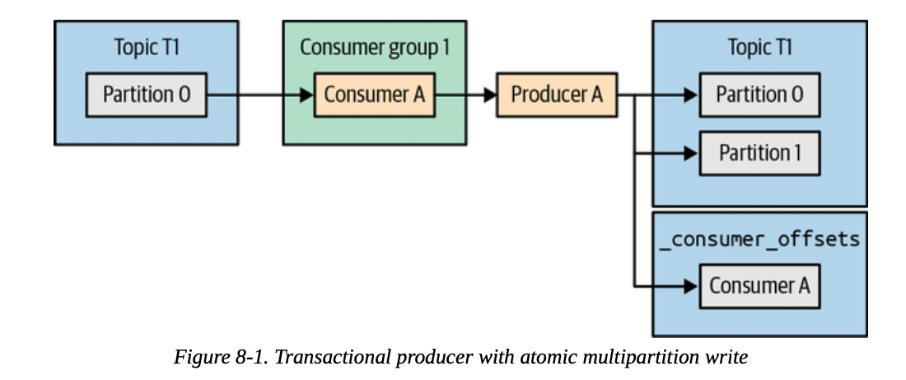
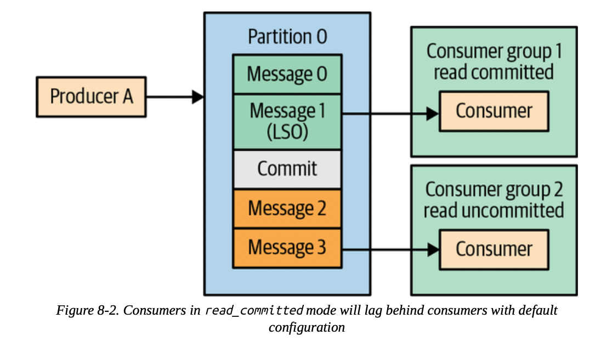
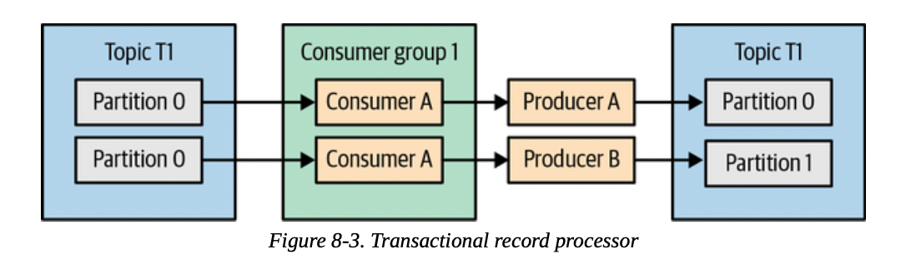
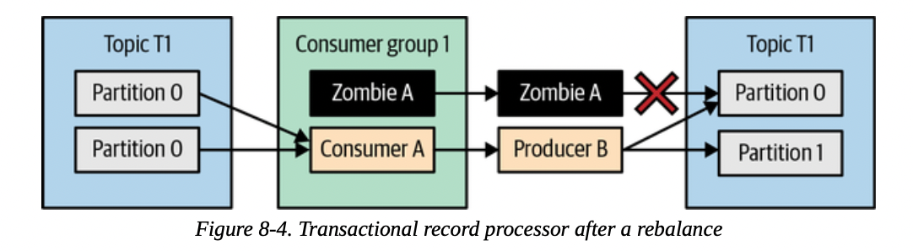

# Chapter 08. Exactly-Once Semantics

大多数现实世界中的简单系统往往都会有一个唯一的ID用来标识事件，从而**基于这个唯一的ID去重并且搭配Kafka的提交机制（至少一次at-least once）就可以实现恰好一次exactly once**，但是同样有一些流数据的场景更加复杂，需要更复杂的机制来保证恰好一次语义，在Kafka中提供了两个核心特性来支持这个保证，**幂等生产idempotent producer用于消除producer重试引入的重复消息、事务transactional semantics用于保证恰好一次**

## Idempotent Producer

- 工作原理
  当启动了幂等生产的机制后，每条消息都会附带上一个**producer的UID**（PID）以及一个**序列号sequence number**，这两个额外的信息结合消息本身的topic和partition就可以独一无二的标识每一条消息，Kafka brokers就通过这些标识来追踪producer的生产消息情况

  为了追踪重复的数据（通常数据超时、连接重连等场景下就会发生重新发送消息，这些重复的消息显然具有**局部性locality**，即往往连续出现），**brokers会记录每个partition最近5条消息**，当有重复时就不会写入重复的消息，因此在producer侧也应该保证同时发送的消息（尚未确认的在途消息，即`max.inflight.requests`）应不超过5条

  需要特别注意，**通常序列号都是单调递增的**，假如broker在消息2后直接收到了消息27，则往往是消息3-26出现了丢失等情况，需要检查producer和broker的状态：

  - **producer重启**，通常新的producer就会启动并且通过broker获得一个唯一的producer识别号，PID，此时若**新producer继续发送了一条前一个producer已经发送过的消息（未启动事务机制），则并不会被broker标记为重复**
  - **broker宕机**，由controller选举出新的partition leader，此时新的leader此前一直在接受replication，因此也持有消息最新的序列号，可以应对producer重试发送的重复消息
- 局限性
  **idempotent producer只能预防因producer重试（连接中断、网络故障、broker宕机等）导致的重复消息**，无法避免应用层因为某些原因发送两条完全一样的消息（Kafka无法判断应用层的消息重复）

## Transactions

事务的支持主要是为了**确保每一条输入的消息严格恰好一次，从而给Kafka Streams提供准确的计算结果**

- 事务的使用场景
  所有**涉及到流计算、结果的精确性非常重要（尤其是使用了join等聚合操作）的场景都适合使用事务**，而如果只是逐条消息处理，并不涉及多消息合并计算等处理，则仅仅依赖idempotent producer去重就已足够
- 事务希望解决的问题
  假定现有的场景是一个简单的从topic A读取消息，进行处理，随后写入到topic B上这样的场景，那么需要考虑：
  - **应用程序crash导致的重复处理**
    当consumer读取完消息并结束处理，此时需要做两个独立的操作，一是提交消费的位置，而是讲结果写入topci B，那么假如**先写入topic B随后在提交消费位置前就宕机**，则意味着这条消息依然会被再一次消费、并且产生相同的结果写入topic B，即重复处理（显然idempotent producer无法解决这种重复，另一个消费者拥有不同的ID）
  - **僵尸应用程序导致的重复处理**
    当consumer读取完消息开始处理后，由于一些原因（gc、缓慢等）导致未及时发送心跳，此时consumer group就会挑选另一个consumer继续处理相应的partitions相同的数据，而卡住的**旧consumer在处理完并写入topic B后可能才会从`poll`中发现自己已经是僵尸consumer，但已经引入了部分重复消费**
- **事务如何保证恰好一次**
  **恰好一次语义意味着一条消息从consuming、processing到producing是原子完成的**，即必须确保一条消息被消费并提交位置和写入下游topic是都成功或都失败

  Kafka事务引入了**原子多分区写入机制atomic multipartition writes**，即原子完成提交消费位置和生产新消息写入其他topic，回顾[Chapter 04 Kafka Consumers](https://github.com/JasonYuchen/notes/blob/master/kafka/04.Kafka_Consumers.md#commits-and-offsets)，提交消费位置实质上就是写入一个特殊的topic `__consumer_offsets`，**采用事务后的consumer不再需要手动提交offsets**

  

  事务需要使用**transactional producer**，配置一个`transactional.id`并且调用`initTransactions()`执行初始化（与此前的producer id不同的是，`transactional.id`是由配置文件决定的，并且**在重启中不会改变，即采用该id可以识别发生了重启的producer**，brokers会负责维护一个`transactional.id -> producer.id`的映射），从而解决了上述的问题一*应用程序crash导致的重复处理*

  显然上述的问题二*僵尸应用程序导致的重复处理*可以通过`initTransactions()`中**递增epoch号作为zombie fencing禁止旧producer继续写入**来解决，broker收到的请求包含相同`transactional.id`但较小epoch号的会被拒绝

  由于producer侧**依然会将最终失败事务的消息写入到相应的partitions中**，因此事务的保证还需要**consumer侧忽略这些失败事务写入的消息**才能实现，即**隔离isolation**，参考[数据库常见的隔离级别](https://github.com/JasonYuchen/notes/blob/master/cmu15.445/18.Timestamp_Ordering.md#隔离级别-isolation-levels)，配置`isolation.level`为`read_committed`就会只消费到已提交事务/非事务写入的消息，配置为`read_uncommitted`就会收到所有消息，但是consumer无法得知哪些消息属于哪一个事务，也无法知道一次事务涉及到的所有消息

  

  另外与数据库事务相同的点在于顺序的保证，为了保证消息读取有序，`read_committed`模式会**暂时不提供尚未结束的事务涉及的消息**（只提供到**最近可靠位置Last Stable Offset LSO**的消息）直到事务提交commit或终止abort（超过`transaction.timeout.ms`的事务会被brokers强制终止）
- **事务无法解决的问题**
  Kafka中加入的事务提供了原子多分区写入而不是读取，阻止了僵尸生产者写入消息，从而保证了**consume-process-produce**这种串联流数据处理模式下的恰好一次语义，而在一些涉及Kafka Stream外部系统（即**存在副作用**）的场景下并不能保证恰好一次，包括但不限于：
  - 流数据处理过程中存在副作用
    例如处理到某一个数据就发送邮件，邮件不能保证恰好发送了一封，也不能因为事务终止而撤回，其他也包括写入一个文件、调用了一个REST API等一切涉及到*不支持事务的*外部系统的操作
  - 从topic中读取数据并写入数据库
    即不符合**consume-process-produce**模式，consumer实际上是处理完成后写入数据库，此时**写入外部系统和提交消费位置无法通过原子多分区写入来实现**（Flink系统中**支持2PC的外部系统可以通过consumer侧的接口参与到Flink的事务管理中**，从而实现外部系统的恰好一次语义），当然也可以放弃Kafka自身的offsets管理，完全依赖外部数据库的事务，从而也能够实现offsets写入和数据库写入的事务化

    注意：非常多的服务常见需求就是处理一个请求包括写入一条消息到Kafka和更新数据库，显然**写入Kafka和更新数据库无法做到事务化，常见的解决方案是仅写入消息到Kafka并且包含更新数据库的操作，随后在作为中继服务的consumer中完成数据库的写入，需要保证写入数据库操作的幂等性回避重复的消息**，这种方式就可以实现请求的处理一定会抵达Kafka和数据库、或都不抵达，并通过幂等写入数据库实现去重；相反的结局方式就是只**写入数据库，并且确保数据库的更新一定会被写入到Kafka**，例如通过数据库的Change Data Capture CDC
  - 从A数据库中读取，写入Kafka，再consumer中写入B数据库
    由于Kafka中对事务的支持非常弱，上述一个consumer无法得知哪些消息属于同一个事务、也无法获得一个事务的所有消息，因此又可能只读取到了A数据库一个事务的部分消息就写入了B数据库，**无法做到数据库A和B的事务对等**
  - 从A集群Kafka中复制数据到B集群Kafka
    理由同上，无法做到A集群和B集群的事务对等
  - **发布订阅模式**
    消息队列更常见的使用模式就是publish-subscribe模式，在**这种模式下采用事务能够提供一定程度的保证但无法做到恰好一致性**，例如配置为transcational producer宕机后重启发送相同的消息就可以被识别出来避免重复，并且可以原子发布多个partitions的消息，配置为`read_committed`的consumer不会看到终止事务的消息，但是consumer依然有可能重复消费，取决于对消费位置提交的策略
- `transactional.id`和fencing
  `transactional.id`会影响到事务机制和fencing，因此需要特别谨慎配置，防止出现冲突等情况，在Kafka 2.5版本之前只能通过静态给定的方式来配置，而Kafka 2.5版本之后引入了**第二种fencing的方式，基于consumer group metadata搭配`transactional.id`来实现**
  - 在原来的设计中，即使来自同一个consumer group，其他consumer由于具有不同的`transactional.id`就无法替代某个consumer继续消费并发布消息，必须等到该consumer重启
  - 新的方案下，由于fencing还带有consumer group metadata的信息，因此同一个group的其他consumer可以替代某个宕机的consumer开始消费并发布消息

  （图片存在错误？）

  

  

- **事务的原理**
  事务的基本算法参考自[Chandy-Lamport快照](https://github.com/JasonYuchen/notes/blob/master/dsaaa/08.Distributed_Snapshot.md#83-chandy-lamport-algorithm)，采用一个**特殊的标记消息marker message**在流水线中传输，通过此来决定一致性状态，Kafka通过**这种标记消息来表达一个跨多个分区的事务的提交/终止**，当producer决定提交某个事务时就发送这个标记消息给**事务协调者transaction coordinator**，随后协调者将commit标记写入所有该事务涉及的分区，而当producer宕机时，Kafka通过**两阶段提交[2PC](https://github.com/JasonYuchen/notes/blob/master/cmu15.445/23.Distributed_OLTP.md#两阶段提交-two-phase-commit-2pc)和[事务日志transaction log](https://github.com/JasonYuchen/notes/blob/master/cmu15.445/20.Logging.md#预写式日志-write-ahead-log)来解决事务的终止**：

  1. 记录当前正在运行的事务，以及涉及的所有分区
  2. 记录事务的提交还是终止，一旦确定事务的结果，不可改变
  3. 将marker写入所有涉及的分区
  4. 记录事务结束

  Kafka通过内部的特殊topic `__transaction_state`作为一个WAL来记录事务执行，一个**事务的基本流程如下**：

  1. producer调用`initTransaction()`发送给broker（随后成为该producer的transaction coordinator，每个broker都是一部分producers的coordinator）
  2. `initTransaction()`会在coordinator上注册`transaction.id`或递增现有`transaction.id`对应的epoch号，**一旦递增了epoch号就意味着当前尚未决议的事务全部被终止**（隶属于上一次的transaction producer）
  3. producer测调用`beginTransaction()`来通知producer开始新事务（coordinator侧依然未感知到事务开始），随后producer就可以开始发送消息，一旦producer检测到一个新的partition被引入，就会调用`AddPartitionsToTxnRequest`通知coordinator该事务涉及到的partitions，这些信息也会被记录到事务日志中
  4. 当事务结束需要提交时，首先提交相关的offsets，调用`sendOffsetsToTransaction()`发送给coordinator，包含了相应的**offsets**和**consumer group id**，而coordinator则会通过group id找到group coordinator并提交消费位置offsets
  5. 此时可以通过`commitTransaction()`完成事务的提交，或是`abortTransaction()`完成事务的终止，发送`EndTransactionRequest`给相应的coordinator，后者就会**在事务日志中记录事务决议**，并且发送commit marker给所有相关的partitions，随后写入事务提交结束到事务日志中；假如在写入事务决议后宕机，选举出的新coordinator从日志中读取事务决议结果并继续执行
  6. 假如事务在`transaction.timeout.ms`中没有决议，则coordinator就会自动强制终止，例如前一任coordinator尚未写入事务决议就宕机，则事务在超时后会被新coodinator自动终止
- 记录事务状态存在潜在OOM的风险
  由于事务的状态、transactional/idempotent producer、每个partition的最后五条消息、序列号等等信息会在相应的producer停止活动（默认是最近七天没有任何活动）后继续被记录`transactional.id.expiration.ms`这段时间（从而避免当producer重新活动时遇到`UNKNOWN_PRODUCER_ID`错误），因此当段时间大量创建transactional/idempotent producer可能会导致OOM

## Performance of Transactions

在事务中会在以下几个部分增加额外的开销：

- 每个producer在初始化时会额外注册一次`transactional.id`
- 每个transaction中在涉及到新的partition时需要额外发送一次注册partition的请求
- 每个transaction提交时需要额外发送一次提交/终止请求，并且发送一个额外的commit marker到所有涉及到的分区中
- transaction初始化和提交的两个额外请求是同步的synchronous，因此期间不能发送其他消息，直到事务正常或异常结束
- consumer侧（`read_committed`模式）在涉及事务的消息必须等到事务提交才能收到相应的消息，因此事务提交间隔过长就可能导致consumer需要等待，从而引起了端到端延迟的上升

由于事务中实际涉及的消息数量并不影响事务本身需要做的额外工作，因此单个事务包含越多消息越能平摊额外的开销，即批量化
